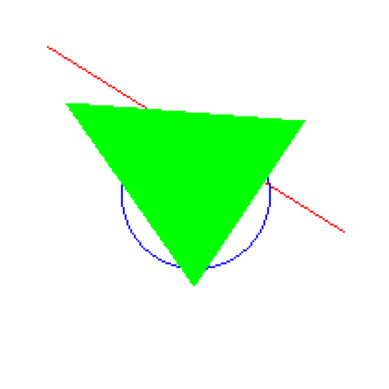

# Taller - Rasterización desde Cero: Dibujando con Algoritmos Clásicos

## Nombre de los estudiantes


* Brayan Alejandro Muñoz Pérez bmunozp@unal.edu.co
* Álvaro Andrés Romero Castro alromeroca@unal.edu.co
* Juan Camilo Lopez Bustos juclopezbu@unal.edu.co
* Oscar Javier Martinez Martinez ojmartinezma@unal.edu.co
* Alejandro Ortiz Cortes alortizco@unal.edu.co

## fecha de entrega

09 de Marzo de 2026

## Descripción breve

En este taller se implementan los **algoritmos clásicos de rasterización** para líneas, círculos y triángulos, entendiendo cómo se construyen imágenes píxel a píxel en una pantalla. El objetivo es desarrollar una base sólida sobre cómo se generan primitivas gráficas sin usar librerías de alto nivel.

---

## Implementaciones

### Entorno: Python (Jupyter Notebook o Colab)

**Herramientas:**
- `Pillow` (para crear imágenes)
- `numpy` (opcional para operaciones matriciales)
- `matplotlib.pyplot` (para mostrar resultados)

---

### 🔧 Actividades paso a paso

#### 1. Preparar el entorno de dibujo

```python
from PIL import Image, ImageDraw
import matplotlib.pyplot as plt
```
##### Se asegura que estén disponibles la biblioteca de imágenes de Phyton PIL, al igual que matplotlib

```python

width, height = 200, 200
image = Image.new('RGB', (width, height), 'white')
pixels = image.load()
```

##### Se crea el lienzo en donde se graficará, definiendo el tamaño, color del fondo y la variable que lo contendrá

---

#### 2. Dibujar una línea con el algoritmo de **Bresenham**

```python
def bresenham(x0, y0, x1, y1):
 dx = abs(x1 - x0)
 dy = abs(y1 - y0)
 sx = 1 if x0 < x1 else -1
 sy = 1 if y0 < y1 else -1
 err = dx - dy

 while True:
 pixels[x0, y0] = (255, 0, 0)
 if x0 == x1 and y0 == y1:
 break
 e2 = 2 * err
 if e2 > -dy:
 err -= dy
 x0 += sx
 if e2 < dx:
 err += dx
 y0 += sy
```
#### Se usa el algoritmo bresenham para crear una línea
#### Primero se reciben las coordenadas de inicio y final tanto en x como en y
#### se calcula la distancia que debe recorren la lìnea en cada uno de los ejes
#### luego se verifica si debe crecer hacia la derecha o izquierda, y luego si hacía arriba o abajo
#### Luego se calcula el error como la diferencia entre las distancias a recorrer en cada eje
#### Aqui se llega al ciclo principal, en el cual primero se pinta de rojo el pixel marcado como x0,yo, luego se verifica si se llegó al final de la línea
#### En caso que no,  se calcula e2 como el doble del error, con ellos se decide a donde debe moverse, con 2 condiciones moverse en x o moverse en y, ambas condiciones se pueden cumplor al mismo tiempo. 
#### Es un algoritmo que se calcula rápidamente y de manera sencilla ya que solo tiene sumas, restas, multiplicación y comparación y solo números enteros.

Instrucción de prueba:

```python
bresenham(20, 20, 180, 120)
```

---

#### 3. Dibujar un círculo con el algoritmo **de punto medio**

```python
def midpoint_circle(x0, y0, radius):
 x = radius
 y = 0
 p = 1 - radius

 while x >= y:
 for dx, dy in [(x, y), (y, x), (-x, y), (-y, x), (-x, -y), (-y, -x), (x, -y), (y, -x)]:
 if 0 <= x0 + dx < width and 0 <= y0 + dy < height:
 pixels[x0 + dx, y0 + dy] = (0, 0, 255)
 y += 1
 if p <= 0:
 p = p + 2*y + 1
 else:
 x -= 1
 p = p + 2*y - 2*x + 1
```
#### primero se reciben los parametros del centro, y el radio
#### Se crean unas variables con el radio, y=0 para iniciar en la esquina superior del circulo
#### y se crea una variable p, objetivo para ir avanzando
#### se crea un ciclo for que para en el momento en que se llegue al extremo derecho del circulo
#### y en cada ejecucion se crean los 8 puntos alrededor del circulo aprovechando la simetria de 8 octantes
#### luego por el parametro p, se decide si el siguiente punto es el de la derecha o es el diagonal inferior.
### Este algoritmo permite crear el circulo rápidamente ya que solo se debe calcular 1/8 del circulo el resto se replica por simetría además que el calculo se hace solo con enteros.

Instrucción de prueba:

```python
midpoint_circle(100, 100, 40)
```

---

#### 4. Rellenar un triángulo (simple rasterización por scanline)

```python
def fill_triangle(p1, p2, p3):
 # ordenar por y
 pts = sorted([p1, p2, p3], key=lambda p: p[1])
 (x1, y1), (x2, y2), (x3, y3) = pts

 def interpolate(y0, y1, x0, x1):
 if y1 - y0 == 0: return []
 return [int(x0 + (x1 - x0) * (y - y0) / (y1 - y0)) for y in range(y0, y1)]

 x12 = interpolate(y1, y2, x1, x2)
 x23 = interpolate(y2, y3, x2, x3)
 x13 = interpolate(y1, y3, x1, x3)

 x_left = x12 + x23
 for y, xl, xr in zip(range(y1, y3), x13, x_left):
 for x in range(min(xl, xr), max(xl, xr)):
 if 0 <= x < width and 0 <= y < height:
 pixels[x, y] = (0, 255, 0)
```
#### Este algoritmo rellena un triangulo pixel a pixel usando lineas horizontales interpolando los bordes
### la funcion recibe los 3 puntos del triangulos
### primero ordena los puntos de arriba a abajo
### luego la interpolación calcula en cada lìnea donde comienza y donde termina el triangulo
### después de esto por medio de 2 bucles for, pinta todos los pixeles que se encuentran entre los bordes línea a línea.
### al igual que los algoritmos anteriores este algoritmo tiebe la ventaja en que es muy liviano y solo usa enteros 

 Probar con:

```python
fill_triangle((30, 50), (100, 150), (160, 60))
```

---

#### 5. Mostrar el resultado

```python
plt.imshow(image)
plt.axis('off')
plt.show()
```

#### en esta sección se usa matplotlib para pasarle la imagen, desactive los ejes y la muestre.

---

## Resultados visuales

A continuación se relaciona el resultado obtenido del script




## Código relevante

el código se puede consultar en el archivo rasterizacion.py

## Aprendizajes y dificultades

Este taller demuestra que para desarrollar algunas operaciones no siempre es necesario tener hardware super potente o super actualizado, sino que el hardware básico tambien puede lograr resultados mediante el uso de algoritmos óptimos.