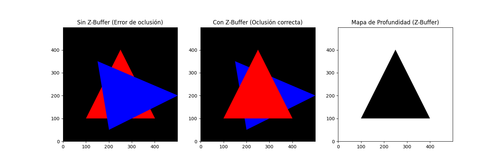
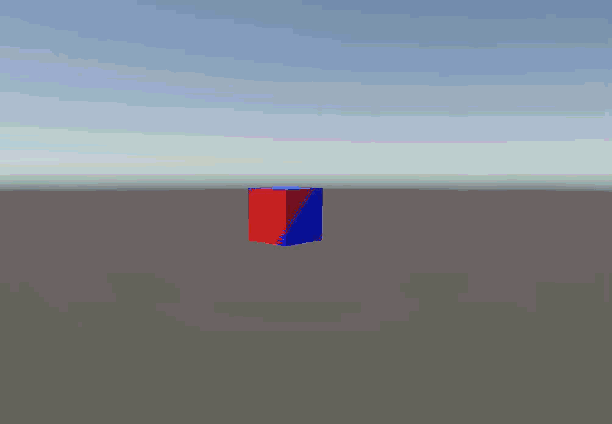
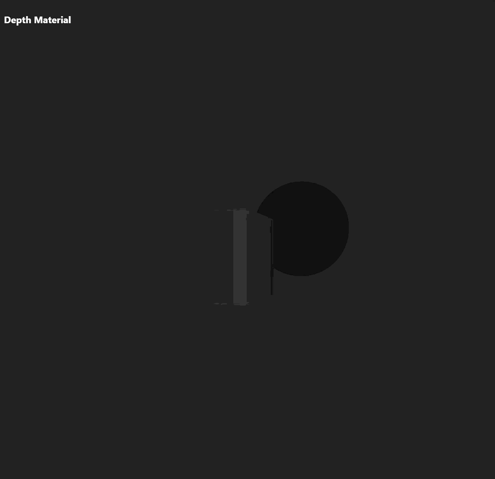
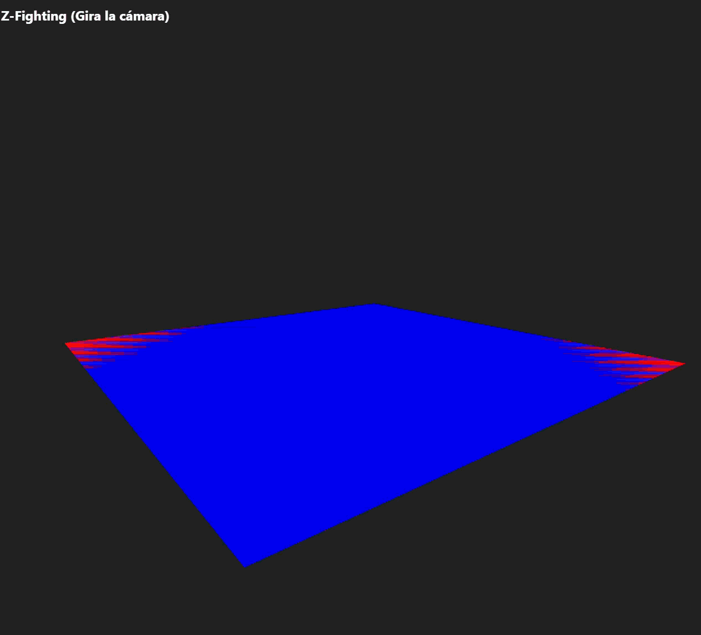

# Taller ZBuffer Depth Testing

## Nombre del estudiante
* Brayan Alejandro Muñoz Pérez bmunozp@unal.edu.co
* Álvaro Andrés Romero Castro alromeroca@unal.edu.co
* Juan Camilo Lopez Bustos juclopezbu@unal.edu.co
* Oscar Javier Martinez Martinez ojmartinezma@unal.edu.co
* Alejandro Ortiz Cortes alortizco@unal.edu.co

## Fecha de entrega
2026-03-09

---

## Descripción breve
El objetivo de este taller fue comprender el funcionamiento del Z-buffer (depth buffer) en el pipeline de renderizado 3D. Se implementó un sistema de rasterización desde cero en Python para observar el problema de oclusión ("Painter's algorithm"). Luego, se configuraron escenas en Unity (HLSL) y React Three Fiber (GLSL) para visualizar los mapas de profundidad nativos y forzar intencionalmente artefactos de precisión conocidos como Z-fighting.

---

## Implementaciones

### Python
Se desarrolló un script de rasterización usando NumPy. Se dibujan triángulos determinando la pertenencia del píxel con coordenadas baricéntricas. Se implementó un Z-buffer real donde se interpola la componente Z de los vértices y solo se sobreescribe el color si la profundidad actual es menor que la almacenada.

### Unity
Se creó un proyecto 3D Core utilizando el pipeline estándar. Se escribió un `Unlit Shader` en HLSL que extrae la profundidad en Clip Space usando la macro `UNITY_Z_0_FAR_FROM_CLIPSPACE`. Además, se configuró una escena con dos planos casi coplanares para estresar el *Far Clip Plane* de la cámara (llevándolo a 100000) y demostrar el Z-fighting de forma dinámica mediante un script de órbita.

### Three.js / React Three Fiber
Se construyó un canvas 3D interactivo en la web. Por un lado, se utilizó el componente nativo `<meshDepthMaterial>` para renderizar la geometría según su distancia a la cámara. Por otro lado, se configuraron planos paralelos con una separación mínima (`0.00001` en Y) y un frustum extremo para causar colapso de precisión en WebGL, evidenciado al orbitar la escena.

---

## Resultados visuales

### Python - Implementación

*Comparación del renderizado por orden de pintado (falla de oclusión) vs uso correcto de Z-buffer.*


*Visualización en escala de grises de la matriz del Depth Buffer extraída de NumPy.*


*Artefactos de Z-Fighting provocados por mallas superpuestas y rango de cámara extremo en movimiento.*

### Three.js - Implementación

*Escena con `<meshDepthMaterial>` reaccionando dinámicamente al movimiento de la cámara.*


*Parpadeo severo (Z-Fighting) en planos coplanares renderizados en el navegador.*

---

## Código relevante

### Cálculo del Z-Buffer en Python:
```python
# Interpolación baricéntrica de profundidad
z = w0 * v0[2] + w1 * v1[2] + w2 * v2[2]

if use_zbuffer:
    if z < z_buffer[y, x]:  # Depth test
        z_buffer[y, x] = z
        img[y, x] = color

```

### Extracción de profundidad en Vertex Shader de Unity (HLSL):

```hlsl
v2f vert (appdata v)
{
    v2f o;
    o.pos = UnityObjectToClipPos(v.vertex);
    // Extracción y normalización de la profundidad
    o.depth = UNITY_Z_0_FAR_FROM_CLIPSPACE(o.pos.z);
    return o;
}

```

---

## Prompts utilizados

* "Corrección de estilo archivo 'README.md'."

---

## Aprendizajes y dificultades

### Aprendizajes

Comprendimos de manera práctica que el Z-buffer no es infinito ni lineal. La resolución de punto flotante favorece las zonas cercanas a la cámara, por lo que colocar el *far plane* demasiado lejos destruye la capacidad de distinguir qué objeto está delante de otro a lo lejos. Implementarlo en Python aclaró cómo viaja esta data píxel por píxel.

### Dificultades

La principal dificultad fue en Unity a la hora de grabar los GIFs: lograr que el Z-fighting fuera visible requirió afinar matemáticamente la distancia a un valor microscópico (`0.00001`), extender la cámara a `100000` de far plane, e implementar un script de rotación (`LookAt`), ya que los motores actuales tienen mitigaciones automáticas muy fuertes en reposo.