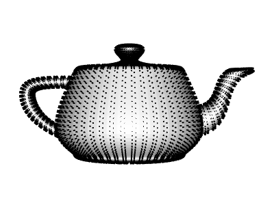
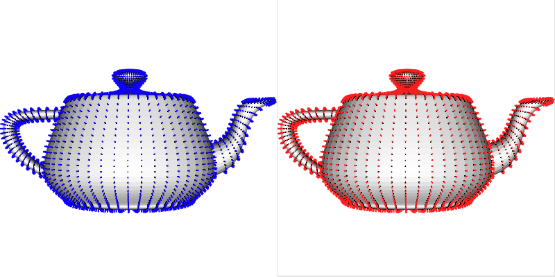
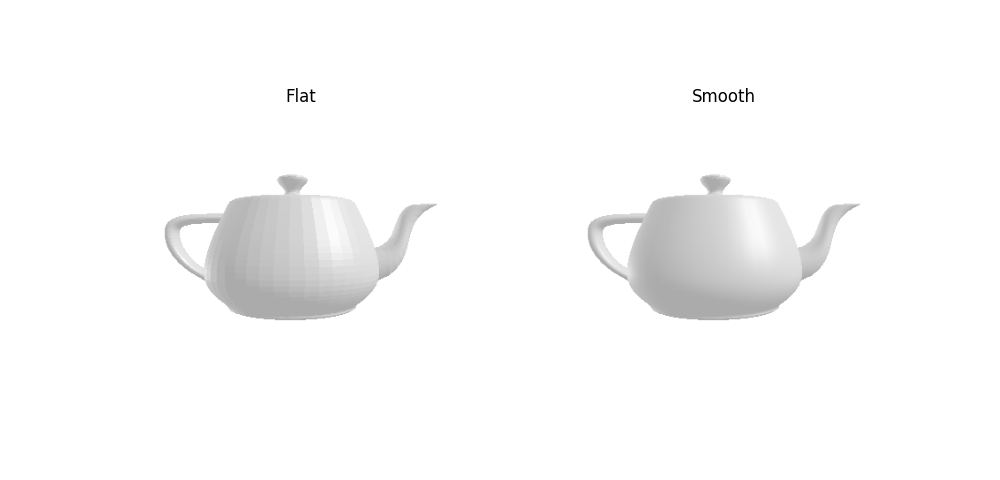
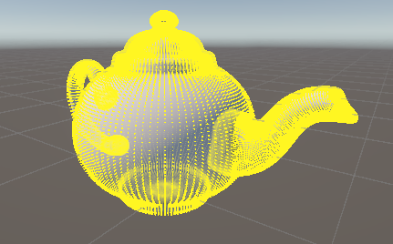
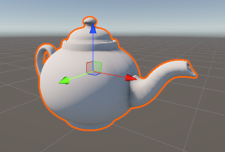
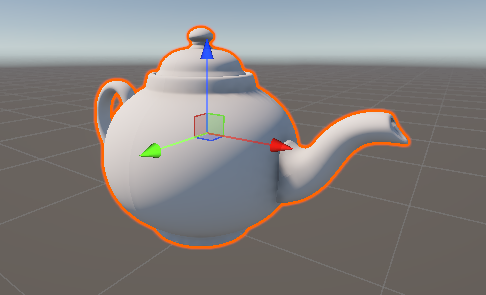
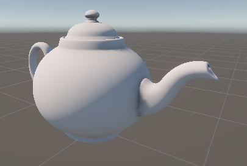
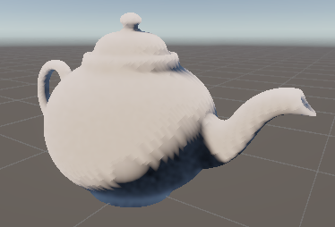
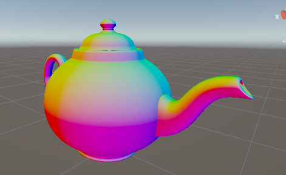
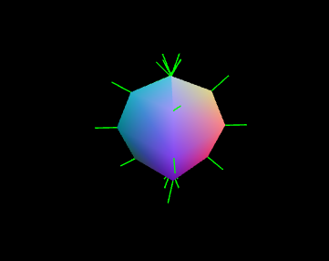

# Taller Calculo Visualizacion Normales

## Nombre del estudiante
* Brayan Alejandro Muñoz Pérez bmunozp@unal.edu.co
* Álvaro Andrés Romero Castro alromeroca@unal.edu.co
* Juan Camilo Lopez Bustos juclopezbu@unal.edu.co
* Oscar Javier Martinez Martinez ojmartinezma@unal.edu.co
* Alejandro Ortiz Cortes alortizco@unal.edu.co

## Fecha de entrega
2026-03-09

---

## Descripción

Este proyecto explora los fundamentos de la geometría 3D, centrándose en el cálculo, manipulación y visualización de vectores normales. El objetivo es comprender cómo la orientación de los vértices afecta la iluminación y el sombreado de un objeto, implementando soluciones manuales y automáticas

## Implementaciones
### Python 
- Carga de `.obj`: Uso de la libreria `trimesh` para cargar y acceder a los datos del archivo `.obj`
- Cálculo Manual: Implementación de un algoritmo para calcular normales de cara usando el producto cruz.
- Comparación de flat vs smooth shading: Por medio del las opciones del método `show()` de `trimesh`.
- Verificación de normales: Se verifico que las normales calculadas estuvieran normalizadas y que se orientaran correctamente. Tambien en caso de no estarlo corregirlas.
### Unity
- Acceso a Datos: Uso de `MeshFilter` para extraer y modificar `mesh.vertices` y `mesh.normals`.
- Cálculo Manual: Implementación de un algoritmo para calcular normales de cara usando el producto cruz.
- RecalculateNormals: Uso de la API nativa de Unity para suavizado de malla.
- Flat Shading Enforcer: Script para desindexar la malla (separar vértices compartidos) y lograr un estilo low-poly.
- Visualización: Implementación de `OnDrawGizmos` para dibujar líneas de dirección de las normales en tiempo real.

### Threejs
- Carga de Modelos: Integración de `GLTFLoader` para importar modelos complejos con dependencias externas.
- BufferGeometry: Manipulación directa de `Float32Array` en los atributos de posición y normal.
- ComputeVertexNormals: Uso del método de Three.js para regenerar normales tras modificar la geometría.
- Shader Custom: Creación de un `ShaderMaterial` en GLSL para colorear el modelo basándose en la dirección de la normal.
- Helpers: Uso de `VertexNormalsHelper` para depuración visual

## Resultados visuales

*Normales calculadas normalmente*

*Normales calculadas a comparación de las precalculadas*

*Diferencia entre flat shading y smooth shading*

*visualizacion de las normales*

*objeto con normales calculadas manualmente*

*objeto con normales recalculadas por unity*

*objeto con smooth shading (normal)*

*objeto con flat shading*

*objeto con shader para ver normales*

*esferea con todos los efectos aplicados*

## Aprendizajes y Dificultades
### Aprendizajes
- Matemática de Superficies: Entender que la normal es el resultado del producto cruz de las aristas de un triángulo fue fundamental para entender la iluminación.
- Estructuras de Datos: Diferenciar entre geometrías indexadas (comparten vértices) y no indexadas es la clave para alternar entre Smooth y Flat shading.
### Dificultades
- Los cambios entre smooth a flat shading fueron complicados en muchos casos ya que no se dan opciones fáciles de usar, debido a que no es comun deshabilitarlo.