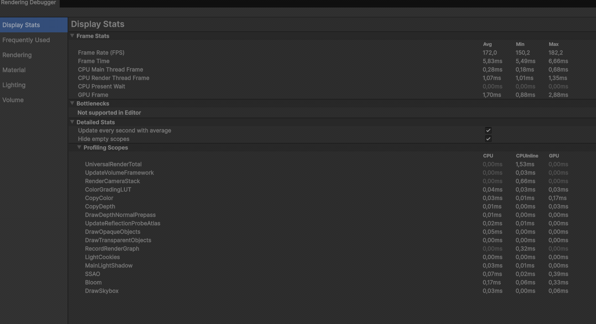
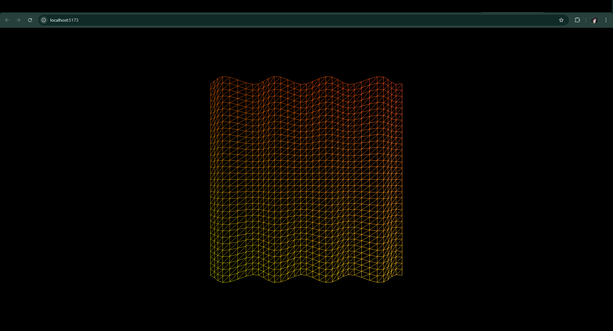

# Taller Etapas Pipeline Programable

## Nombre del estudiante
* Brayan Alejandro Muñoz Pérez bmunozp@unal.edu.co
* Álvaro Andrés Romero Castro alromeroca@unal.edu.co
* Juan Camilo Lopez Bustos juclopezbu@unal.edu.co
* Oscar Javier Martinez Martinez ojmartinezma@unal.edu.co
* Alejandro Ortiz Cortes alortizco@unal.edu.co

## Fecha de entrega
2026-03-09

---

## Descripción breve
El objetivo de este taller fue explorar las etapas programables del pipeline gráfico moderno: **Vertex Shader**, **Fragment Shader** y opcionalmente **Geometry Shader**. Se buscó comprender cómo los datos viajan desde la CPU hasta la GPU para manipular la geometría y el color de manera personalizada.

Durante el desarrollo, se implementaron deformaciones geométricas mediante funciones senoidales en el Vertex Shader y cálculos de iluminación básica (Lambert) junto a efectos procedurales en el Fragment Shader. Esto se logró utilizando dos entornos: **Unity** (HLSL) y **React Three Fiber** (GLSL), comparando la flexibilidad de este enfoque frente al pipeline de función fija.

---

## Implementaciones

### Unity (HLSL)
Se desarrolló un shader personalizado utilizando el **Universal Render Pipeline (URP)**. 
* **Vertex Shader**: Implementa la transformación de espacios (Object a Clip Space) y una deformación dinámica en el eje Y usando la función `sin()` y la variable global `_Time`.
* **Fragment Shader**: Calcula el color por píxel aplicando un modelo de iluminación Lambertiana, multiplicando el producto punto de la normal y la dirección de luz por el color base.
* **Debugging**: Se utilizó el **Frame Debugger** de Unity para visualizar los pasos de renderizado y detectar errores en el flujo de datos.

### Three.js / React Three Fiber (GLSL)
Se implementó un componente `ShaderMaterial` dentro de un entorno React para gestionar el pipeline programable.
* **Vertex Shader**: Realiza una deformación en el eje Z combinando ondas de seno y coseno sobre un `PlaneGeometry` altamente subdividido.
* **Fragment Shader**: Genera un efecto de color procedural que varía según las coordenadas UV y el tiempo (`uTime`), pasado mediante un `uniform` desde JavaScript.
* **Funcionalidad**: Se integró `OrbitControls` para permitir la inspección del objeto 3D desde distintos ángulos.

---

## Resultados visuales

### Unity - Implementación

*Deformación de la malla en tiempo real y aplicación de iluminación Lambert.*


*Inspección de las etapas del pipeline en la GPU mediante el Frame Debugger.*

### Three.js - Implementación

*Plano animado con ShaderMaterial mostrando deformación procedural.*


*Visualización de gradientes calculados dinámicamente en el fragment shader.*

---

## Código relevante

### Vertex Shader en Unity (HLSL):
```hlsl
Varyings vert(Attributes IN)
{
    Varyings OUT;
    float3 pos = IN.positionOS.xyz;
    // Deformación senoidal dinámica
    pos.y += sin(pos.x * _WaveFreq + _Time.y * _WaveSpeed) * 0.2;
    
    OUT.positionHCS = TransformObjectToHClip(pos);
    OUT.normalWS = TransformObjectToWorldNormal(IN.normalOS);
    OUT.uv = TRANSFORM_TEX(IN.uv, _BaseMap);
    return OUT;
}
```

### Fragment Shader en React Three Fiber (GLSL):
```GLSL
varying vec2 vUv;
varying vec3 vNormal;
uniform float uTime;

void main() {
  vec3 lightDir = normalize(vec3(1.0, 1.0, 1.0));
  float intensity = max(0.0, dot(vNormal, lightDir));
  
  // Color basado en posición UV e intensidad de luz
  vec3 finalColor = vec3(vUv.x, vUv.y, 1.0) * intensity;
  gl_FragColor = vec4(finalColor, 1.0);
}
```


## Prompts utilizados

- "Crea un shader básico en HLSL para URP que aplique una deformación de onda senoidal en los vértices."
- "Genera un componente ShaderMaterial para React Three Fiber que reciba un uniform de tiempo y use GLSL."
- "Explícame cómo pasar las normales desde el Vertex Shader al Fragment Shader en HLSL y GLSL."

## Aprendizajes y dificultades

### Aprendizajes

Reforcé la importancia de las transformaciones de espacio; entender que el Vertex Shader es el lugar para modificar la posición de los puntos antes de que se proyecten a la pantalla fue clave. También aprendí a usar `varyings` para pasar datos interpolados entre etapas del pipeline, permitiendo efectos visuales complejos como la iluminación por píxel.

### Dificultades

La mayor dificultad fue configurar correctamente el entorno de Vite para React y entender cómo Three.js mapea las matrices de proyección en el shader personalizado. En Unity, asegurar que el script fuera compatible con URP requirió atención especial a las librerías incluidas `(Core.hlsl)`.

### Mejoras Futuras

Me gustaría explorar el Geometry Shader para generar mallas tipo wireframe desde geometría sólida, y añadir Normal Mapping para simular detalles de superficie sin aumentar la carga de vértices.


## Referencias

- Documentación oficial de Unity ShaderLab: https://docs.unity3d.com/

- Three.js ShaderMaterial Documentation: https://threejs.org/docs/#api/en/materials/ShaderMaterial

- Guía del taller: Etapas del Pipeline Programable.
