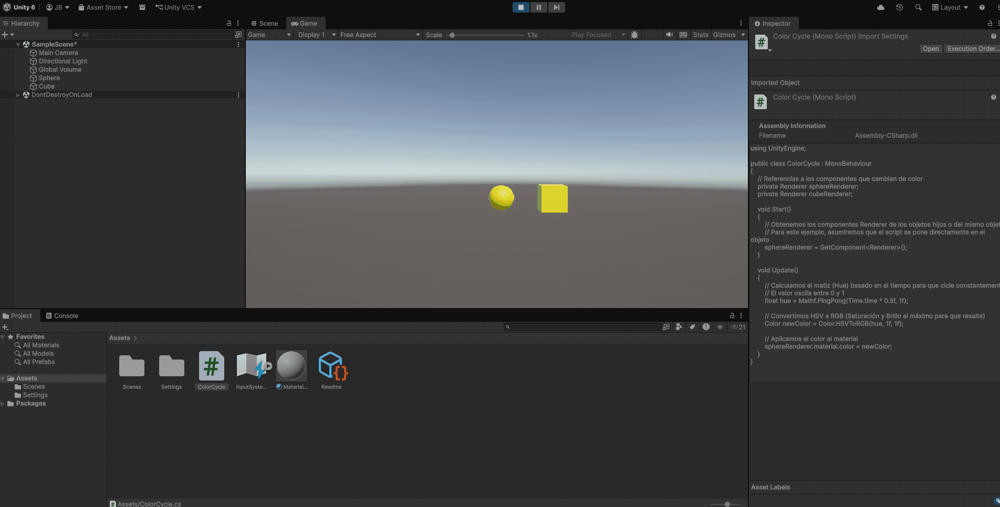

# Taller Modelos Color Percepcion

## Nombre de los estudiantes
* Brayan Alejandro Muñoz Pérez bmunozp@unal.edu.co
* Álvaro Andrés Romero Castro alromeroca@unal.edu.co
* Juan Camilo Lopez Bustos juclopezbu@unal.edu.co
* Oscar Javier Martinez Martinez ojmartinezma@unal.edu.co
* Alejandro Ortiz Cortes alortizco@unal.edu.co

## Fecha de entrega
2026-03-28

---

## Descripción breve
Este taller explora la representación del color desde dos perspectivas: la computacional y la humana. Se trabajó en la conversión de imágenes entre espacios de color **RGB, HSV y CIE Lab**, analizando cómo cada modelo descompone la información visual.

Además, se implementaron simulaciones de **daltonismo (protanopía y deuteranopía)** en Python para entender las deficiencias en la percepción del color. Finalmente, en Unity, se aplicó el modelo **HSV** para crear materiales que cambian de matiz dinámicamente en un entorno 3D.

---

## Implementaciones

### Python (Google Colab)
Se utilizaron las librerías `OpenCV`, `Matplotlib` y `Numpy`. La implementación incluye:
* **Conversión de Espacios**: Transformación de imágenes de RGB a HSV (para separar matiz y brillo) y a CIE Lab (perceptualmente uniforme).
* **Visualización de Canales**: Descomposición de la imagen en sus canales individuales para observar la luminancia y la crominancia por separado.
* **Simulación de Daltonismo**: Aplicación de matrices de transformación lineal para simular cómo perciben los colores personas con protanopía y deuteranopía.

### Unity
Se desarrolló un sistema de materiales dinámicos en Unity 6.
* **Scripting C#**: Creación de un script que utiliza la función `Color.HSVToRGB`.
* **Ciclo de Color**: Los objetos (Esfera y Cubo) cambian su matiz (Hue) automáticamente basándose en el tiempo del sistema ($Time.time$), permitiendo observar la transición fluida a través del espectro visible.

---

## Resultados visuales

### Python - Implementación

*Visualización de los canales de Matiz, Saturación y Valor.*


### Unity - Implementación

*GIF de los objetos 3D cambiando de color automáticamente mediante el modelo HSV.*

---

## Código relevante

### Transformación de Daltonismo (Python):
```python
# Matriz para simular Protanopía
protan_matrix = np.array([
    [0.567, 0.433, 0.0],
    [0.558, 0.442, 0.0],
    [0.0, 0.242, 0.758]
])
img_sim = img_rgb.dot(protan_matrix.T)

```

### Cambio de color por tiempo (Unity C#):

```C#
float hue = Mathf.PingPong(Time.time * 0.5f, 1f);
Color newColor = Color.HSVToRGB(hue, 1f, 1f);
sphereRenderer.material.color = newColor;

```

## Prompts utilizados
- "Cargar una imagen en Google Colab y convertirla de RGB a HSV y CIE Lab usando OpenCV."

- "Matrices de transformación para simular protanopía y deuteranopía en Python."

- "Script en C# para Unity que cambie el color de un objeto automáticamente usando el modelo HSV."

## Aprendizajes y dificultades
### Aprendizajes
Reforcé la comprensión de que el color en computación no es solo "píxeles rojos, verdes y azules", sino que existen modelos como CIE Lab que intentan imitar la biología humana. Aprendí a manipular matrices de color para alterar la percepción visual de forma matemática.

### Dificultades
La mayor dificultad fue entender cómo Unity maneja los rangos de HSV, ya que a diferencia de otros softwares que usan grados (0-360°), Unity utiliza valores normalizados de 0 a 1. Lo resolví consultando la documentación técnica de la clase Color.


## Referencias
- Documentación oficial de OpenCV: https://docs.opencv.org/

- Scripting API de Unity (Color.HSVToRGB): https://docs.unity3d.com/