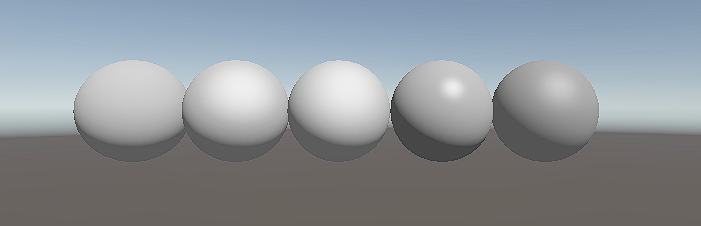
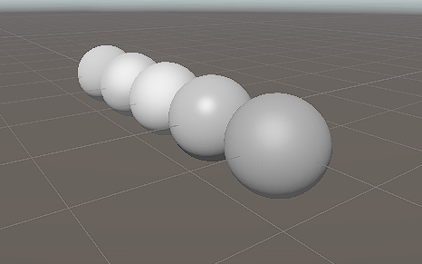
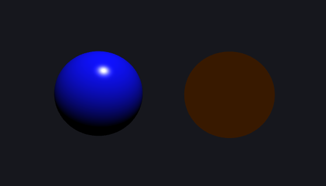
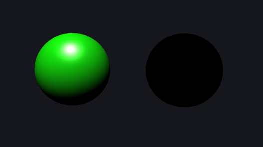

# Taller Modelos Reflexion PBR

## Nombre del estudiante

* Brayan Alejandro Muñoz Pérez bmunozp@unal.edu.co
* Álvaro Andrés Romero Castro alromeroca@unal.edu.co
* Juan Camilo Lopez Bustos juclopezbu@unal.edu.co
* Oscar Javier Martinez Martinez ojmartinezma@unal.edu.co
* Alejandro Ortiz Cortes alortizco@unal.edu.co


## Fecha de entrega

2026-03-28

---

## Descripción breve

El objetivo de este taller fue implementar y comparar diferentes modelos de reflexión de luz utilizados en gráficos por computador: Lambertiano (difuso), Phong (especular), Blinn-Phong y una introducción a PBR (Physically Based Rendering).

Se desarrollaron estos modelos tanto en Unity mediante shaders personalizados y materiales, como en Three.js utilizando React Three Fiber con shaders programables y materiales integrados.

El enfoque principal fue comprender las diferencias matemáticas y visuales entre cada modelo, así como su comportamiento frente a parámetros como la dirección de la luz, la posición de la cámara y el brillo especular.

---

## Implementaciones

### Unity (Shader Graph / Materiales)

En Unity se implementaron diferentes modelos de iluminación mediante Shader Graph y materiales estándar:

#### Lambert (Diffuse)

Se implementó iluminación difusa basada en el producto punto entre la normal y la dirección de la luz:

* Iluminación suave
* Sin reflejo especular
* Dependiente únicamente del ángulo de incidencia

---

#### Phong (Specular)

Se añadió componente especular usando el vector de reflexión:

* Aparición de brillo especular
* Dependencia de la cámara
* Control del parámetro *shininess*

---

#### Blinn-Phong

Se optimizó el modelo Phong utilizando el half-vector:

* Brillo más suave
* Mejor estabilidad visual
* Menor costo computacional

---

#### Iluminación completa

Se combinaron los tres componentes:

* Ambient + Diffuse + Specular
* Mayor realismo
* Eliminación de sombras completamente negras

---

#### PBR (Physically Based Rendering)

Se utilizaron materiales estándar de Unity:

* Parámetros: *Metallic* y *Smoothness*
* Simulación de materiales reales (metal vs plástico)

---

### Three.js (React Three Fiber)

Se implementaron modelos de iluminación mediante shaders personalizados y materiales integrados:

#### Shader personalizado

Se desarrolló un shader en GLSL que permite alternar entre:

* Lambert
* Phong
* Blinn-Phong

Incluye:

* Uniforms: dirección de luz, posición de cámara, shininess
* Iluminación dinámica (luz rotando)
* Control interactivo con Leva

---

#### Materiales built-in

Se compararon los materiales nativos de Three.js:

* `MeshLambertMaterial`
* `MeshPhongMaterial`
* `MeshStandardMaterial` (PBR)

Se analizaron diferencias en:

* Iluminación difusa
* Brillo especular
* Realismo físico

---

#### Visualización interactiva

Se implementó una escena interactiva que permite:

* Cambiar entre modelos de iluminación en tiempo real
* Ajustar parámetros como shininess y color
* Rotar la luz dinámicamente
* Comparar shader personalizado vs materiales integrados

---

## Resultados visuales

### Unity




---

### Threejs





---

## Código relevante

### Lambert (GLSL)

```glsl
float diff = max(dot(N, L), 0.0);
vec3 diffuse = diff * color;
```

---

### Phong

```glsl
vec3 R = reflect(-L, N);
float spec = pow(max(dot(R, V), 0.0), shininess);
```

---

### Blinn-Phong

```glsl
vec3 H = normalize(L + V);
float spec = pow(max(dot(N, H), 0.0), shininess);
```

---

## Prompts utilizados

Se utilizó IA generativa para:

* Generar shaders en GLSL para Three.js
* Construir el proyecto en React Three Fiber
* Resolver problemas de actualización de uniforms
* Diseñar la estructura del README

Ejemplos de prompts:

* “Implementa Lambert, Phong y Blinn-Phong en fragment shader con React Three Fiber”
* “Corrige shaders que no actualizan uniforms en tiempo real”
* “Explica paso a paso cómo hacer iluminación en Unity Shader Graph”

---

## Aprendizajes y dificultades

### Aprendizajes

* Comprensión profunda de modelos de iluminación clásicos
* Diferencias entre Phong y Blinn-Phong
* Manejo de shaders en tiempo real
* Uso de React Three Fiber para gráficos 3D
* Introducción a PBR y materiales físicos

---

### Dificultades

* Manejo de uniforms en shaders (actualización en tiempo real)
* Diferencias entre sistemas de coordenadas
* Configuración inicial en Unity y Three.js
* Ajuste correcto de parámetros como shininess
* Comprensión de vectores (normal, luz, vista)

---

## Conclusión

El taller permitió comprender cómo se modela la interacción de la luz con las superficies en gráficos por computador. Se evidenció que modelos simples como Lambert son eficientes pero limitados, mientras que Phong y Blinn-Phong agregan realismo mediante reflejos especulares. Finalmente, PBR representa un enfoque más físico y moderno, logrando resultados visuales más realistas.
