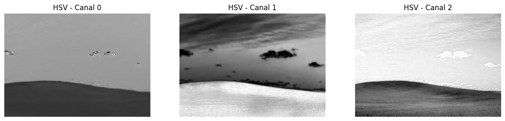
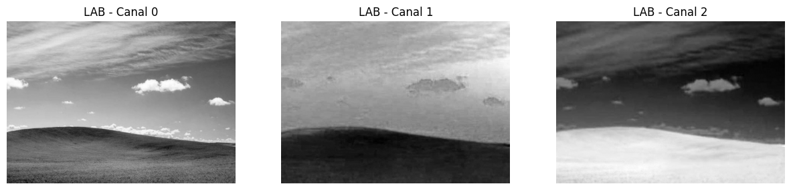

# Taller Conversion Espacios Color

## Nombre de los estudiantes

* Brayan Alejandro Muñoz Pérez bmunozp@unal.edu.co
* Álvaro Andrés Romero Castro alromeroca@unal.edu.co
* Juan Camilo Lopez Bustos juclopezbu@unal.edu.co
* Oscar Javier Martinez Martinez ojmartinezma@unal.edu.co
* Alejandro Ortiz Cortes alortizco@unal.edu.co

## fecha de entrega

28 de Marzo de 2026

---

## Descripción breve

El objetivo de este taller fue trabajar con diferentes espacios de color como RGB, HSV, HSL, LAB y YCrCb, realizando conversiones entre ellos y aplicándolos en procesamiento de imágenes.

Se desarrollaron técnicas de visualización de canales, segmentación por color, manipulación de propiedades como saturación y matiz, análisis de histogramas, extracción de paletas de colores y aplicación de efectos de color grading.

---

## Implementaciones

### 1. Conversión entre espacios de color

Se cargó una imagen en formato RGB y se convirtió a múltiples espacios de color utilizando OpenCV y scikit-image:

* RGB → HSV
* RGB → LAB
* RGB → YCrCb
* RGB → Grayscale
* Aproximación a HSL

También se visualizaron los canales individuales para analizar la distribución de la información en cada espacio.

---

### 2. Visualización de espacios de color

Se representaron los canales de los diferentes espacios para entender cómo se distribuyen los colores y cómo cambia la información entre modelos.

---

### 3. Segmentación por color

Se utilizó el espacio HSV para segmentar colores específicos (ej: azul), definiendo rangos de color y generando máscaras binarias.

Se aplicaron operaciones morfológicas para limpiar ruido:

* Apertura
* Eliminación de ruido

---

### 4. Manipulación de color

Se realizaron modificaciones sobre la imagen:

* Aumento de saturación
* Rotación de matiz (hue shift)
* Ajustes en luminosidad

---

### 5. Color Grading

Se aplicaron efectos simples de color grading:

* Filtro cálido (warm)
* Ajustes de tonos

---

### 6. Paletas de colores

Se utilizó K-Means para extraer los colores dominantes de la imagen y generar una paleta visual.

---

### 7. Análisis de histogramas

Se generaron histogramas RGB para analizar la distribución de intensidades y se aplicó ecualización (CLAHE) para mejorar contraste.

---

### 8. Transferencia de color

Se implementó transferencia de color entre imágenes usando el espacio LAB, ajustando medias y desviaciones estándar.

---

## Resultados visuales

Representación de los canales de los diferentes espacios:




---

## Código relevante

Ejemplo de segmentación en HSV:

```python
hsv = cv2.cvtColor(image, cv2.COLOR_BGR2HSV)
lower_blue = np.array([100, 50, 50])
upper_blue = np.array([130, 255, 255])
mask = cv2.inRange(hsv, lower_blue, upper_blue)
```

Ejemplo de K-Means para colores dominantes:

```python
pixels = image.reshape((-1,3))
kmeans = KMeans(n_clusters=5)
kmeans.fit(pixels)
colors = kmeans.cluster_centers_
```

---

## Prompts utilizados

Se utilizó IA generativa para:

* Generar la estructura del taller en Python
* Crear funciones de procesamiento de imágenes
* Optimizar código de segmentación y color grading

Ejemplo de prompt:

* "Genera un notebook en Python con OpenCV para trabajar espacios de color, segmentación y paletas"

---

## Aprendizajes y dificultades

### Aprendizajes

* Comprensión de diferencias entre espacios de color
* Uso práctico de HSV para segmentación
* Aplicación de técnicas de color grading
* Uso de K-Means para análisis de color

### Dificultades

* Comprender rangos correctos en HSV
* Manejo de conversiones entre formatos (BGR vs RGB)
* Ajuste de parámetros en segmentación
* Interpretación de histogramas

---

## Conclusión

Este taller permitió entender cómo los espacios de color afectan directamente el procesamiento de imágenes y cómo elegir el espacio adecuado puede simplificar tareas como segmentación o mejora visual. Además, se logró aplicar técnicas reales utilizadas en visión por computador y edición de imagen.