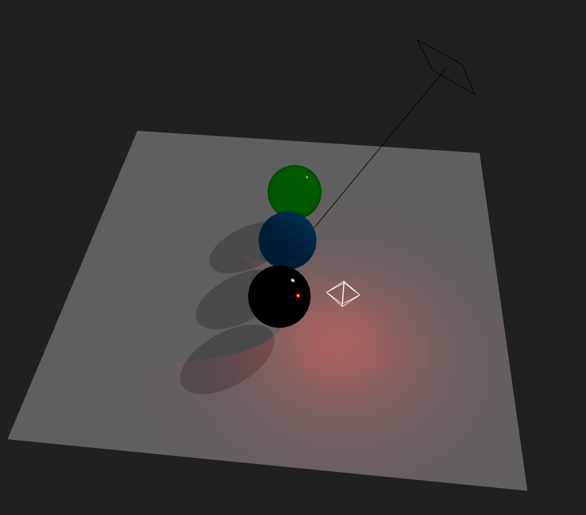
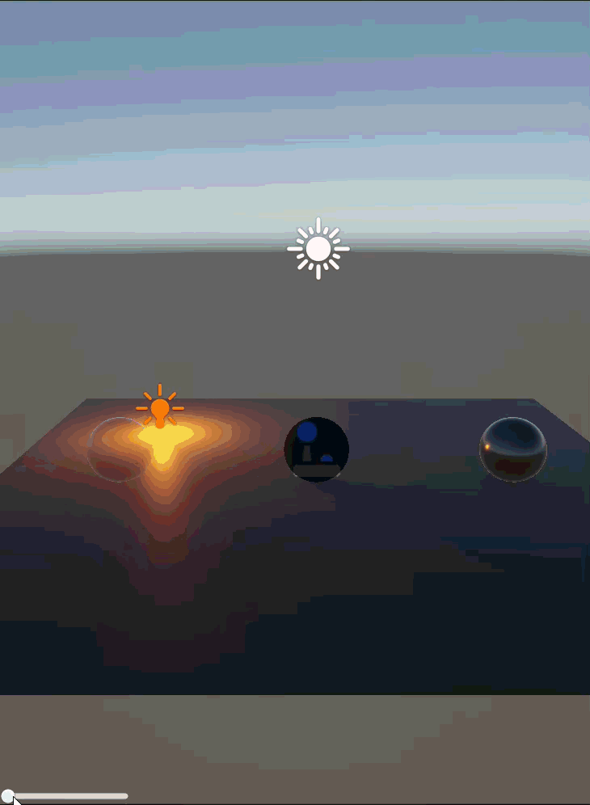

# Taller Luces Sombras Radiometria

**Nombres de los estudiantes:**
- Brayan Alejandro Muñoz Pérez (bmunozp@unal.edu.co)
- Álvaro Andrés Romero Castro (alromeroca@unal.edu.co)
- Juan Camilo Lopez Bustos (juclopezbu@unal.edu.co)
- Oscar Javier Martinez Martinez (ojmartinezma@unal.edu.co)
- Alejandro Ortiz Cortes (alortizco@unal.edu.co)

**Fecha de entrega:** 2026-03-28

---

## Descripción breve
Este taller explora la interacción física entre la luz y los objetos 3D simulando principios básicos de radiometría. Se desarrollaron dos escenas interactivas (en Unity y React Three Fiber) utilizando fuentes de luz direccional, puntual y ambiental. Se analizó el comportamiento de los rayos de luz sobre superficies con diferentes propiedades físicas (mate, metálico y cristal translúcido) y se habilitó el cálculo de proyección de sombras en tiempo real.

---

## Implementaciones

### 1. Three.js (React Three Fiber)
Se implementó una escena 3D declarativa usando `@react-three/fiber` y `@react-three/drei`. 
- **Luces:** Se integraron componentes `<ambientLight>`, `<directionalLight>` y `<pointLight>`, ajustando sus parámetros físicos de intensidad y color.
- **Materiales:** Se utilizaron `MeshStandardMaterial` para superficies mate y `MeshPhysicalMaterial` para representar las propiedades de transmisión (transparencia/cristal) y reflectividad (metal).
- **Sombras:** Se habilitó el flag `shadows` en el Canvas general y se configuraron las propiedades `castShadow` y `receiveShadow` en las mallas correspondientes.
- **Interactividad:** Se implementó un panel de control en tiempo real mediante la librería `leva` para modificar dinámicamente las propiedades de la luz.

### 2. Unity (Versión 6.3 LTS)
Se construyó una escena utilizando el pipeline estándar (3D Core).
- **Luces:** Se configuró una *Directional Light* (Sol) con *Soft Shadows*, una *Point Light* para iluminación localizada y se modificó la luz de entorno global (*Environment Lighting*).
- **Materiales:** Se crearon materiales ajustando los valores de *Albedo*, *Metallic* y *Smoothness* para lograr acabados mate, metálicos pulidos y cristalinos (usando el modo *Transparent*).
- **Interactividad:** Se creó una interfaz de usuario (UI Canvas con Slider) conectada a un script en C# (`LightController.cs`) para manipular la intensidad de la luz principal en tiempo real.

---

## Resultados visuales

### Implementación en Three.js / React Three Fiber

*Captura de la disposición de los objetos, luces y panel de control en React Three Fiber.*


*Demostración del comportamiento dinámico de las luces, sombras y material translúcido modificados desde la UI.*

### Implementación en Unity

*Interacción en tiempo real modificando la intensidad de la luz direccional mediante el Slider UI, evidenciando el renderizado físico de los materiales.*

> **Nota:** Se incluye una sola imagen animada para Unity por ahora. *(Recuerda agregar una segunda imagen como `media/unity_2.png` para cumplir estrictamente el requisito de mínimo 2 por implementación).*

---

## Código relevante

**React Three Fiber - Implementación de Luz con Sombras y Material Físico Transmisivo:**
```jsx
{/* Luz direccional que emite sombras */}
<directionalLight 
  position={[5, 5, 5]} 
  intensity={dirInt} 
  color={dirColor}
  castShadow 
  shadow-mapSize={[1024, 1024]}
/>

{/* Material tipo cristal */}
<meshPhysicalMaterial 
  color="#00ff00" 
  transmission={0.9} 
  opacity={1} 
  transparent={true} 
  roughness={0.1} 
/>
```

**Unity - Script en C# para Control de Intensidad (LightController.cs):**
```csharp
using UnityEngine;
using UnityEngine.UI;

public class LightController : MonoBehaviour
{
    public Light directionalLight;
    public Slider intensitySlider;

    void Start()
    {
        if (directionalLight == null) directionalLight = RenderSettings.sun;
        intensitySlider.value = directionalLight.intensity;
        intensitySlider.onValueChanged.AddListener(UpdateLightIntensity);
    }

    void UpdateLightIntensity(float value)
    {
        directionalLight.intensity = value;
    }
}
```

---

## Prompts utilizados
- "Cómo estructurar un material tipo cristal en React Three Fiber usando meshPhysicalMaterial para que permita el paso de luz pero siga emitiendo sombra."
- "Script en C# para Unity 6 LTS que conecte un UI Slider con la intensidad de la Directional Light de la escena."

---

## Aprendizajes y dificultades

**Aprendizajes:** Logramos comprender cómo los motores gráficos actuales utilizan aproximaciones (PBR - Physically Based Rendering) para simular la radiometría real. Entendimos la relación crítica entre la rugosidad (*roughness* / *smoothness*) y la metalicidad (*metallic*) al momento de dispersar o reflejar la luz. Además, verificamos la importancia de establecer la luz ambiental correctamente para evitar sombras completamente negras y carentes de rebote lumínico.

**Dificultades:** La principal dificultad radicó en configurar correctamente la transparencia en Three.js sin romper el sistema de sombras. Si se usa el canal `opacity` estándar, el objeto deja de verse sólido para la luz; la solución técnica correcta fue usar `transmission` en un `MeshPhysicalMaterial`. En Unity, el reto fue asegurar que el UI interactuara de forma fluida con el motor de iluminación en tiempo real sin requerir reconstrucción (*baking*) de iluminación.
```