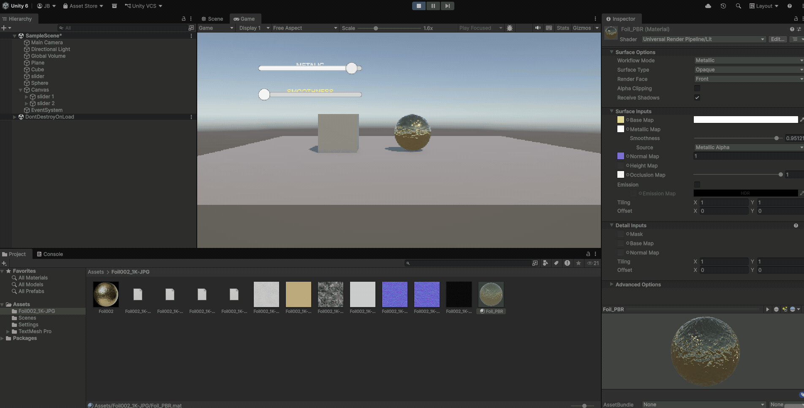
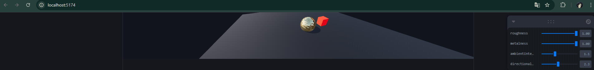

# Taller Materiales Pbr Unity Threejs

## Nombre de los estudiantes
* Brayan Alejandro Muñoz Pérez bmunozp@unal.edu.co
* Álvaro Andrés Romero Castro alromeroca@unal.edu.co
* Juan Camilo Lopez Bustos juclopezbu@unal.edu.co
* Oscar Javier Martinez Martinez ojmartinezma@unal.edu.co
* Alejandro Ortiz Cortes alortizco@unal.edu.co
## Fecha de entrega
2026-03-28

---

## Descripción breve

Este taller tuvo como objetivo comprender y aplicar los principios del **Renderizado Basado en Física (PBR)** utilizando un flujo de trabajo profesional de texturizado tanto en entornos web como en motores de videojuegos. Se exploró cómo la luz interactúa con superficies que poseen diferentes propiedades físicas mediante el uso de mapas de texturas especializados.

La implementación se centró en la creación de escenas 3D en **Unity** y **Three.js** donde se comparan materiales básicos frente a materiales complejos que utilizan mapas de Albedo, Normales, Rugosidad y Metalicidad. Se logró desarrollar interfaces interactivas en ambos entornos para manipular estas propiedades en tiempo real.

---

## Implementaciones

### Unity

Se trabajó con el **Universal Render Pipeline (URP)** para crear un material realista de tipo "Foil" (papel de aluminio/metálico).
* [cite_start]**Material PBR**: Se configuró el material `Foil_PBR` utilizando el shader `Universal Render Pipeline/Lit`[cite: 1]. Se asignaron mapas de base (`_BaseMap`), normales (`_BumpMap`), metálico (`_MetallicGlossMap`) y oclusión (`_OcclusionMap`)[cite: 2, 5].
* **Controlador de Materiales**: Se desarrolló el script `MaterialController.cs` que vincula la interfaz de usuario (UI Sliders) con las propiedades del shader `_Metallic` y `_Glossiness`.
* **Interactividad**: El sistema permite actualizar en tiempo real los valores de suavizado y metalicidad mediante el método `UpdateMaterialValues()`.

### Three.js / React Three Fiber

Se desarrolló una aplicación utilizando **React Three Fiber** y la librería **Drei** para la carga eficiente de recursos.
* **PBR Workflow**: Uso de `meshStandardMaterial` vinculado a cuatro mapas de textura (`map`, `normalMap`, `roughnessMap`, `metalnessMap`) cargados asíncronamente.
* **Iluminación Global**: Implementación de un componente `<Environment />` con el preset "sunset" para proporcionar reflejos realistas.
* **Interfaz de Usuario (UI)**: Integración de **Leva** para el control dinámico de las propiedades físicas y luces.

---

## Resultados visuales

### Unity - Implementación


*Demostración del cambio de propiedades metálicas en Unity usando el script MaterialController.*

### Three.js - Implementación


*Muestra de la esfera PBR reaccionando a los cambios de Rugosidad y Metalicidad mediante Leva.*

---

## Código relevante

### Ejemplo de controlador en Unity (C#):

```csharp
public void UpdateMaterialValues()
{
    if (pbrMaterial != null)
    {
        // Actualización de propiedades del shader mediante sliders
        pbrMaterial.SetFloat("_Metallic", metallicSlider.value);
        pbrMaterial.SetFloat("_Smoothness", smoothnessSlider.value);
    }
}
```

### Ejemplo de configuración en Three.js:
```
JavaScript
<meshStandardMaterial 
  {...props} 
  roughness={roughness} 
  metalness={metalness} 
  envMapIntensity={2}
/>
```
## Prompts utilizados
- "Ayúdame a solucionar el error de visualización en React Three Fiber cuando las texturas no cargan."
- "Genera un script en C# para Unity que cambie el valor de _Metallic en un material URP desde un Slider."
- "¿Cómo forzar la actualización de la caché en un proyecto de Vite y Three.js?"

## Aprendizajes y dificultades
### Aprendizajes
A través de este taller, profundicé en la importancia de los Mapas de Normales para simular detalles geométricos sin aumentar la carga de polígonos. Comprendí que un material PBR requiere de un entorno (EnvironmentMap en Three.js o Skybox en Unity) para que los reflejos tengan coherencia visual.

### Dificultades
En Three.js, la mayor dificultad fue la carga asíncrona de las texturas y la sensibilidad a las mayúsculas en las rutas de los archivos.

En Unity, se presentó una dificultad técnica específica con el material seleccionado: no se pudo visualizar el roughness (suavizado) debidamente debido a la naturaleza altamente reflectiva y las propiedades intrínsecas del material de "Foil" seleccionado, lo que dificultaba apreciar variaciones sutiles en la rugosidad bajo ciertas condiciones de luz.

### Mejoras futuras
Me gustaría implementar mapas de desplazamiento (Displacement Maps) para añadir relieve real a la geometría y explorar el uso de shaders personalizados en HLSL para efectos de post-procesamiento.

## Referencias

- **Adobe Substance 3D (2024)**. *The PBR Guide: Part 1, Light and Matter*. Recuperado de: https://substance3d.adobe.com/tutorials/courses/the-pbr-guide-part-1
- **Pozo, N. (2023)**. *React Three Fiber Documentation: useTexture hook*. Recuperado de: https://docs.pmnd.rs/react-three-fiber/
- **Three.js Core Team**. *MeshStandardMaterial Technical Reference*. Recuperado de: https://threejs.org/docs/#api/en/materials/MeshStandardMaterial
- **Unity Technologies**. *Universal Render Pipeline: Lit Shader Reference*. Recuperado de: https://docs.unity3d.com/Packages/com.unity.render-pipelines.universal@12.1/manual/lit-shader.html