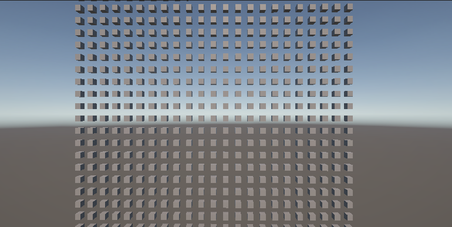
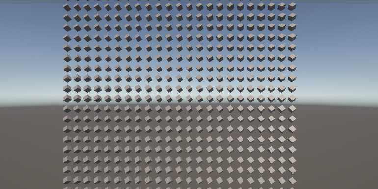
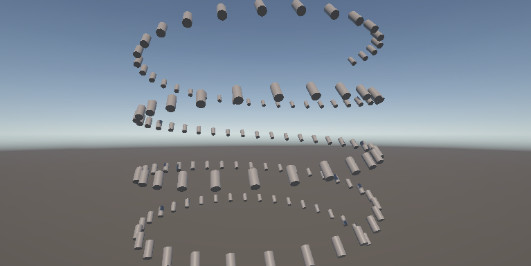
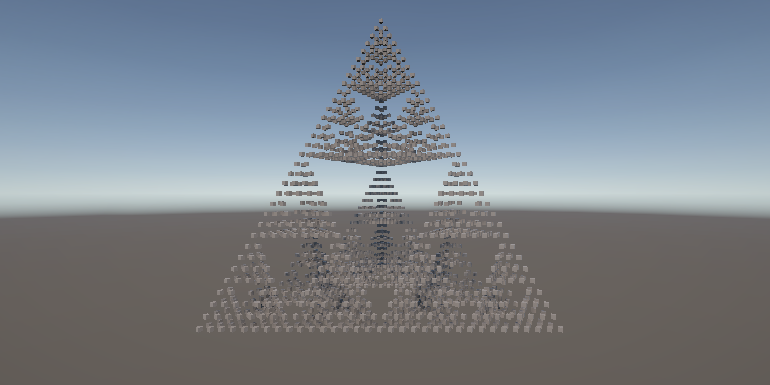
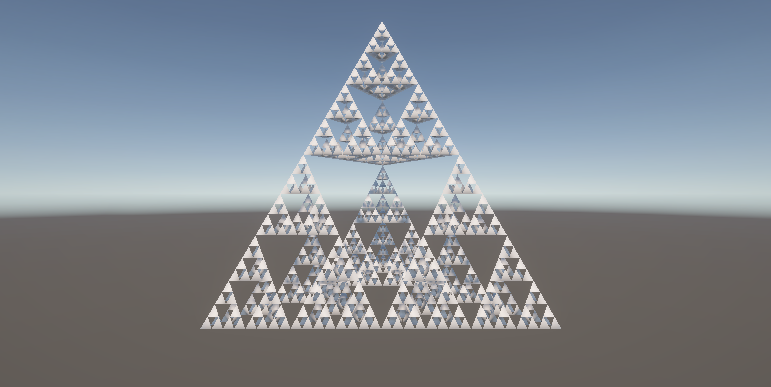
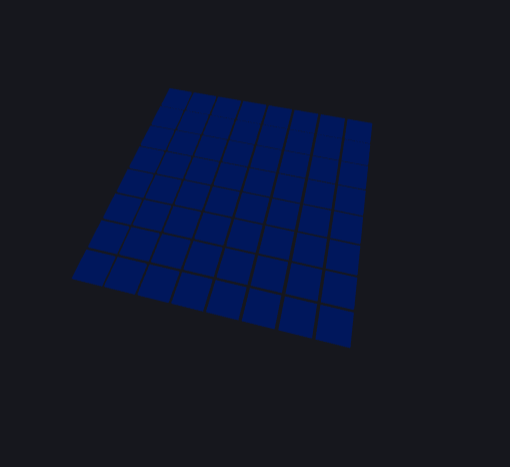
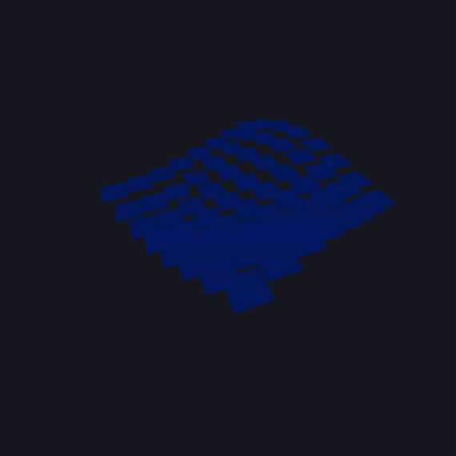
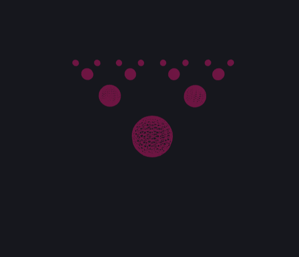

# Taller Etapas Pipeline Programable

## Nombre del estudiante
* Brayan Alejandro Muñoz Pérez bmunozp@unal.edu.co
* Álvaro Andrés Romero Castro alromeroca@unal.edu.co
* Juan Camilo Lopez Bustos juclopezbu@unal.edu.co
* Oscar Javier Martinez Martinez ojmartinezma@unal.edu.co
* Alejandro Ortiz Cortes alortizco@unal.edu.co

## Fecha de entrega
2026-03-28

---

## Descripción breve
El objetivo de este taller fue explorar la creación de objetos simples, y la manipulacion de los mismos en varias estructuras procedurales. Además de una aplicación simple de animaciones.

Durante el desarrollo, se usaron las funciones para implementar objetos 3D primitivos, como cubos, esferas y cilindros. A partir de estos objetos, se transformaron espacialmente para crear distintas estructuras.

---

## Implementaciones

### Unity
Se creo un script para popular un objeto con hijos en una dada estructura.

Este escript permite elegir el primitivo a usar, y una de tres estructuras basicas. Una vez se eligen los parametros base, se limpian los objetos hijos y se repopula con los objetos en la estructura dada.

Tambien si se selecciona la estructura piramide se permite crear una malla del fractal piramidal dado un límite de profundidad. Que se le aplica al objeto generador.

### Three.js / React Three Fiber (GLSL)
Se implementó un componente `GridTile` y `AnimatedGrid` que se encargan de renderizar una cuadricula, a la que se le puede dar una animacion de "olas" y rotacion individual de cada objeto.

Tambien hay un fractal simple que consiste de esferas decrecientes de tamaño en una organización que se acerca a la de un arbol.

---

## Resultados visuales

### Unity - Implementación

*Cuadricula de cubos sin aplicar rotación.*


*Cuadricula de cubos con una rotación uniforme aplicada a todos*


*Espiral de cilindros con rotación uniforme*


*Aproximacion de un fractal piramidal con cubos*


*Malla que aproxima un fractal piramidal con profundidad 5*

### Three.js - Implementación


*Cuadricula de prismas cuadrangulares uniformes*


*Cuadricula de prismas animados .*


*Arbol fractal compuesto de esferas en wireframe*

---

## Código relevante

### Iteradores de posiciones en estructuras en Unity:
```c#
private IEnumerable<Vector3> gridPositions() {
    int objPerSide = (int)math.ceil(math.sqrt(this.numObj));
    float xMul = this.gridSize.x / objPerSide;
    float yMul = this.gridSize.y / objPerSide;
    for(int i = 0; i < this.numObj; i++) {
        int x = i % objPerSide;
        int y = (int)(i / objPerSide);
        yield return new Vector3(x * xMul, y * yMul);
    }
}
private IEnumerable<Vector3> spiralPositions() {
    for(int i = 0; i < this.numObj; i++) {
        float t = (float) i / (float) (this.numObj - 1);
        float angle = i * this.spiralAngleOff;
        yield return new Vector3(
            this.spiralRadius * math.cos(angle),
            this.spiralHeight * t,
            this.spiralRadius * math.sin(angle)
            );
    }
}

private IEnumerable<Vector3> recursivePyramid(Vector3 A, Vector3 B, Vector3 C, Vector3 D) {
    //returns in the form 2 * (4^n - 1) where n is the depth of recursive calls
    Vector3 AB = (A + B) / 2;
    yield return AB;
    Vector3 AC = (A + C) / 2;
    yield return AC;
    Vector3 AD = (A + D) / 2;
    yield return AD;
    Vector3 BC = (B + C) / 2;
    yield return BC;
    Vector3 BD = (B + D) / 2;
    yield return BD;
    Vector3 CD = (C + D) / 2;
    yield return CD;

    var sub1 = recursivePyramid(A, AB, AC, AD);
    var sub2 = recursivePyramid(AB, B, BC, BD);
    var sub3 = recursivePyramid(AC, BC, C, CD);
    var sub4 = recursivePyramid(AD, BD, CD, D);

    uint maxRet = 6;
    var subs = new IEnumerator<Vector3>[] {
        sub1.GetEnumerator(),
        sub2.GetEnumerator(),
        sub3.GetEnumerator(),
        sub4.GetEnumerator()
    };
    while(true) {
        foreach(var sub in subs) {
            for(uint i = 0; i < maxRet; i++) {
                sub.MoveNext();
                yield return sub.Current;
            }
        }
        maxRet <<= 2;
    }
}

private IEnumerable<Vector3> pyramidPositions() {
    Vector3 A, B, C, D;
    A = Vector3.up * this.pyramidHeight;
    float fromCenter = this.pyramidHeight / math.sqrt(3);
    B = new Vector3(math.cos(math.PI * 2 / 3) * fromCenter, 0, math.sin(math.PI * 2 / 3) * fromCenter);
    C = new Vector3(math.cos(math.PI * 4 / 3) * fromCenter, 0, math.sin(math.PI * 4 / 3) * fromCenter);
    D = new Vector3(math.cos(math.PI * 2) * fromCenter, 0, math.sin(math.PI * 2) * fromCenter);
    var vecEnum = recursivePyramid(A, B, C, D).GetEnumerator();
    if (this.numObj > 0)
        yield return A;
    if (this.numObj > 1)
        yield return B;
    if (this.numObj > 2)
        yield return C;
    if (this.numObj > 3)
        yield return D;
    for(uint i = 0; i < this.numObj - 4 && vecEnum.MoveNext(); i++) {
        yield return vecEnum.Current;
    }
}
```

### Creacion de los objetos en Unity:

```c#
public void destroyChildObj() {
    if(objects != null) {
        foreach(GameObject obj in objects) {
            DestroyImmediate(obj);
        }
    }
    objects = null;
}

public void createObjects() {
    destroyChildObj();
    this.objects = new GameObject[this.numObj];

    //position iterable
    Func<IEnumerable<Vector3>> iterable = null;
    switch (this.structure) {
        case Structure.grid:
            iterable = gridPositions;
            break;
        case Structure.spiral:
            iterable = spiralPositions;
            break;
        case Structure.pyramid:
            iterable = pyramidPositions;
            break;
    }

    uint i = 0;
    foreach (Vector3 pos in iterable()) {
        GameObject obj = GameObject.CreatePrimitive(this.objType); //create obj

        //initialize obj
        obj.transform.parent = gameObject.transform;
        obj.transform.localPosition = pos;
        obj.transform.rotation = Quaternion.Euler(this.rotation);
        obj.transform.localScale = this.scale;

        this.objects[i++] = obj; //add to obj array
    }

}
```

### Creacion de la malla fractal en Unity:
```c#
public void genPyramidMesh() {
    uint numVert = 0;
    uint numTri = 1;
    if (pyramidDepth > 0) {
        numTri = (uint)4 << ((int) this.pyramidDepth - 1) * 2;
        numVert = (numTri - 1) << 1;
    }
    numTri *= 12;
    numVert += 4;
    this.meshVert = new Vector3[numVert];
    this.meshTri = new int[numTri];
    triUsed = 0;

    meshVert[0] = Vector3.up * this.pyramidHeight;
    float fromCenter = this.pyramidHeight / math.sqrt(3);
    meshVert[1] = new Vector3(math.cos(math.PI * 2 / 3) * fromCenter, 0, math.sin(math.PI * 2 / 3) * fromCenter);
    meshVert[2] = new Vector3(math.cos(math.PI * 4 / 3) * fromCenter, 0, math.sin(math.PI * 4 / 3) * fromCenter);
    meshVert[3] = new Vector3(math.cos(math.PI * 2) * fromCenter, 0, math.sin(math.PI * 2) * fromCenter);
    vertUsed = 4;

    genPyramidMesh(0, 1, 2, 3, 0);

    Mesh pyramid = new Mesh();
    pyramid.vertices = meshVert;
    pyramid.triangles = meshTri;
    pyramid.RecalculateNormals();

    gameObject.GetComponent<MeshFilter>().mesh = pyramid;
}
public void genPyramidMesh(int a, int b, int c, int d, int depth) {
    if (depth < this.pyramidDepth) {
        meshVert[vertUsed] = (meshVert[a] + meshVert[b]) / 2;
        int ab = vertUsed++;
        meshVert[vertUsed] = (meshVert[a] + meshVert[c]) / 2;
        int ac = vertUsed++;
        meshVert[vertUsed] = (meshVert[a] + meshVert[d]) / 2;
        int ad = vertUsed++;
        meshVert[vertUsed] = (meshVert[b] + meshVert[c]) / 2;
        int bc = vertUsed++;
        meshVert[vertUsed] = (meshVert[b] + meshVert[d]) / 2;
        int bd = vertUsed++;
        meshVert[vertUsed] = (meshVert[c] + meshVert[d]) / 2;
        int cd = vertUsed++;

        genPyramidMesh(a, ab, ac, ad, ++depth);
        genPyramidMesh(ab, b, bc, bd, depth);
        genPyramidMesh(ac, bc, c, cd, depth);
        genPyramidMesh(ad, bd, cd, d, depth);
        return;
    }
    meshTri[triUsed++] = b;
    meshTri[triUsed++] = a;
    meshTri[triUsed++] = c;

    meshTri[triUsed++] = c;
    meshTri[triUsed++] = a;
    meshTri[triUsed++] = d;

    meshTri[triUsed++] = d;
    meshTri[triUsed++] = a;
    meshTri[triUsed++] = b;

    meshTri[triUsed++] = b;
    meshTri[triUsed++] = c;
    meshTri[triUsed++] = d;
}
```

### Cuadricula en Three js:
```jsx
const GridTile = ({ position, time, isPlaying }) => {
  const meshRef = useRef();

  useFrame((state) => {
    const t = state.clock.getElapsedTime();
    if (meshRef.current) {
      // Calculate a unique Y position based on X and Z coordinates + Time
      const wave = isPlaying?Math.sin(position[0] * 0.5 + t) * Math.cos(position[2] * 0.5 + t):0;
      meshRef.current.position.y = wave;
      
      // Optional: Make them rotate too
      meshRef.current.rotation.y = isPlaying? t * 0.5:0;
    }
  });

  return (
    <mesh ref={meshRef} position={position}>
      <boxGeometry args={[0.9, 0.1, 0.9]} />
      <meshStandardMaterial color="royalblue" />
    </mesh>
  );
};

const AnimatedGrid = ({ count = 10, isPlaying }) => {
  const tiles = useMemo(() => {
    const temp = [];
    for (let x = 0; x < count; x++) {
      for (let z = 0; z < count; z++) {
        temp.push([x - count / 2, 0, z - count / 2]);
      }
    }
    return temp;
  }, [count]);

  return (
    <group>
      {tiles.map((pos, i) => (
        <GridTile key={i} position={pos} isPlaying={isPlaying}/>
      ))}
    </group>
  );
};
```
### Fractal de arbol en Three js:
```jsx
const FractalTree = ({ position, scale, depth }) => {
  if (depth <= 0) return null;

  return (
    <group position={position} scale={scale}>
      <mesh>
        <sphereGeometry args={[1, 16, 16]} />
        <meshStandardMaterial color="hotpink" wireframe />
      </mesh>
      
      {/* Recursive branches */}
      <FractalTree position={[2, 2, 0]} scale={[0.5, 0.5, 0.5]} depth={depth - 1} />
      <FractalTree position={[-2, 2, 0]} scale={[0.5, 0.5, 0.5]} depth={depth - 1} />
    </group>
  );
};
``` 


## Prompts utilizados

Como tengo un menor conocimiento de threejs le hice preguntas como:

- "Crea una cuadricula de objetos en threejs."
- "Crea una anumacion senoidal para aplicar sobre la cuadricula."
- "¿Cómo crear un patron fractal de arbol recursivo de objetos?"

## Aprendizajes y dificultades

### Aprendizajes

Reforcé la aplicación de transformaciones a objetos en cada plataforma, y la creación de mallas en unity. También, me familiarize con las funciones para instanciar objetos 3D. Además, aprendí a generar fractales por medio de la recursividad.

### Dificultades

La mayor dificultad fue la creación de la malla fractal, ya que no me fue intuitivo como crear la lista de triangulos. Debido a esto tuve que escribir una segunda funcion recursiva para computar no solo los vertices del fractal, sino tambien sus triangulos una vez llegado a la profundidad deseada.

La otra fue en si entender como usar threejs y sus componentes que no me son familiares. Además de las dependencias que varias veces me retrasaron.

### Mejoras Futuras

Me gustaría intentar refactorizar las funciones de fractal para que sean más limpias y reusables.
