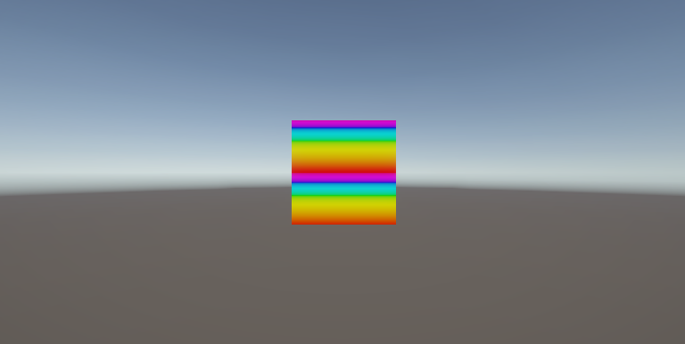
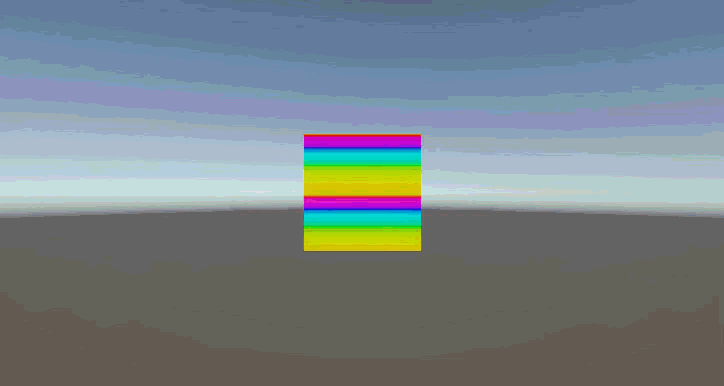
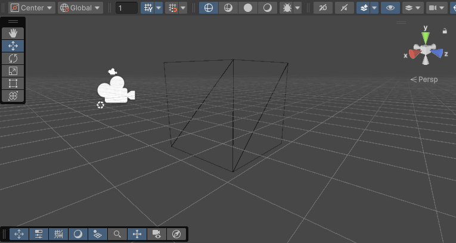

# Taller Etapas Pipeline Programable

## Nombre del estudiante
* Brayan Alejandro Muñoz Pérez bmunozp@unal.edu.co
* Álvaro Andrés Romero Castro alromeroca@unal.edu.co
* Juan Camilo Lopez Bustos juclopezbu@unal.edu.co
* Oscar Javier Martinez Martinez ojmartinezma@unal.edu.co
* Alejandro Ortiz Cortes alortizco@unal.edu.co

## Fecha de entrega
2026-03-28

---

## Descripción breve
El objetivo de este taller fue explorar el uso de shader y diferentre aplicaciones de estos en objetos 3D.

Durante el desarrollo, se uso los métodos para crear shaders y manipular los valores de los objetos 3D para producir los effectos deseados.

---

## Implementaciones

### Unity
Se crearon 3 shaders y materiales para crear los effectos deseados, uno para un shader basado en la posicion (altura) y tiempo transcurrido creando un effecto animado colorido.

Los otros dos se crearon para recrear un effecto "toon", donde se creo un delineado de objetos creando una "copia" más grande del objeto y empujanola para atras creando el efecto de delineado. El otro shader era para dar un estilo de sombra simplificado donde hay saltos de color entre distintos valores de sombra para dar a entender un effecto de iluminacion más rústico. 

Tambien se uso el inspector para ver un wireframe de un cubo.

---

## Resultados visuales

### Unity - Implementación

*Cubo con shader que da una hue basado en la altura computada.*


*El mismo shader de altura, pero se suma a la altura el tiempo*


*Cubo en wireframe visto desde el inspector*


*Esfera con toon shader aplicado*
---

## Código relevante

### Paso del centro de objeto al shader:
```c#
using UnityEngine;

public class PassCenter2Shader : MonoBehaviour {
	private MeshRenderer _renderer;
	public Material shaderMaterial; // Assign your Shader Graph material in the Inspector

	[ExecuteAlways]
	void Start() {
		_renderer = GetComponent<MeshRenderer>();
	}

	[ExecuteAlways]
	void Update() {
		// Calculate the world center every frame (or only when the object moves)
		Vector3 center = _renderer.bounds.center;
		// Pass it to the material's property named "_ObjectCenter"
		shaderMaterial.SetVector("_ObjectCenter", center);
	}
}
```


## Prompts utilizados

Como tengo un menor conocimiento de threejs le hice preguntas como:

- "Crea una cuadricula de objetos en threejs."
- "Crea una anumacion senoidal para aplicar sobre la cuadricula."
- "¿Cómo crear un patron fractal de arbol recursivo de objetos?"

## Aprendizajes y dificultades

### Aprendizajes

Reforcé la aplicación de transformaciones a objetos en cada plataforma, y la creación de mallas en unity. También, me familiarize con las funciones para instanciar objetos 3D. Además, aprendí a generar fractales por medio de la recursividad.

### Dificultades

La mayor dificultad fue la creación de la malla fractal, ya que no me fue intuitivo como crear la lista de triangulos. Debido a esto tuve que escribir una segunda funcion recursiva para computar no solo los vertices del fractal, sino tambien sus triangulos una vez llegado a la profundidad deseada.

La otra fue en si entender como usar threejs y sus componentes que no me son familiares. Además de las dependencias que varias veces me retrasaron.

### Mejoras Futuras

Me gustaría intentar refactorizar las funciones de fractal para que sean más limpias y reusables.
