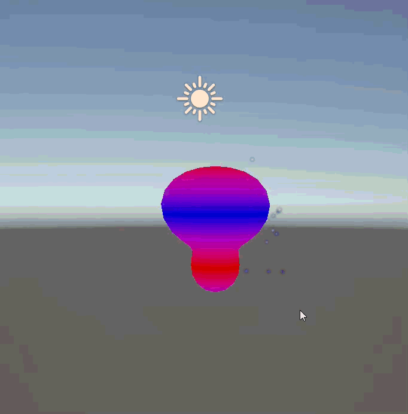

# Taller Texturizado Dinamico Shaders Particulas

**Nombres de los estudiantes:**
- Brayan Alejandro Muñoz Pérez (bmunozp@unal.edu.co)
- Álvaro Andrés Romero Castro (alromeroca@unal.edu.co)
- Juan Camilo Lopez Bustos (juclopezbu@unal.edu.co)
- Oscar Javier Martinez Martinez (ojmartinezma@unal.edu.co)
- Alejandro Ortiz Cortes (alortizco@unal.edu.co)

**Fecha de entrega:** 2026-03-28

---

## Descripción breve
En este taller exploramos la creación de materiales dinámicos y sistemas de partículas interactivos. Intervenimos directamente el pipeline gráfico utilizando Shaders (Vertex y Fragment/Unlit) para deformar la geometría de un objeto y cambiar su color en tiempo real basándonos en el tiempo. Además, acoplamos sistemas de partículas para simular ráfagas de energía que reaccionan a los clics del usuario, implementando estas mecánicas tanto en un entorno web (React Three Fiber) como en un motor de escritorio (Unity).

---

## Implementaciones

### 1. Three.js (React Three Fiber)
Se desarrolló una escena empleando el componente `<shaderMaterial>`. 
- **Vertex Shader:** Se modificó la posición de los vértices desplazándolos en la dirección de su normal usando una función senoidal y la variable uniforme `uTime`, generando una pulsación fluida.
- **Fragment Shader:** Se realizó una interpolación (`mix`) entre dos colores utilizando las coordenadas UV y el tiempo.
- **Partículas:** Se creó un componente personalizado con `bufferGeometry`, manipulando directamente arreglos `Float32Array` para las posiciones de 2000 partículas. Al hacer clic (`onClick`), se activa un estado que multiplica la posición de los vértices simulando una explosión expansiva.

### 2. Unity (Versión LTS 3D Core / URP)
Se implementó un Shader personalizado compatible mediante código Cg/HLSL.
- **Shader:** Debido a restricciones de compatibilidad con URP/Surface Shaders, se programó un *Unlit Shader* a medida. En la etapa de vértices (`#pragma vertex vert`) se aplicó un desplazamiento espacial en el eje Y utilizando `_Time.y`. En la etapa de fragmentos (`#pragma fragment frag`) se mezclaron dos colores expuestos en el Inspector basándose en la altura del vértice en el mundo real.
- **Partículas:** Se configuró el Shuriken Particle System para emitir ráfagas instantáneas (Bursts).
- **Interacción:** El script `InteractiveEffect.cs` lee el input del mouse, modifica dinámicamente las propiedades del material (`SetFloat`) para hacer la vibración más violenta y dispara la ráfaga de partículas.

---

## Resultados visuales

### Implementación en Three.js / React Three Fiber

*Animación del shader pulsante y la expansión de partículas al hacer clic.*

### Implementación en Unity

*Reacción en tiempo real del Unlit Shader (distorsión y color) y ráfaga de partículas mediante script.*

---

## Código relevante

**Three.js - Vertex Shader (Desplazamiento fluido):**
```glsl
vec3 pos = position;
float displacement = sin(pos.y * 5.0 + uTime * 2.0) * 0.1;
pos += normal * displacement;
gl_Position = projectionMatrix * modelViewMatrix * vec4(pos, 1.0);
```

**Unity - Unlit Shader (Transformación de Vértices en Cg):**
```csharp
v2f vert (appdata v)
{
    v2f o;
    float time = _Time.y * _Speed;
    float displacement = sin(v.vertex.y * 5.0 + time) * _Amount;
    v.vertex.xyz += v.normal * displacement;
    o.pos = UnityObjectToClipPos(v.vertex);
    o.worldPos = mul(unity_ObjectToWorld, v.vertex).xyz;
    return o;
}
```

---

## Prompts utilizados
- "Cómo solucionar error magenta en Unity 6 con Surface Shaders creando un Unlit Shader que deforme vértices."
- "Crear un sistema de partículas interactivo en React Three Fiber manipulando bufferGeometry con Float32Array."

---

## Aprendizajes y dificultades
- **Aprendizajes:** Entendimos la diferencia fundamental entre procesar datos en la CPU (scripts) vs la GPU (Shaders). Modificar la posición de los vértices directamente en la GPU es drásticamente más eficiente. También comprendimos el ciclo de vida de un material Unlit y cómo funciona la transformación matemática de coordenadas locales (`v.vertex`) a coordenadas de pantalla (`UnityObjectToClipPos`).
- **Dificultades:** La mayor dificultad técnica se presentó en Unity, donde el Surface Shader estándar falló al compilar (mostrando un material magenta continuo) debido a conflictos con la configuración del proyecto. Se resolvió exitosamente reescribiendo la lógica en un Unlit Shader clásico con los pases de vértices y fragmentos explícitos.