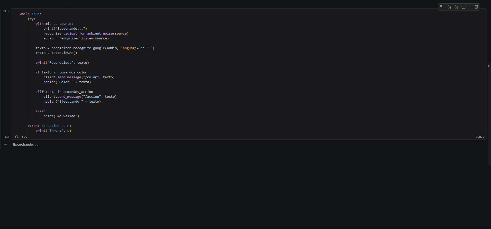
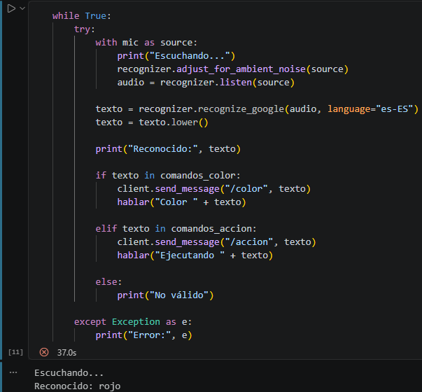
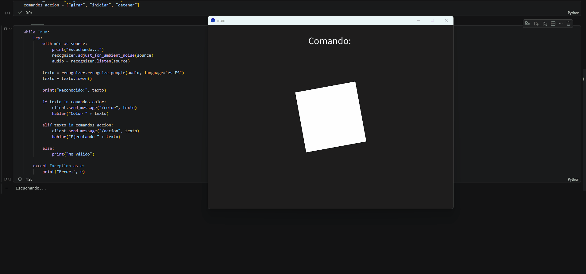
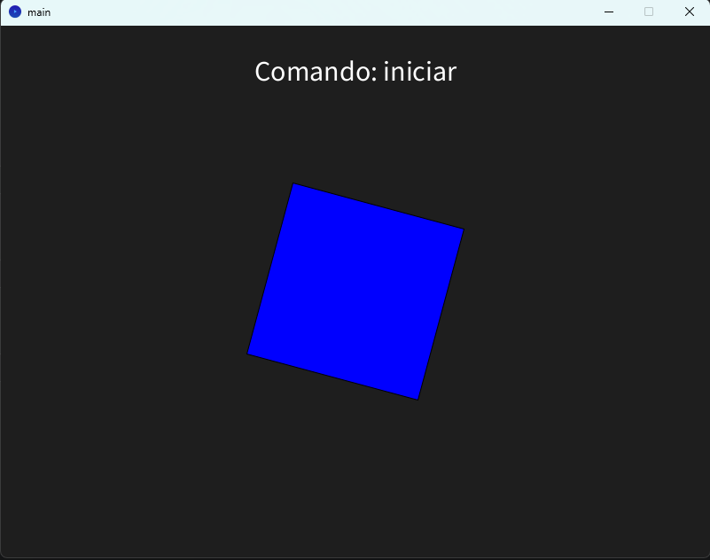

# Taller Reconocimiento Voz Local

## Nombre del estudiante

* Brayan Alejandro Muñoz Pérez bmunozp@unal.edu.co
* Álvaro Andrés Romero Castro alromeroca@unal.edu.co
* Juan Camilo Lopez Bustos juclopezbu@unal.edu.co
* Oscar Javier Martinez Martinez ojmartinezma@unal.edu.co
* Alejandro Ortiz Cortes alortizco@unal.edu.co

## Fecha de entrega

25 de abril de 2026

---

## Descripción breve

El objetivo de este taller fue desarrollar un sistema de reconocimiento de voz local en Python capaz de capturar comandos hablados desde el micrófono y convertirlos en acciones visuales en Processing mediante comunicación OSC.

Se implementó una solución donde el usuario pronuncia comandos como **rojo**, **azul**, **verde**, **girar**, **iniciar** y **detener**, y estos modifican en tiempo real una escena gráfica en Processing.

El sistema integra entrada por voz, procesamiento de comandos y respuesta visual interactiva.

---

## Implementaciones

## Python (Reconocimiento de Voz Local)

Se desarrolló un notebook en Python encargado de:

- Capturar audio desde el micrófono.
- Reconocer comandos por voz usando `speech_recognition`.
- Uso de reconocimiento offline con PocketSphinx y opción online con Google Speech Recognition.
- Crear diccionario de comandos válidos.
- Enviar mensajes OSC hacia Processing.
- Retroalimentación por consola y voz con `pyttsx3`.

### Librerías utilizadas

- speech_recognition
- pyaudio
- python-osc
- pyttsx3

### Evidencias




---

## Processing (Visualización Remota)

Se desarrolló una escena en Processing conectada por OSC para reaccionar a comandos de voz.

### Funcionalidades implementadas

- Recepción de mensajes OSC.
- Cambio de color de figura principal.
- Rotación animada.
- Pausa y reanudación de animación.
- Visualización del último comando recibido.

### Evidencias




---

## Código relevante

### Python - Envío OSC

```python
if texto in ["rojo", "azul", "verde"]:
    client.send_message("/color", texto)

elif texto in ["girar", "iniciar", "detener"]:
    client.send_message("/accion", texto)
````

### Processing - Recepción OSC

```java
if (msg.checkAddrPattern("/color")) {
   String valor = msg.get(0).stringValue();
}
```

---

## Prompts utilizados

Se utilizó IA generativa como apoyo para:

* Estructurar arquitectura del taller.
* Corrección de errores de PocketSphinx.
* Generación de ejemplos OSC entre Python y Processing.
* Redacción del README.

### Ejemplo de prompt usado

> Explicame como funciona OSC.

---

## Aprendizajes y dificultades

Durante el desarrollo se fortalecieron conocimientos en integración entre herramientas, reconocimiento de voz y comunicación en tiempo real entre aplicaciones.

### Aprendizajes

* Uso de entrada de audio en Python.
* Comunicación OSC entre programas.
* Programación visual en Processing.
* Manejo de eventos en tiempo real.

### Dificultades encontradas

* Instalación de PyAudio en Windows.
* Configuración de PocketSphinx en español.
* Sincronización entre Processing y Python.
* Ajuste del micrófono por ruido ambiental.

### Reflexión personal

Este taller permitió comprender cómo conectar la voz humana con sistemas interactivos, abriendo posibilidades para interfaces naturales y proyectos multimedia más avanzados.