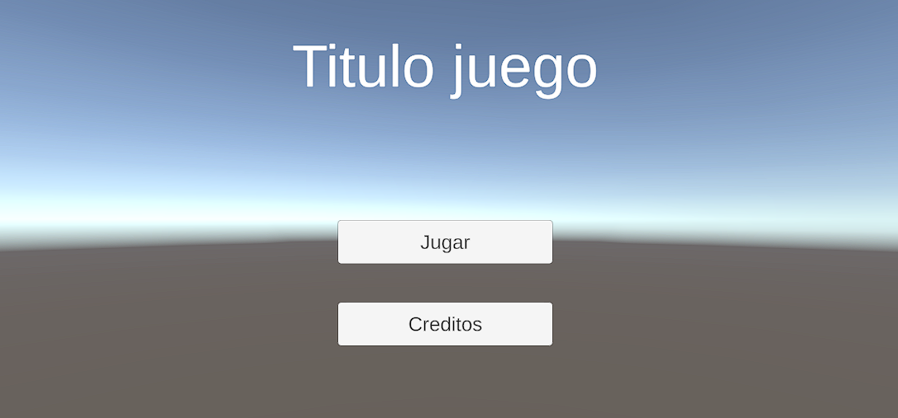
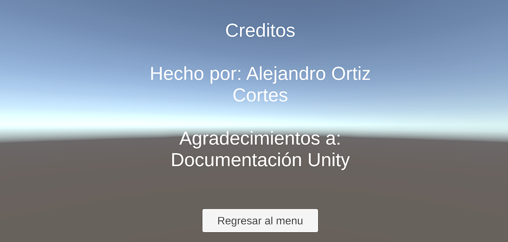
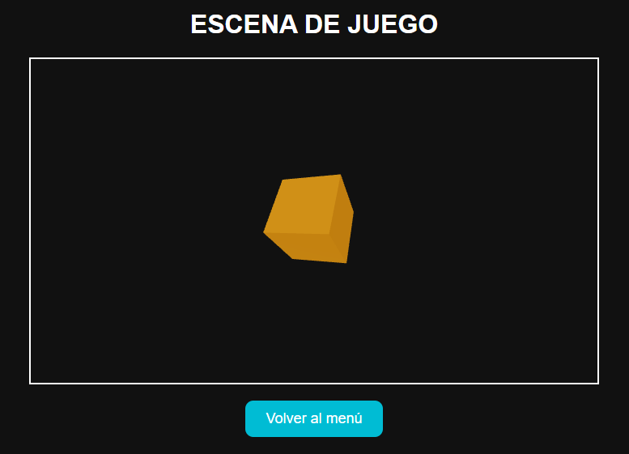

# Taller Arquitectura Escenas Navegacion Unity Threejs

## Nombre del estudiante
* Brayan Alejandro Muñoz Pérez bmunozp@unal.edu.co
* Álvaro Andrés Romero Castro alromeroca@unal.edu.co
* Juan Camilo Lopez Bustos juclopezbu@unal.edu.co
* Oscar Javier Martinez Martinez ojmartinezma@unal.edu.co
* Alejandro Ortiz Cortes alortizco@unal.edu.co

## Fecha de entrega

25 de abril de 2026

---

# Descripción breve

El objetivo de este taller fue diseñar una estructura escalable para una aplicación interactiva con múltiples escenas o pantallas, permitiendo una navegación fluida entre menús, niveles y pantallas secundarias.

Se desarrollaron dos implementaciones principales:

1. Unity usando escenas independientes y navegación con SceneManager.
2. React + Three.js usando rutas con react-router-dom y componentes como escenas virtuales.

En ambos casos se aplicó una arquitectura modular y organizada, facilitando futuras mejoras o ampliaciones.

---

# Implementaciones

## 1. Implementación en Unity

Se desarrolló una aplicación con tres escenas:

* Menú principal
* Escena de juego
* Pantalla de créditos

La navegación entre escenas se realizó mediante botones UI conectados a un script en C# utilizando `SceneManager.LoadScene()`.

### Funcionalidades implementadas

* Botón Jugar
* Botón Créditos
* Botón Volver al menú
* Organización por carpetas
* Escenas registradas en Build Settings

---

## 2. Implementación en React + Three.js

Se desarrolló una aplicación web con navegación por rutas:

* `/` → Menú principal
* `/juego` → Escena de juego 3D
* `/creditos` → Pantalla de créditos

Se utilizaron las librerías:

* React
* react-router-dom
* @react-three/fiber
* @react-three/drei

### Funcionalidades implementadas

* Navegación entre rutas
* Escena 3D con cubo interactivo
* Cámara orbit control
* Componentes independientes por pantalla
* Diseño visual básico

---

# Resultados visuales

## Unity

### Menú principal



### Créditos



---

## React + Three.js

### Escena Juego



### Créditos


---

# Código relevante

## Unity - Navegación entre escenas

```csharp
using UnityEngine;
using UnityEngine.SceneManagement;

public class Navegacion : MonoBehaviour
{
    public void IrAJuego()
    {
        SceneManager.LoadScene("Juego");
    }

    public void IrACreditos()
    {
        SceneManager.LoadScene("Creditos");
    }

    public void IrAMenu()
    {
        SceneManager.LoadScene("Menu");
    }
}
```

---

## React Router

```jsx
<Routes>
  <Route path="/" element={<Menu />} />
  <Route path="/juego" element={<Juego />} />
  <Route path="/creditos" element={<Creditos />} />
</Routes>
```

---

## Three.js Escena 3D

```jsx
<Canvas>
  <ambientLight />
  <mesh>
    <boxGeometry />
    <meshStandardMaterial color="orange" />
  </mesh>
</Canvas>
```

---

# Prompts utilizados

Se utilizó inteligencia artificial como apoyo para:

* Generación de estructura base del proyecto Unity
* Configuración de rutas en React
* Integración de Three.js con React
* Corrección de errores en botones y navegación
* Redacción técnica del README

Ejemplo de prompt utilizado:

```text
Explicame como funciona SceneManagement en Unity
```

---

# Aprendizajes y dificultades

Durante el desarrollo del taller aprendí la importancia de separar correctamente cada pantalla en escenas o componentes independientes para mantener el código organizado.

En Unity comprendí el funcionamiento del `SceneManager` y la necesidad de agregar las escenas al Build Settings para que funcionen correctamente.

En React aprendí cómo usar `react-router-dom` para simular escenas mediante rutas, además de integrar objetos 3D con Three.js.

Las principales dificultades fueron:

* Configurar correctamente los botones en Unity.
* Resolver errores iniciales con paquetes y dependencias.
* Ajustar tamaños y estilos visuales en React.

En conclusión, el taller permitió entender cómo construir aplicaciones escalables con navegación estructurada tanto en motores de videojuegos como en aplicaciones web modernas.
