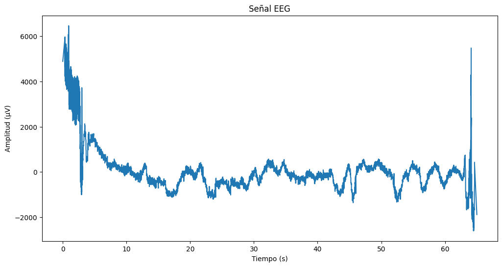
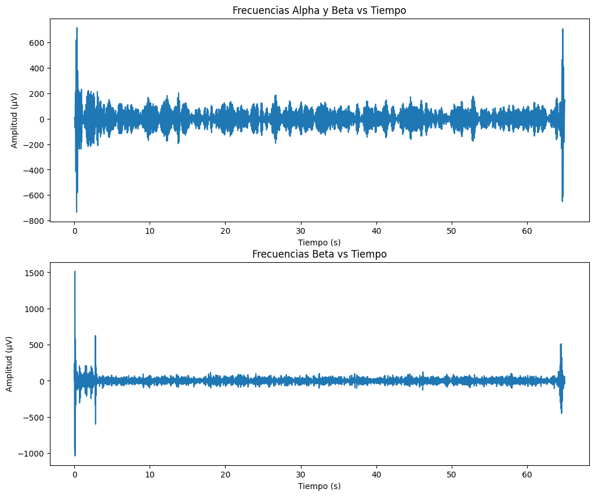
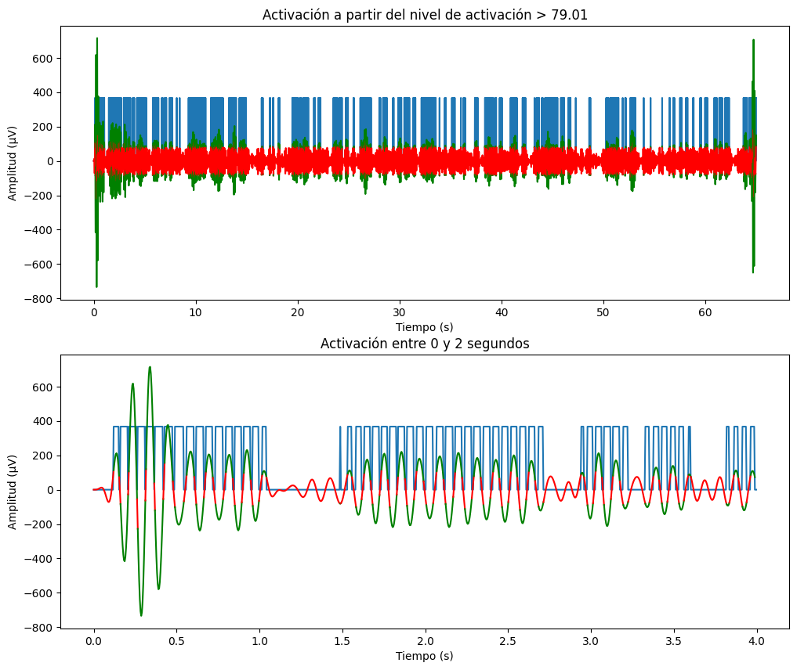

# Taller Materiales Pbr Unity Threejs

## Nombre de los estudiantes
* Brayan Alejandro Muñoz Pérez bmunozp@unal.edu.co
* Álvaro Andrés Romero Castro alromeroca@unal.edu.co
* Juan Camilo Lopez Bustos juclopezbu@unal.edu.co
* Oscar Javier Martinez Martinez ojmartinezma@unal.edu.co
* Alejandro Ortiz Cortes alortizco@unal.edu.co
## Fecha de entrega
2026-04-25

---

## Descripción breve

Este taller tuvo como objetivo entender el manejo de señales cerebrales, en un contexto de interface cerebro computadora. Se usaron datos abiertos de señales cerebrales para obtener sus frecuencias alpha y beta, con las que pudimos generear una señal de activación basado en la "consentración" de la persona de la cual se tomo los datos.

## Implementacion

### Python

Primero se realizó una limpieza de la señal y se guarda en el archivo signal.csv

Despues se cargan los datos sin ya preparados. Y se muestra la señal usando `matplotlib`.

Despues se filtran las frecuencias de 8-12 Hz y 12-30 Hz para obtener las frecuencias alpha y beta. Y al igual que antes se muestran usando `matplotlib`.

Despues se define un minimo de activacion que debe alcanzar la frecuencia alpha. Esto lo hace multiplicando el promedio de alpha por `1.5`. Y se muestra alpha en conjunto a la señal de activación.

## Resultados visuales

### Python - Implementación



*Señal cerebral descargada*


*Comparación frecuencias alpha y beta*


*Señal de activación y misma señal de 0-4 segundos*

---

## Código relevante

### Limpieza y guardado de la señal descargada:

```Python
file = "dwnld_signal.csv"
signal_csv = pd.read_csv(file)
signal_csv = signal_csv[signal_csv["Time"] != "Time"].astype("float64").drop_duplicates("Time")
signal_csv = signal_csv.sort_values("Time")
t = signal_csv["Time"].values
#señales con ruido externo reducido
signal1 = signal_csv["MV1"].values - signal_csv["MV2"].values
signal2 = signal_csv["MV3"].values - signal_csv["MV4"].values

#guardar resultados en signal.csv
#solo guardamos una de las señales y la centramos en 0
df = pd.DataFrame({"tiempo": t - min(t), "eeg": signal1 - signal1.mean()})
df.to_csv("signal.csv")
```

### Separación de frecuencias alpha y beta:

```Python
def freq_filter(data, lowcut, highcut, fs, order=5) -> np.ndarray:
    nyq = 0.5 * fs
    low = lowcut / nyq
    high = highcut / nyq
    b, a = sg.butter(order, [low, high], btype='band')
    y = sg.lfilter(b, a, data)
    return y

freq = 250

#filtrar frecuencias 8-12 HZ
alpha_signal = freq_filter(signal, 8, 12, freq)

#filtrar frecuencias 12-30HZ
beta_signal = freq_filter(signal, 12, 30, freq)

t = np.linspace(0, max(t), len(signal))
```

## Prompts utilizados

Debido a que no había usado scipy le pedi a `gemini` que me ayudara en el filtrado de frecuencias. Y también le pedí ayuda para interpretar los datos de los csv descargados.

## Aprendizajes y dificultades
### Aprendizajes
A través de este taller, aprendí sobre la captura de señales cerebrales y como se suelen guardar. Además de como procesar señales haciendo uso de `scipy`.

### Dificultades
El mayor problema fue la interpretación de los datos descargados, ya que no encontré facilmente la documentación de los mismos. Ya que el procesamiento en si de la señal fue relativamente fácil gracias a pandas, numpy y scipy.

### Mejoras futuras
Se podría mostrar como el interpretar una señal cerebral (puede ser simulada) en tiempo real, para mostrar como funcionaría en una interface real.