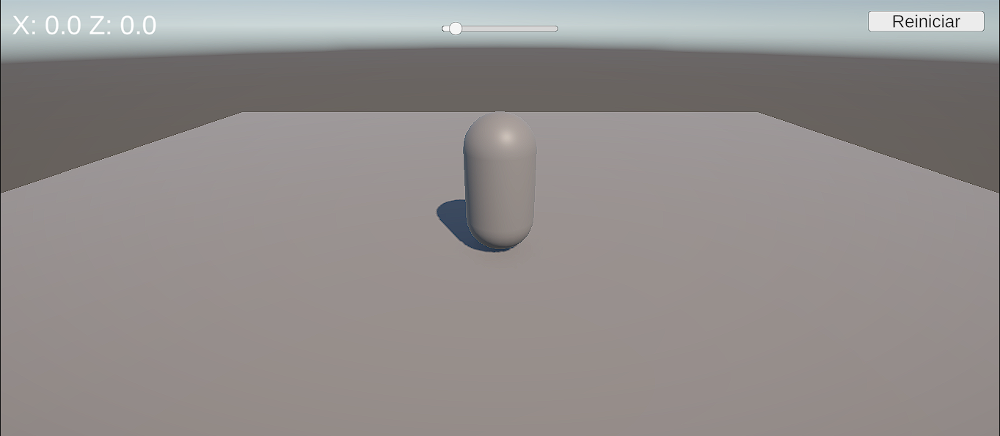
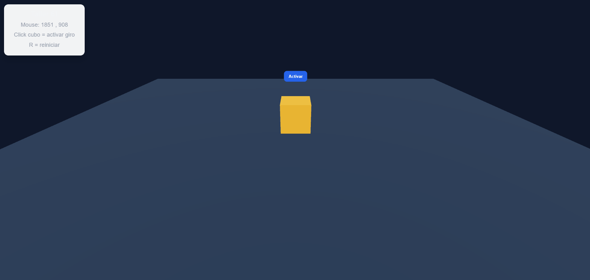
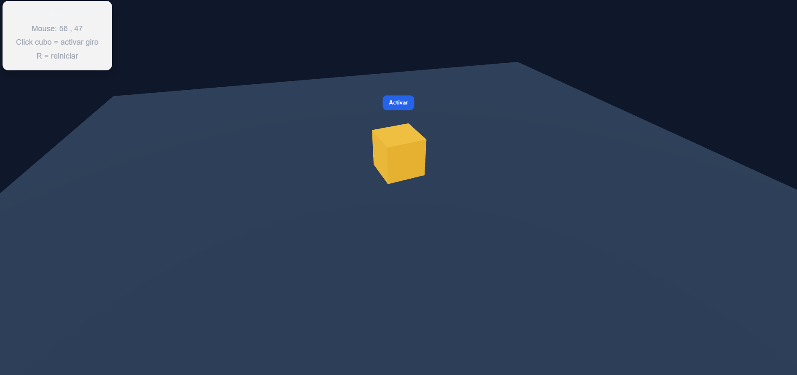

# Taller Input Ui Unity Threejs

## Nombre del estudiante

* Brayan Alejandro Muñoz Pérez bmunozp@unal.edu.co
* Álvaro Andrés Romero Castro alromeroca@unal.edu.co
* Juan Camilo Lopez Bustos juclopezbu@unal.edu.co
* Oscar Javier Martinez Martinez ojmartinezma@unal.edu.co
* Alejandro Ortiz Cortes alortizco@unal.edu.co

## Fecha de entrega

25 de abril de 2026

---

## Descripción breve

El objetivo de este taller fue aprender a capturar y procesar entradas del usuario mediante teclado, mouse y eventos de interacción, además de implementar interfaces gráficas dinámicas en dos entornos distintos: Unity y Three.js con React Three Fiber.

Durante el desarrollo se construyeron dos aplicaciones interactivas:

* En **Unity**, se creó una escena 3D con movimiento del jugador, salto con click, rotación de cámara con mouse y una interfaz UI con texto, barra de progreso y botones.
* En **Three.js + React**, se desarrolló una escena web 3D con interacción por click, control por teclado, detección de movimiento del mouse y superposición de interfaces HTML.

---

# Implementaciones

## 1. Unity - Sistema Input + UI Canvas

### Funcionalidades implementadas

* Movimiento del jugador con teclas **W, A, S, D**
* Rotación de cámara con movimiento del mouse
* Salto con click izquierdo
* Bloqueo de salto en el aire
* Prevención de salto al hacer click en botones UI
* Texto en pantalla mostrando estado
* Barra de progreso dinámica
* Botón para reiniciar posición

### Resultados visuales




---

## 2. Three.js + React Three Fiber - Input + HTML UI

### Funcionalidades implementadas

* Cubo 3D interactivo
* Click sobre objeto para activar rotación
* Botón HTML flotante
* Detección de posición del mouse
* Tecla **R** para reiniciar objeto
* Interfaz fija superpuesta estilo HUD
* Cámara orbital interactiva

### Resultados visuales





---

# Código relevante

## Unity - Movimiento y salto

```csharp
if (Input.GetMouseButtonDown(0) && isGrounded)
{
    rb.AddForce(Vector3.up * jumpForce, ForceMode.Impulse);
}
```

## Unity - Bloquear click sobre UI

```csharp
!EventSystem.current.IsPointerOverGameObject()
```

## React Three Fiber - Click sobre objeto

```jsx
<mesh onClick={toggle}>
```

## React Three Fiber - Tecla R

```jsx
useEffect(() => {
  const handleKeyDown = (e) => {
    if (e.key === "r") reset()
  }

  window.addEventListener("keydown", handleKeyDown)

  return () =>
    window.removeEventListener("keydown", handleKeyDown)
}, [])
```

---

# Prompts utilizados

Se utilizó inteligencia artificial como apoyo para:

* Corrección de errores en Unity Input System
* Mejoras visuales en React Three Fiber
* Detección de eventos de teclado y mouse
* Generación base del README
* Optimización de interacción entre UI y escena 3D

Ejemplos de prompts usados:

* hacer que no pueda saltar mientras está en el aire
* hacer que cuando toque botones del ui no salte
* rotar cámara con el mouse
* la r no funciona
* crear README completo del taller

---

# Aprendizajes y dificultades

Durante el taller se comprendió la importancia del manejo de eventos de entrada en aplicaciones interactivas. Se aprendió cómo Unity administra inputs clásicos y cómo React Three Fiber combina eventos web con entornos 3D.

También se reforzó el uso de interfaces visuales para mejorar la experiencia del usuario.

## Dificultades encontradas

* Conflicto entre Input System nuevo y sistema clásico en Unity.
* Eventos HTML bloqueando clicks sobre objetos 3D.
* Posicionamiento incorrecto de UI dentro de la escena Three.js.
* Reinicio de estados entre componentes React.

## Solución aplicada

Se ajustaron configuraciones, se reorganizó la UI y se manejaron correctamente eventos y estados.

---

# Conclusión

El taller permitió integrar interacción del usuario con entornos gráficos modernos tanto en escritorio como web, fortaleciendo conocimientos en desarrollo de videojuegos y experiencias 3D interactivas.
