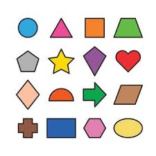
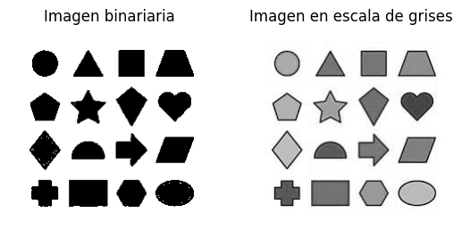
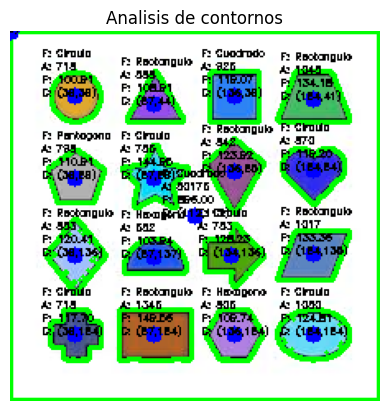

# Taller Convoluciones Personalizadas

## Nombre del estudiante

* Brayan Alejandro Muñoz Pérez bmunozp@unal.edu.co
* Álvaro Andrés Romero Castro alromeroca@unal.edu.co
* Juan Camilo Lopez Bustos juclopezbu@unal.edu.co
* Alejandro Ortiz Cortes alortizco@unal.edu.co

## Fecha de entrega
11 de mayo de 2026

---

# Descripción breve

El objetivo de este taller es de utilizar la librería opencv de python para encontrar contornos dentro de una imagen, Y obtener información de estas diferentes particiones. 

---

# Implementaciones

## Implementación en Python

## Funcionalidades desarrolladas

### 1. Carga de imagen en

Se utilizó OpenCV para cargar una imagen de varias formas identificables.

```python
img_path = "../media/image.png"
image = cv2.imread(img_path)
```

---

### 2. Conversión a escala de grises y binario

Se transformo la imagen original en una de escala de grises, y de esta a binario con un threshold de 210/255.

```python
gray = cv2.cvtColor(image, cv2.COLOR_RGB2GRAY)
ret, threshold = cv2.threshold(gray, 210, 255, cv2.THRESH_BINARY)
```

---

### 3. Obtención de contornos

Se uso el binario para encontrar los contornos de la imagen original.

```python
contours, _ = cv2.findContours(threshold, cv2.RETR_TREE, cv2.CHAIN_APPROX_SIMPLE)
```

---

### 4. Área, perimetro y centroide

Se obtuvo los datos de area perimetro y centroide a partir de cada contorno individual.

```python
cv2.drawContours(output, contours, -1, (0, 255, 0), 2)
for i, cnt in enumerate(contours):
    area = cv2.contourArea(cnt)
    perimetro = cv2.arcLength(cnt, True)
    M = cv2.moments(cnt)
    if M["m00"] != 0:
        cx = int(M["m10"] / M["m00"])
        cy = int(M["m01"] / M["m00"])
    else:
        cx, cy = 0, 0
    
    cv2.circle(output, (cx, cy), 5, (0, 0, 255), -1)
    
    font = cv2.FONT_HERSHEY_SIMPLEX
    escala = 0.2
    color_texto = (0, 0, 0)
    
    cv2.putText(output, f"A: {int(area)}", (cx - 20, cy - 16), font, escala, color_texto, 1)
    cv2.putText(output, f"P: {perimetro:.2f}", (cx - 20, cy - 8), font, escala, color_texto, 1)
    cv2.putText(output, f"C: ({cx},{cy})", (cx - 20, cy), font, escala, color_texto, 1)
```
---

### 5. Clasificación de las formas (Bonus)

A partir del contorno se clasifico el tipo de forma por medio de número de vertices.

```python
def clasificar_contorno(cnt, perimetro):
    epsilon = 0.02 * perimetro
    approx = cv2.approxPolyDP(cnt, epsilon, True)
    
    # Número de vértices encontrados
    vertices = len(approx)
    
    nombre_figura = "Desconocido"

    if vertices == 3:
        nombre_figura = "Triangulo"
        
    elif vertices == 4:
        # Para diferenciar entre cuadrado y rectángulo usamos la relación de aspecto
        x, y, w, h = cv2.boundingRect(approx)
        aspect_ratio = float(w) / h
        if 0.95 <= aspect_ratio <= 1.05:
            nombre_figura = "Cuadrado"
        else:
            nombre_figura = "Rectangulo"
            
    elif vertices == 5:
        nombre_figura = "Pentagono"
        
    elif vertices == 6:
        nombre_figura = "Hexagono"
        
    else:
        # Si tiene muchos vértices, asumimos que es un círculo
        nombre_figura = "Circulo"
    return nombre_figura

for i, cnt in enumerate(contours):
    cv2.putText(output, f"F: {clasificar_contorno(cnt, perimetro)}", (cx - 20, cy - 24), font, escala, color_texto, 1)
```

---

# Resultados visuales

## Capturas de la implementación

### Imagen original



---

### Imagen en escala de grises y binario



---

### Detección de contornos y información



---

# Código relevante

## Obtención de la imagen y procesado inicial

```python
img_path = "../media/image.png"
image = cv2.imread(img_path)
gray = cv2.cvtColor(image, cv2.COLOR_RGB2GRAY)
ret, threshold = cv2.threshold(gray, 210, 255, cv2.THRESH_BINARY)
```

---

## Información de contornos y clasificación

```python
contours, _ = cv2.findContours(threshold, cv2.RETR_TREE, cv2.CHAIN_APPROX_SIMPLE)
output = image.copy()

def clasificar_contorno(cnt, perimetro):
    epsilon = 0.02 * perimetro
    approx = cv2.approxPolyDP(cnt, epsilon, True)
    
    # Número de vértices encontrados
    vertices = len(approx)
    
    nombre_figura = "Desconocido"

    if vertices == 3:
        nombre_figura = "Triangulo"
        
    elif vertices == 4:
        # Para diferenciar entre cuadrado y rectángulo usamos la relación de aspecto
        x, y, w, h = cv2.boundingRect(approx)
        aspect_ratio = float(w) / h
        if 0.95 <= aspect_ratio <= 1.05:
            nombre_figura = "Cuadrado"
        else:
            nombre_figura = "Rectangulo"
            
    elif vertices == 5:
        nombre_figura = "Pentagono"
        
    elif vertices == 6:
        nombre_figura = "Hexagono"
        
    else:
        # Si tiene muchos vértices, asumimos que es un círculo
        nombre_figura = "Circulo"
    return nombre_figura

cv2.drawContours(output, contours, -1, (0, 255, 0), 2)
for i, cnt in enumerate(contours):
    area = cv2.contourArea(cnt)
    perimetro = cv2.arcLength(cnt, True)
    M = cv2.moments(cnt)
    if M["m00"] != 0:
        cx = int(M["m10"] / M["m00"])
        cy = int(M["m01"] / M["m00"])
    else:
        cx, cy = 0, 0
    
    cv2.circle(output, (cx, cy), 5, (0, 0, 255), -1)
    
    font = cv2.FONT_HERSHEY_SIMPLEX
    escala = 0.2
    color_texto = (0, 0, 0)
    
    cv2.putText(output, f"F: {clasificar_contorno(cnt, perimetro)}", (cx - 20, cy - 24), font, escala, color_texto, 1)
    cv2.putText(output, f"A: {int(area)}", (cx - 20, cy - 16), font, escala, color_texto, 1)
    cv2.putText(output, f"P: {perimetro:.2f}", (cx - 20, cy - 8), font, escala, color_texto, 1)
    cv2.putText(output, f"C: ({cx},{cy})", (cx - 20, cy), font, escala, color_texto, 1)
```

---

# Prompts utilizados

No se uso IA durante el proceso de este taller

---

# Aprendizajes y dificultades

## Aprendizajes

Se aprendió sobre la libreria cv y su funcionalidad para crear contornos y obtener información de los mismos. Además de entender que la forma en que se procesa la imagen antes de crear los contornos es muy importante (En particuar definir el threshold de la escala de grises).

## Dificultades

Fue particularmente dificil encontrar el balance del threshold que permitiera detectar todas las formas de la imagen, sin dejar artefactos o contornos mal detectados.