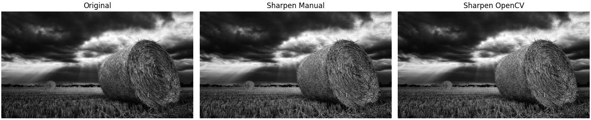
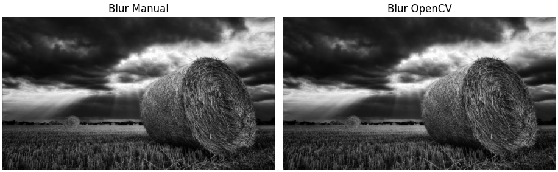
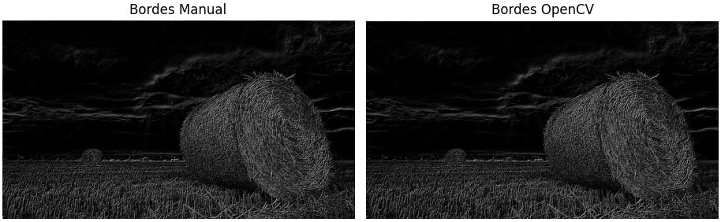
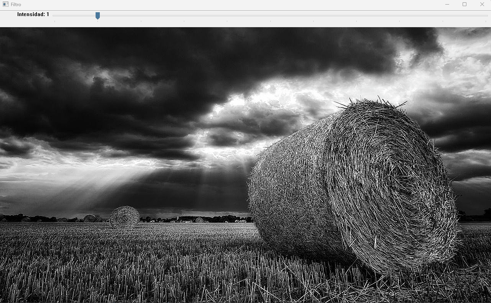

# Taller Convoluciones Personalizadas

## Nombre del estudiante

* Brayan Alejandro Muñoz Pérez bmunozp@unal.edu.co
* Álvaro Andrés Romero Castro alromeroca@unal.edu.co
* Juan Camilo Lopez Bustos juclopezbu@unal.edu.co
* Alejandro Ortiz Cortes alortizco@unal.edu.co

## Fecha de entrega
11 de mayo de 2026

---

# Descripción breve

El objetivo de este taller fue comprender el funcionamiento de las convoluciones en el procesamiento digital de imágenes mediante la implementación manual de filtros personalizados utilizando Python, NumPy y OpenCV.

Durante el desarrollo se implementó una función de convolución 2D desde cero que permite aplicar kernels personalizados sobre imágenes en escala de grises. Posteriormente, los resultados obtenidos fueron comparados con las funciones integradas de OpenCV para validar el funcionamiento de la implementación.

Los filtros desarrollados fueron:

- Enfoque (Sharpening)
- Suavizado (Blur)
- Detección de bordes y esquinas usando Sobel

Además, se realizó una visualización comparativa de resultados y una interfaz interactiva opcional mediante sliders usando `cv2.createTrackbar()`.

---

# Implementaciones

## Implementación en Python

### Herramientas utilizadas

- Python
- NumPy
- OpenCV
- Matplotlib

---

## Funcionalidades desarrolladas

### 1. Carga de imagen en escala de grises

Se utilizó OpenCV para cargar una imagen en escala de grises con el fin de simplificar el procesamiento.

```python
imagen = cv2.imread("imagen.jpg", cv2.IMREAD_GRAYSCALE)
```

---

### 2. Implementación manual de convolución 2D

Se desarrolló una función personalizada que recorre cada píxel de la imagen y aplica un kernel mediante multiplicación elemento a elemento.

```python
valor = np.sum(region * kernel)
```

---

### 3. Kernel de enfoque (Sharpen)

Filtro utilizado para resaltar detalles y aumentar la nitidez de la imagen.

```python
kernel_sharpen = np.array([
    [0, -1, 0],
    [-1, 5, -1],
    [0, -1, 0]
])
```

---

### 4. Kernel de suavizado (Blur)

Filtro utilizado para reducir ruido y suavizar la imagen.

```python
kernel_blur = (1/9) * np.array([
    [1,1,1],
    [1,1,1],
    [1,1,1]
])
```

---

### 5. Detección de bordes con Sobel

Se utilizaron kernels Sobel en X y Y para detectar cambios de intensidad y bordes en la imagen.

```python
kernel_sobel_x = np.array([
    [-1,0,1],
    [-2,0,2],
    [-1,0,1]
])
```

---

### 6. Comparación con OpenCV

Los resultados obtenidos manualmente fueron comparados con la función `cv2.filter2D()` de OpenCV.

```python
resultado_cv = cv2.filter2D(imagen, -1, kernel)
```

---

### 7. Interfaz interactiva (Bonus)

Se implementó una interfaz interactiva utilizando sliders para modificar dinámicamente la intensidad del filtro.

```python
cv2.createTrackbar(
    "Intensidad",
    "Filtro",
    1,
    10,
    actualizar
)
```

---

# Resultados visuales

## Capturas de la implementación

### Imagen original y filtro Sharpen



---

### Filtro Blur



---

### Detección de bordes



---

### Interfaz interactiva



---

# Código relevante

## Función principal de convolución

```python
def convolucion_manual(imagen, kernel):

    alto, ancho = imagen.shape
    k_alto, k_ancho = kernel.shape

    padding_y = k_alto // 2
    padding_x = k_ancho // 2

    imagen_padding = np.pad(
        imagen,
        ((padding_y, padding_y), (padding_x, padding_x)),
        mode='constant'
    )

    salida = np.zeros((alto, ancho), dtype=np.float32)

    for y in range(alto):
        for x in range(ancho):

            region = imagen_padding[
                y:y+k_alto,
                x:x+k_ancho
            ]

            valor = np.sum(region * kernel)

            salida[y, x] = valor

    salida = np.clip(salida, 0, 255)

    return salida.astype(np.uint8)
```

---

# Prompts utilizados

Durante el desarrollo se utilizaron herramientas de IA generativa para resolver dudas relacionadas con:

- Implementación manual de convoluciones usando NumPy.
- Uso de kernels Sobel para detección de bordes.
- Comparación entre convolución manual y `cv2.filter2D()`.
- Creación de interfaces interactivas usando `cv2.createTrackbar()`.

Ejemplo de prompt utilizado:

> "Implementar una convolución 2D manual en Python usando NumPy y compararla con OpenCV."

---

# Aprendizajes y dificultades

## Aprendizajes

- Comprensión del funcionamiento interno de las convoluciones.
- Uso de kernels personalizados para modificar imágenes.
- Aplicación de operadores Sobel para detección de bordes.
- Manejo de imágenes con OpenCV y visualización con Matplotlib.
- Diferencias entre implementar algoritmos manualmente y usar funciones optimizadas.

## Dificultades

- Manejo correcto del padding en los bordes de la imagen.
- Ajuste de valores fuera del rango válido de píxeles.
- Comprensión inicial del funcionamiento matemático de los kernels.
- Diferencias visuales entre implementaciones manuales y funciones optimizadas de OpenCV.