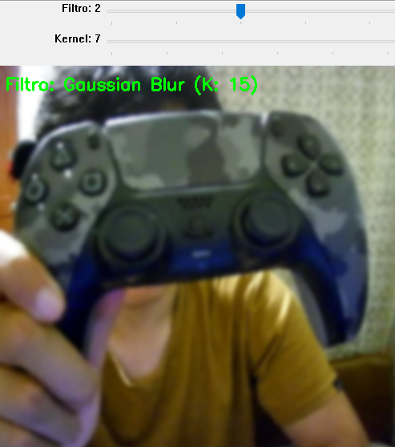

# Taller Ojos Digitales Vision Artificial

## Nombre del estudiante

* Brayan Alejandro Muñoz Pérez bmunozp@unal.edu.co
* Álvaro Andrés Romero Castro alromeroca@unal.edu.co
* Juan Camilo Lopez Bustos juclopezbu@unal.edu.co
* Alejandro Ortiz Cortes alortizco@unal.edu.co

**Fecha de entrega:** 2026-05-11

## Descripción breve
Este taller introduce los fundamentos de la visión artificial utilizando la librería OpenCV en Python. El objetivo principal es procesar imágenes en tiempo real obtenidas desde la cámara web, manipulando la información a nivel de píxeles mediante transformaciones de color (escala de grises) y operaciones de convolución espacial para implementar filtros de suavizado (Gaussian Blur), realce (Sharpening) y algoritmos de detección de bordes basados en gradientes matemáticos (Sobel X/Y, Laplaciano).

## Implementaciones

### Python (OpenCV)
Se desarrolló un script en Python que realiza el procesamiento de frames en tiempo real. 
- **Conversión de color**: Traslación de BGR a Grayscale para reducir la dimensionalidad de la matriz de la imagen.
- **Filtros de Convolución**: Implementación de `cv2.GaussianBlur` para la eliminación de ruido de alta frecuencia y `cv2.filter2D` con un kernel fijo de 3x3 para el efecto de realce (Sharpening).
- **Detección de Bordes**: Cálculo de la primera derivada de la imagen mediante `cv2.Sobel` en los ejes X y Y, y cálculo de la segunda derivada mediante el operador Laplaciano (`cv2.Laplacian`).
- **Bonus Interfaz**: Se implementó `cv2.createTrackbar` permitiendo cambiar en caliente tanto el filtro activo como el tamaño del Kernel de convolución (`ksize`). Se agregó lógica visual para indicar en pantalla cuándo el slider del kernel afecta matemáticamente a la imagen (Blur, bordes) y cuándo no aplica.

## Resultados visuales

*(Nota: Reemplaza las rutas con los nombres exactos de tus imágenes/GIFs en la carpeta media/)*


*Efecto de difuminado Gaussiano aplicado en tiempo real.*


*Detección de bordes direccionales calculando gradientes de intensidad.*

## Código relevante

El cálculo de bordes en OpenCV se realiza sobre imágenes en coma flotante (`CV_64F`) para soportar transiciones negativas de gradiente (de blanco a negro). Posteriormente se aplica valor absoluto y conversión a `uint8`. También fue vital limitar el tamaño del kernel a un máximo de 7 para prevenir inestabilidad y fallos silenciosos en las derivadas de OpenCV:

```python
# k_sobel se limita (min 3, max 7) para evitar saturación de la matriz en derivadas
sobelx = cv2.Sobel(gray, cv2.CV_64F, 1, 0, ksize=k_sobel)
resultado = cv2.cvtColor(cv2.convertScaleAbs(sobelx), cv2.COLOR_GRAY2BGR)

```

## Prompts utilizados

No se utilizaron prompts de IA generativa para la resolución estructural de este taller.

## Aprendizajes y dificultades

**Aprendizajes:** Comprendimos de manera práctica cómo una matriz de convolución (kernel) altera drásticamente los píxeles adyacentes. Entender matemáticamente que Sobel busca la derivada (tasa de cambio) nos ayudó a visualizar por qué resalta los bordes.

**Dificultades:** Durante las pruebas notamos que el control del kernel parecía no hacer nada en algunos filtros. Descubrimos que el tamaño del kernel no aplica a filtros como "Sharpening" (que usa una matriz manual fija) y que tamaños muy grandes (>7) causaban errores en las derivadas matemáticas de OpenCV. Se solucionó limitando dinámicamente los valores en el slider y añadiendo retroalimentación visual en pantalla para el usuario.

## Referencias

* Documentación oficial de OpenCV (Image Filtering): https://docs.opencv.org/4.x/d4/d86/group__imgproc__filter.html
* Documentación Trackbar en OpenCV: https://docs.opencv.org/3.4/d9/dc8/tutorial_py_trackbar.html
