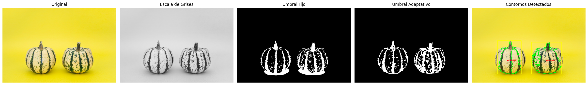
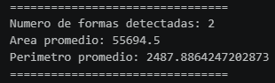

# Taller Segmentacion Formas

## Nombre del estudiante
* Brayan Alejandro Muñoz Pérez bmunozp@unal.edu.co
* Álvaro Andrés Romero Castro alromeroca@unal.edu.co
* Juan Camilo Lopez Bustos juclopezbu@unal.edu.co
* Alejandro Ortiz Cortes alortizco@unal.edu.co

## Fecha de entrega
11 de mayo de 2026

---

# Descripción breve

El objetivo de este taller fue aplicar técnicas básicas de segmentación de imágenes mediante procesos de binarización y detección de formas usando Python y OpenCV.

Durante el desarrollo se implementaron diferentes métodos de umbralización para separar regiones de interés dentro de imágenes, permitiendo detectar objetos, contornos y propiedades geométricas de las figuras encontradas.

Se trabajó con:

- Umbral fijo (`cv2.threshold`)
- Umbral adaptativo (`cv2.adaptiveThreshold`)
- Detección de contornos (`cv2.findContours`)
- Cálculo de centros de masa (`cv2.moments`)
- Bounding boxes (`cv2.boundingRect`)

Además, se calcularon métricas básicas como:
- Número de formas detectadas
- Área promedio
- Perímetro promedio

---

# Implementaciones

## Implementación en Python

### Herramientas utilizadas

- Python
- OpenCV
- NumPy
- Matplotlib

---

## Funcionalidades desarrolladas

### 1. Carga de imagen en escala de grises

La imagen fue convertida a escala de grises para simplificar el procesamiento y facilitar la segmentación.

```python
gris = cv2.cvtColor(imagen, cv2.COLOR_BGR2GRAY)
```

---

### 2. Umbral fijo

Se aplicó un umbral binario fijo para separar los objetos del fondo.

```python
_, umbral_fijo = cv2.threshold(
    blur,
    170,
    255,
    cv2.THRESH_BINARY_INV
)
```

---

### 3. Umbral adaptativo

Se utilizó umbral adaptativo para mejorar la detección en regiones con variaciones de iluminación.

```python
umbral_adaptativo = cv2.adaptiveThreshold(
    blur,
    255,
    cv2.ADAPTIVE_THRESH_GAUSSIAN_C,
    cv2.THRESH_BINARY_INV,
    31,
    8
)
```

---

### 4. Operaciones morfológicas

Se aplicaron operaciones morfológicas para eliminar ruido y mejorar la segmentación.

```python
mascara = cv2.morphologyEx(
    umbral_adaptativo,
    cv2.MORPH_CLOSE,
    kernel,
    iterations=2
)
```

---

### 5. Detección de contornos

Se detectaron las formas presentes utilizando contornos externos.

```python
contornos, _ = cv2.findContours(
    mascara,
    cv2.RETR_EXTERNAL,
    cv2.CHAIN_APPROX_SIMPLE
)
```

---

### 6. Centro de masa

Se calculó el centro de masa de cada figura detectada mediante momentos espaciales.

```python
momentos = cv2.moments(contorno)

cx = int(momentos["m10"] / momentos["m00"])
cy = int(momentos["m01"] / momentos["m00"])
```

---

### 7. Bounding boxes

Se dibujaron rectángulos delimitadores alrededor de cada figura detectada.

```python
x, y, w, h = cv2.boundingRect(contorno)

cv2.rectangle(
    resultado,
    (x, y),
    (x+w, y+h),
    (255, 255, 0),
    3
)
```

---

### 8. Métricas básicas

Se calcularon métricas estadísticas de las formas detectadas.

```python
numero_formas = len(areas)

area_promedio = np.mean(areas)

perimetro_promedio = np.mean(perimetros)
```

---

# Resultados visuales





---

# Código relevante

## Detección de contornos y métricas

```python
for contorno in contornos:

    area = cv2.contourArea(contorno)

    if area < 5000:
        continue

    perimetro = cv2.arcLength(contorno, True)

    areas.append(area)
    perimetros.append(perimetro)

    cv2.drawContours(
        resultado,
        [contorno],
        -1,
        (0, 255, 0),
        3
    )

    momentos = cv2.moments(contorno)

    if momentos["m00"] != 0:

        cx = int(momentos["m10"] / momentos["m00"])
        cy = int(momentos["m01"] / momentos["m00"])

        cv2.circle(
            resultado,
            (cx, cy),
            8,
            (255, 0, 0),
            -1
        )
```

---

# Prompts utilizados

Durante el desarrollo se utilizaron herramientas de IA generativa para resolver dudas relacionadas con:

- Segmentación de imágenes con OpenCV.
- Uso de umbral fijo y adaptativo.
- Eliminación de ruido mediante operaciones morfológicas.
- Detección de contornos y cálculo de centros de masa.
- Ajuste de parámetros para mejorar la detección de objetos.

Ejemplo de prompt utilizado:

> "Detectar correctamente objetos en imágenes usando cv2.findContours y calcular centros de masa con OpenCV."

---

# Aprendizajes y dificultades

## Aprendizajes

- Comprensión de técnicas de segmentación binaria.
- Uso de umbralización fija y adaptativa.
- Aplicación de operaciones morfológicas para limpieza de imágenes.
- Detección de contornos y análisis geométrico de formas.
- Cálculo de centros de masa y bounding boxes.

## Dificultades

- Detectar correctamente figuras cuando el fondo tenía intensidades similares.
- Ajustar parámetros de umbral adaptativo.
- Eliminar ruido sin perder partes importantes de las figuras.
- Mejorar la precisión del centro de masa en objetos irregulares.