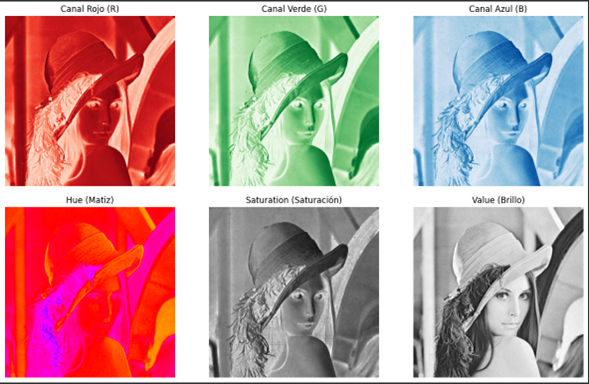
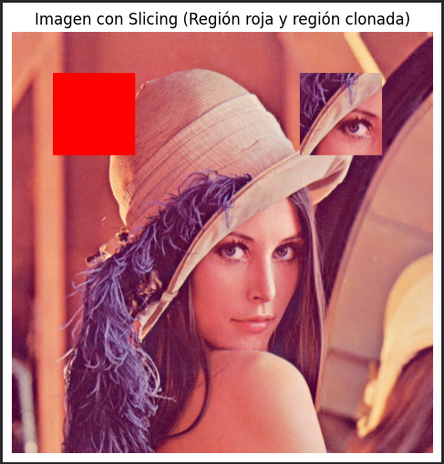
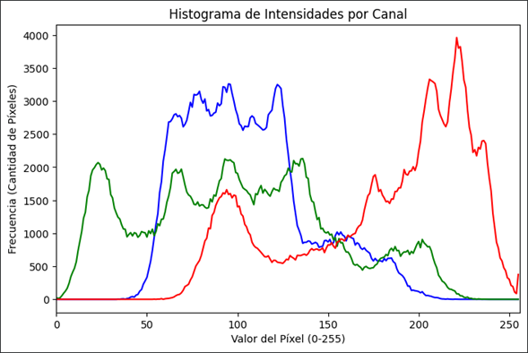
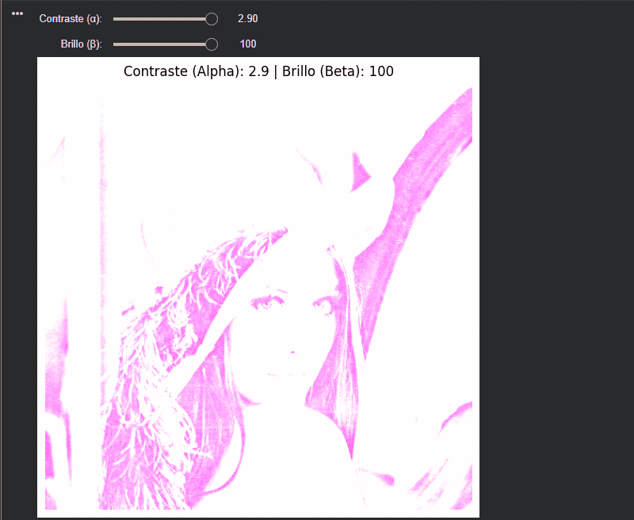

# Taller Deteccion Bordes Contornos

## Nombre del estudiante
* Brayan Alejandro Muñoz Pérez bmunozp@unal.edu.co
* Álvaro Andrés Romero Castro alromeroca@unal.edu.co
* Juan Camilo Lopez Bustos juclopezbu@unal.edu.co
* Alejandro Ortiz Cortes alortizco@unal.edu.co

## Fecha de entrega

2026-05-17

---

## Descripción breve

Este taller tiene como objetivo fundamental explorar y comprender la representación matemática de las imágenes digitales. A través del uso de librerías como OpenCV y NumPy, se manipuló la matriz subyacente de la imagen para extraer información de los canales de color (RGB y HSV), modificar regiones específicas a nivel de píxel (slicing) y analizar la distribución de sus intensidades mediante histogramas.

Adicionalmente, se aplicaron operaciones aritméticas directas sobre la matriz de píxeles para alterar propiedades visuales básicas, como el contraste y el brillo, permitiendo visualizar los cambios mediante la ecuación matemática y comparándolos con las funciones integradas de OpenCV.

---

## Implementaciones

### Python (Google Colab)

El taller se desarrolló íntegramente en Python utilizando un cuaderno de Google Colab. Las herramientas principales utilizadas fueron:
- **OpenCV (`cv2`)**: Para la carga de la imagen, conversión entre espacios de color, cálculo de histogramas y ajuste de escala absoluta.
- **NumPy**: Para la manipulación directa de la imagen como matriz, utilizando *slicing* para copiar e inyectar sub-regiones y aplicar cálculos matemáticos vectorizados de brillo y contraste.
- **Matplotlib**: Utilizado como alternativa a las funciones de ventana de OpenCV (`cv2.imshow`), permitiendo visualizar de manera correcta los canales de color y trazar el histograma de intensidades en el entorno de la nube.
- **IPyWidgets**: Se utilizó para suplir la función `cv2.createTrackbar()`, permitiendo crear una interfaz interactiva con sliders dentro del cuaderno para la modificación del brillo y contraste en tiempo real.

---

## Resultados visuales

### Python - Implementación



**Descomposición de Canales de Color:** En esta imagen se evidencia la separación de la matriz principal en sus canales individuales. En la fila superior, se observan los canales Rojo (R), Verde (G) y Azul (B), donde las áreas más claras indican una mayor intensidad de dicho color. En la fila inferior, se visualiza el espacio de color HSV (Hue, Saturation, Value), lo cual es muy útil para separar la información del color real (Matiz) de la iluminación (Brillo/Value).



**Manipulación de la Matriz (Slicing):** Se demuestra el acceso directo a coordenadas específicas de la matriz de la imagen. Por un lado, se sobrescribió un área rectangular asignándole directamente el valor BGR correspondiente al color rojo `[0, 0, 255]`. Por otro lado, se extrajo un "parche" (la zona del ojo) guardándolo en una variable, para luego inyectarlo en una región diferente (esquina superior derecha).



**Análisis de Intensidades:** Se calculó y graficó el histograma utilizando OpenCV y Matplotlib. Este gráfico permite analizar la distribución de los valores de los píxeles (de 0 a 255) para cada uno de los tres canales (azul, verde y rojo). Es una herramienta esencial para entender el contraste y la exposición general de la fotografía original.



**Bonus (Ajuste Interactivo):** Mediante el uso de `ipywidgets` en Colab, se implementaron sliders interactivos que modifican dinámicamente los valores de $\alpha$ (Contraste) y $\beta$ (Brillo). En el GIF se observa el efecto en tiempo real sobre la imagen cuando se aplica la ecuación $O(i,j) = \alpha \cdot I(i,j) + \beta$ elevando drásticamente el contraste y el brillo.

---

## Código relevante

A continuación, los fragmentos más destacados de la manipulación de matrices:

### Slicing y Clonación de regiones:

```python
# 1. Cambiar el color de un área rectangular
img_modificada[50:150, 50:150] = [0, 0, 255] 

# 2. Sustituir una región por otra parte de la imagen
parche = img_bgr[200:300, 200:300]
img_modificada[50:150, 350:450] = parche

```

### Ajuste de Brillo y Contraste por Ecuación Manual:
```
Python
alpha = 1.5 # Contraste
beta = 50   # Brillo

# Modificación matemática: O(i,j) = alpha * I(i,j) + beta
# Se usa np.clip para evitar valores fuera del rango 0-255 del formato uint8
img_manual = np.clip(alpha * img_bgr + beta, 0, 255).astype(np.uint8)
```
## Prompts utilizados
Para resolver este taller y estructurar el código adaptándolo al entorno de Google Colab, se utilizó Gemini con el siguiente contexto:

- "¿Por qué `cv2.imshow()` me da error en Google Colab y qué alternativa puedo usar con Matplotlib?"
- "¿Cómo puedo crear un slider interactivo dentro de un cuaderno de Jupyter o Colab ya que `cv2.createTrackbar()` no es compatible?"
- "Tengo un error 403 Forbidden al intentar descargar una imagen con `urllib` en Python, ¿cómo lo soluciono?"

## Aprendizajes y dificultades
### Aprendizajes
Este taller consolidó el entendimiento de que una imagen no es más que una matriz tridimensional (alto, ancho, canales). Quedó mucho más clara la distinción entre los espacios de color (RGB vs HSV) y cómo la manipulación de arreglos en NumPy (slicing) puede usarse para editar visualmente una imagen sin necesidad de software de edición fotográfica.

### Dificultades
La mayor dificultad radicó en el uso del entorno Google Colab. Funciones nativas muy útiles como cv2.imshow() o cv2.createTrackbar() generan errores o simplemente no existen en entornos de ejecución en la nube. Se resolvió investigando alternativas, utilizando matplotlib para la visualización estática e integrando ipywidgets para lograr el objetivo del Bonus interactivo. Además, se debió prestar especial atención al mapeo BGR a RGB que requiere Matplotlib y a solucionar el error 403 al descargar imágenes de prueba cambiando la fuente de descarga.

### Mejoras futuras
En futuros proyectos de procesamiento de imágenes, implementaría transformaciones de matrices utilizando procesamiento en paralelo o librerías optimizadas para GPU (como CuPy o módulos de PyTorch) en caso de que la resolución de las imágenes sea masiva y los cálculos matemáticos (como el ajuste de escala absoluta) requieran rendimiento en tiempo real.

## Referencias
* Documentación oficial de OpenCV: https://docs.opencv.org/

* Documentación de NumPy: https://numpy.org/doc/

* Documentación IPyWidgets: https://ipywidgets.readthedocs.io/
