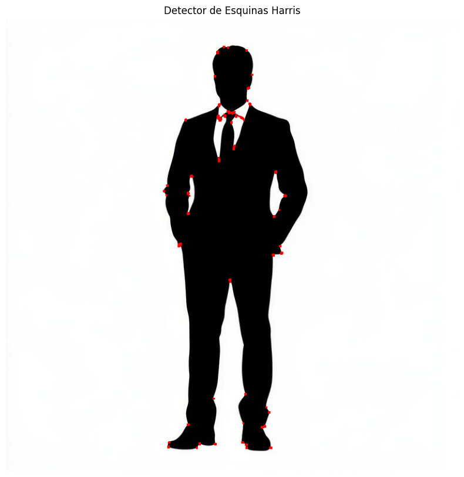
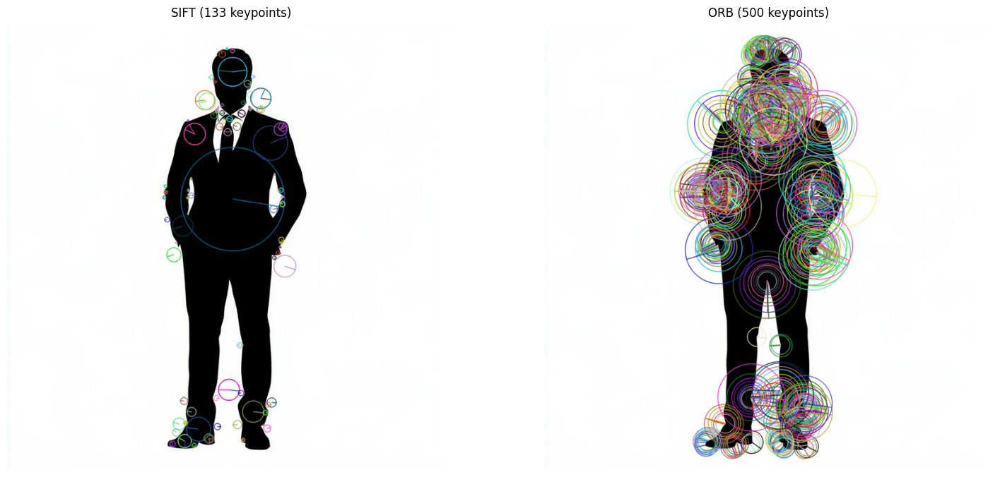
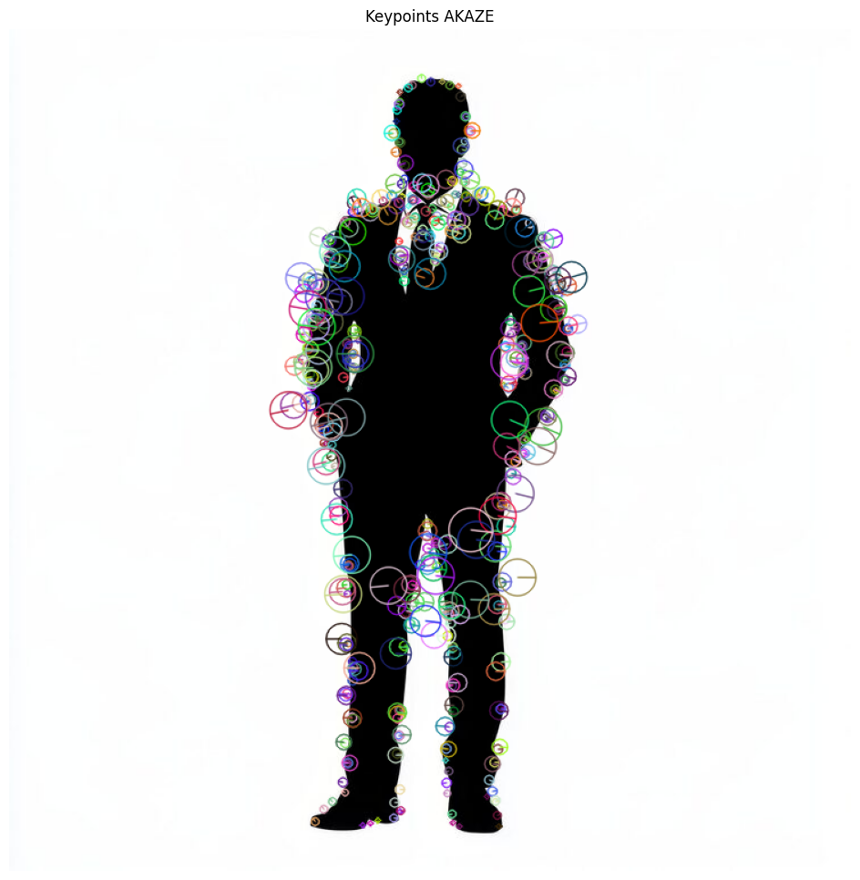
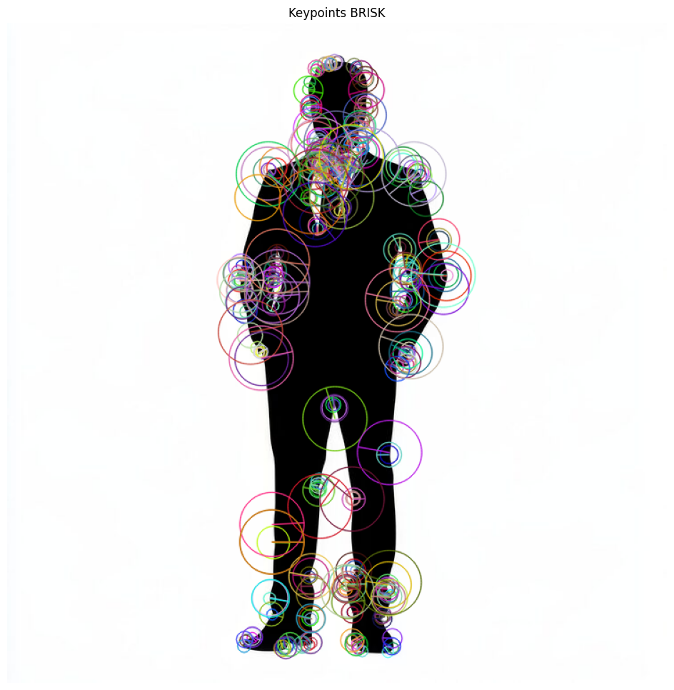

# Taller Extraccion Caracteristicas SIFT ORB

## Nombre del estudiante

* Brayan Alejandro Muñoz Pérez bmunozp@unal.edu.co
* Álvaro Andrés Romero Castro alromeroca@unal.edu.co
* Juan Camilo Lopez Bustos juclopezbu@unal.edu.co
* Alejandro Ortiz Cortes alortizco@unal.edu.co

## Fecha de entrega

18 de mayo de 2026

---

# Descripción breve

El objetivo de este taller fue implementar y comparar diferentes algoritmos de detección de características y puntos clave utilizando OpenCV en Python. Se trabajó con los detectores Harris Corner Detector, SIFT, ORB, AKAZE y BRISK para analizar cómo cada algoritmo detecta esquinas, bordes y puntos de interés dentro de una imagen.

Durante el desarrollo se realizaron pruebas de detección de keypoints, análisis de escalas y orientaciones, comparación de rendimiento y visualización de resultados utilizando imágenes en escala de grises y visualizaciones enriquecidas con OpenCV y Matplotlib.

---

# Implementaciones

## Python - OpenCV

### Harris Corner Detector

Se implementó el detector de esquinas de Harris para identificar puntos de cambio brusco en la silueta utilizada como imagen de prueba. Se ajustaron parámetros como:

* blockSize
* ksize
* k

El resultado mostró correctamente esquinas en hombros, corbata, zapatos y contornos del cuerpo.

---

### SIFT (Scale-Invariant Feature Transform)

Se utilizó:

```python
sift = cv2.SIFT_create()
```

Posteriormente se aplicó:

```python
detectAndCompute()
```

SIFT permitió detectar keypoints robustos ante cambios de escala y rotación. Además, se visualizaron tamaños y orientaciones de cada punto clave mediante:

```python
cv2.drawKeypoints(
    image,
    keypoints,
    None,
    flags=cv2.DRAW_MATCHES_FLAGS_DRAW_RICH_KEYPOINTS
)
```

---

### ORB (Oriented FAST and Rotated BRIEF)

Se implementó ORB utilizando:

```python
orb = cv2.ORB_create()
```

ORB detectó una mayor cantidad de keypoints en comparación con SIFT debido a su detector FAST. Se observó una distribución más densa de puntos sobre los bordes de la silueta.

También se realizaron pruebas ajustando:

```python
nfeatures
fastThreshold
```

para controlar la cantidad de keypoints detectados.

---

### AKAZE

Se implementó AKAZE como alternativa moderna entre precisión y velocidad. Este algoritmo mostró una distribución equilibrada de keypoints y una detección más limpia sobre los bordes de la figura.

---

### BRISK

Se utilizó BRISK para comparar su comportamiento frente a ORB y AKAZE. BRISK detectó regiones circulares más grandes y una cantidad intermedia de puntos clave.

---

# Resultados visuales

## Harris Corner Detector



---

## Comparación SIFT vs ORB



---

## AKAZE



---

## BRISK



---

# Código relevante

## Creación de detector SIFT

```python
sift = cv2.SIFT_create()
sift_keypoints, sift_descriptors = sift.detectAndCompute(gray, None)
```

---

## Creación de detector ORB

```python
orb = cv2.ORB_create(nfeatures=150)
orb_keypoints, orb_descriptors = orb.detectAndCompute(gray, None)
```

---

## Harris Corner Detector

```python
harris = cv2.cornerHarris(gray_float, blockSize, ksize, k)
```

---

## Visualización de keypoints

```python
cv2.drawKeypoints(
    image_rgb,
    keypoints,
    None,
    flags=cv2.DRAW_MATCHES_FLAGS_DRAW_RICH_KEYPOINTS
)
```

---

# Prompts utilizados

Durante el desarrollo se utilizaron herramientas de IA generativa para:

* Explicar diferencias entre SIFT y ORB
* Validar resultados obtenidos
* Generar estructura base del notebook
* Resolver dudas sobre parámetros de OpenCV
* Generar ejemplos de README y documentación

Ejemplos de prompts utilizados:

* "Implementa un taller de SIFT y ORB en Python con OpenCV"
* "Explica las diferencias entre Harris, SIFT y ORB"
* "Los resultados de estos keypoints están correctos?"
* "Genera un README para un taller de extracción de características"

---

# Aprendizajes y dificultades

Durante el desarrollo del taller se aprendió el funcionamiento de distintos detectores de características y cómo cada uno responde de manera diferente dependiendo del tipo de imagen utilizada.

Se comprendió que:

* Harris detecta únicamente esquinas.
* SIFT es más robusto ante escala y rotación.
* ORB es más rápido pero genera una mayor cantidad de keypoints.
* AKAZE y BRISK ofrecen alternativas intermedias entre velocidad y precisión.

Una de las principales dificultades fue interpretar la gran cantidad de keypoints generados por ORB y entender cómo ajustar sus parámetros para obtener resultados más limpios. También fue importante aprender a visualizar correctamente los puntos clave utilizando OpenCV y Matplotlib.

Finalmente, el taller permitió entender aplicaciones reales de visión por computador relacionadas con reconocimiento de objetos, matching de imágenes y seguimiento de características.