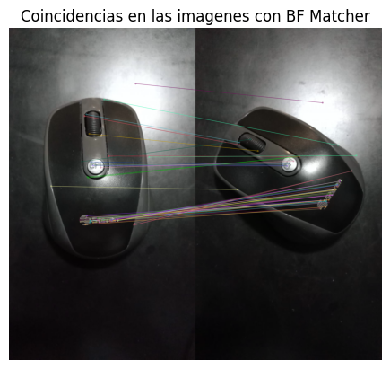
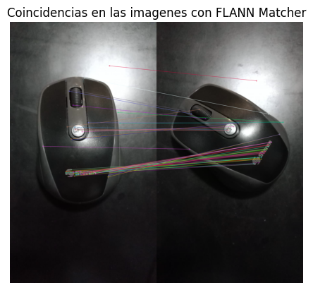
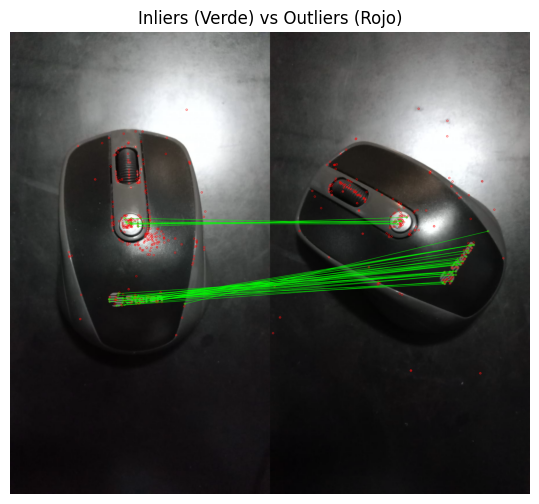
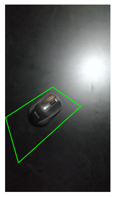
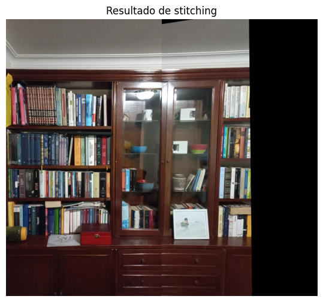

# Taller Convoluciones Personalizadas

## Nombre del estudiante

* Brayan Alejandro Muñoz Pérez bmunozp@unal.edu.co
* Álvaro Andrés Romero Castro alromeroca@unal.edu.co
* Juan Camilo Lopez Bustos juclopezbu@unal.edu.co
* Alejandro Ortiz Cortes alortizco@unal.edu.co

## Fecha de entrega
18 de mayo de 2026

---

# Descripción breve

El objetivo de este taller es de utilizar la librería opencv de python para encontrar las similitudes entre imagenes y usarlas para diferentes fines, como encontrar objetos junto con su transformación en la otra imagen o unir dos imagenes que componen una sola escena. 

---

# Implementaciones

## Implementación en Python

## Funcionalidades desarrolladas

### 1. Feature Matching con Brute Force matcher 

Se utilizó el BFMatcher de opencv para encontrar similitudes entre dos imagenes con un mismo objeto rotado.

```python
bf = cv.BFMatcher_create()

s_bf = t.time()
matches_bf = bf.knnMatch(dsc_1, dsc_2, k=2)
time_bv = t.time() - s_bf

good_matches_bf = [m for m, n in matches_bf if m.distance < 0.7 * n.distance]

img_matches = cv.drawMatches(
    img1_col, kp_1,
    img2_col, kp_2,
    good_matches_bf,
    None,
    flags=cv.DrawMatchesFlags_NOT_DRAW_SINGLE_POINTS)

plt.imshow(img_matches)
plt.title("Coincidencias en las imagenes con BF Matcher")
plt.axis("off")
plt.show()
```

---

### 2. Feature Matching con FLANN matcher

Se utilizó el BFMatcher de opencv para encontrar similitudes entre las mismas imagenes de antes.

```python
flann = cv.FlannBasedMatcher_create()

s_fl = t.time()
matches_fl = flann.knnMatch(dsc_1, dsc_2, k=2)
time_fl = t.time() - s_fl

good_matches_fl = [m for m, n in matches_fl if m.distance < 0.7 * n.distance]

img_matches = cv.drawMatches(
    img1_col, kp_1,
    img2_col, kp_2,
    good_matches_fl,
    None,
    flags=cv.DrawMatchesFlags_NOT_DRAW_SINGLE_POINTS)

plt.imshow(img_matches)
plt.title("Coincidencias en las imagenes con FLANN Matcher")
plt.axis("off")
plt.show()
```

---

### 3. Calculo de Homografía

A partir de las similitudes encontradas por el matcher, se uso `findHomography` de `opencv` para encontrar los puntos atipicos y la matriz proyectiva para poder interpretar sus valores.

```python
src_pts = np.float32([kp_1[m.queryIdx].pt for m in good_matches_fl]).reshape(-1, 1, 2)
dst_pts = np.float32([kp_2[m.trainIdx].pt for m in good_matches_fl]).reshape(-1, 1, 2)

H, mask = cv.findHomography(src_pts, dst_pts, cv.RANSAC, 5)

mask_flat = mask.ravel().tolist()
inlier_matches = [m for m, is_inlier in zip(good_matches_fl, mask_flat) if is_inlier]


img_matches = cv.drawMatches(
    img1_col, kp_1,
    img2_col, kp_2,
    good_matches_fl, None,
    matchColor=(0, 255, 0),
    singlePointColor=(255, 0, 0),
    matchesMask=mask_flat,
    flags=cv.DrawMatchesFlags_DEFAULT
)

plt.figure(figsize=(12, 6))
plt.imshow(img_matches)
plt.title('Inliers (Verde) vs Outliers (Rojo)')
plt.axis('off')
plt.show()

H = H / H[2, 2]

print("Matriz de transformación proyectiva: ")
print(H)
num_solutions, rotations, translations, normals = cv.decomposeHomographyMat(H, np.float32([
    [1.24953842e+03, 0.00000000e+00, 6.41007951e+02],
    [0.00000000e+00, 1.17797383e+03, 6.85636048e+02],
    [0.00000000e+00, 0.00000000e+00, 1.00000000e+00]
]))

print("Rotación: ")
deg = np.degrees(rot.from_matrix(rotations[0]).as_euler("zyx"))
print(*map(lambda x,y: f"{y}: {x}", deg, "ZYX"), sep=", ")
print("Traslación: ")
print(*map(lambda x,y: f"{y}: {x[0]}", translations[0], "XYZ"), sep=", ")
```

---

### 4. Detección de objetos

Se tomó una imagen de referencia con un objeto y realizando los pasos anteriores se buscó el objeto en otra imagen y su bounding box.

```python
for i, path in enumerate(escenas, 1):
    img = cv.imread(path, cv.IMREAD_GRAYSCALE)
    img_col = cv.imread(path)
    kp, dsc = sift.detectAndCompute(img, None)
    matches = flann.knnMatch(dsc_1, dsc, k=2)
    good_matches = [m for m, n in matches if m.distance < 0.7 * n.distance]
    src_pts = np.float32([kp_1[m.queryIdx].pt for m in good_matches]).reshape(-1, 1, 2)
    dst_pts = np.float32([kp[m.trainIdx].pt for m in good_matches]).reshape(-1, 1, 2)
    H, mask = cv.findHomography(src_pts, dst_pts, cv.RANSAC, 5)
    
    mask_flat = mask.ravel().tolist()
    inlier_matches = [m for m, is_inlier in zip(good_matches, mask_flat) if is_inlier]

    img_matches = cv.drawMatches(
        img1_col, kp_1,
        img_col, kp,
        good_matches, None,
        matchColor=(0, 255, 0),
        singlePointColor=(255, 0, 0),
        matchesMask=mask_flat,
        flags=cv.DrawMatchesFlags_DEFAULT
    )

    plt.imshow(img_matches)
    plt.title('Inliers (Verde) vs Outliers (Rojo)')
    plt.axis('off')
    plt.show()
    
    if H is None:
        print("No se encontró el objeto")
    else:
        h, w = img1.shape[:2]

        obj_corners = np.float32([[0, 0], [0, h - 1], [w - 1, h - 1], [w - 1, 0]]).reshape(-1, 1, 2)

        corners = cv.perspectiveTransform(obj_corners, H)

        res = img_col.copy()
        res = cv.polylines(res, [np.int32(corners)], True, (0, 255, 0), 5, cv.LINE_AA)

        plt.imshow(res)
        plt.axis('off')
        plt.show()
```
---

### 5. Image stitching

A partir de dos imagenes que compartian una misma sección se procesaron y se pegaron las imagenes de tal forma que quedaran de forma continua.

```python
kp_l, des_l = sift.detectAndCompute(grey_l, None)
kp_r, des_r = sift.detectAndCompute(grey_r, None)

matches_fl = flann.knnMatch(des_l, des_r, k=2)
good_matches_fl = [m for m, n in matches_fl if m.distance < 0.7 * n.distance]

pts_l = np.float32([kp_l[m.queryIdx].pt for m in good_matches_fl]).reshape(-1, 1, 2)
pts_r = np.float32([kp_r[m.trainIdx].pt for m in good_matches_fl]).reshape(-1, 1, 2)

H, _ = cv.findHomography(pts_r, pts_l, cv.RANSAC, 5.0)

width = img_l.shape[1] + img_r.shape[1]
height = max(img_l.shape[0], img_r.shape[0])

res = cv.warpPerspective(img_r, H, (width, height))
res[0:img_l.shape[0], 0:img_l.shape[1]] = img_l

plt.figure(figsize=(12, 6))
plt.imshow(res)
plt.title('Resultado de stitching')
plt.axis('off')
plt.show()
```

---

### 6. Evaluación de calidad

Por último se realizo una comparación entre `BFMatcher` y `FlannBasedMatcher`.

```python
print("Tiempos de Matchers:")
print(f"Brute Force: {time_bv}s")
print(f"Flann: {time_fl}s")
print(f"diferencia: {abs(time_fl - time_bv)}s\n")
print("Robustez de Correspondencias:")
print(f"Matches BF: {len(matches_bf)}")
print(f"Matches flann: {len(matches_fl)}")
print(f"Matches BF (filtrado): {len(good_matches_bf)}")
print(f"Matches flann (filtrado): {len(good_matches_fl)}")
print(f"Inliers: {len(inlier_matches)}")
print(f"Outliers: {len(good_matches_fl) - len(inlier_matches)}")
print(f"Porcentaje inliers: {len(inlier_matches) / len(good_matches_fl):%}")
```

---

# Resultados visuales

## Capturas de la implementación

### Coincidencias con BFMatcher



---

### Coincidencias con FlannBasedMatcher



---

### Puntos atípicos



---

### Objeto enconctrado con bounding box



---

### Image stitching



---

# Código relevante

## Keypoints y descriptores de las imagenes con SIFT

```python
sift = cv.SIFT_create()

kp_1, dsc_1 = sift.detectAndCompute(img1, None)
kp_2, dsc_2 = sift.detectAndCompute(img2, None)
```

---

## BFMatcher

```python
bf = cv.BFMatcher_create()

s_bf = t.time()
matches_bf = bf.knnMatch(dsc_1, dsc_2, k=2)
time_bv = t.time() - s_bf

good_matches_bf = [m for m, n in matches_bf if m.distance < 0.7 * n.distance]
```

## FlannBasedMatcher

```python
flann = cv.FlannBasedMatcher_create()

s_fl = t.time()
matches_fl = flann.knnMatch(dsc_1, dsc_2, k=2)
time_fl = t.time() - s_fl

good_matches_fl = [m for m, n in matches_fl if m.distance < 0.7 * n.distance]
```

## Homografía

```python
src_pts = np.float32([kp_1[m.queryIdx].pt for m in good_matches_fl]).reshape(-1, 1, 2)
dst_pts = np.float32([kp_2[m.trainIdx].pt for m in good_matches_fl]).reshape(-1, 1, 2)

H, mask = cv.findHomography(src_pts, dst_pts, cv.RANSAC, 5)

mask_flat = mask.ravel().tolist()
inlier_matches = [m for m, is_inlier in zip(good_matches_fl, mask_flat) if is_inlier]
num_solutions, rotations, translations, normals = cv.decomposeHomographyMat(H, np.float32([
    [1.24953842e+03, 0.00000000e+00, 6.41007951e+02],
    [0.00000000e+00, 1.17797383e+03, 6.85636048e+02],
    [0.00000000e+00, 0.00000000e+00, 1.00000000e+00]
]))
```

## Detección objetos

```python
for i, path in enumerate(escenas, 1):
    img = cv.imread(path, cv.IMREAD_GRAYSCALE)
    img_col = cv.imread(path)
    kp, dsc = sift.detectAndCompute(img, None)
    matches = flann.knnMatch(dsc_1, dsc, k=2)
    good_matches = [m for m, n in matches if m.distance < 0.7 * n.distance]
    src_pts = np.float32([kp_1[m.queryIdx].pt for m in good_matches]).reshape(-1, 1, 2)
    dst_pts = np.float32([kp[m.trainIdx].pt for m in good_matches]).reshape(-1, 1, 2)
    H, mask = cv.findHomography(src_pts, dst_pts, cv.RANSAC, 5)
    
    mask_flat = mask.ravel().tolist()

    inlier_matches = [m for m, is_inlier in zip(good_matches, mask_flat) if is_inlier]
    h, w = img1.shape[:2]

        obj_corners = np.float32([[0, 0], [0, h - 1], [w - 1, h - 1], [w - 1, 0]]).reshape(-1, 1, 2)

        corners = cv.perspectiveTransform(obj_corners, H)
```

## Image stitching

```python
img_l = cv.imread('../media/img_pan1.jpeg', cv.IMREAD_COLOR_RGB)
img_r = cv.imread('../media/img_pan2.jpeg', cv.IMREAD_COLOR_RGB)

grey_l = cv.cvtColor(img_l, cv.COLOR_BGR2GRAY)
grey_r = cv.cvtColor(img_r, cv.COLOR_BGR2GRAY)

kp_l, des_l = sift.detectAndCompute(grey_l, None)
kp_r, des_r = sift.detectAndCompute(grey_r, None)

matches_fl = flann.knnMatch(des_l, des_r, k=2)
good_matches_fl = [m for m, n in matches_fl if m.distance < 0.7 * n.distance]

pts_l = np.float32([kp_l[m.queryIdx].pt for m in good_matches_fl]).reshape(-1, 1, 2)
pts_r = np.float32([kp_r[m.trainIdx].pt for m in good_matches_fl]).reshape(-1, 1, 2)

H, _ = cv.findHomography(pts_r, pts_l, cv.RANSAC, 5.0)

width = img_l.shape[1] + img_r.shape[1]
height = max(img_l.shape[0], img_r.shape[0])

res = cv.warpPerspective(img_r, H, (width, height))
res[0:img_l.shape[0], 0:img_l.shape[1]] = img_l
```

---

# Prompts utilizados

Principalmente se al buscar información sobre opencv y como usar sus métodos y clases la IA del buscador aporto información sobre su uso además de la interpretación de sus resultados

---

# Aprendizajes y dificultades

## Aprendizajes

Se aprendió sobre la libreria cv y su funcionalidad para encontrar similitudes en imagenes, permitiendo ubicar automaticamente objetos y secciones que comparten dos imagenes diferentes.

## Dificultades

Fue particularmente difícil enlazar todas las diferentes funciones necesarias para hacer funcionar el programa, debido a que cada una tiene una forma de uso específica.