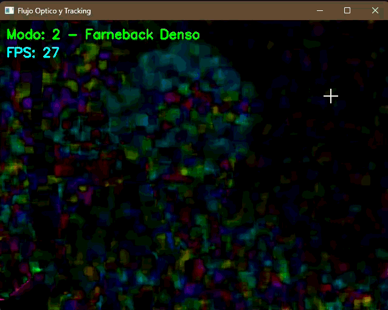

# Taller Flujo Optico Tracking

## Integrantes del grupo
* Brayan Alejandro Muñoz Pérez - bmunozp@unal.edu.co
* Álvaro Andrés Romero Castro - alromeroca@unal.edu.co
* Juan Camilo Lopez Bustos - juclopezbu@unal.edu.co
* Alejandro Ortiz Cortes - alortizco@unal.edu.co

**Fecha de entrega:** 2026-05-18

## Descripción breve
Este proyecto implementa técnicas de cálculo de flujo óptico y tracking de movimiento utilizando la librería OpenCV en Python. Se evalúan y comparan los enfoques de flujo disperso (Lucas-Kanade) centrado en características clave (corners) y el flujo denso (Farnebäck) analizando todos los píxeles de la imagen. Adicionalmente, se incluye una segmentación lógica de áreas con alta magnitud de movimiento para aislar y trackear dinámicamente objetos en tiempo real.

## Implementaciones

### Python (OpenCV)
- **Flujo Óptico Disperso (Lucas-Kanade):** Implementado mediante `cv2.calcOpticalFlowPyrLK`. Rastrea puntos detectados por el algoritmo Shi-Tomasi (`cv2.goodFeaturesToTrack`). Incluye una lógica de recuperación que redetecta puntos automáticamente cuando caen por debajo de un umbral, manteniendo un historial en memoria para dibujar la estela del movimiento.
- **Flujo Óptico Denso (Farnebäck):** Usando `cv2.calcOpticalFlowFarneback`, evalúa el desplazamiento de todo el encuadre. El resultado polar (magnitud y ángulo) se codifica matricialmente a formato HSV, donde el Matiz (H) representa la dirección y el Valor (V) indica la velocidad/intensidad del movimiento.
- **Tracking de Objetos y Detección de Movimiento:** Aprovecha la matriz de magnitudes calculada por Farnebäck, aplica un umbral binario y transformaciones morfológicas (Open/Close) para reducir el ruido. Sobre la máscara resultante se calculan los contornos (`cv2.findContours`), filtrando por área para colocar *bounding boxes* e implementar un conteo en vivo de entidades detectadas moviéndose.

## Resultados visuales


*Flujo óptico disperso rastreando características puntuales y dibujando trayectorias.*


*Transición entre flujo denso (codificación HSV) y máscara de tracking por umbralización de magnitud.*

## Código relevante
El cálculo de FPS in-loop y la conversión de los vectores de movimiento de plano cartesiano a polar (para su visualización matricial sin iterar sobre los píxeles, optimizando el rendimiento):

```python
# Cálculo denso optimizado y conversión cartesiana a polar
flujo = cv2.calcOpticalFlowFarneback(gris_previo, gris_actual, None, 0.5, 3, 15, 3, 5, 1.2, 0)
magnitud, angulo = cv2.cartToPolar(flujo[..., 0], flujo[..., 1])

# Mapeo a espacio HSV usando Broadcasting
hsv[..., 0] = angulo * 180 / np.pi / 2
hsv[..., 2] = cv2.normalize(magnitud, None, 0, 255, cv2.NORM_MINMAX)

```

## Prompts utilizados

No se utilizaron prompts de IA generativa para la resolución estructural del código en este entorno de desarrollo.

## Aprendizajes y dificultades

**Aprendizajes:** Quedó demostrada la diferencia radical de rendimiento y enfoque: Lucas-Kanade es muy eficiente y excelente para seguir estelas específicas, mientras que Farnebäck otorga una comprensión global del movimiento de la escena (incluyendo el pan/tilt de la cámara en sí), aunque a un mayor costo computacional (reflejado en la caída de FPS).

**Dificultades:** Lidiar con el ruido de fondo al umbralizar la magnitud en el modo de tracking generaba *bounding boxes* erráticos en zonas con baja iluminación. Fue obligatorio aplicar ruido de cierre morfológico (`cv2.morphologyEx`) para estabilizar los contornos activos.