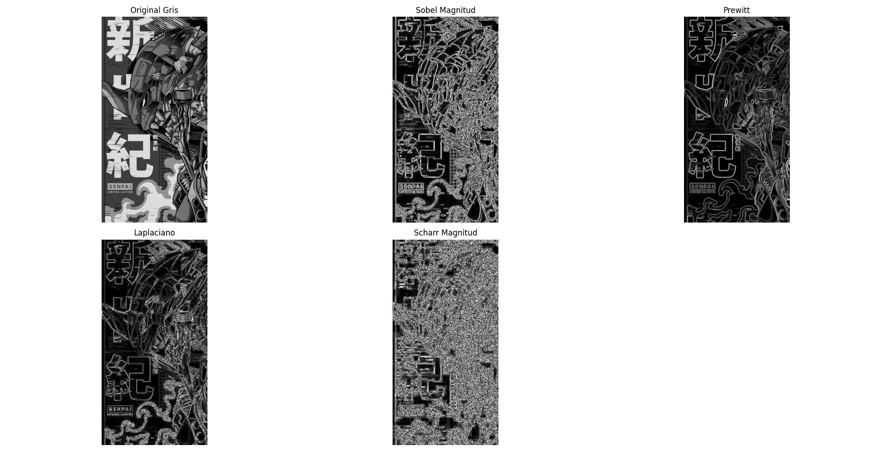
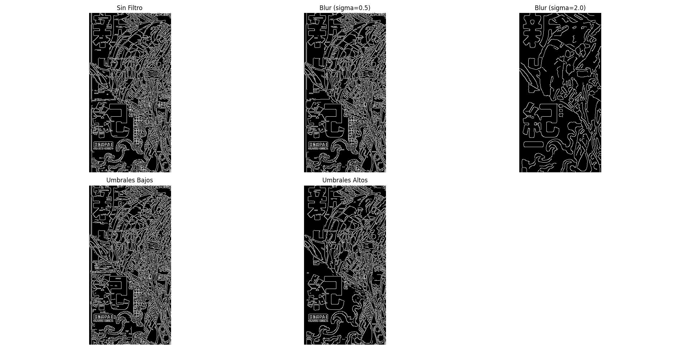
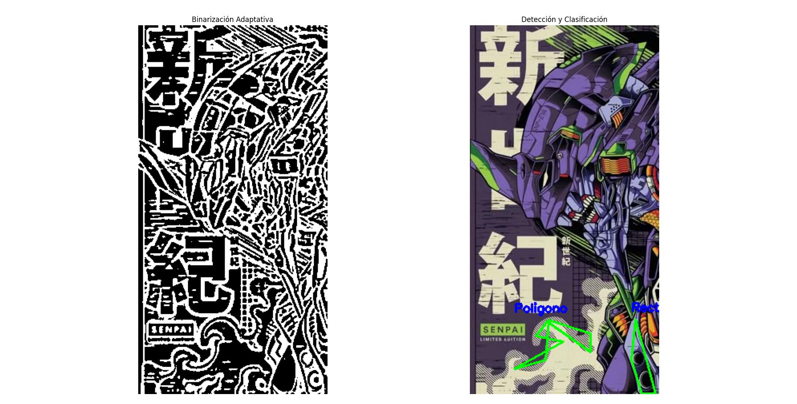
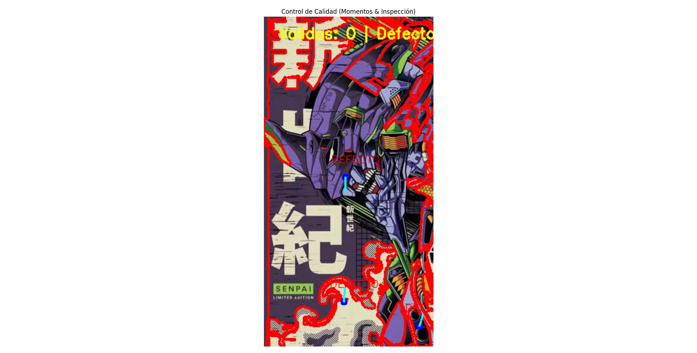
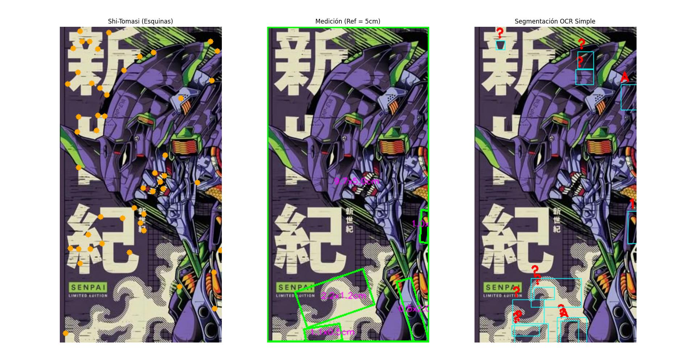

# Taller Deteccion Bordes Contornos

## Nombre del estudiante

* Brayan Alejandro Muñoz Pérez bmunozp@unal.edu.co
* Álvaro Andrés Romero Castro alromeroca@unal.edu.co
* Juan Camilo Lopez Bustos juclopezbu@unal.edu.co
* Alejandro Ortiz Cortes alortizco@unal.edu.co

## Fecha de entrega

`2026-05-18`

---

## Descripción breve

El objetivo de este taller fue aplicar operadores matemáticos de detección de bordes (como Sobel, Prewitt y Canny) y técnicas de análisis de contornos para extraer información estructural de imágenes complejas. Se pretendía explorar cómo diferentes algoritmos perciben los gradientes espaciales y cómo utilizar esta información para clasificar objetos.

Se logró implementar con éxito un pipeline completo en Python que va desde la binarización de la imagen hasta un sistema básico de inspección visual de control de calidad. Además, se desarrollaron heurísticas simples para un OCR, medición de objetos con una referencia de escala teórica y detección de esquinas mediante Shi-Tomasi.

---

## Implementaciones

### Python

Todo el desarrollo se centralizó en un único script de Python, utilizando `opencv-python` para el procesamiento principal, `scikit-image` para la extracción de propiedades matemáticas robustas (como Prewitt y excentricidad) y `matplotlib` para la visualización. 

**Funcionalidad lograda por pasos:**
1. **Operadores básicos:** Se extrajeron los bordes aplicando derivadas de primer orden (Sobel, Scharr, Prewitt) y de segundo orden (Laplaciano).
2. **Canny Edge Detector:** Se demostró la importancia del suavizado Gaussiano previo (`sigmaX`) y se ajustaron umbrales de histéresis para limpiar ruido.
3. **Contornos y Formas:** Mediante un umbral adaptativo (`cv2.adaptiveThreshold`) se aislaron las figuras, se calcularon sus perímetros con `cv2.arcLength` y se simplificaron a polígonos usando `cv2.approxPolyDP` para clasificar formas geométricas contando sus vértices.
4. **Análisis de Momentos e Inspección:** Usando `cv2.moments` para el centroide y `skimage.measure` para la excentricidad, se evaluó si los objetos cumplían el criterio de "redondez" para pasar o reprobar un control de calidad simulado.
5. **Bonus:** Se detectaron esquinas (Shi-Tomasi), se midieron los objetos en base a una referencia ficticia (5 cm) usando `cv2.minAreaRect`, y se aislaron "caracteres" con segmentación para un OCR heurístico.

---

## Resultados visuales

A continuación, se presentan las capturas correspondientes a cada etapa del script desarrolladas en Python. Todos los recursos se encuentran almacenados en el directorio `media/`.

### Python - Implementación


*Animación en tiempo real que demuestra la ejecución secuencial del script y la generación de ventanas analíticas de matplotlib.*



*Comparación de la detección de gradientes espaciales usando filtros de Sobel, Prewitt, Scharr y el Laplaciano en escala de grises.*



*Impacto del desenfoque gaussiano y la variación de umbrales altos y bajos en el algoritmo de detección multietapa de Canny.*



*Proceso de binarización adaptativa (izquierda) y el aislamiento de contornos con su respectiva aproximación de vértices para clasificar formas geométricas (derecha).*



*Simulación de línea de inspección: Se calculan los centroides y la orientación utilizando momentos espaciales, discriminando piezas "OK" o "DEFECTO" basándose en la excentricidad.*



*Resultados del Bonus: Detección de esquinas con Shi-Tomasi (puntos naranjas), medición relativa usando cajas delimitadoras orientadas y aislamiento rudimentario de contornos para segmentación OCR.*

---

## Código relevante

A continuación, se presentan los fragmentos clave que dan solución a cada uno de los requerimientos técnicos del taller.

### 1. Operadores Básicos (Sobel, Prewitt, Laplaciano)
Uso de derivadas espaciales de OpenCV y filtros de `scikit-image` para detectar gradientes.
```python
# Sobel y cálculo de su magnitud
sobel_x = cv2.Sobel(img_gray, cv2.CV_64F, 1, 0, ksize=3)
sobel_y = cv2.Sobel(img_gray, cv2.CV_64F, 0, 1, ksize=3)
sobel_mag = np.uint8(np.absolute(cv2.magnitude(sobel_x, sobel_y)))

# Prewitt usando scikit-image
prewitt_edges = filters.prewitt(img_gray)

# Laplaciano (segunda derivada)
laplacian = np.uint8(np.absolute(cv2.Laplacian(img_gray, cv2.CV_64F)))
```
### 2. Detección Canny y Suavizado Gaussiano
Se aplica un desenfoque previo para mitigar el ruido antes de buscar bordes mediante histéresis.

```python
# Suavizado para eliminar ruido de alta frecuencia
blur_bajo = cv2.GaussianBlur(img_gray, (3, 3), sigmaX=0.5)

# Detector Canny con umbrales ajustados para la estructura principal
canny_umb_alto = cv2.Canny(blur_bajo, 150, 200)
```
### 3. Binarización Adaptativa y Extracción de Contornos
Se independiza la detección de bordes de la iluminación local y se aíslan los contornos.

```python
# Binarización adaptativa frente a iluminación irregular
blur = cv2.GaussianBlur(img_gray, (5, 5), 0)
thresh = cv2.adaptiveThreshold(blur, 255, cv2.ADAPTIVE_THRESH_GAUSSIAN_C, cv2.THRESH_BINARY_INV, 11, 2)

# Extracción de contornos externos
contornos, _ = cv2.findContours(thresh, cv2.RETR_EXTERNAL, cv2.CHAIN_APPROX_SIMPLE)
```
### 4. Aproximación de Polígonos y Clasificación
Cálculo de la longitud de la curva para simplificar la figura y contar sus vértices.

```python
perimetro = cv2.arcLength(cnt, True)
epsilon = 0.04 * perimetro
approx = cv2.approxPolyDP(cnt, epsilon, True)

# Clasificar basados en el número de vértices encontrados
vertices = len(approx)
if vertices == 3:
    forma = "Triangulo"
elif vertices > 5:
    # Verificación extra mediante cálculo de circularidad
    circularidad = 4 * np.pi * (cv2.contourArea(cnt) / (perimetro * perimetro))
    forma = "Circulo" if circularidad > 0.8 else "Poligono"

```
### 5. Momentos, scikit-image e Inspección
Uso de momentos espaciales para el centroide y propiedades de región matemáticas para evaluar defectos.

```python
# Momentos espaciales de OpenCV
M = cv2.moments(cnt)
cx = int(M["m10"] / M["m00"])
cy = int(M["m01"] / M["m00"])

# Propiedades de skimage (robustez matemática)
excentricidad = prop.eccentricity
orientacion = prop.orientation

# Lógica del Control de Calidad
if excentricidad < 0.4 and cv2.contourArea(cnt) > 1000:
    estado = "OK"  # Válido: Redondo y de buen tamaño
else:
    estado = "DEFECTO"
```
### 6. Bonus: Esquinas con Shi-Tomasi
Implementación del detector de características para localizar puntos clave en la imagen.

```python
# Detección de las 50 mejores esquinas (Shi-Tomasi)
esquinas = cv2.goodFeaturesToTrack(img_gray, maxCorners=50, qualityLevel=0.01, minDistance=10)
esquinas = np.int32(esquinas)
```
---

## Prompts utilizados

Durante el desarrollo de este taller, se utilizó asistencia de IA generativa para el diseño de la arquitectura del script, la resolución de problemas de ruido en la imagen y la comprensión matemática de las propiedades geométricas.

* **Diseño y Arquitectura:** "¿Cuál es la mejor estrategia en Python para modularizar un script de visión artificial que aplica múltiples filtros secuenciales y muestra los resultados comparativos usando subplots de matplotlib?"
* **Análisis de Preprocesamiento:** "Estoy obteniendo demasiado ruido (falsos positivos) al usar `cv2.findContours()` en una ilustración tipo manga llena de texturas. ¿Qué técnicas de preprocesamiento y parámetros de suavizado gaussiano recomiendas antes de aplicar la binarización adaptativa?"
* **Integración de Librerías:** "¿Cómo puedo calcular la excentricidad matemática real de un objeto para determinar su nivel de 'redondez', aprovechando `scikit-image` (`regionprops`) en lugar de usar aproximaciones rudimentarias solo con OpenCV?"
* **Comprensión Teórica:** "Explícame las diferencias prácticas y matemáticas entre usar un gradiente de primer orden como Sobel y el detector multietapa de Canny cuando se intenta extraer la estructura principal de un objeto complejo."
* **Lógica Heurística (OCR):** "Para implementar un OCR simple basado únicamente en el análisis de contornos, ¿qué propiedades geométricas (como el *aspect ratio*, *solidez* o *extent*) son más útiles para diferenciar la forma de los caracteres sin usar Machine Learning?"

---

## Aprendizajes y dificultades
### Aprendizajes
Aprendí la enorme diferencia que existe entre detectar bordes simples (Sobel/Prewitt) y algoritmos multietapa como Canny. Comprendí el concepto de Momentos de imagen para ubicar el centro de masa de una figura y descubrí la potencia de combinar OpenCV con scikit-image (skimage.measure.regionprops) para simplificar cálculos matemáticos complejos como la orientación y la excentricidad.

### Dificultades
El mayor reto fue procesar la imagen elegida, ya que por ser una ilustración tipo "manga", contaba con muchísimos detalles (líneas cruzadas, texto, texturas). Esto causó que cv2.findContours arrojara una gran cantidad de ruido. Lo resolví aplicando un fuerte suavizado gaussiano previo, afinando la binarización adaptativa y estableciendo umbrales estrictos de área (cv2.contourArea) para ignorar fragmentos diminutos.

### Mejoras futuras
En futuros proyectos, implementaría algoritmos de Machine Learning (como SVM o redes neuronales convolucionales básicas) o motores como Tesseract para que el módulo de OCR no dependa de heurísticas rígidas (aspect ratio). También podría integrar una cámara para hacer la detección dimensional de piezas en tiempo real.

---

## Referencias
* Documentación oficial de OpenCV: https://docs.opencv.org/

* Documentación oficial de Scikit-Image: https://scikit-image.org/docs/stable/

* Documentación de Matplotlib: https://matplotlib.org/stable/users/index.html


