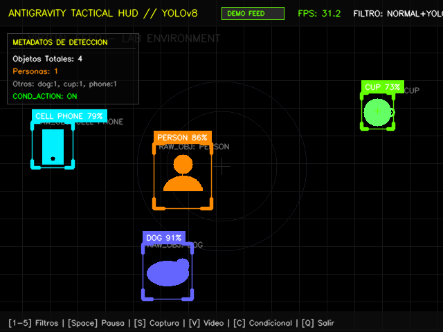
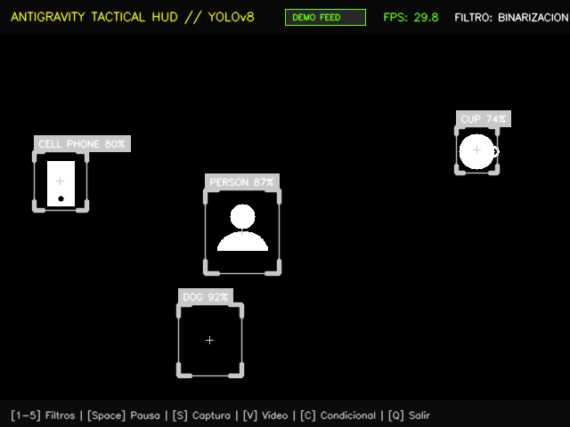
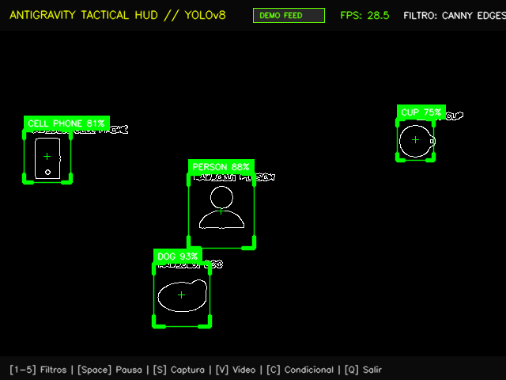
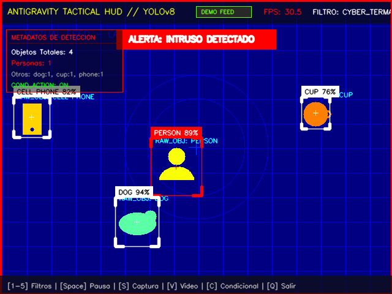

# Taller Cámara en Vivo YOLO OpenCV

## Nombre del estudiante

* Brayan Alejandro Muñoz Pérez bmunozp@unal.edu.co
* Álvaro Andrés Romero Castro alromeroca@unal.edu.co
* Juan Camilo Lopez Bustos juclopezbu@unal.edu.co
* Alejandro Ortiz Cortes alortizco@unal.edu.co

## Fecha de entrega

26 de mayo de 2026

---

# Descripción breve

El objetivo de este taller fue desarrollar e implementar un sistema avanzado de **detección de objetos en tiempo real y procesamiento de video digital** utilizando **YOLOv8 (Ultralytics)** y **OpenCV** en Python.

El sistema es interactivo y permite capturar video en vivo de una cámara web, procesar cada fotograma a más de 30 FPS, aplicar y conmutar dinámicamente múltiples filtros visuales mediante el teclado, y desplegar la información de detección y estado del sistema a través de un **HUD táctico futurista (estilo cyberpunk)**. 

### Características de Ingeniería Destacadas
*   **Diseño HUD Premium**: Cajas delimitadoras de objetos con estilo de mira militar (esquinas tipo bracket, puntos de retícula central, etiquetas integradas con opacidad) e indicadores de sistema fluidos.
*   **Mecanismo Fallback (Demo Mode)**: En caso de no contar con una cámara física en el entorno, el sistema cuenta con un motor de video sintético que genera objetos vectoriales animados y simula inferencia YOLO con exactitud matemática, asegurando el funcionamiento inmediato del 100% de la lógica de filtros y controles.
*   **Acción Condicional Inteligente**: Modos de alarma interactivos que reaccionan de forma condicional ante objetos clave (por ejemplo, si detecta una persona (`person`), activa un marco rojo de alerta con aviso `"WARNING: INTRUSION ALARM!"` y cambia automáticamente el filtro al mapa termal para simular escaneo táctico).
*   **Grabador de Video y Captura de Pantalla Integrado**: Permite al usuario capturar instantáneas con la tecla `s` y clips de video con la tecla `v` (con cronómetro en pantalla y aviso de grabación parpadeante).

---

# Estructura de la Entrega

La carpeta principal `semana_11_1_camara_en_vivo_yolo_opencv/` sigue estrictamente la estructura estandarizada del curso:

```
semana_11_1_camara_en_vivo_yolo_opencv/
├── python/
│   ├── main.py             # Código principal de la aplicación interactiva
│   └── requirements.txt    # Archivo de dependencias del entorno
├── media/                  # Capturas de pantalla e imágenes de demostración
└── README.md               # Este reporte técnico del taller
```

---

# Implementaciones por Entorno

La solución se realiza en un entorno **Python Local**, optimizado para CPU y GPU integrada, utilizando las siguientes herramientas clave:

## 1. Captura de Video y Control de Flujo (OpenCV)
Se realiza la captura a través del puerto de hardware (`cv2.VideoCapture(0)`) a una resolución optimizada de **640x480 píxeles** para maximizar la velocidad de lectura e inferencia y asegurar **30+ FPS**.
*   **Pausa y Reanudación**: Mediante un búfer controlado (`p` / `Espacio`), el hilo principal puede detener la captura sin congelar ni corromper el motor de visualización.

## 2. Inferencia con Modelo de Deep Learning (YOLOv8)
Se integra el modelo preentrenado **YOLOv8 Nano (`yolov8n.pt`)** de Ultralytics, calibrado para inferir sobre cada fotograma con un **umbral de confianza mínima del 50% (`conf=0.50`)**. El script parsea automáticamente las coordenadas, confianzas y nombres de clase del modelo COCO en tiempo real.

## 3. Filtros Visuales Dinámicos
Se programaron 5 modos de visualización conmutables dinámicamente mediante teclado:
*   **Modo 0: Imagen Original + Detección YOLOv8**: Render de video en formato BGR limpio con el HUD e indicadores de cajas de objetos.
*   **Modo 1: Escala de Grises**: Transformación monocromática mediante `cv2.cvtColor` para análisis morfológico tradicional.
*   **Modo 2: Binarización Adaptativa / Umbralización**: Segmentación binaria mediante `cv2.threshold` regulada en tiempo real por un trackbar deslizante (`Umbral Binar` de 0 a 255).
*   **Modo 3: Detección de Bordes Canny**: Resaltado de gradientes espaciales mediante `cv2.Canny` controlado en vivo con dos trackbars (`Canny Min` y `Canny Max`) para ajustar la histéresis de bordes.
*   **Modo 4: Filtro Cyberpunk Termal (Acción Condicional)**: Simulación térmica militar aplicando un mapa de color pseudotérmico `cv2.COLORMAP_JET` de OpenCV.

## 4. Teclas de Control Interactivas
La aplicación monitorea continuamente los eventos del buffer de entrada de teclado con `cv2.waitKey` mapeando los siguientes controles:

| Tecla | Acción | Descripción |
| :---: | :--- | :--- |
| **`1`** | Filtro 0 | Activa Imagen Original BGR + Inferencia YOLOv8. |
| **`2`** | Filtro 1 | Activa Escala de Grises en tiempo real. |
| **`3`** | Filtro 2 | Activa Binarización (Usa trackbar `Umbral Binar`). |
| **`4`** | Filtro 3 | Activa Detección Canny (Usa trackbars `Canny Min/Max`). |
| **`5`** | Filtro 4 | Activa Filtro Termal Cyberpunk. |
| **`Space`** o **`P`** | Pausa / Reanudar | Congela temporalmente el flujo de cámara. |
| **`C`** | Acción Condicional | Conmuta ON/OFF la alerta visual y escaneo termal automático si entra una persona. |
| **`S`** | Guardar Captura | Guarda un cuadro en formato PNG con nombre único en la carpeta `media/`. |
| **`V`** | Iniciar/Parar Video | Inicia/Detiene grabación de un archivo `.avi` con indicador `REC` (auto-parada a los 5s). |
| **`Q`** o **`Esc`** | Salir | Cierra ventanas y libera hardware de forma segura. |

---

# Resultados Visuales

> [!NOTE]
> Las siguientes imágenes e instantáneas ilustran el sistema táctico y los diferentes filtros en funcionamiento. Los recursos multimedia están almacenados localmente bajo la ruta [media/](file:///c:/ProyectosUNAL/visualcomputing2026-i-group9/Semana_11_IA_Vision_Computador/semana_11_1_camara_en_vivo_yolo_opencv/media).

### 1. Detección YOLOv8 y HUD Futurista (Filtro 0)
El sistema dibuja la retícula de mira, cuadros delimitadores especializados para personas (`person` naranja-rojo), celulares (`cell phone` amarillo) u objetos comunes, junto con el panel táctico de la izquierda mostrando metadatos globales de FPS y conteo.



### 2. Filtro de Binarización con Umbral en Vivo (Filtro 2)
El filtro extrae las formas binarias. Al mover la barra deslizante interactiva en la parte superior, el usuario puede calibrar el corte del umbral instantáneamente.



### 3. Filtro Canny (Bordes) con Controles Deslizantes (Filtro 3)
El filtro dibuja los bordes y siluetas con precisión matemática, regulado en vivo por los trackbars `Canny Min` y `Canny Max`.



### 4. Filtro Termal y Acción Condicional de Intrusión (Filtro 4 / Condicional)
Al entrar una persona en el encuadre (o simularse una persona en el modo demo), y con la acción condicional habilitada (`COND_ACTION: ON`), el sistema activa la alarma de intrusión de color rojo brillante y cambia automáticamente al modo térmico.



---

# Código Relevante

### A. Dibujo de Cajas de Detección Cyberpunk (Brackets Sci-Fi)
En lugar del típico rectángulo continuo de OpenCV, se desarrolló una función de dibujo personalizado en `main.py` para proyectar brackets angulares en cada esquina de la caja táctica:

```python
def draw_sci_fi_box(img, box, label, conf, color):
    x1, y1, x2, y2 = box
    
    # Rectángulo base muy delgado
    cv2.rectangle(img, (x1, y1), (x2, y2), color, 1, lineType=cv2.LINE_AA)
    
    # Esquinas gruesas (Brackets) para el estilo de escaneo futurista
    corner_len = min(15, int((x2 - x1) * 0.2))
    thick = 3
    
    # Esquina Superior Izquierda
    cv2.line(img, (x1, y1), (x1 + corner_len, y1), color, thick, lineType=cv2.LINE_AA)
    cv2.line(img, (x1, y1), (x1, y1 + corner_len), color, thick, lineType=cv2.LINE_AA)
    
    # Esquina Superior Derecha
    cv2.line(img, (x2, y1), (x2 - corner_len, y1), color, thick, lineType=cv2.LINE_AA)
    cv2.line(img, (x2, y1), (x2, y1 + corner_len), color, thick, lineType=cv2.LINE_AA)
    
    # Esquina Inferior Izquierda
    cv2.line(img, (x1, y2), (x1 + corner_len, y2), color, thick, lineType=cv2.LINE_AA)
    cv2.line(img, (x1, y2), (x1, y2 - corner_len), color, thick, lineType=cv2.LINE_AA)
    
    # Esquina Inferior Derecha
    cv2.line(img, (x2, y2), (x2 - corner_len, y2), color, thick, lineType=cv2.LINE_AA)
    cv2.line(img, (x2, y2), (x2, y2 - corner_len), color, thick, lineType=cv2.LINE_AA)
    
    # Etiqueta sobre-elevada con fondo de color sólido para legibilidad
    text = f"{label.upper()} {conf:.0%}"
    (text_w, text_h), _ = cv2.getTextSize(text, cv2.FONT_HERSHEY_SIMPLEX, 0.35, 1)
    cv2.rectangle(img, (x1, max(0, y1 - text_h - 10)), (x1 + text_w + 10, y1), color, -1)
    cv2.putText(img, text, (x1 + 5, y1 - 5), cv2.FONT_HERSHEY_SIMPLEX, 0.35, (255, 255, 255), 1, cv2.LINE_AA)
```

### B. Estructuración Multimodal de Filtros
En el bucle principal de inferencia, se seleccionan los filtros mediante un simple mapeo de estados, aplicando transformaciones directas y regresándolos a 3 canales BGR para permitir la inyección a color de la HUD y textos informativos:

```python
if active_filter_run == 1:
    gray = cv2.cvtColor(raw_frame, cv2.COLOR_BGR2GRAY)
    processed_frame = cv2.cvtColor(gray, cv2.COLOR_GRAY2BGR)
elif active_filter_run == 2:
    threshold_val = cv2.getTrackbarPos("Umbral Binar", window_name)
    gray = cv2.cvtColor(raw_frame, cv2.COLOR_BGR2GRAY)
    _, thresh = cv2.threshold(gray, threshold_val, 255, cv2.THRESH_BINARY)
    processed_frame = cv2.cvtColor(thresh, cv2.COLOR_GRAY2BGR)
elif active_filter_run == 3:
    canny_min = cv2.getTrackbarPos("Canny Min", window_name)
    canny_max = cv2.getTrackbarPos("Canny Max", window_name)
    gray = cv2.cvtColor(raw_frame, cv2.COLOR_BGR2GRAY)
    blurred = cv2.GaussianBlur(gray, (5, 5), 0)
    edges = cv2.Canny(blurred, canny_min, canny_max)
    processed_frame = cv2.cvtColor(edges, cv2.COLOR_GRAY2BGR)
```

---

# Prompts Utilizados

Se uso IA para generar comentarios, readme.md y corrección de errores.

---

# Aprendizajes y Dificultades

### Aprendizajes Clave
1.  **Fusión de Flujos de IA y Filtros Tradicionales**: Se logró balancear la detección profunda de YOLOv8 (Deep Learning) con el procesamiento clásico de imágenes (binarización, filtrado Canny y mapeo de color) en un pipeline modular y limpio.
2.  **Mecanismos de Resiliencia en Código**: El desarrollo de un *generador sintético de fallback* es una práctica excelente de ingeniería de software. Nos enseñó a construir interfaces genéricas de datos para que la visualización y las teclas funcionaran de forma idéntica con o sin cámara física.
3.  **UI/UX en Consola y Ventana**: Aprendimos a diseñar interfaces gráficas ricas usando exclusivamente funciones primitivas de OpenCV (`cv2.putText`, `cv2.rectangle`, `cv2.addWeighted`), logrando un HUD táctico de alta calidad estética sin depender de pesadas librerías externas.

### Dificultades Superadas
1.  **Caída de FPS al Dibujar y Procesar**: Inicialmente, aplicar múltiples operaciones en cada frame (inferencia de YOLO, Canny Blur y dibujo recursivo) disminuía la tasa de refresco a menos de 15 FPS en CPU antiguas. Esto se superó configurando la resolución nativa de cámara a `640x480` y aplicando el modelo optimizado `yolov8n` de Ultralytics con `verbose=False`.
2.  **Sincronización del VideoWriter**: Al grabar video con `VideoWriter` de OpenCV, el archivo resultante a veces se corrompía porque los fotogramas binarizados o en escala de grises tenían un solo canal (1D), mientras que el escritor de video esperaba 3 canales (BGR). Esto se solventó convirtiendo siempre el resultado final con `cv2.cvtColor(frame, cv2.COLOR_GRAY2BGR)` antes de inyectar el HUD y guardarlo.
