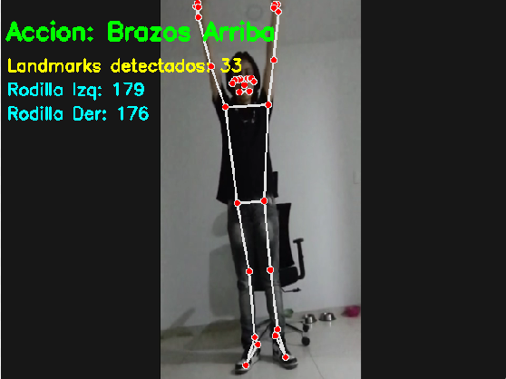
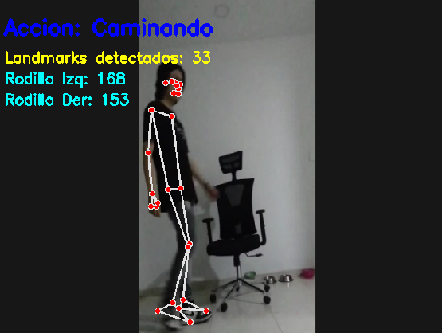
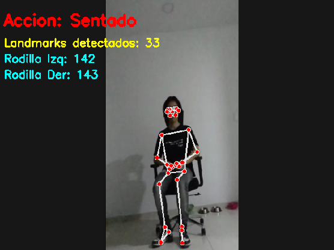
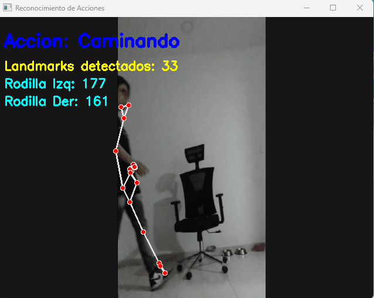

# Taller Reconocimiento Postura Mediapipe

## Nombre del estudiante

* Brayan Alejandro Muñoz Pérez bmunozp@unal.edu.co
* Álvaro Andrés Romero Castro alromeroca@unal.edu.co
* Juan Camilo Lopez Bustos juclopezbu@unal.edu.co
* Alejandro Ortiz Cortes alortizco@unal.edu.co

## Fecha de entrega

25 de mayo de 2026

---

# Descripción breve

El objetivo de este taller fue desarrollar un sistema de reconocimiento de acciones corporales en tiempo real utilizando visión por computador, MediaPipe Pose y OpenCV en Python.

El sistema implementado permite detectar y rastrear los 33 landmarks del cuerpo humano usando la cámara web del computador. A partir de estos puntos clave se desarrollaron reglas geométricas para reconocer diferentes acciones y posturas corporales, incluyendo:

* Persona sentada
* Brazos levantados
* Caminando
* Persona de pie

Además, el sistema calcula ángulos corporales, muestra el esqueleto del cuerpo en tiempo real y despliega retroalimentación visual indicando la acción detectada.

---

# Implementaciones

## Implementación en Python con MediaPipe y OpenCV

### Herramientas utilizadas

* Python 3.11
* MediaPipe
* OpenCV
* NumPy

### Funcionalidades implementadas

* Captura de video en tiempo real con webcam
* Detección de pose humana usando MediaPipe Pose
* Visualización de landmarks y conexiones esqueléticas
* Reconocimiento de acciones mediante reglas geométricas
* Cálculo de ángulos de rodillas
* Retroalimentación visual mediante etiquetas y colores
* Detección de caminata usando movimiento de tobillos
* Detección de postura sentada usando ángulos de rodillas y torso

---

# Resultados visuales

## Detección de brazos levantados



## Detección de caminata



## Detección de postura sentada



## Visualización en tiempo real



---

# Código relevante

## Inicialización de MediaPipe Pose

```python
mp_pose = mp.solutions.pose

pose = mp_pose.Pose(
    static_image_mode=False,
    model_complexity=1,
    smooth_landmarks=True,
    min_detection_confidence=0.5,
    min_tracking_confidence=0.5
)
```

## Regla para detectar brazos levantados

```python
def detectar_brazos_arriba(left_wrist_y, right_wrist_y, nose_y):
    return left_wrist_y < nose_y and right_wrist_y < nose_y
```

## Cálculo de ángulos

```python
def calcular_angulo(a, b, c):

    a = np.array(a)
    b = np.array(b)
    c = np.array(c)

    radians = np.arctan2(c[1] - b[1], c[0] - b[0]) - \
              np.arctan2(a[1] - b[1], a[0] - b[0])

    angle = np.abs(radians * 180.0 / np.pi)

    if angle > 180:
        angle = 360 - angle

    return angle
```

## Detección de postura sentada

```python
rodillas_dobladas = (
    angulo_rodilla_izq < 160 and
    angulo_rodilla_der < 160
)

torso_recto = angulo_torso < 35

return rodillas_dobladas and torso_recto
```

---

# Prompts utilizados

Durante el desarrollo se utilizaron herramientas de IA generativa para apoyo en:

* Generación de estructuras base en Python
* Mejora de algoritmos de detección de postura
* Corrección de errores de MediaPipe
* Optimización de reglas geométricas para detectar acciones
* Creación de documentación README

### Ejemplos de prompts utilizados

* “Crear un sistema de reconocimiento de postura usando MediaPipe y OpenCV”
* “Cómo detectar una persona sentada usando landmarks de MediaPipe”
* “Mejorar detección de caminata con pasos cortos”
* “Cómo calcular ángulos entre landmarks corporales en Python”

---

# Aprendizajes y dificultades

Durante el desarrollo del taller se aprendió el funcionamiento básico de los modelos de pose estimation utilizando MediaPipe y cómo utilizar landmarks corporales para reconocer acciones humanas en tiempo real.

También se comprendió la importancia de la geometría corporal y el cálculo de ángulos para realizar clasificaciones más precisas de las posturas.

Una de las principales dificultades fue lograr una detección estable de la postura sentada y de la caminata con movimientos pequeños, debido a variaciones en la posición de la cámara, iluminación y precisión de los landmarks.

Finalmente, se logró mejorar la estabilidad del sistema utilizando ángulos de rodillas, análisis del torso y detección de movimiento horizontal de los pies.
