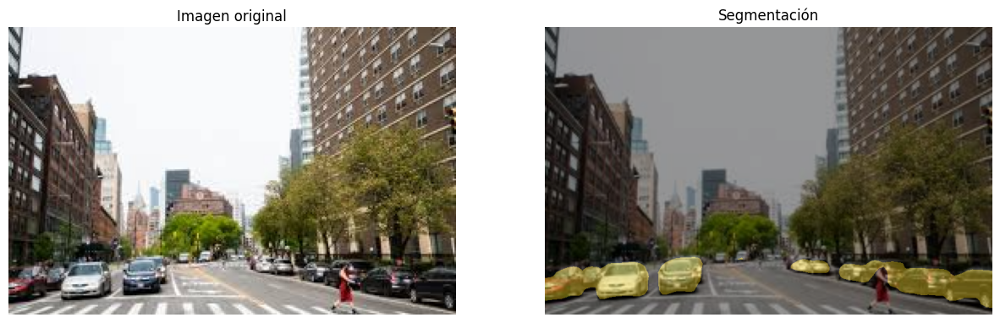
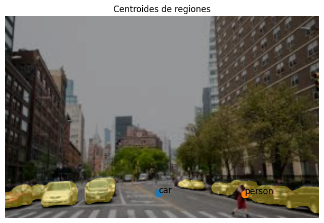

# Taller Convoluciones Personalizadas

## Nombre del estudiante

* Brayan Alejandro Muñoz Pérez bmunozp@unal.edu.co
* Álvaro Andrés Romero Castro alromeroca@unal.edu.co
* Juan Camilo Lopez Bustos juclopezbu@unal.edu.co
* Alejandro Ortiz Cortes alortizco@unal.edu.co

## Fecha de entrega
18 de mayo de 2026

---

# Descripción breve

El objetivo de este taller es de utilizar un modelo de segmentación semántica de imagenes para detectar toda clase de regiones en imagenes. Para esto se usó python y el modelo `SAM` (Segment Anithing Model).

---

# Implementaciones

## Implementación en Python

## Funcionalidades desarrolladas

### 1. Cargar SAM en el ambiente 

Para poder usar `SAM` se deben instalar sus dependencias, que por medio de python se realiza de la forma:

```python
checkpoint_path = hf_hub_download(
    repo_id="ybelkada/segment-anything",
    filename="checkpoints/sam_vit_h_4b8939.pth"
)

print("Checkpoint descargado en:")
print(checkpoint_path)

sam = sam_model_registry["vit_h"](
    checkpoint=checkpoint_path
)

sam.to(device=DEVICE)

sam_predictor = SamPredictor(sam)
```

---

### 2. Definición de clases

Se definierón las siguientes clases para clasificar los objetos en la imagen.

```python
CLASSES = [
    "background",
    "aeroplane",
    "bicycle",
    "bird",
    "boat",
    "bottle",
    "bus",
    "car",
    "cat",
    "chair",
    "cow",
    "diningtable",
    "dog",
    "horse",
    "motorbike",
    "person",
    "pottedplant",
    "sheep",
    "sofa",
    "train",
    "tvmonitor"
]
```

---

### 3. Calculo de los segmentos

Se calculo la segmentación a partir de una imágen con la funcion:

```python
def deeplab_segmentation(image_path):

    image = Image.open(image_path).convert("RGB")

    tensor = preprocess(image).unsqueeze(0)

    with torch.no_grad():
        output = deeplab_model(tensor)["out"]

    prediction = output.argmax(1).squeeze().cpu().numpy()

    return np.array(image), prediction
```

Y a partir de estos se generó las máscaras y overlays:
```python
Image.fromarray(colored_mask).save(
    f"outputs/masks/{image_name}"
)

Image.fromarray(overlay).save(
    f"outputs/overlays/{image_name}"
)
```

---

### 4. Computar métricas

Junto con los datos de segmentación se calculó los datos de métricas.

```python
def compute_metrics(binary_mask):

    binary_mask = binary_mask.astype(np.uint8)

    # Área
    area = np.sum(binary_mask)

    # Contornos
    contours, _ = cv2.findContours(
        binary_mask,
        cv2.RETR_EXTERNAL,
        cv2.CHAIN_APPROX_SIMPLE
    )

    perimeter = 0

    for cnt in contours:
        perimeter += cv2.arcLength(cnt, True)

    # Centroide
    M = cv2.moments(binary_mask)

    if M["m00"] != 0:
        cx = int(M["m10"] / M["m00"])
        cy = int(M["m01"] / M["m00"])
    else:
        cx, cy = 0, 0

    return {
        "area": area,
        "perimeter": perimeter,
        "centroid_x": cx,
        "centroid_y": cy
    }

...

class_mask = (prediction == cls_id)
metrics = compute_metrics(class_mask)
```
---

### 5. Filtrado por IoU

Al igual que las métricas se usó la `class_mask` para determinar un IoU con una máscara `ground_truth` simulada.

```python
def compute_iou(pred_mask):
    #Crear ground truth simulada
    kernel = np.ones((5,5), np.uint8)

    ground_truth = cv2.erode(
        pred_mask.astype(np.uint8),
        kernel,
        iterations=1
    ).astype(bool)

    intersection = np.logical_and(pred_mask, ground_truth)
    union = np.logical_or(pred_mask, ground_truth)

    return np.sum(intersection) / np.sum(union)

...

class_mask = (prediction == cls_id)

        iou = compute_iou(class_mask)
        if iou < 0.75:
            print(f"Filtrando la clase {CLASSES[cls_id]} en imagen {image_name} por IoU ({iou}) < 0.75")
            continue
```

---

---

# Resultados visuales

## Capturas de la implementación

### Imagen original vs Imagén con overlay aplicado



---

### Imagen con métricas de centroides aplicada



---

# Código relevante

## Inicialización

```python
!python -m pip install -r requirements.txt
import os
import cv2
import torch
import random
import numpy as np
import pandas as pd
import matplotlib.pyplot as plt

from PIL import Image
from huggingface_hub import hf_hub_download

from torchvision import models, transforms

from segment_anything import (
    sam_model_registry,
    SamPredictor
)

# Desactivar warning symlink
os.environ["HF_HUB_DISABLE_SYMLINKS_WARNING"] = "1"

# GPU o CPU
DEVICE = "cuda" if torch.cuda.is_available() else "cpu"

print("Dispositivo:", DEVICE)

# Carpeta de imágenes
IMAGE_FOLDER = "../media/dataset"

# Crear carpetas de salida
os.makedirs("outputs", exist_ok=True)
os.makedirs("outputs/masks", exist_ok=True)
os.makedirs("outputs/overlays", exist_ok=True)

checkpoint_path = hf_hub_download(
    repo_id="ybelkada/segment-anything",
    filename="checkpoints/sam_vit_h_4b8939.pth"
)

print("Checkpoint descargado en:")
print(checkpoint_path)

sam = sam_model_registry["vit_h"](
    checkpoint=checkpoint_path
)

sam.to(device=DEVICE)

sam_predictor = SamPredictor(sam)

deeplab_model = models.segmentation.deeplabv3_resnet101(
    pretrained=True
).eval()

print("Modelos cargados")
```

---

## Setup para el procesamiento

```python
CLASSES = [
    "background",
    "aeroplane",
    "bicycle",
    "bird",
    "boat",
    "bottle",
    "bus",
    "car",
    "cat",
    "chair",
    "cow",
    "diningtable",
    "dog",
    "horse",
    "motorbike",
    "person",
    "pottedplant",
    "sheep",
    "sofa",
    "train",
    "tvmonitor"
]

print("Número de categorías:", len(CLASSES))

preprocess = transforms.Compose([
    transforms.Resize(520),
    transforms.ToTensor(),
    transforms.Normalize(
        mean=[0.485, 0.456, 0.406],
        std=[0.229, 0.224, 0.225]
    ),
])

def random_color():
    return np.random.randint(0, 255, size=3)


def compute_metrics(binary_mask):

    binary_mask = binary_mask.astype(np.uint8)

    # Área
    area = np.sum(binary_mask)

    # Contornos
    contours, _ = cv2.findContours(
        binary_mask,
        cv2.RETR_EXTERNAL,
        cv2.CHAIN_APPROX_SIMPLE
    )

    perimeter = 0

    for cnt in contours:
        perimeter += cv2.arcLength(cnt, True)

    # Centroide
    M = cv2.moments(binary_mask)

    if M["m00"] != 0:
        cx = int(M["m10"] / M["m00"])
        cy = int(M["m01"] / M["m00"])
    else:
        cx, cy = 0, 0

    return {
        "area": area,
        "perimeter": perimeter,
        "centroid_x": cx,
        "centroid_y": cy
    }


def compute_iou(pred_mask):
    #Crear ground truth simulada
    kernel = np.ones((5,5), np.uint8)

    ground_truth = cv2.erode(
        pred_mask.astype(np.uint8),
        kernel,
        iterations=1
    ).astype(bool)

    intersection = np.logical_and(pred_mask, ground_truth)
    union = np.logical_or(pred_mask, ground_truth)

    return np.sum(intersection) / np.sum(union)

def deeplab_segmentation(image_path):

    image = Image.open(image_path).convert("RGB")

    tensor = preprocess(image).unsqueeze(0)

    with torch.no_grad():
        output = deeplab_model(tensor)["out"]

    prediction = output.argmax(1).squeeze().cpu().numpy()

    return np.array(image), prediction
```

## Procesamiento de las imágenes

```python
image_files = [
    f for f in os.listdir(IMAGE_FOLDER)
    if f.endswith((".jpg", ".png", ".jpeg"))
]

print("Número de imágenes:", len(image_files))

metrics_data = []

for image_name in image_files:

    print(f"\nProcesando: {image_name}")

    image_path = os.path.join(
        IMAGE_FOLDER,
        image_name
    )

    image_rgb, prediction = deeplab_segmentation(
        image_path
    )

    height, width = prediction.shape

    colored_mask = np.zeros(
        (height, width, 3),
        dtype=np.uint8
    )

    unique_classes = np.unique(prediction)

    # Procesar cada clase
    for cls_id in unique_classes:

        if cls_id == 0:
            continue

        class_mask = (prediction == cls_id)

        iou = compute_iou(class_mask)
        if iou < 0.75:
            print(f"Filtrando la clase {CLASSES[cls_id]} en imagen {image_name} por IoU ({iou}) < 0.75")
            continue

        color = random_color()

        colored_mask[class_mask] = color

        metrics = compute_metrics(class_mask)

        metrics["image"] = image_name
        metrics["class_id"] = int(cls_id)
        metrics["class_name"] = CLASSES[cls_id]

        metrics_data.append(metrics)

    # Overlay
    resized_original = cv2.resize(
        image_rgb,
        (width, height)
    )

    overlay = (
        0.6 * resized_original +
        0.4 * colored_mask
    ).astype(np.uint8)

    # Guardar resultados
    Image.fromarray(colored_mask).save(
        f"outputs/masks/{image_name}"
    )

    Image.fromarray(overlay).save(
        f"outputs/overlays/{image_name}"
    )

print("\nProcesamiento finalizado")

for sample_image in image_files:
    original = np.array(
        Image.open(
            os.path.join(
                IMAGE_FOLDER,
                sample_image
            )
        ).convert("RGB")
    )

    overlay = np.array(
        Image.open(
            f"outputs/overlays/{sample_image}"
        )
    )

    plt.figure(figsize=(15,8))
    ax = plt.subplot(1,2, 1)

    ax.imshow(original)
    ax.set_title("Imagen original")
    ax.axis("off")
    
    ax = plt.subplot(1,2, 2)

    ax.imshow(overlay)
    ax.set_title("Segmentación")
    ax.axis("off")
    plt.show()

metrics_df = pd.DataFrame(metrics_data)

metrics_df.head(20)

for sample_image in image_files:
    sample_metrics = metrics_df[
        metrics_df["image"] == sample_image
    ]

    overlay = np.array(
        Image.open(
            f"outputs/overlays/{sample_image}"
        )
    )

    plt.figure(figsize=(8,6))
    plt.imshow(overlay)

    for _, row in sample_metrics.iterrows():

        plt.scatter(
            row["centroid_x"],
            row["centroid_y"],
            s=100
        )

        plt.text(
            row["centroid_x"],
            row["centroid_y"],
            row["class_name"],
            fontsize=12
        )

    plt.title("Centroides de regiones")
    plt.axis("off")
    plt.show()
```

---

# Prompts utilizados

Principalmente se le pidio a la IA información sobre SAM, y snippets para poder entender la API, esto fácilto el entendimiento ya que sin este acceder a las diferentes funcionalidades habria sido díficil por medio de documentación tradicional.

---

# Aprendizajes y dificultades

## Aprendizajes

Se aprendió a usar herramientas como `SAM` de segmentación de imágenes para obtener objetos en imágenes de una forma detallada, y más fiel a las clasificaciones naturales que otros métodos.

## Dificultades

Fue particularmente difícil usar las funcionalidades de segmentación debido a las diferentes dependencias y la necesidad de instalar diferentes archivos y repositorios por medio de python para que funcionara.