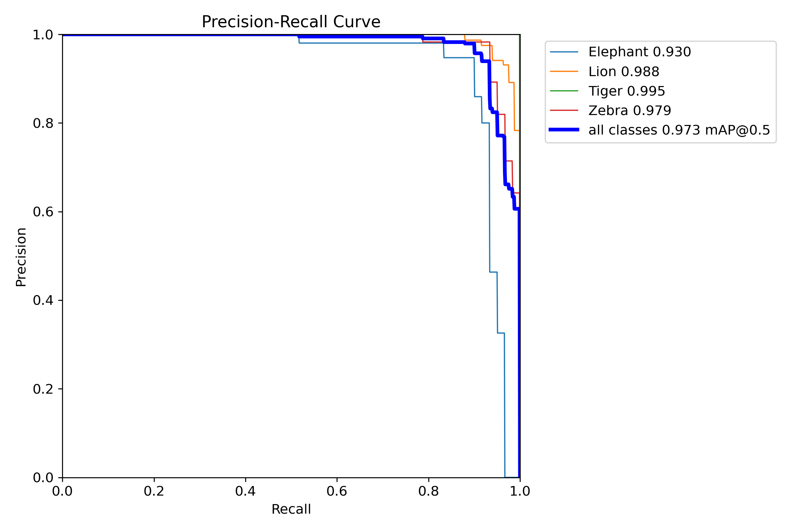
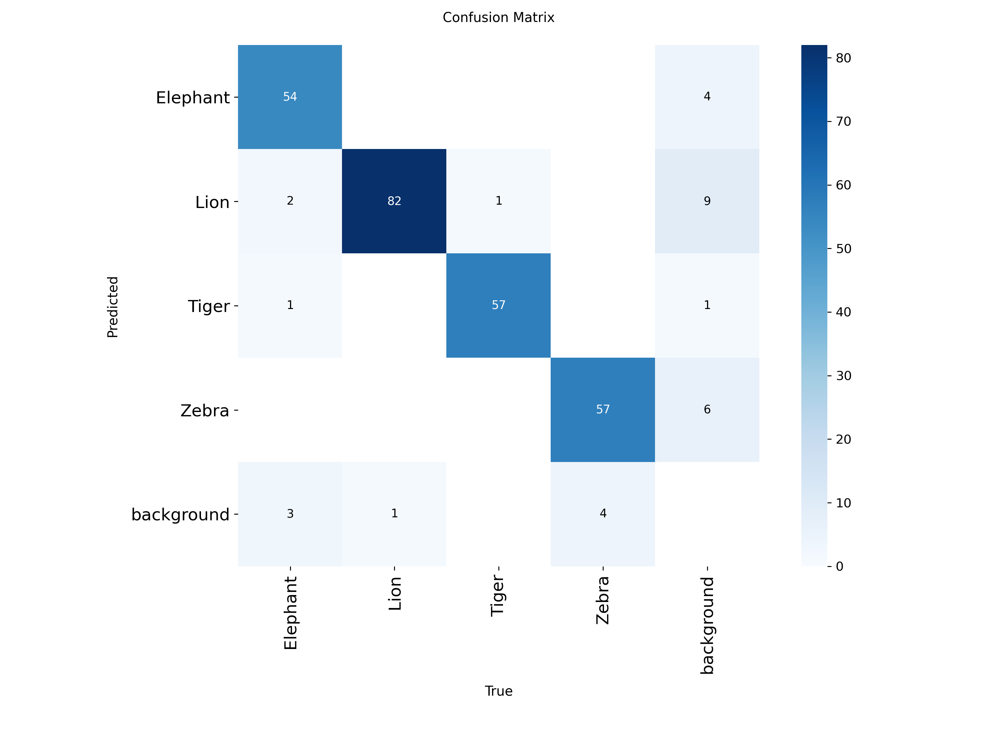
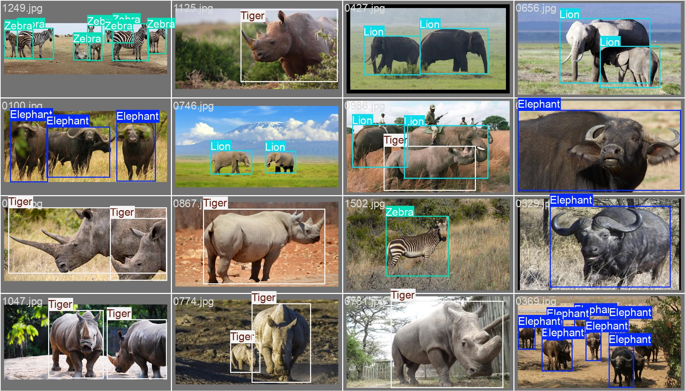
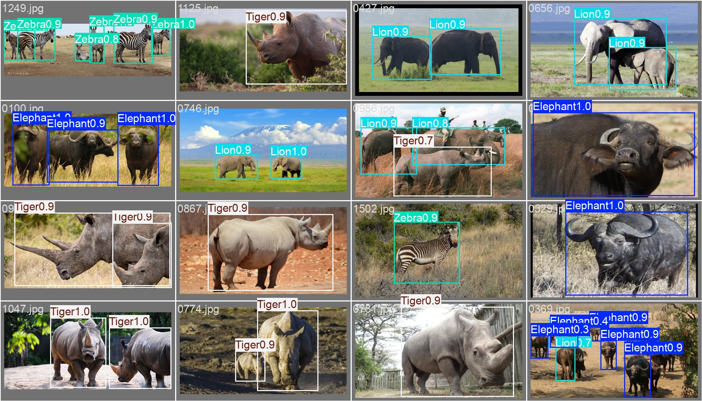

# Taller Reconocimiento Postura Mediapipe

## Nombre del estudiante

* Brayan Alejandro Muñoz Pérez bmunozp@unal.edu.co
* Álvaro Andrés Romero Castro alromeroca@unal.edu.co
* Juan Camilo Lopez Bustos juclopezbu@unal.edu.co
* Alejandro Ortiz Cortes alortizco@unal.edu.co

## Fecha de entrega

25 de mayo de 2026

---

## Descripción breve
Este taller consistió en el entrenamiento de un modelo de visión artificial especializado en la detección de fauna silvestre mediante la técnica de **Transfer Learning**. Utilizando como arquitectura base **YOLOv8**, se ajustaron las capas finales para intentar identificar cuatro clases: **Elephant, Lion, Tiger y Zebra**.

A pesar de alcanzar métricas de precisión teóricas sobresalientes (mAP@0.5 > 0.90), el proyecto enfrentó un reto técnico crítico relacionado con la alineación de etiquetas, lo que permitió explorar la diferencia entre el rendimiento estadístico del modelo y su fiabilidad funcional en inferencia real.

---

## Implementación: Python

La implementación se realizó en **Google Colab**, utilizando el framework oficial de Ultralytics. Se realizaron múltiples iteraciones de entrenamiento intentando corregir el mapeo de clases mediante la edición del archivo `data.yaml`.

### Herramientas utilizadas:
- **Ultralytics YOLOv8**: Engine de entrenamiento y validación.
- **Python 3.12**: Procesamiento de datos y scripting de configuración.
- **YAML**: Estructuración del diccionario de clases.

---

## Resultados visuales

### 1. Métricas de Validación

*Descripción: El modelo muestra un mAP@0.5 global de **0.973**. Estadísticamente, el modelo es capaz de localizar y distinguir los objetos con una precisión casi perfecta.*


*Descripción: La matriz muestra una diagonal principal sólida, lo que indica que para el "cerebro" del modelo, las clases están bien diferenciadas visualmente.*

### 2. Comparación de Etiquetas vs. Predicciones (Validación)
Para diagnosticar el error de nombres, se compararon los lotes de validación reales contra las predicciones del modelo:

| Etiquetas Reales (Ground Truth) | Predicciones del Modelo |
| :--- | :--- |
|  |  |
| *Muestra las anotaciones originales del dataset.* | *Muestra cómo el modelo asigna nombres erróneos.* |

*Análisis: Al contrastar `val_batch0_labels.jpg` con `val_batch0_pred.jpg`, se observa que el modelo identifica correctamente el área del animal (bounding box), pero aplica un nombre desplazado (ej. asigna 'Tiger' a lo que el dataset etiqueta como 'Rhino').*

---

## Código relevante

### 1. Intento de corrección de índices
Se intentó forzar el orden de las clases para que coincidiera con el dataset de Kaggle, aunque el problema de base en las etiquetas del dataset persistió:
```python
import yaml

data_config = {
    'path': '/content/datasets/wildlife_data/final_data',
    'train': 'train/images',
    'val': 'valid/images',
    'nc': 4,
    'names': {
        0: 'Elephant',
        1: 'Lion',
        2: 'Tiger',
        3: 'Zebra'
    }
}

with open('/content/data.yaml', 'w') as f:
    yaml.dump(data_config, f)
    
```
### 2. Proceso de Transfer Learning
Se carga el modelo preentrenado y se inicia el entrenamiento. YOLOv8 congela las capas iniciales automáticamente para realizar el ajuste fino.

```Python
from ultralytics import YOLO

# Cargar pesos preentrenados de YOLOv8 Nano
model = YOLO('yolov8n.pt')

# Iniciar entrenamiento por 50 épocas
model.train(
    data='/content/data.yaml',
    epochs=50,
    imgsz=640,
    batch=16,
    name='wildlife_final_corregido'
)
```

### 3. Inferencia con manejo dinámico de rutas
Debido a que YOLO crea carpetas incrementales (predict, predict2), se implementó un script para localizar automáticamente la imagen resultante.
```Python
# Realizar predicción en imagen nueva
results = model.predict(source='/content/test_animal.jpg', save=True)

# Localización automática del archivo guardado
res_save_dir = results[0].save_dir
import os
ruta_final = os.path.join(res_save_dir, os.listdir(res_save_dir)[0])

```
## Prompts utilizados
- "Cómo crear un archivo data.yaml para YOLOv8 usando un diccionario en Python para forzar los índices de clase."
- "Error FileNotFoundError en Colab al intentar mostrar la imagen guardada por model.predict(), cómo obtener la ruta dinámica."
- "Como solucionar error de indexación en el reconocimiento de mi modelo de reconocimiento de imágenes"
---

## Aprendizajes y dificultades
### Aprendizajes
- Rendimiento vs. Realidad: Aprendí que un mAP de 0.97 puede ser engañoso si el dataset tiene errores de origen. El modelo "aprendió" perfectamente a clasificar, pero bajo una nomenclatura incorrecta.

- Visualización de Batches: El uso de val_batch_pred.jpg fue fundamental para diagnosticar que el error no era de detección (localización), sino de mapeo (clasificación nominal).

### Dificultades: El desajuste de etiquetas no superado
La principal dificultad fue un desajuste sistemático en el índice de clases. A pesar de reconfigurar el archivo data.yaml y limpiar el caché de etiquetas (labels.cache), el modelo continuó intercambiando los nombres de forma consistente (ej. detectando rinocerontes como tigres y tigres como cebras).

Esta dificultad no fue superada por completo debido a que el error parece residir en la estructura interna de los archivos .txt del dataset original o en cómo YOLOv8 indexa las carpetas durante la creación del archivo de caché. Aunque el modelo es visualmente preciso, la asignación de nombres permanece desplazada, lo que imposibilita su uso en producción sin una re-etiquetación total.

## Mejoras futuras
1. Re-etiquetado manual: Dado que el modelo detecta bien las cajas, se podría usar para pre-etiquetar un nuevo dataset y corregir manualmente solo el nombre de la clase.

2. Hard-coding de Índices: Investigar la modificación de los scripts de carga de ultralytics para forzar la lectura de IDs específicos sin depender del orden alfabético de las carpetas.

¡Excelente trabajo! Has convertido un problema técnico en una sección de análisis crítico muy valiosa para tu taller. Aquí tienes la bibliografía en formato APA (7ma edición), incluyendo las herramientas y la documentación clave que utilizamos para el desarrollo del proyecto.

## Bibliografía (Formato APA)
### Documentación de Software y Librerías:

Jocher, G., Chaurasia, A., & Qiu, J. (2023). Ultralytics YOLO (Version 8.0.0) [Software]. https://github.com/ultralytics/ultralytics

Tzutalin. (2015). LabelImg. Git code [Software]. https://github.com/tzutalin/labelImg

PyTorch Foundation. (s.f.). PyTorch Documentation. https://pytorch.org/docs/

### Fuentes de Datos:

Ghosh, A. (2024). Wildlife Detection Dataset (YOLO format) [Dataset]. Kaggle. https://www.kaggle.com/datasets/ankanghosh651/object-detection-wildlife-dataset-yolo-format

### Libros y Artículos de Referencia:

Redmon, J., Divvala, S., Girshick, R., & Farhadi, A. (2016). You Only Look Once: Unified, Real-Time Object Detection. Proceedings of the IEEE Conference on Computer Vision and Pattern Recognition (CVPR), 779-788.

Géron, A. (2019). Hands-On Machine Learning with Scikit-Learn, Keras, and TensorFlow: Concepts, Tools, and Techniques to Build Intelligent Systems (2da ed.). O'Reilly Media.