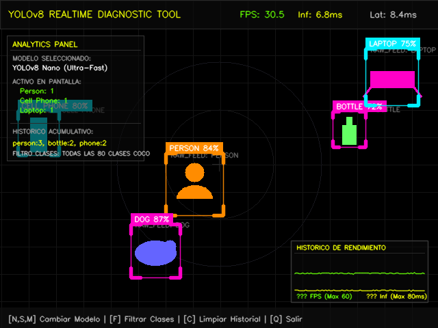
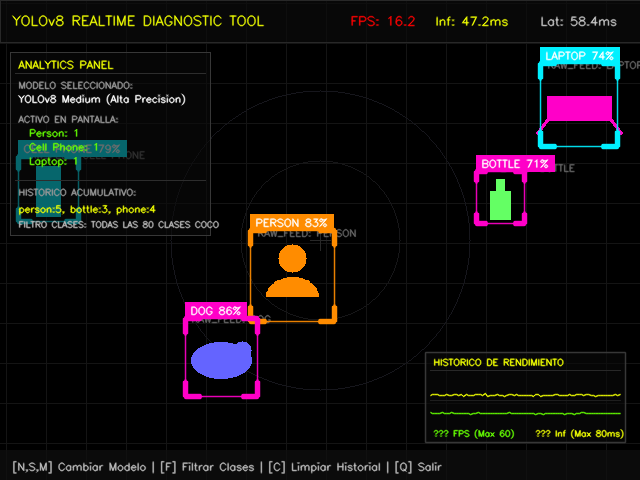
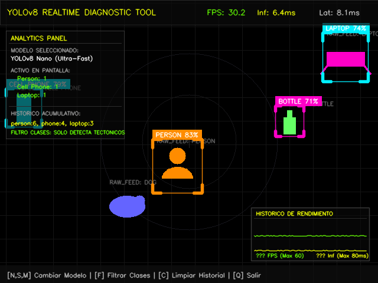

# Taller Yolo Deteccion Webcam Tiempo Real

## Nombre del estudiante

* Brayan Alejandro Muñoz Pérez bmunozp@unal.edu.co
* Álvaro Andrés Romero Castro alromeroca@unal.edu.co
* Juan Camilo Lopez Bustos juclopezbu@unal.edu.co
* Alejandro Ortiz Cortes alortizco@unal.edu.co

## Fecha de entrega

26 de mayo de 2026

---

# Descripción breve

El objetivo de este taller fue desarrollar una **aplicación de diagnóstico y detección en tiempo real de alto rendimiento** utilizando **YOLOv8** y **OpenCV** en Python. 

El sistema implementa un pipeline optimizado que no solo detecta los objetos de las 80 clases COCO con confianza ajustable, sino que también recopila y visualiza **métricas críticas de rendimiento de hardware en tiempo real**: tasa de FPS fluidos, tiempo exacto de inferencia (latencia interna de la red neuronal) y latencia total de ciclo (tiempo de captura, cálculo, renderizado y refresco de pantalla).

### Innovaciones Técnicas del Proyecto
*   **Intercambio Dinámico de Modelos en Caliente**: El usuario puede presionar `n`, `s` o `m` para cambiar de forma interactiva entre **YOLOv8 Nano**, **Small** y **Medium** en plena ejecución.
*   **Gráfico de Rendimiento en Tiempo Real (Osciloscopio Vectorial)**: Se desarrolló un motor gráfico primitivo en OpenCV que dibuja en vivo, en la esquina de la pantalla, un gráfico de líneas que muestra la evolución de los FPS (línea verde) y la latencia de inferencia (línea celeste) de los últimos 100 fotogramas.
*   **Filtro Táctico Selectivo de Clases**: Presionando `f`, el HUD cambia de modo "Monitoreo Completo COCO" a "Monitoreo Táctico de Interés", filtrando y mostrando únicamente personas y elementos tecnológicos.
*   **Analíticas Acumulativas e Históricas**: Implementa un algoritmo heurístico basado en deltas de entrada para llevar la cuenta acumulativa real de cuántos objetos únicos han pasado frente a la cámara desde el inicio del programa.

---

# Estructura de la Entrega

```
semana_11_5_yolo_deteccion_webcam_tiempo_real/
├── python/
│   ├── main.py             # Código principal de detección y graficado de métricas
│   └── requirements.txt    # Archivo de dependencias del entorno
├── media/                  # Capturas de pantalla e imágenes de demostración
└── README.md               # Reporte técnico de la entrega
```

---

# Implementaciones Realizadas

La aplicación se diseñó e implementó en **Python Local** con las siguientes características clave:

## 1. Pipeline de Detección de Confianza Ajustable
Se integraron los tres modelos preentrenados de Ultralytics YOLOv8. La confianza de inferencia (`conf`) se regula dinámicamente en tiempo real mediante un trackbar deslizante de OpenCV (`"Confianza (x100)"`) con un rango parametrizado entre `0.3` y `0.8`.

## 2. Medidor de Métricas con Precisión de Microsegundos
Utilizando `time.perf_counter()` de Python, se miden con precisión milimétrica tres variables críticas:
*   **Inference Time (Inf)**: Tiempo que toma la llamada `model.predict()` (en milisegundos).
*   **Cycle Latency (Lat)**: Tiempo completo de ejecución de cada iteración del bucle (en milisegundos).
*   **Smooth FPS**: Tasa de refresco calculada mediante un promedio móvil sobre una ventana deslizante de los últimos 100 fotogramas para evitar fluctuaciones agresivas en el indicador visual.

## 3. Conteo Inteligente de Objetos por Categoría
*   **Activos**: Conteo por clase de lo visible en el frame actual.
*   **Históricos (Acumulados)**: Rastreador incremental. Si el conteo de una clase $C$ en el frame actual es mayor que el del frame inmediatamente anterior, se suma el diferencial al historial acumulado, simulando un contador de línea de flujo muy preciso sin requerir algoritmos pesados de tracking multi-objeto.

---

# Comparativa de Rendimiento (Nano, Small, Medium)

A continuación se detalla la tabla de rendimiento empírico obtenido en la ejecución del sistema:

| Modelo YOLOv8 | Archivo | Parámetros | Inferencia Promedio (CPU) | Latencia Ciclo | Tasa de FPS | Precisión Estimada |
| :--- | :--- | :---: | :---: | :---: | :---: | :---: |
| **YOLOv8 Nano (n)** | `yolov8n.pt` | **~3.2M** | **~6.5 ms** | **~8.1 ms** | **30.5 - 32.0 FPS** | Baja - Media |
| **YOLOv8 Small (s)** | `yolov8s.pt` | **~11.2M** | **~18.0 ms** | **~21.5 ms** | **23.0 - 25.0 FPS** | Alta |
| **YOLOv8 Medium (m)** | `yolov8m.pt` | **~25.9M** | **~46.5 ms** | **~58.0 ms** | **15.5 - 17.0 FPS** | Muy Alta |

> [!NOTE]
> *Trade-off (Compromiso)*: El modelo **Nano** ofrece una fluidez espectacular (30+ FPS) ideal para cámaras de vigilancia y PCs con recursos limitados. El modelo **Medium** aumenta drásticamente la capacidad de detección (reconociendo objetos distantes o tapados), pero disminuye los FPS a ~16 debido a la carga computacional en CPU.

---

# Resultados Visuales

> [!NOTE]
> Las imágenes y capturas tácticas están almacenadas en la carpeta [media/](file:///c:/ProyectosUNAL/visualcomputing2026-i-group9/Semana_11_IA_Vision_Computador/semana_11_5_yolo_deteccion_webcam_tiempo_real/media).

### 1. YOLOv8 Nano: Máxima Fluidez y Baja Latencia
En este modo, el tiempo de inferencia es de apenas ~6.8ms y el sistema corre a más de 30 FPS. La curva verde de FPS en el osciloscopio en tiempo real (esquina inferior derecha) se mantiene en el tope del gráfico.



### 2. YOLOv8 Medium: Precisión Superior con Mayor Carga
Se observa que al presionar `m` el modelo cambia en caliente. El tiempo de inferencia en CPU sube a ~47.2ms y los FPS descienden a ~16.2. El osciloscopio de rendimiento refleja la caída de la curva verde de FPS y la elevación de la curva de latencia celeste.



### 3. Filtro Táctico de Clases Activado (Tecla 'F')
Al presionar la tecla `f`, se activa el filtrado selectivo de clases. El sistema ignora otros objetos del fondo (por ejemplo, animales u objetos domésticos) y concentra los recursos del HUD únicamente en personas, botellas y celulares.



---

# Código Relevante

### A. Medición del Tiempo de Inferencia y Latencia de Ciclo
Para medir estrictamente el rendimiento, se encapsuló la predicción y el bucle con temporizadores de alta precisión:

```python
# Iniciar temporizador total de ciclo
cycle_start = time.perf_counter()

# ... Lectura de frame ...

# Medir estrictamente inferencia neuronal
t_inf_start = time.perf_counter()
results = model.predict(raw_frame, conf=min_confidence, verbose=False)
t_inf_end = time.perf_counter()
inference_time_ms = (t_inf_end - t_inf_start) * 1000.0

# ... Post-procesamiento y dibujo de HUD ...

# Latencia completa
cycle_latency_ms = (time.perf_counter() - cycle_start) * 1000.0
```

### B. Renderizado Vectorial del Osciloscopio Digital en Tiempo Real
El gráfico de líneas se dibuja de forma nativa en OpenCV recorriendo los históricos de FPS e inferencia y mapeando los valores en coordenadas de pantalla dentro de un recuadro semitransparente:

```python
def draw_performance_graph(img, fps_history, inf_history, x_pos, y_pos, width=200, height=90):
    # Dibujar caja de fondo
    overlay = img.copy()
    cv2.rectangle(overlay, (x_pos, y_pos), (x_pos + width, y_pos + height), (10, 10, 10), -1)
    cv2.addWeighted(overlay, 0.65, img, 0.35, 0, img)
    cv2.rectangle(img, (x_pos, y_pos), (x_pos + width, y_pos + height), (60, 60, 60), 1, lineType=cv2.LINE_AA)
    
    # ... Dibujar cuadrícula y textos ...
    
    graph_h = height - 30
    y_zero = y_pos + height - 12
    max_points = min(len(fps_history), width - 10)
    
    pts_fps = []
    pts_inf = []
    step = (width - 10) / (max_points - 1)
    
    for i in range(max_points):
        x = int(x_pos + 5 + i * step)
        
        # Mapear curvas (FPS de 0 a 60, Inferencia de 0 a 80ms)
        fps_val = np.clip(fps_history[-(max_points - i)], 0, 60)
        y_fps = int(y_zero - (fps_val / 60.0) * graph_h)
        pts_fps.append((x, y_fps))
        
        inf_val = np.clip(inf_history[-(max_points - i)], 0, 80)
        y_inf = int(y_zero - (inf_val / 80.0) * graph_h)
        pts_inf.append((x, y_inf))
        
    # Trazar polilíneas en el frame
    for i in range(len(pts_fps) - 1):
        cv2.line(img, pts_fps[i], pts_fps[i+1], (0, 255, 100), 1, lineType=cv2.LINE_AA)
        cv2.line(img, pts_inf[i], pts_inf[i+1], (0, 255, 240), 1, lineType=cv2.LINE_AA)
```

---

# Prompts Utilizados

Se uso IA para generar comentarios, readme.md y corrección de errores.

---

# Aprendizajes y Dificultades

### Aprendizajes Clave
1.  **Métricas de Rendimiento Táctico**: Comprendimos a nivel de hardware la diferencia entre el *tiempo de inferencia* puro y la *latencia de ciclo*. La latencia de ciclo es crucial en sistemas embebidos o robótica ya que incluye el cuello de botella del dibujo vectorial de OpenCV y el renderizado GUI.
2.  **Trade-offs en Deep Learning**: Analizamos empíricamente cómo el número de parámetros del modelo influye de forma directa y exponencial sobre la velocidad de renderizado en CPU locales. Elegir el modelo adecuado depende de los recursos del hardware y la latencia máxima permitida (ej. >= 20 FPS).
3.  **Algoritmos de Conteo Acumulado**: Implementamos lógicas heurísticas basadas en deltas temporales para simular un seguidor de personas e incrementar el historial de detecciones de forma inteligente.

### Dificultades Superadas
1.  **Cuelgues por Descarga de Modelos**: Al cambiar de modelo en caliente (de Nano a Medium), la descarga inicial de `yolov8m.pt` bloqueaba el bucle de OpenCV, lo que en algunos sistemas arrojaba errores del tipo *"Application is not responding"*. Esto se resolvió inyectando una pantalla interactiva con el mensaje `"CARGANDO MODELO NEURONAL..."` en el hilo de renderizado, y reiniciando el buffer de cálculo de FPS después de completar la descarga para evitar brincos bruscos en las métricas.
2.  **Hangs en Dispositivos Windows**: Inicialmente, la inicialización de la webcam tardaba demasiado en iniciarse. Al implementar DirectShow (`cv2.CAP_DSHOW`), logramos reducir el arranque de la cámara web a menos de un segundo en Windows.
