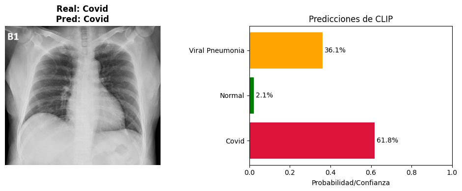
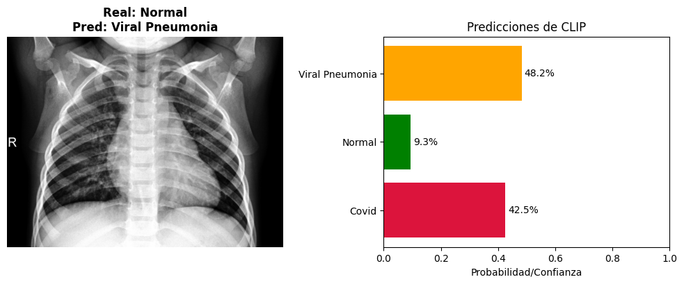
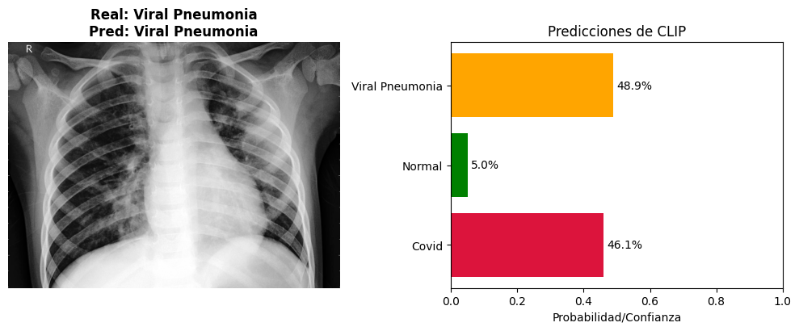
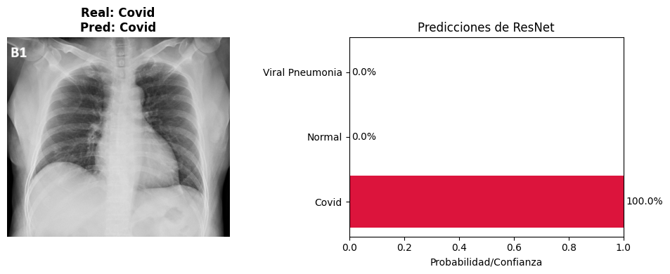
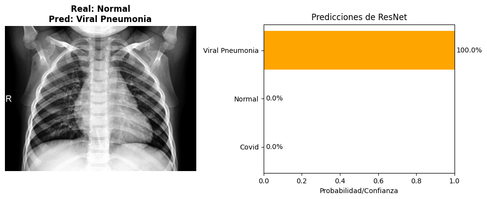
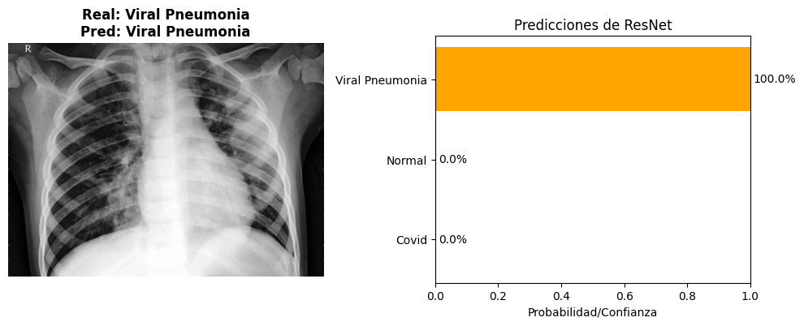

# Taller Convoluciones Personalizadas

## Nombre del estudiante

* Brayan Alejandro Muñoz Pérez bmunozp@unal.edu.co
* Álvaro Andrés Romero Castro alromeroca@unal.edu.co
* Juan Camilo Lopez Bustos juclopezbu@unal.edu.co
* Alejandro Ortiz Cortes alortizco@unal.edu.co

## Fecha de entrega
1 de junio de 2026

---

# Descripción breve

El objetivo de este taller fue de usar diferentes modelos de clasificación de imágenes en un dataset y comparar su efectividad. Se realizo con `CLIP` de OpenAI y `ResNet` de torch. 

---

# Implementaciones

## Implementación en Python

## Funcionalidades desarrolladas

### 1. Uso de CLIP para clasificación de imagenes 

Se cargo el modelo `CLIP` y se usó para clasificar las imágenes de test.

```python
# Cargar y preprocesar la imagen
image_raw = Image.open(img_path).convert("RGB")
image_input = preprocess(image_raw).unsqueeze(0).to(device)

# Inferencia con CLIP
with torch.no_grad():
    logits_per_image, _ = model(image_input, text_inputs)
    probs = logits_per_image.softmax(dim=-1).cpu().numpy()[0]

# Predicción con mayor probabilidad
pred_idx = np.argmax(probs)
pred_label = class_names[pred_idx]
```

---

### 2. Uso de ResNet para clasificación de imagenes 

Se cargo el modelo `ResNet`, se entreno y se usó para clasificar las imágenes de test.

```python
svm_classifier = SVC(kernel='linear', C=1.0)
svm_classifier.fit(train_features, train_labels)

y_pred_svm = svm_classifier.predict(test_features)
svm_accuracy = accuracy_score(test_labels, y_pred_svm)
```

---

# Resultados visuales

## Capturas de la implementación

### Classificación de imagenes por CLIP





---

### Classificación de imagenes por ResNet





---

# Código relevante

## Carga de los modelos

```python
device = "cuda" if torch.cuda.is_available() else "cpu"
model, preprocess = clip.load("ViT-B/32", device=device)

resnet = models.resnet18(weights=models.ResNet18_Weights.DEFAULT)
resnet.fc = torch.nn.Identity()  # Removemos la capa de clasificación final
resnet.eval()
resnet.to(device)

resnet_transforms = transforms.Compose([
    transforms.Resize(256),
    transforms.CenterCrop(224),
    transforms.ToTensor(),
    transforms.Normalize(mean=[0.485, 0.456, 0.406], std=[0.229, 0.224, 0.225]),
])
```

---

## Parametros y direcciónes de imágenes para CLIP

```python
base_path = "../Covid19-dataset"
class_names = ["Covid", "Normal", "Viral Pneumonia"]
descriptions = [
    "a chest X-ray showing COVID-19 pneumonia",
    "a normal healthy chest X-ray",
    "a chest X-ray showing viral pneumonia"
]

# Tokenizar los textos para CLIP
text_inputs = clip.tokenize(descriptions).to(device)

test_images = {
    "Covid": base_path + "/test/Covid/094.png",
    "Normal": base_path + "/test/Normal/0114.jpeg",
    "Viral Pneumonia": base_path + "/test/Viral Pneumonia/0101.jpeg"
}
```

## Clasificación con CLIP

```python
for true_label, img_path in test_images.items():
    if not os.path.exists(img_path):
        print(f"Archivo no encontrado: {img_path}. Saltando ejemplo...")
        continue
        
    # Cargar y preprocesar la imagen
    image_raw = Image.open(img_path).convert("RGB")
    image_input = preprocess(image_raw).unsqueeze(0).to(device)
    
    # Inferencia con CLIP
    with torch.no_grad():
        logits_per_image, _ = model(image_input, text_inputs)
        probs = logits_per_image.softmax(dim=-1).cpu().numpy()[0]
    
    # Predicción con mayor probabilidad
    pred_idx = np.argmax(probs)
    pred_label = class_names[pred_idx]
    
    
    fig, (ax1, ax2) = plt.subplots(1, 2, figsize=(10, 4))
    
    # Mostrar Rayos X
    ax1.imshow(image_raw, cmap='gray')
    ax1.set_title(f"Real: {true_label}\nPred: {pred_label}", fontsize=12, fontweight='bold')
    ax1.axis('off')
    
    # Mostrar Gráfica de barras de confianza
    bars = ax2.barh(class_names, probs, color=['crimson', 'g', 'orange'])
    ax2.set_xlim(0, 1)
    ax2.set_xlabel('Probabilidad/Confianza')
    ax2.set_title('Predicciones de CLIP')
    
    # Añadir porcentajes a las barras
    for bar in bars:
        width = bar.get_width()
        ax2.text(width + 0.01, bar.get_y() + bar.get_height()/2, f'{width*100:.1f}%', 
                 va='center', ha='left', fontsize=10)
                 
    plt.tight_layout()
    plt.show()
```

## Carga de imagenes para ResNet

```python
class_mapping = {"Covid": 0, "Normal": 1, "Viral Pneumonia": 2}

train_features = []
train_labels = []

for class_name, class_idx in class_mapping.items():
    class_folder = os.path.join(base_path, "train", class_name)
    if not os.path.exists(class_folder):
        print(f"Advertencia: No se encontró la carpeta {class_folder}")
        continue
        
    for img_name in os.listdir(class_folder):
        img_path = os.path.join(class_folder, img_name)
        try:
            # Cargar imagen y pasar por ResNet
            img = Image.open(img_path).convert("RGB")
            tensor = resnet_transforms(img).unsqueeze(0).to(device)
            
            with torch.no_grad():
                feat = resnet(tensor).cpu().numpy().flatten()
            
            train_features.append(feat)
            train_labels.append(class_idx)
        except Exception as e:
            # Saltar archivos que no se puedan abrir
            continue
        
train_features = np.array(train_features)
train_labels = np.array(train_labels)

test_features = []
test_labels = []

graph = { os.path.abspath(k): None for k in test_images.values() }

#repetir lo mismo para las de entrenamiento
for class_name, class_idx in class_mapping.items():
    class_folder = os.path.join(base_path, "test", class_name)
    if not os.path.exists(class_folder):
        print(f"Advertencia: No se encontró la carpeta {class_folder}")
        continue
        
    for img_name in os.listdir(class_folder):
        img_path = os.path.join(class_folder, img_name)
        if os.path.abspath(img_path) in graph:
            graph[img_name] = len(test_features)
        try:
            img = Image.open(img_path).convert("RGB")
            tensor = resnet_transforms(img).unsqueeze(0).to(device)
            
            with torch.no_grad():
                feat = resnet(tensor).cpu().numpy().flatten()
            
            test_features.append(feat)
            test_labels.append(class_idx)
        except Exception as e:
            continue


test_features = np.array(test_features)
test_labels = np.array(test_labels)
```

## Clasificación con ResNet

```python
svm_classifier = SVC(kernel='linear', C=1.0)
svm_classifier.fit(train_features, train_labels)

y_pred_svm = svm_classifier.predict(test_features)
svm_accuracy = accuracy_score(test_labels, y_pred_svm)

print("\n=== RENDIMIENTO CLASIFICADOR TRADICIONAL (ResNet + SVM) ===")
print(f"Precisión Global (Accuracy): {svm_accuracy:.2%}")
print("\nReporte de Clasificación:")
print(classification_report(test_labels, y_pred_svm, target_names=["Covid", "Normal", "Viral Pneumonia"]))

for true_label, img_path in test_images.items():
    if not os.path.exists(img_path):
        print(f"Archivo no encontrado: {img_path}. Saltando ejemplo...")
        continue
        
    image_raw = Image.open(img_path).convert("RGB")
    
    pred_idx = y_pred_svm[graph[os.path.basename(img_path)]]
    pred_label = class_names[pred_idx]
    
    
    fig, (ax1, ax2) = plt.subplots(1, 2, figsize=(10, 4))
    
    # Mostrar Rayos X
    ax1.imshow(image_raw, cmap='gray')
    ax1.set_title(f"Real: {true_label}\nPred: {pred_label}", fontsize=12, fontweight='bold')
    ax1.axis('off')
    
    # Mostrar Gráfica de barras de confianza
    bars = ax2.barh(class_names, [(i == pred_idx)*1 for i in range(3)], color=['crimson', 'g', 'orange'])
    ax2.set_xlim(0, 1)
    ax2.set_xlabel('Probabilidad/Confianza')
    ax2.set_title('Predicciones de ResNet')
    
    # Añadir porcentajes a las barras
    for bar in bars:
        width = bar.get_width()
        ax2.text(width + 0.01, bar.get_y() + bar.get_height()/2, f'{width:.1%}', 
                 va='center', ha='left', fontsize=10)
                 
    plt.tight_layout()
    plt.show()
```

## Comparación entre modelos

```python
#clip ya debe estar cargado con la parte 1

clip_correct = 0
total_samples = 0

for class_name, class_idx in class_mapping.items():
    class_folder = os.path.join(base_path, "test", class_name)
    if not os.path.exists(class_folder): continue
    
    for img_name in os.listdir(class_folder):
        img_path = os.path.join(class_folder, img_name)
        try:
            img = Image.open(img_path).convert("RGB")
            img_input = preprocess(img).unsqueeze(0).to(device)
            
            with torch.no_grad():
                logits_per_image, _ = model(img_input, text_inputs)
                pred = logits_per_image.argmax(dim=-1).item()
                
            if pred == class_idx:
                clip_correct += 1
            total_samples += 1
        except:
            continue

clip_accuracy = clip_correct / total_samples if total_samples > 0 else 0
print("\n=== COMPARATIVA FINAL ===")
print(f"Precisión SVM (Supervisado tradicional): {svm_accuracy * 100:.2f}%")
print(f"Precisión CLIP (Zero-Shot sin entrenar): {clip_accuracy * 100:.2f}%")
```

---

# Prompts utilizados

Principalmente se usó para encontrar información sobre los modelos y su uso especiífico.

---

# Aprendizajes y dificultades

## Aprendizajes

Se aprendió sobre los modelos de clasificación `CLIP` y `ResNet` en python. Se pudo evidenciar como `CLIP` no es tan bueno para datasets especializados mientras que `ResNet` requiere de más preparación para ser usado.

## Dificultades

Fue particularmente difícil el uso de las librerías, ya que ambas son muy diferentes en su uso (excepto la carga del modelo) y sobre todo `ResNet` requiere varios pasos consecutivos para funcionar correctamente.