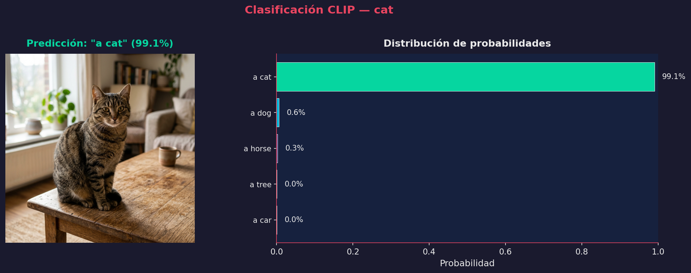
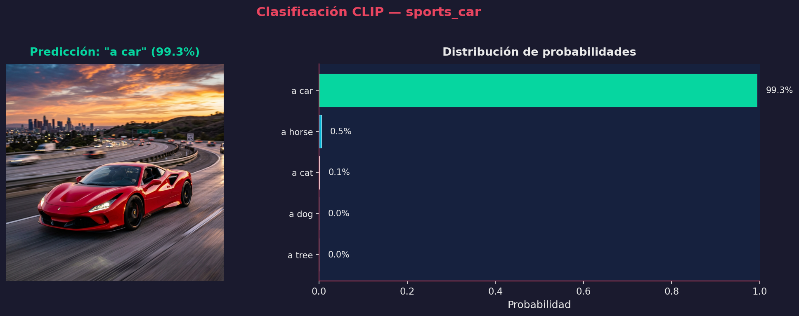
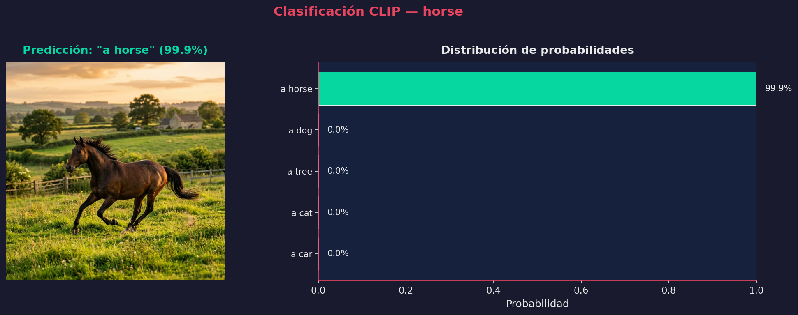
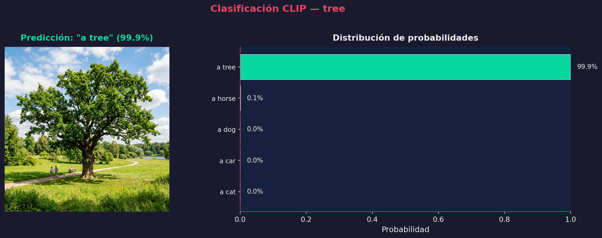
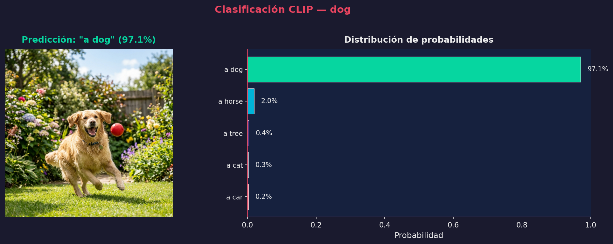
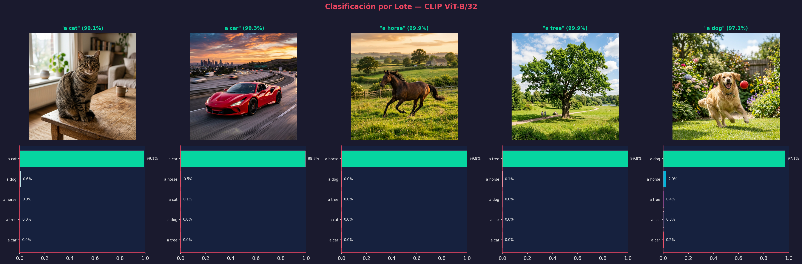
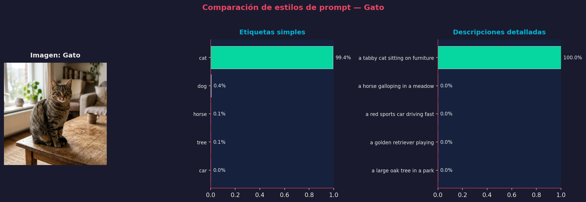
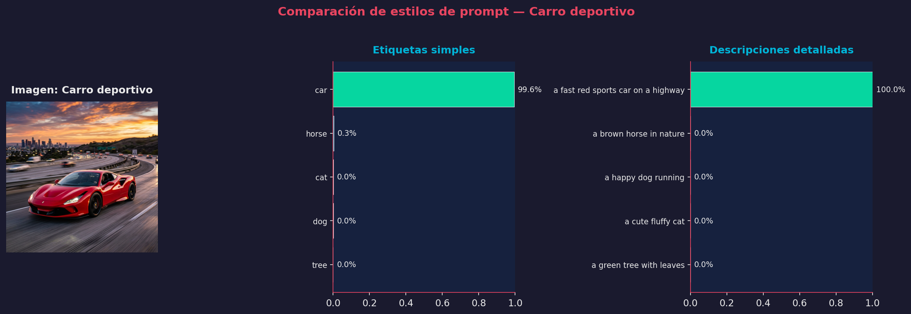
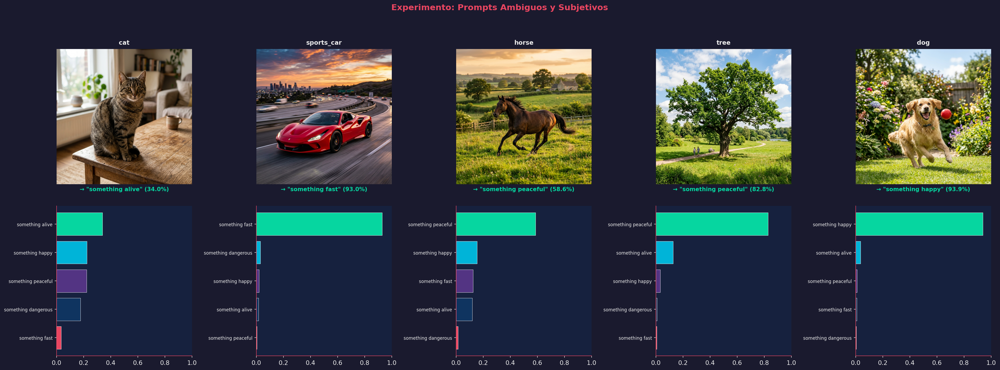
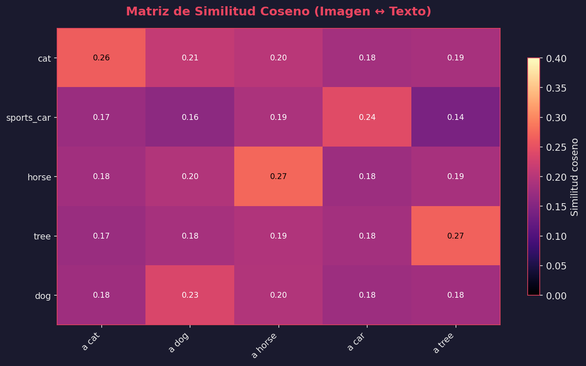

# Taller Clip Clasificación Visual Verbal

## Nombre del estudiante

* Brayan Alejandro Muñoz Pérez bmunozp@unal.edu.co
* Álvaro Andrés Romero Castro alromeroca@unal.edu.co
* Juan Camilo Lopez Bustos juclopezbu@unal.edu.co
* Alejandro Ortiz Cortes alortizco@unal.edu.co

---

## Fecha de entrega

01 de junio de 2026

---

# Descripción breve

En este taller se exploró el modelo **CLIP (Contrastive Language–Image Pre-training)** de OpenAI para clasificar imágenes comparando representaciones de texto e imagen mediante **clasificación zero-shot** — es decir, sin necesidad de entrenamiento adicional.

CLIP aprende a vincular imágenes y texto en un mismo espacio de embeddings mediante entrenamiento contrastivo sobre millones de pares (imagen, texto) recopilados de internet. Esto permite evaluar la similitud entre cualquier imagen y cualquier descripción textual, posibilitando clasificación, búsqueda y recuperación multimodal.

Durante el desarrollo se implementó:

* Carga del modelo CLIP (ViT-B/32) con soporte CPU/CUDA
* Clasificación individual de imágenes con etiquetas de texto
* Clasificación por lote (batch) de múltiples imágenes
* Comparación de estilos de prompt (simples vs detallados)
* Experimentación con prompts ambiguos y subjetivos
* Visualización de la matriz de similitud coseno (imagen ↔ texto)

---

# Implementaciones

## Implementación en Python

Se desarrolló el script `python/main.py` utilizando:

* **CLIP** de OpenAI (modelo `ViT-B/32`)
* **PyTorch** para inferencia
* **Pillow** para carga de imágenes
* **Matplotlib** para visualización con estilo dark premium
* **NumPy** para operaciones numéricas

### Arquitectura del enfoque CLIP

```
Imagen → Preprocesamiento → Encoder Visual (ViT-B/32) → Embedding imagen
                                                              ↓
                                                     Similitud Coseno → Softmax → Probabilidades
                                                              ↑
Texto  → Tokenización      → Encoder Textual          → Embedding texto
```

CLIP no requiere entrenamiento para nuevas clases: simplemente se proporcionan las etiquetas de texto deseadas y el modelo calcula la similitud con la imagen.

### Actividades implementadas

| # | Actividad | Descripción |
|---|-----------|-------------|
| 1 | Clasificación individual | Clasificación de cada imagen contra 5 etiquetas básicas |
| 2 | Clasificación por lote | Procesamiento simultáneo de 5 imágenes con visualización en cuadrícula |
| 3 | Comparación de prompts | Etiquetas simples vs descripciones detalladas |
| 4 | Prompts ambiguos | Frases subjetivas como "something happy", "something dangerous" |
| 5 | Matriz de similitud | Heatmap de similitud coseno entre todas las imágenes y textos |

---

# Resultados visuales

## Clasificación individual

Cada imagen fue clasificada contra las etiquetas: `"a cat"`, `"a dog"`, `"a horse"`, `"a car"`, `"a tree"`.

### Gato (99.1% de confianza)



### Carro deportivo (99.3% de confianza)



### Caballo (99.9% de confianza)



### Árbol (99.9% de confianza)



### Perro (97.1% de confianza)



## Clasificación por lote (Batch)

Todas las imágenes clasificadas simultáneamente en una sola visualización:



## Comparación de estilos de prompt

Se comparó el efecto de usar etiquetas simples (`"cat"`, `"dog"`) versus descripciones detalladas (`"a tabby cat sitting on furniture"`, `"a golden retriever playing"`):

### Imagen del gato — Simples vs Detalladas



### Imagen del carro — Simples vs Detalladas



## Experimento: Prompts ambiguos y subjetivos

Se probaron frases abstractas como `"something happy"`, `"something dangerous"`, `"something peaceful"`, `"something fast"`, `"something alive"`:



**Observaciones interesantes:**
* El gato fue clasificado como "something alive" (34%) — distribución más uniforme, indicando ambigüedad
* El carro deportivo como "something fast" (93%) — muy alta confianza
* El caballo como "something peaceful" (58.6%) — moderada confianza
* El árbol como "something peaceful" (82.8%) — alta confianza
* El perro como "something happy" (93.9%) — la más alta confianza entre animales

## Matriz de similitud coseno

Heatmap que muestra la similitud coseno directa entre los embeddings de cada imagen y cada etiqueta de texto:



Se puede observar que la diagonal (imagen correcta ↔ etiqueta correcta) tiene los valores más altos, confirmando que CLIP mapea correctamente cada imagen a su categoría textual correspondiente.

---

# Código relevante

## Carga del modelo CLIP

```python
import clip
import torch

device = "cuda" if torch.cuda.is_available() else "cpu"
model, preprocess = clip.load("ViT-B/32", device=device)
```

## Clasificación de una imagen

```python
# Cargar y preprocesar la imagen
image = preprocess(Image.open(image_path)).unsqueeze(0).to(device)

# Tokenizar las etiquetas de texto
text = clip.tokenize(labels).to(device)

# Obtener embeddings y calcular similitud
with torch.no_grad():
    image_features = model.encode_image(image)
    text_features = model.encode_text(text)
    logits_per_image, logits_per_text = model(image, text)
    probs = logits_per_image.softmax(dim=-1).cpu().numpy()[0]
```

## Matriz de similitud coseno

```python
with torch.no_grad():
    image_features = model.encode_image(image_tensors)
    text_features = model.encode_text(text_tokens)

    # Normalizar embeddings
    image_features = image_features / image_features.norm(dim=-1, keepdim=True)
    text_features = text_features / text_features.norm(dim=-1, keepdim=True)

    # Similitud coseno
    similarity = (image_features @ text_features.T).cpu().numpy()
```

El código completo se encuentra en [`python/main.py`](python/main.py).

---

# Prompts utilizados

## Prompts de clasificación (texto natural)

Se experimentaron tres categorías de prompts:

### 1. Etiquetas simples
```
"a cat", "a dog", "a horse", "a car", "a tree"
```

### 2. Descripciones detalladas
```
"a tabby cat sitting on furniture"
"a golden retriever playing"
"a horse galloping in a meadow"
"a red sports car driving fast"
"a large oak tree in a park"
```

### 3. Frases ambiguas/subjetivas
```
"something happy"
"something dangerous"
"something peaceful"
"something fast"
"something alive"
```

## Prompts de IA generativa

Durante el desarrollo se utilizaron herramientas de IA generativa para:

* Generar la estructura base del código y visualizaciones
* Crear las imágenes de prueba (gato, carro, caballo, árbol, perro)
* Diseñar el estilo visual dark premium de matplotlib
* Resolver dudas sobre la API de CLIP y embeddings

Ejemplos de prompts de IA utilizados:

* "Crear script de clasificación con CLIP en Python con visualización de probabilidades"
* "Generar imágenes de prueba fotorrealistas para clasificación"
* "Explicar la diferencia entre similitud coseno y softmax en CLIP"

---

# Aprendizajes y dificultades

## Aprendizajes

Durante el desarrollo del taller se comprendió:

* **Zero-shot learning**: CLIP puede clasificar imágenes en categorías nunca vistas durante entrenamiento, simplemente proporcionando etiquetas de texto
* **Espacio de embeddings compartido**: Imágenes y texto se mapean al mismo espacio vectorial, permitiendo comparación directa mediante similitud coseno
* **Sensibilidad al prompt**: Las descripciones detalladas pueden mejorar la precisión — por ejemplo, "a tabby cat sitting on furniture" vs "cat"
* **Conceptos abstractos**: CLIP puede capturar nociones subjetivas como "algo feliz" o "algo peligroso", lo cual sugiere que aprendió asociaciones semánticas complejas durante su entrenamiento
* **Sesgos del modelo**: CLIP asoció "something dangerous" más con el carro deportivo (velocidad) que con animales, reflejando posibles sesgos culturales del dataset de entrenamiento

## Reflexión: ¿Qué tipo de descripciones funcionan mejor?

* **Descripciones específicas y contextuales** funcionan mejor que palabras sueltas (ej: "a tabby cat sitting on furniture" > "cat")
* **El artículo "a"** mejora resultados al ser más natural en inglés
* **Los prompts ambiguos** producen distribuciones más uniformes, indicando genuina incertidumbre del modelo

## ¿Hay sesgos?

Sí, CLIP hereda sesgos de su dataset de entrenamiento (400M pares imagen-texto de internet):
* Asocia velocidad/peligro más con objetos mecánicos
* Los animales tienden a ser clasificados como "alive" o "happy"
* Los paisajes naturales se asocian con "peaceful"

## Dificultades

* Instalación de dependencias: la cadena `torch → CLIP → packaging → regex` requirió instalación cuidadosa
* El modelo ViT-B/32 requiere ~338MB de descarga inicial
* En CPU la inferencia es rápida pero batch grandes pueden ser lentos
* Las visualizaciones requirieron ajuste fino para ser legibles con el tema dark

---
