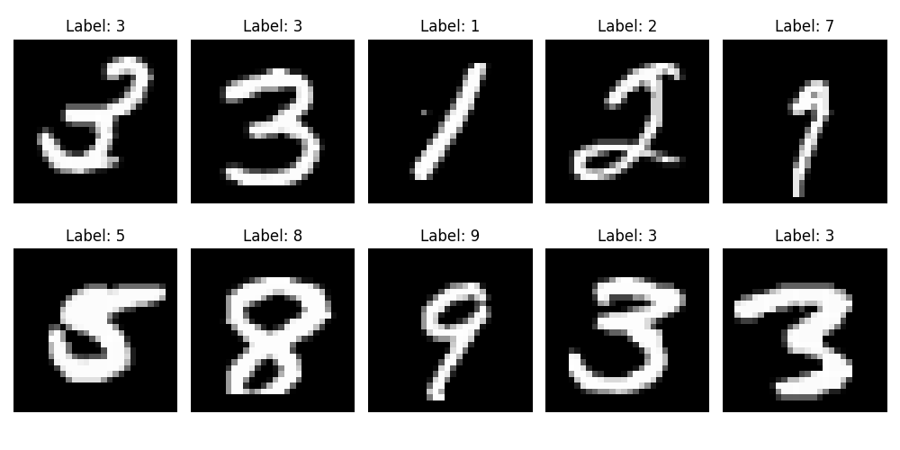
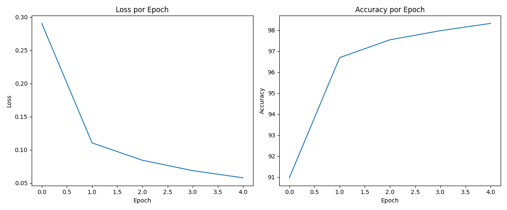
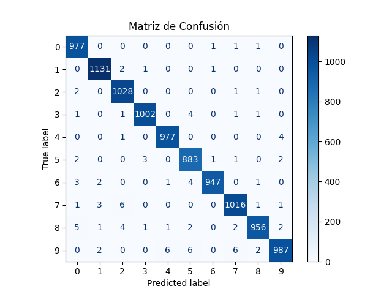
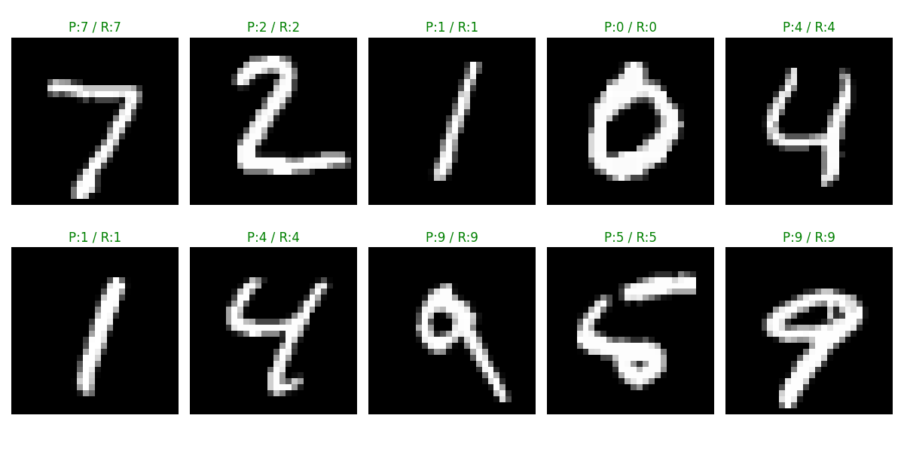

# Taller CNN Básico Deep Learning Keras PyTorch

## Nombre del estudiante

* Brayan Alejandro Muñoz Pérez bmunozp@unal.edu.co
* Álvaro Andrés Romero Castro alromeroca@unal.edu.co
* Juan Camilo Lopez Bustos juclopezbu@unal.edu.co
* Alejandro Ortiz Cortes alortizco@unal.edu.co

---

## Fecha de entrega

01 de junio de 2026

---

# Descripción breve

En este taller se desarrolló una Red Neuronal Convolucional (CNN) desde cero utilizando PyTorch para el reconocimiento y clasificación de imágenes del dataset MNIST.

El objetivo principal fue comprender el funcionamiento de las capas convolucionales, funciones de activación, pooling, entrenamiento y evaluación de modelos de Deep Learning aplicados a visión por computador.

Durante el desarrollo se implementó:

* Carga y visualización del dataset
* Construcción de una CNN básica
* Entrenamiento del modelo
* Evaluación de accuracy
* Matriz de confusión
* Visualización de predicciones
* Guardado y carga del modelo entrenado

---

# Implementaciones

## Implementación en PyTorch

Se desarrolló una CNN utilizando PyTorch y torchvision.

La arquitectura implementada fue:

```python
Conv2D → ReLU → MaxPooling →
Conv2D → ReLU → MaxPooling →
Flatten → Dense → Dropout → Output
```

Características principales:

* Dataset utilizado: MNIST
* Imágenes en escala de grises de 28x28
* Optimización con Adam
* Función de pérdida CrossEntropyLoss
* Regularización con Dropout
* Evaluación mediante accuracy y matriz de confusión

---

# Resultados visuales

## Visualización del dataset



## Curvas de entrenamiento



## Matriz de confusión



## Predicciones del modelo



---

# Código relevante

## Definición de la CNN

```python
class CNN(nn.Module):

    def __init__(self):

        super(CNN, self).__init__()

        self.conv_layers = nn.Sequential(

            nn.Conv2d(1, 32, kernel_size=3, padding=1),
            nn.ReLU(),
            nn.MaxPool2d(2, 2),

            nn.Conv2d(32, 64, kernel_size=3, padding=1),
            nn.ReLU(),
            nn.MaxPool2d(2, 2)
        )

        self.fc_layers = nn.Sequential(

            nn.Flatten(),
            nn.Linear(64 * 7 * 7, 128),
            nn.ReLU(),
            nn.Dropout(0.5),
            nn.Linear(128, 10)
        )

    def forward(self, x):

        x = self.conv_layers(x)

        x = self.fc_layers(x)

        return x
```

## Entrenamiento del modelo

```python
loss.backward()
optimizer.step()
```

## Guardado del modelo

```python
torch.save(model.state_dict(), "cnn_mnist.pt")
```

---

# Prompts utilizados

Durante el desarrollo se utilizaron herramientas de IA generativa para:

* Explicar conceptos de CNN
* Generar estructura base del README
* Resolver dudas sobre PyTorch
* Mejorar visualizaciones y organización del código

Ejemplos de prompts utilizados:

* "Crear una CNN básica en PyTorch para MNIST"
* "Explicar las capas Conv2D y MaxPooling"
* "Generar README para taller de Deep Learning"
* "Mostrar matriz de confusión en PyTorch"

---

# Aprendizajes y dificultades

## Aprendizajes

Durante el desarrollo del taller se comprendió:

* Cómo funcionan las capas convolucionales
* El proceso de entrenamiento de una CNN
* El uso de funciones de activación y pooling
* Cómo evaluar modelos de clasificación
* El manejo de datasets con torchvision
* La importancia de evitar overfitting mediante Dropout

## Dificultades

Algunas dificultades encontradas fueron:

* Comprender las dimensiones de salida entre capas
* Configurar correctamente las capas Dense
* Interpretar la matriz de confusión
* Ajustar hiperparámetros para mejorar accuracy

Finalmente se logró entrenar correctamente el modelo y obtener una alta precisión en el conjunto de prueba.

---
