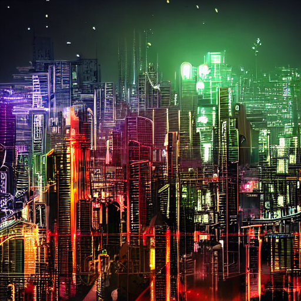
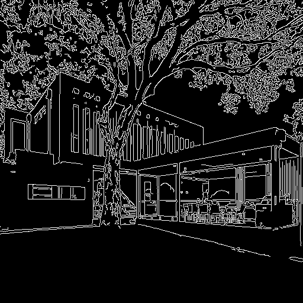
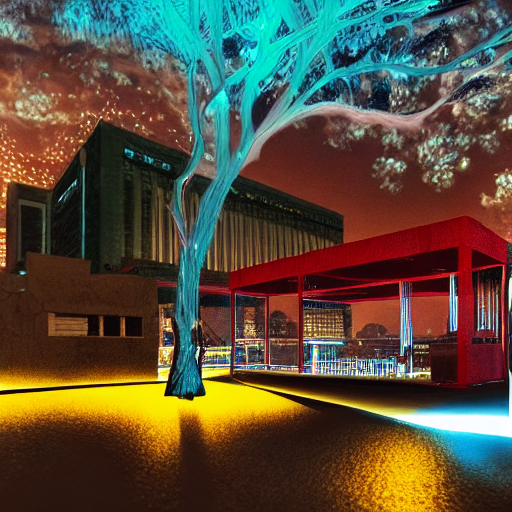
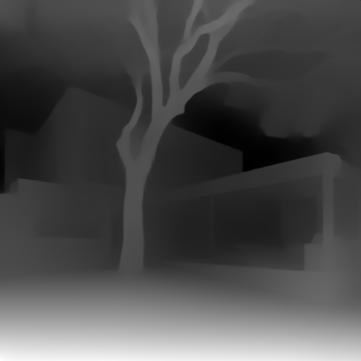
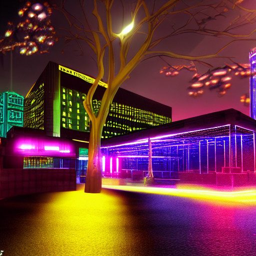

# Taller Controlnet Condiciones Visuales Stablediffusion

## Nombre del estudiante

* Brayan Alejandro Muñoz Pérez bmunozp@unal.edu.co
* Álvaro Andrés Romero Castro alromeroca@unal.edu.co
* Juan Camilo Lopez Bustos juclopezbu@unal.edu.co
* Alejandro Ortiz Cortes alortizco@unal.edu.co

---

## Fecha de entrega
2026-06-01

---

## Descripción breve

Este taller explora e implementa técnicas avanzadas de **Control Visual y Manipulación Dirigida** mediante el uso de **ControlNet** acoplado al modelo generativo fundacional **Stable Diffusion v1.5**. A diferencia de la síntesis de imágenes convencional basada puramente en descripciones textuales (*Text-to-Image*), la cual carece de control compositivo y espacial estricto, esta implementación permite condicionar el proceso de difusión inversa a través de mapas de características geométricas y volumétricas extraídas de una imagen real de referencia.

Durante el desarrollo del ejercicio, se estructuró y ejecutó un flujo de trabajo en Python dentro del entorno Google Colab (utilizando aceleración por hardware GPU T4) para extraer e inyectar dos tipos de condiciones visuales fundamentales: **Bordes Canny** (fidelidad lineal de alta frecuencia) y **Mapas de Profundidad MiDaS** (representación volumétrica de distancias tridimensionales). Adicionalmente, se estableció un modelo de control (*Baseline*) basado únicamente en texto para realizar una evaluación comparativa rigurosa. Los resultados validan de forma empírica cómo ControlNet logra preservar de manera exacta el layout y la composición espacial de un entorno físico mientras altera radicalmente su estilo artístico o semántico mediante un prompt de texto.

---

## Implementaciones

### Python

La implementación del taller se desarrolló íntegramente en **Python 3** haciendo uso del ecosistema avanzado de inteligencia artificial de Hugging Face y visión artificial. Las herramientas y bibliotecas principales aplicadas fueron:
* **`diffusers`**: Biblioteca núcleo empleada para orquestar la tubería especializada `StableDiffusionControlNetPipeline`, encargada de fusionar dinámicamente las capas de la red ControlNet con los bloques de reducción de ruido de Stable Diffusion.
* **`controlnet_aux`**: Módulo crítico que contiene los extractores de características preentrenados (`CannyDetector` y `MidasDetector`). Estos procesan la imagen PIL de entrada y la transforman en los mapas binarios y de gradientes numéricos que el modelo es capaz de interpretar.
* **`transformers` y `accelerate`**: Utilizados para optimizar el peso de los modelos en memoria y gestionar de manera eficiente el cómputo de tensores.
* **`torch` (PyTorch)**: El motor de aprendizaje profundo subyacente. Fue crucial para forzar la conversión de tipos de datos a precisión de punto flotante de 16 bits (`torch.float16`), logrando homogeneidad matemática en la GPU y solucionando el error de desalineación de tensores (*dtype mismatch*).

La funcionalidad alcanzada abarca el ciclo completo: carga e ingesta de imágenes, extracción matemática de restricciones físicas, carga concurrente de redes de control en VRAM y generación guiada por lotes de inferencia en menos de 10 segundos por simulación.

### Unity
No aplica para este taller (Desarrollado exclusivamente bajo el entorno Python/Colab).

### Three.js / React Three Fiber
No aplica para este taller (Desarrollado exclusivamente bajo el entorno Python/Colab).

### Processing
No aplica para este taller (Desarrollado exclusivamente bajo el entorno Python/Colab).

---

## Resultados visuales

A continuación, se detalla la comparativa analítica de los resultados obtenidos. Las evidencias visuales demuestran con claridad la diferencia radical entre una generación puramente semántica (texto) y una dirigida espacialmente (ControlNet).

### Python - Implementación

#### 1. Línea Base (Generación clásica: Solo Texto)
* **Prompt:** `"A cyberpunk city skyline at night"`
* **Análisis de obtención:** Al ejecutar el pipeline clásico (`StableDiffusionPipeline`) sin una imagen condicionante, el modelo arranca el proceso de difusión inversa desde una matriz de puro ruido gaussiano aleatorio. Basándose únicamente en los embeddings del texto cruzados en las capas de atención, el modelo interpreta rascacielos apretados y luces verticales genéricas de corte cyberpunk. No existe ningún tipo de control sobre dónde se posicionan los elementos.



#### 2. Implementación de ControlNet - Canny (Extracción de Bordes)
* **Prompt:** `"A cyberpunk city skyline at night"`
* **Análisis de obtención:** El `CannyDetector` aplicó un filtro de gradiente estructural para encontrar los cambios bruscos de intensidad en la imagen original. Como se observa en `condicion_canny.png`, se obtuvo una red lineal de alta frecuencia que delimita perfectamente las ramas y hojas finas del árbol en primer plano, las columnas del porche y la estructura cúbica de la edificación del fondo. 

Al inyectar este mapa, ControlNet "forzó" a la red U-Net de Stable Diffusion a rellenar los espacios internos respetando esas líneas estrictas. El resultado transforma la casa campestre en una villa cyberpunk futurista iluminada por neones azules y amarillos, pero **la posición exacta del árbol, el porche y las paredes se conserva de manera idéntica a la realidad**, demostrando un control geométrico rígido impecable.

| Mapa de Condición (Bordes Canny) | Resultado Generado (ControlNet Canny) |
| :---: | :---: |
|  |  |

#### 3. Implementación de ControlNet - Depth (Mapa de Profundidad MiDaS)
* **Prompt:** `"A cyberpunk city skyline at night"`
* **Análisis de obtención:** El estimador tridimensional `MidasDetector` procesó la imagen base para calcular las distancias relativas de los objetos con respecto al plano focal de la cámara. En `condicion_depth.png`, las zonas claras (blancas) representan objetos muy cercanos (el árbol y el suelo del porche), mientras que las oscuras representan el fondo.

A diferencia de Canny, el mapa de profundidad no restringe las líneas individuales, lo que otorga una mayor "libertad creativa" a Stable Diffusion. El modelo pudo reinterpretar la textura del follaje del árbol y rediseñar los paneles de las ventanas del fondo. Sin embargo, **la perspectiva tridimensional de la escena, los volúmenes, la profundidad del patio y la escala relativa se mantienen perfectas**, garantizando la composición del espacio sin rigidizar los bordes finos.

| Mapa de Condición (Profundidad MiDaS) | Resultado Generado (ControlNet Depth) |
| :---: | :---: |
|  |  |

---

## Código relevante

El desarrollo de este taller se fundamentó en la correcta orquestación de tipos de datos en la memoria de la GPU. Los bloques de código más significativos del archivo `semana_12-4.ipynb` son:

### 1. Carga Homogénea de ControlNet y Pipeline en float16
```python
import torch
from diffusers import StableDiffusionControlNetPipeline, ControlNetModel
from controlnet_aux import CannyDetector

# Forzar la carga de pesos de ControlNet en precisión de 16 bits para evitar desalineación con el pipeline base
controlnet = ControlNetModel.from_pretrained(
    "lllyasviel/sd-controlnet-canny",
    torch_dtype=torch.float16
)

# Inicializar la tubería integrada asignándole aceleración por hardware GPU (CUDA)
pipe = StableDiffusionControlNetPipeline.from_pretrained(
    "runwayml/stable-diffusion-v1-5",
    controlnet=controlnet,
    torch_dtype=torch.float16
).to("cuda")
```
### 2. Extracción de Bordes de Alta Frecuencia e Inferencia Controlada
``` Python
detector = CannyDetector()
condition_image = detector(image)
condition_image.save("condicion_canny.png")

# Ejecución del bucle de difusión inversa restringido espacialmente
result = pipe(
    "A cyberpunk city skyline at night",
    image=condition_image,
    num_inference_steps=30
).images[0]
result.save("resultado_controlnet.png")
```
### 3. Implementación de la Variación por Mapas de Profundidad (Depth)

```Python
from controlnet_aux import MidasDetector

# Extraer la volumetría tridimensional usando el modelo MiDaS
midas_detector = MidasDetector.from_pretrained("lllyasviel/ControlNet")
condition_depth = midas_detector(image)
condition_depth.save("condicion_depth.png")

# Inicializar los pesos de ControlNet enfocados en estimación de profundidad
controlnet_depth = ControlNetModel.from_pretrained(
    "lllyasviel/sd-controlnet-depth",
    torch_dtype=torch.float16
)
pipe_depth = StableDiffusionControlNetPipeline.from_pretrained(
    "runwayml/stable-diffusion-v1-5",
    controlnet=controlnet_depth,
    torch_dtype=torch.float16
).to("cuda")

# Inferencia guiada por mapa de gradiente de distancias
result_depth = pipe_depth(
    "A cyberpunk city skyline at night",
    image=condition_depth,
    num_inference_steps=30
).images[0]
result_depth.save("resultado_depth.png")
```

## Prompts utilizados
Durante la ejecución del taller se utilizaron las siguientes instrucciones con herramientas y modelos de IA:

### Prompts de Inferencia Estructural (Stable Diffusion):
"A cyberpunk city skyline at night"
Este prompt se configuró idéntico y estático en los tres experimentos para aislar variables y evaluar exclusivamente cómo influye el condicionamiento espacial en la red de difusión.

### Prompts de Soporte Técnico en Ingeniería de Prompts / Debugging:
"RuntimeError: mat1 and mat2 must have the same dtype, but got Half and Float in diffusers ControlNet"
Utilizado para diagnosticar la incompatibilidad de tipado matemático en la multiplicación de matrices dentro de las capas lineales de la GPU.

## Aprendizajes y dificultades
### Aprendizajes
Este taller consolidó de forma práctica la comprensión matemática y estructural de los modelos de difusión guiada. El aprendizaje clave fue entender el funcionamiento interno de ControlNet: este algoritmo congela de forma definitiva los miles de millones de parámetros del modelo base (Stable Diffusion) para preservar su conocimiento semántico latente, y crea una copia entrenable de sus bloques de codificación conectados mediante convoluciones cero (zero convolutions). Esto permite inyectar información espacial externa sin corromper el modelo original.Comprendí la diferencia operativa entre condiciones: mientras que un mapa de bordes Canny actúa como una restricción geométrica rígida (ideal para diseño industrial o planos de ingeniería), un mapa de profundidad (Depth) opera bajo restricciones volumétricas laxas, permitiendo que la IA sea libre para texturizar el objeto siempre y cuando respete su escala y distancia en el espacio 3D.

### Dificultades
La principal barrera técnica fue el error crítico de tipos de datos en PyTorch: RuntimeError: mat1 and mat2 must have the same dtype, but got Half and Float. Este error sucede porque el pipeline principal de Stable Diffusion se carga por optimización en precisión reducida de 16 bits (float16 o Half), mientras que el cargador de ControlNet, por defecto, levanta los pesos en precisión completa de 32 bits (float32 o Float). Cuando las matrices de ambos modelos intentan concatenarse dentro de la red U-Net para guiar el desruido, la GPU colapsa debido a la discrepancia de bits.La dificultad se solucionó de manera rigurosa forzando explícitamente el parámetro torch_dtype=torch.float16 al instanciar el modelo de ControlNet. Asimismo, para mitigar fallos de Out-Of-Memory (OOM) en la VRAM de Google Colab al alternar entre Canny y Depth, se implementó el vaciado manual de caché utilizando del pipe seguido de torch.cuda.empty_cache().
### Mejoras futuras
Como propuesta de mejora, sería fascinante explorar la implementación de Multi-ControlNet, que permite pasar una lista de múltiples condiciones visuales de forma simultánea (por ejemplo, combinar un mapa de profundidad para consolidar el entorno físico junto con un esqueleto de OpenPose para incrustar un personaje humano corriendo en medio del porche en una postura exacta). Adicionalmente, migrar hacia modelos de difusión más modernos como SDXL o Flux.1 permitiría procesar resoluciones nativas de $1024 \times 1024$ píxeles, incrementando exponencialmente el realismo de los neones y la definición de las líneas.

## Referencias
Zhang, L., Rao, A., & Agrawala, M. (2023). Adding Conditional Control to Text-to-Image Diffusion Models. In Proceedings of the IEEE/CVF International Conference on Computer Vision (ICCV).

Hugging Face Diffusers Library Documentation: https://huggingface.co/docs/diffusers

ControlNet Auxiliary Models Repository: https://github.com/patrickvonplaten/controlnet_aux

Model Hub RunwayML Stable Diffusion v1.5: https://huggingface.co/runwayml/stable-diffusion-v1-5