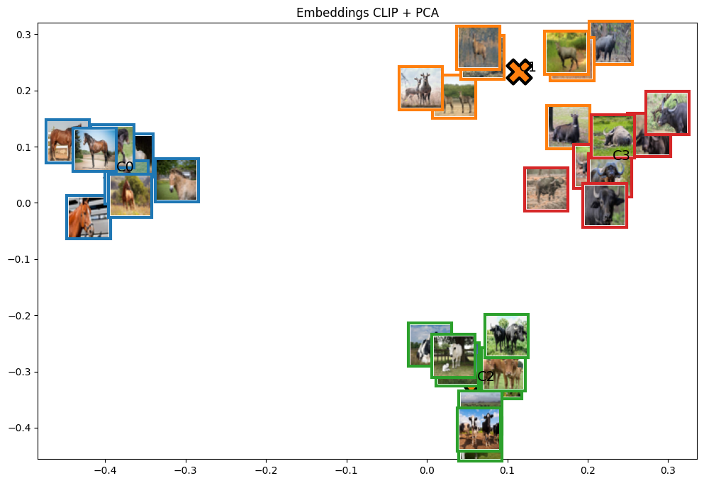
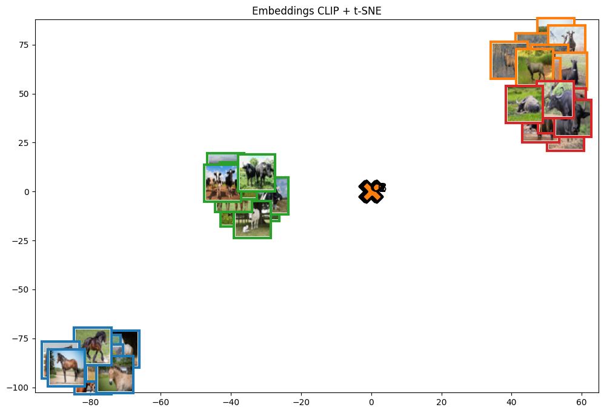
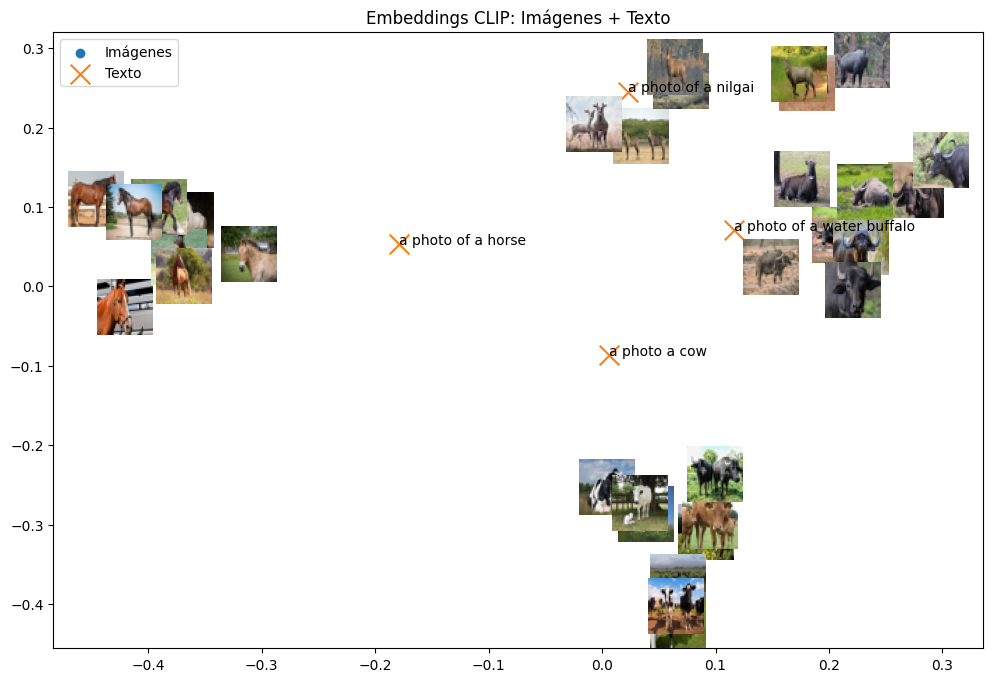

# Taller Convoluciones Personalizadas

## Nombre del estudiante

* Brayan Alejandro Muñoz Pérez bmunozp@unal.edu.co
* Álvaro Andrés Romero Castro alromeroca@unal.edu.co
* Juan Camilo Lopez Bustos juclopezbu@unal.edu.co
* Alejandro Ortiz Cortes alortizco@unal.edu.co

## Fecha de entrega
1 de junio de 2026

---

# Descripción breve

El objetivo de este taller fue de usar el modelo `CLIP` para agrupar imagenes y prompts en un mismo espacio. 

---

# Implementaciones

## Implementación en Python

## Funcionalidades desarrolladas

### 1. Uso de CLIP para agrupar imagenes

Se cargo el modelo `CLIP` y se usó para agrupar en un espacio las imagenes de test.

```python
image_features = []

with torch.no_grad():
    for img in images:
        features = model.encode_image(img)

        # Normalización
        features /= features.norm(dim=-1, keepdim=True)

        image_features.append(features.cpu().numpy())

X = np.vstack(image_features)

print("Shape embeddings:", X.shape)
```

---

### 2. Uso de CLIP para agrupar prompts 

Se realizo el mismo proceso con prompts sobre las imagenes usadas en test.

```python
text_prompts = [
    "a photo a cow",
    "a photo of a horse",
    "a photo of a water buffalo",
    "a photo of a nilgai"
]

# Tokenización
text_tokens = clip.tokenize(text_prompts).to(device)

# Embeddings de texto
with torch.no_grad():

    text_features = model.encode_text(text_tokens)

    # Normalización
    text_features /= text_features.norm(dim=-1, keepdim=True)

text_features = text_features.cpu().numpy()
```

---

# Resultados visuales

## Capturas de la implementación

### Imagenes proyectadas a 2D con PCA



---

### Imagenes proyectadas a 2D con t-SNE



---

### Prompts e imagenes proyectadas a 2D con PCA



---

# Código relevante

## Carga del modelo

```python
device = "cuda" if torch.cuda.is_available() else "cpu"
model, preprocess = clip.load("ViT-B/32", device=device)
```

---

## Carga de imágenes y preprocesado

```python
base_folder = os.path.abspath("../test")
folders = ["cow", "horse", "Nilgai", "water buffelo"]

valid_extensions = (".jpg", ".jpeg", ".png", ".bmp")

# Rutas completas
image_paths = [
    os.path.join(base_folder, sub_folder, file)
    for sub_folder in folders
    for file in os.listdir(os.path.join(base_folder, sub_folder))
    if file.lower().endswith(valid_extensions)
]

images = []

for path in image_paths:
    try:
        image = preprocess(Image.open(path).convert("RGB")).unsqueeze(0).to(device)
        images.append(image)
    except Exception as e:
        print(f"Error cargando {path}: {e}")
```

## Agrupación por CLIP

```python
image_features = []

with torch.no_grad():
    for img in images:
        features = model.encode_image(img)

        # Normalización
        features /= features.norm(dim=-1, keepdim=True)

        image_features.append(features.cpu().numpy())

X = np.vstack(image_features)

print("Shape embeddings:", X.shape)
```

## Reducción de dimensiones a 2D

```python
pca = PCA(n_components=2)
X_pca = pca.fit_transform(X)

tsne = TSNE(
    n_components=2,
    perplexity=5,
    random_state=42
)

X_tsne = tsne.fit_transform(X)

n_clusters = len(folders)

kmeans = KMeans(
    n_clusters=n_clusters,
    random_state=42,
    n_init=10
)

clusters = kmeans.fit_predict(X)
centroids = kmeans.cluster_centers_
centroids_2d = pca.transform(centroids)
```

## Visualización de clusters

```python
def plot_with_images(points, image_paths, title, clusters, centroids_2d):

    fig, ax = plt.subplots(figsize=(12, 8))

    ax.scatter(
        points[:, 0],
        points[:, 1]
    )

    # Agregar miniaturas
    for i, path in enumerate(image_paths):

        img = Image.open(path).convert("RGB")
        img = img.resize((40, 40))

        imagebox = OffsetImage(img, zoom=1)

        ab = AnnotationBbox(
            imagebox,
            (points[i, 0], points[i, 1]),
            frameon=True,
            pad=0.2,
            bboxprops=dict(
                edgecolor=plt.cm.tab10(clusters[i]),
                linewidth=3
            )
        )

        ax.add_artist(ab)
        
    ax.scatter(
        centroids_2d[:, 0],
        centroids_2d[:, 1],
        marker='X',
        s=600,
        linewidths=3,
        edgecolors='black',
        label='Centroides'
    )

    # Etiquetas centroides
    for i, c in enumerate(centroids_2d):

        ax.text(
            c[0],
            c[1],
            f"C{i}",
            fontsize=14
        )

    ax.set_title(title)
    plt.show()

plot_with_images(
    X_pca,
    image_paths,
    "Embeddings CLIP + PCA",
    clusters,
    centroids_2d
)

plot_with_images(
    X_tsne,
    image_paths,
    "Embeddings CLIP + t-SNE",
    clusters,
    centroids_2d
)
```

## Prompts proyectadas

```python
text_prompts = [
    "a photo a cow",
    "a photo of a horse",
    "a photo of a water buffalo",
    "a photo of a nilgai"
]

# Tokenización
text_tokens = clip.tokenize(text_prompts).to(device)

# Embeddings de texto
with torch.no_grad():

    text_features = model.encode_text(text_tokens)

    # Normalización
    text_features /= text_features.norm(dim=-1, keepdim=True)

text_features = text_features.cpu().numpy()

# Proyectar texto usando el mismo pca
text_points = pca.transform(text_features)

fig, ax = plt.subplots(figsize=(12, 8))

# Imágenes
ax.scatter(
    X_pca[:, 0],
    X_pca[:, 1],
    label="Imágenes"
)

# Miniaturas
for i, path in enumerate(image_paths):

    img = Image.open(path).convert("RGB")
    img = img.resize((40, 40))

    imagebox = OffsetImage(img, zoom=1)

    ab = AnnotationBbox(
        imagebox,
        (X_pca[i, 0], X_pca[i, 1]),
        frameon=False
    )

    ax.add_artist(ab)

# Textos
ax.scatter(
    text_points[:, 0],
    text_points[:, 1],
    marker='x',
    s=200,
    label="Texto"
)

for i, txt in enumerate(text_prompts):

    ax.text(
        text_points[i, 0],
        text_points[i, 1],
        txt,
        fontsize=10
    )

ax.set_title("Embeddings CLIP: Imágenes + Texto")
ax.legend()

plt.show()
```

---

# Prompts utilizados

Principalmente se usó para encontrar información sobre los modelos y su uso especiífico.

---

# Aprendizajes y dificultades

## Aprendizajes

Se aprendió sobre la agrupacion por medio de `CLIP`.

## Dificultades

Fue particularmente difícil el paso a 2D y colocar todo en las gráficas de forma que todo quedara visualizado de una forma fácil de entender.