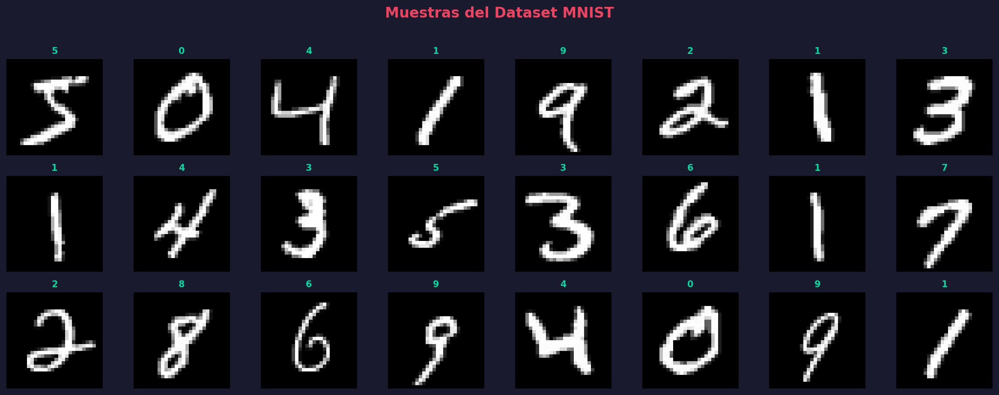
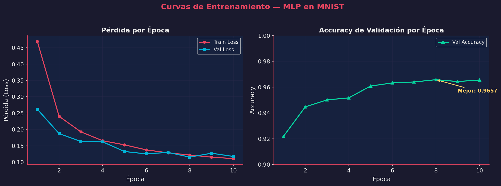
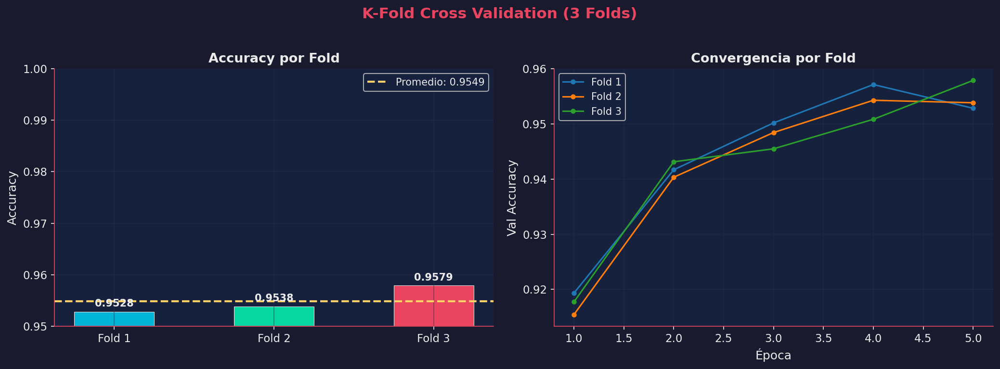
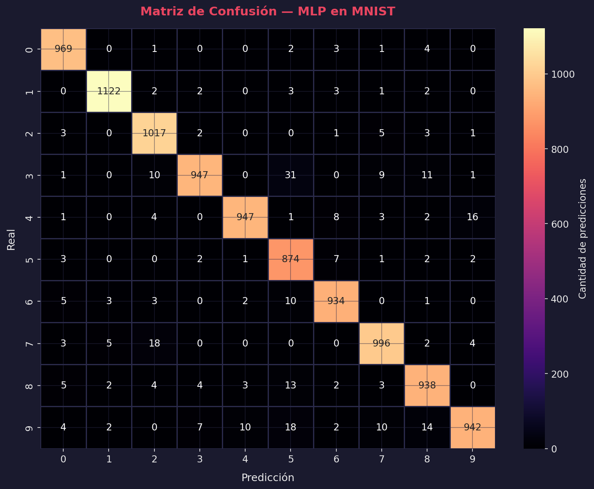
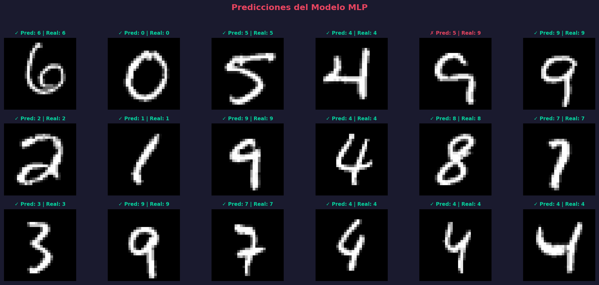
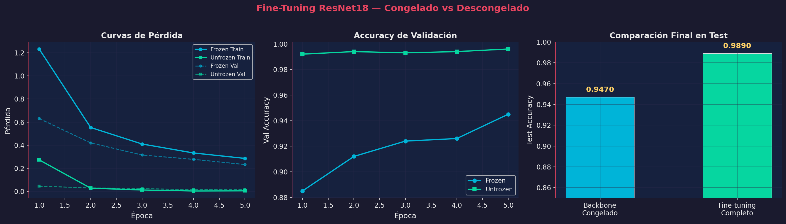

# Taller Entrenamiento Modelo Deep Learning Completo

## Nombre del estudiante

* Brayan Alejandro Muñoz Pérez bmunozp@unal.edu.co
* Álvaro Andrés Romero Castro alromeroca@unal.edu.co
* Juan Camilo Lopez Bustos juclopezbu@unal.edu.co
* Alejandro Ortiz Cortes alortizco@unal.edu.co

---

## Fecha de entrega

01 de junio de 2026

---

# Descripción breve

En este taller se implementó el flujo completo de entrenamiento de un modelo de **Deep Learning** utilizando PyTorch, desde la preparación de los datos hasta la evaluación, validación cruzada, fine-tuning con un modelo preentrenado (ResNet18), y exportación del modelo final.

El objetivo fue comprender cada etapa del pipeline de entrenamiento y cómo las decisiones en cada paso (arquitectura, hiperparámetros, técnica de validación, fine-tuning) impactan el rendimiento del modelo.

Durante el desarrollo se implementó:

* Carga y visualización del dataset MNIST
* Preparación de DataLoaders con split train/val/test (80/20)
* Definición y entrenamiento de un MLP (Multi-Layer Perceptron)
* Validación cruzada K-Fold (3 folds)
* Evaluación con métricas (classification report) y matriz de confusión
* Fine-tuning de ResNet18 preentrenado (backbone congelado vs descongelado)
* Guardado y carga del modelo entrenado

---

# Implementaciones

## Implementación en Python (PyTorch)

Se desarrolló el script `python/main.py` utilizando:

* **PyTorch** para definición, entrenamiento y evaluación del modelo
* **torchvision** para datasets (MNIST) y modelos preentrenados (ResNet18)
* **scikit-learn** para métricas y K-Fold Cross Validation
* **matplotlib + seaborn** para visualización con tema oscuro premium
* **NumPy** para operaciones numéricas

### Arquitectura del MLP

```
Flatten → Linear(784, 128) → ReLU → Dropout(0.2) →
Linear(128, 64) → ReLU → Linear(64, 10)
```

Características:
* **Input**: Imágenes 28×28 en escala de grises (aplanadas a 784)
* **Regularización**: Dropout(0.2) entre capas ocultas
* **Optimización**: Adam con lr=0.001
* **Pérdida**: CrossEntropyLoss
* **Parámetros totales**: 109,386

### Actividades implementadas

| # | Actividad | Descripción |
|---|-----------|-------------|
| 1 | Carga del dataset | MNIST: 60,000 train + 10,000 test |
| 2 | DataLoaders | Split 80/20, batch_size=64 |
| 3 | Modelo MLP | 784→128→64→10 con Dropout |
| 4-5 | Entrenamiento | 10 épocas con validación por época |
| 6a | K-Fold CV | 3 folds, 5 épocas cada uno |
| 6b | Evaluación | Confusion matrix + classification report |
| 7 | Fine-tuning | ResNet18 frozen vs unfrozen |
| 8 | Exportación | Guardar/cargar modelo (.pth) |

### Resumen de resultados

| Modelo | Test Accuracy |
|--------|--------------|
| MLP (desde cero) | **96.86%** |
| K-Fold promedio | 95.49% ± 0.22% |
| ResNet18 (frozen) | 94.70% |
| ResNet18 (unfrozen) | **98.90%** |

---

# Resultados visuales

## Muestras del dataset MNIST



## Curvas de entrenamiento del MLP

Se observa cómo tanto la pérdida de entrenamiento como la de validación disminuyen consistentemente, indicando un buen ajuste del modelo sin overfitting significativo:



## K-Fold Cross Validation (3 folds)

La validación cruzada muestra consistencia entre los folds, con un accuracy promedio de 95.49% ± 0.22%, confirmando la robustez del modelo:



## Matriz de confusión

La diagonal dominante confirma clasificación precisa. Los errores más comunes son entre dígitos visualmente similares (3↔5, 4↔9, 7↔2):



## Predicciones del modelo

Visualización de predicciones individuales con marcadores de correcto (✓) e incorrecto (✗):



## Fine-Tuning: Congelado vs Descongelado

Comparación directa entre ResNet18 con backbone congelado (solo capa final entrenable, 5,130 params) vs backbone descongelado (fine-tuning completo, 11.1M params):



**Observaciones clave:**
* **Frozen (94.70%)**: Con solo 5,130 parámetros entrenables, el modelo alcanza buen rendimiento usando las features ya aprendidas de ImageNet
* **Unfrozen (98.90%)**: El fine-tuning completo supera significativamente (+4.2%) al adaptar todas las capas al dominio MNIST
* El fine-tuning completo converge mucho más rápido (99.2% val accuracy en la primera época)

---

# Código relevante

## Definición del MLP

```python
class MLP(nn.Module):
    def __init__(self, input_size=28*28, hidden1=128, hidden2=64, num_classes=10):
        super(MLP, self).__init__()
        self.network = nn.Sequential(
            nn.Flatten(),
            nn.Linear(input_size, hidden1),
            nn.ReLU(),
            nn.Dropout(0.2),
            nn.Linear(hidden1, hidden2),
            nn.ReLU(),
            nn.Linear(hidden2, num_classes),
        )

    def forward(self, x):
        return self.network(x)
```

## Loop de entrenamiento con validación

```python
for epoch in range(epochs):
    model.train()
    for images, labels in train_loader:
        images, labels = images.to(device), labels.to(device)
        optimizer.zero_grad()
        output = model(images)
        loss = criterion(output, labels)
        loss.backward()
        optimizer.step()

    # Validación
    model.eval()
    with torch.no_grad():
        for images, labels in val_loader:
            output = model(images)
            _, predicted = torch.max(output, 1)
            correct += (predicted == labels).sum().item()
```

## Fine-tuning con ResNet18

```python
# Crear modelo preentrenado
model_ft = models.resnet18(weights=models.ResNet18_Weights.DEFAULT)

# Congelar backbone
for param in model_ft.parameters():
    param.requires_grad = False

# Reemplazar capa final
num_ftrs = model_ft.fc.in_features
model_ft.fc = nn.Linear(num_ftrs, 10)

# Para fine-tuning completo: descongelar todo
for param in model_ft.parameters():
    param.requires_grad = True
optimizer = optim.Adam(model_ft.parameters(), lr=1e-4)  # lr más bajo
```

## Guardado del modelo

```python
torch.save(model.state_dict(), "modelo_final.pth")

# Cargar después
model.load_state_dict(torch.load("modelo_final.pth"))
model.eval()
```

El código completo se encuentra en [`python/main.py`](python/main.py).

---

# Prompts utilizados

Durante el desarrollo se utilizaron herramientas de IA generativa para:

* Generar la estructura completa del pipeline de entrenamiento
* Diseñar las visualizaciones con tema oscuro premium
* Implementar la comparación de fine-tuning (frozen vs unfrozen)
* Optimizar el flujo de K-Fold Cross Validation
* Resolver la adaptación de MNIST (1ch, 28×28) a ResNet18 (3ch, 224×224)

Ejemplos de prompts utilizados:

* "Implementar pipeline completo de entrenamiento de Deep Learning con MNIST en PyTorch"
* "Comparar ResNet18 con backbone congelado vs fine-tuning completo"
* "Implementar K-Fold Cross Validation con PyTorch y scikit-learn"
* "Generar matriz de confusión con seaborn y tema oscuro"
* "Adaptar MNIST grayscale a ResNet18 que espera RGB 224x224"

---

# Aprendizajes y dificultades

## Aprendizajes

### ¿Cómo impacta el fine-tuning?

El fine-tuning tiene un impacto **significativo** en el rendimiento:

* **Sin fine-tuning (frozen backbone)**: El modelo usa directamente las features de ImageNet (entrenado en fotos naturales) para clasificar dígitos manuscritos. Con solo 5,130 parámetros entrenables en la capa final, alcanza 94.70% — impresionante considerando que las features fueron aprendidas para un dominio completamente diferente.

* **Con fine-tuning completo**: Al permitir que todas las 11.1M de capas se adapten al dominio MNIST, el modelo alcanza 98.90% — una mejora de +4.2 puntos porcentuales. Además, converge mucho más rápido.

**Conclusión**: El fine-tuning es más útil cuando el dominio objetivo difiere del dominio de preentrenamiento. Para MNIST vs ImageNet, las features de bajo nivel (bordes, texturas) son transferibles, pero las de alto nivel necesitan adaptación.

### ¿Qué técnica de validación resultó más útil?

* **Hold-out (80/20)**: Simple y rápido, útil para monitoreo en tiempo real durante el entrenamiento. Permite detectar overfitting inmediatamente.

* **K-Fold Cross Validation**: Más robusto para estimar el rendimiento real del modelo. La baja desviación estándar (±0.22%) confirma que el modelo es estable y no depende del split particular de datos.

Para este taller, **Hold-out** fue más práctico durante el desarrollo iterativo, mientras que **K-Fold** fue más útil para la evaluación final y reportar resultados confiables.

## Otros aprendizajes

* El **Dropout** (0.2) previene overfitting: las curvas de train/val loss no divergen significativamente
* **Adam** con lr=0.001 converge rápidamente para el MLP (plateau después de ~6 épocas)
* Para fine-tuning, usar un **learning rate más bajo** (1e-4 vs 1e-3) es crucial para no destruir las features preentrenadas
* La **matriz de confusión** revela patrones específicos de error (3↔5, 4↔9) que podrían guiar mejoras futuras

## Dificultades

* **Adaptación de MNIST a ResNet18**: MNIST es grayscale (1 canal) de 28×28, pero ResNet espera RGB (3 canales) de 224×224. Fue necesario aplicar `Grayscale(num_output_channels=3)` y `Resize(224)`.
* **Tiempo de ejecución en CPU**: El fine-tuning de ResNet18 con imágenes de 224×224 es costoso en CPU (~8 min total). Se usó un subconjunto de 5,000 muestras para mantener el tiempo razonable.
* **Consumo de memoria**: Los DataLoaders de ResNet con imágenes grandes requieren batch_size más pequeño (32 vs 64).
* **K-Fold con PyTorch**: A diferencia de scikit-learn donde es directo, con PyTorch fue necesario crear modelos frescos para cada fold y manejar manualmente los Subsets.

---
