# Taller Stable Diffusion Diffusers Colab

## Nombre del estudiante

* Brayan Alejandro Muñoz Pérez bmunozp@unal.edu.co
* Álvaro Andrés Romero Castro alromeroca@unal.edu.co
* Juan Camilo Lopez Bustos juclopezbu@unal.edu.co
* Alejandro Ortiz Cortes alortizco@unal.edu.co

## Fecha de entrega

01 de junio de 2026

---

# Descripción breve

El objetivo de este taller fue comprender el funcionamiento básico de los modelos de difusión generativa utilizando Stable Diffusion con la librería `diffusers` de Hugging Face en Python.

Durante el desarrollo se implementó la generación de imágenes mediante prompts textuales, explorando diferentes estilos visuales, configuraciones de generación, prompts negativos y técnicas de prompt engineering.

Además, se realizaron pruebas variando parámetros como el número de pasos de inferencia, guidance scale, resolución y semillas aleatorias para analizar cómo afectan la calidad y creatividad de las imágenes generadas.

---

# Implementaciones

# 1. Carga del modelo Stable Diffusion

Se utilizó el modelo preentrenado `runwayml/stable-diffusion-v1-5` mediante la librería `diffusers`.

## Código utilizado

```python
from diffusers import StableDiffusionPipeline
import torch

pipe = StableDiffusionPipeline.from_pretrained(
    "runwayml/stable-diffusion-v1-5",
    torch_dtype=torch.float16
).to("cuda")
```

---

# 2. Generación de imágenes desde prompts

Se generaron imágenes utilizando diferentes descripciones textuales para explorar el comportamiento del modelo.

## Código utilizado

```python
prompt = "A surreal futuristic city in the clouds, digital art"

image = pipe(
    prompt,
    num_inference_steps=50,
    guidance_scale=7.5
).images[0]

image.save("output.png")
```

## Prompts utilizados

* "A surreal futuristic city in the clouds, digital art"
* "Cyberpunk samurai in Tokyo at night, neon lights"
* "A medieval castle in the mountains, oil painting style"
* "Photorealistic astronaut riding a horse on Mars"

## Resultados visuales

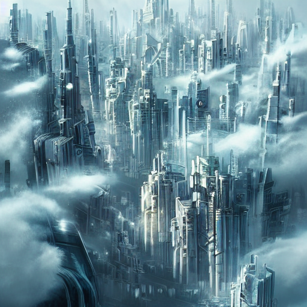

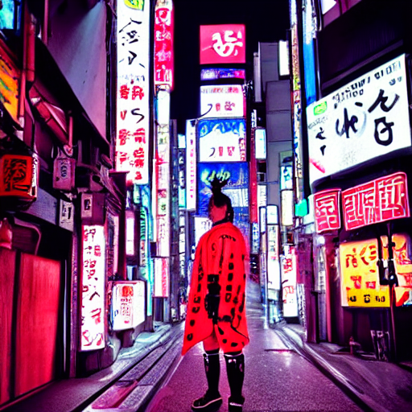

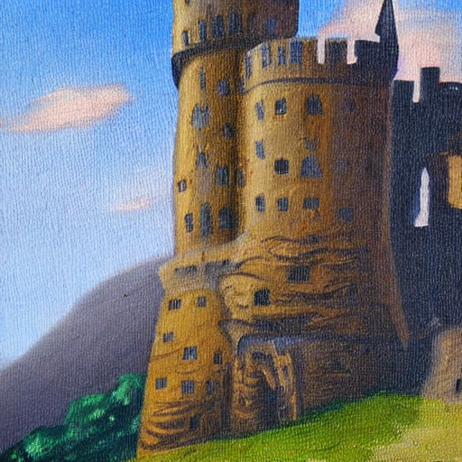

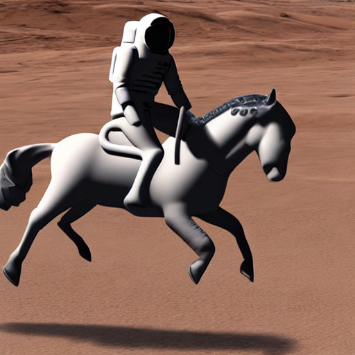

---

# 3. Exploración de parámetros

Se probaron diferentes configuraciones para observar cambios en calidad, creatividad y fidelidad al prompt.

## Parámetros explorados

* `num_inference_steps`
* `guidance_scale`
* `height`
* `width`
* `seed`

## Código utilizado

```python
generator = torch.Generator("cuda").manual_seed(42)

image = pipe(
    prompt,
    generator=generator,
    num_inference_steps=60,
    guidance_scale=9
).images[0]
```

---

# 4. Uso de prompts negativos

Se utilizaron prompts negativos para reducir errores visuales y mejorar la calidad de las imágenes.

## Código utilizado

```python
negative_prompt = "blurry, distorted, low quality"

image = pipe(
    prompt,
    negative_prompt=negative_prompt,
    num_inference_steps=50,
    guidance_scale=8
).images[0]
```

## Resultados visuales

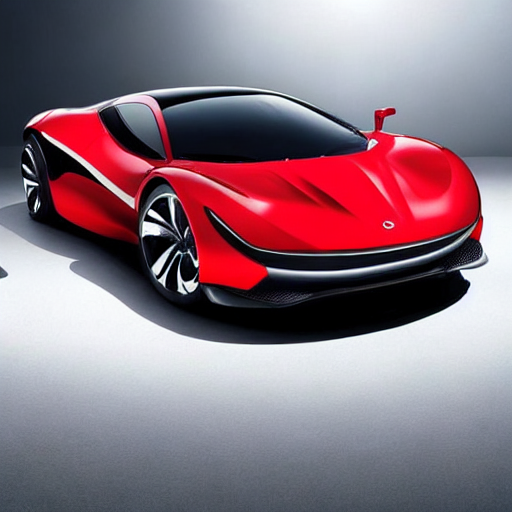

---

# 5. Generación de variantes

Se generaron múltiples variantes de una misma escena utilizando diferentes semillas aleatorias.

## Código utilizado

```python
for i in range(3):

    generator = torch.Generator("cuda").manual_seed(i)

    image = pipe(
        "A dragon flying over a fantasy city",
        generator=generator
    ).images[0]

    image.save(f"dragon_variant_{i}.png")
```

## Resultados visuales

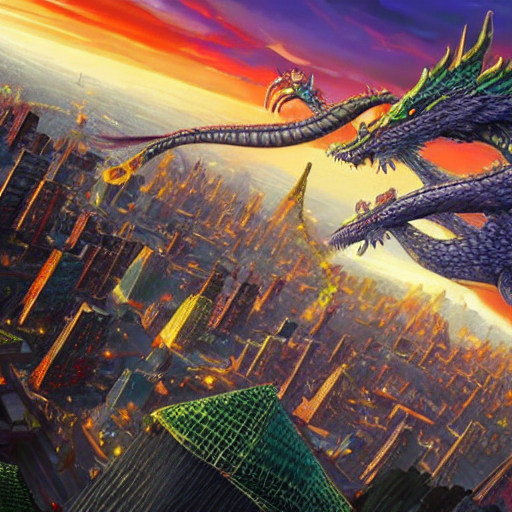

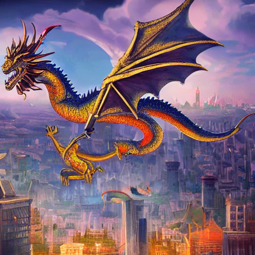

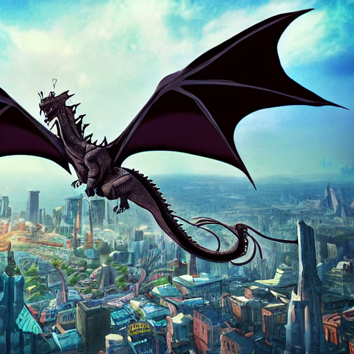

---

# 6. Generación por lotes

Se implementó la generación de varias imágenes simultáneamente usando el mismo prompt.

## Código utilizado

```python
images = pipe(
    ["A futuristic city at sunset"] * 4,
    num_inference_steps=40
).images
```

## Resultados visuales

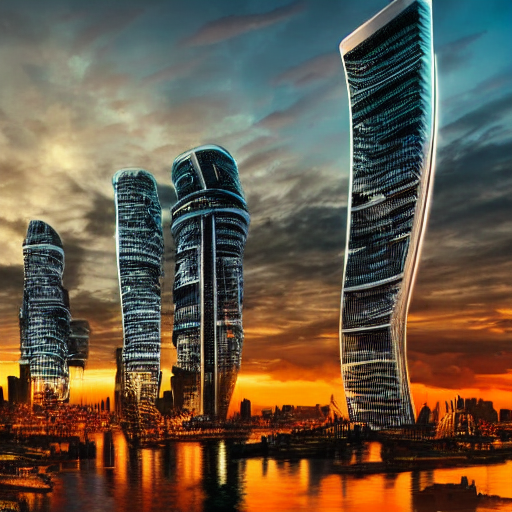

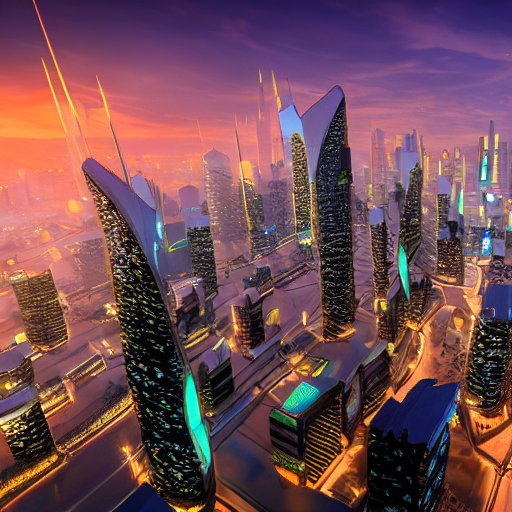

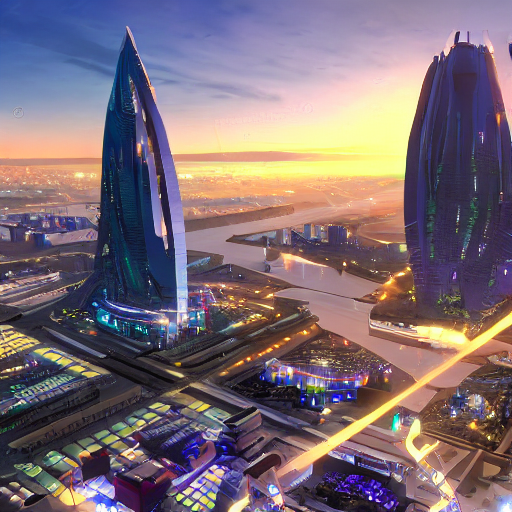

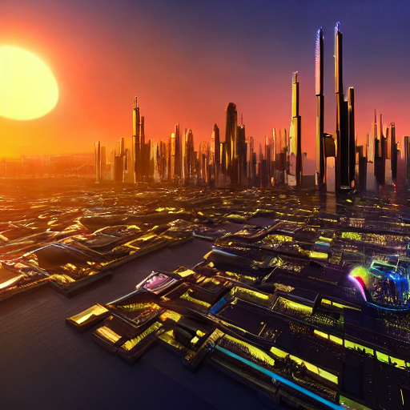

---

# 7. Galería de resultados con Matplotlib

Se construyó una galería para visualizar múltiples imágenes generadas en una sola figura.

## Código utilizado

```python
fig, axes = plt.subplots(2, 2, figsize=(10, 10))

for ax, img in zip(axes.flatten(), images):

    ax.imshow(img)
    ax.axis("off")

plt.show()
```

## Resultados visuales

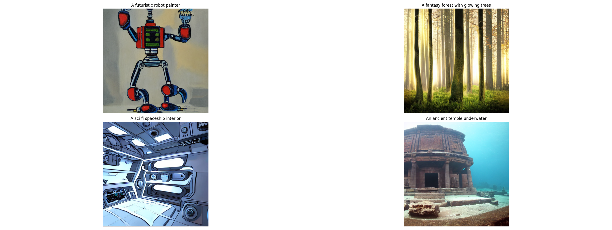

Comparación de prompt engineering:

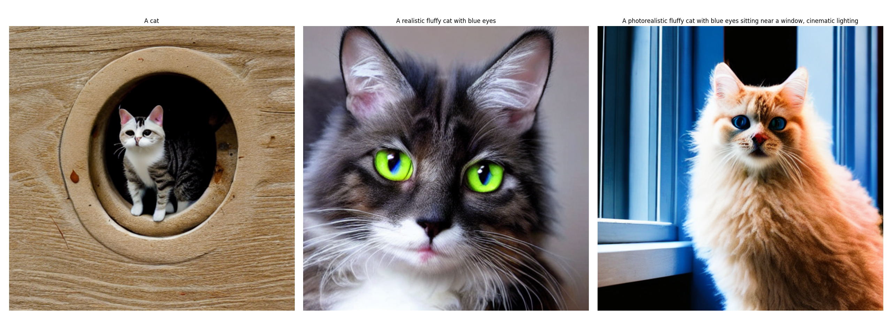

---

# Código relevante

## Función principal de generación

```python
def generar_imagen(
    prompt,
    nombre_archivo,
    negative_prompt=None,
    steps=50,
    guidance=7.5,
    width=512,
    height=512,
    seed=None
):

    generator = None

    if seed is not None:
        generator = torch.Generator(device).manual_seed(seed)

    image = pipe(
        prompt=prompt,
        negative_prompt=negative_prompt,
        num_inference_steps=steps,
        guidance_scale=guidance,
        width=width,
        height=height,
        generator=generator
    ).images[0]

    image.save(nombre_archivo)

    return image
```

---

# Prompts utilizados

## Estilo futurista

* "A surreal futuristic city in the clouds, digital art"
* "A futuristic city at sunset"

## Estilo cyberpunk

* "Cyberpunk samurai in Tokyo at night, neon lights"

## Estilo artístico

* "A medieval castle in the mountains, oil painting style"

## Estilo realista

* "Photorealistic astronaut riding a horse on Mars"

## Fantasía

* "A dragon flying over a fantasy city"

---

# Aprendizajes y dificultades

Durante el desarrollo del taller se logró comprender cómo funcionan los modelos de difusión generativa y cómo Stable Diffusion interpreta prompts textuales para generar imágenes.

También se aprendió la importancia del prompt engineering y cómo pequeños cambios en las descripciones producen resultados visuales completamente diferentes.

Una de las principales dificultades fue el alto consumo de memoria GPU y el tiempo de generación de imágenes con configuraciones altas de resolución y pasos de inferencia.

Además, fue necesario experimentar varias veces con prompts negativos y parámetros para obtener resultados visuales más coherentes y detallados.

Finalmente, el taller permitió entender mejor el potencial de la inteligencia artificial generativa en áreas como arte digital, videojuegos, diseño y automatización creativa.