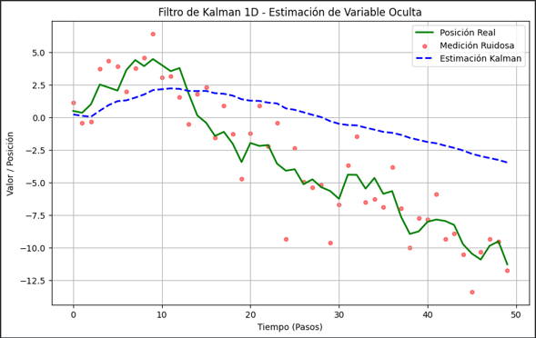

# Taller Filtro Kalman Inferencia Variables Ocultas

## Nombre del estudiante

* Brayan Alejandro Muñoz Pérez bmunozp@unal.edu.co
* Álvaro Andrés Romero Castro alromeroca@unal.edu.co
* Juan Camilo Lopez Bustos juclopezbu@unal.edu.co
* Alejandro Ortiz Cortes alortizco@unal.edu.co

## Fecha de entrega
08 de junio de 2026

## Descripción breve

El objetivo de este taller es implementar el filtro de Kalman en 1D para inferir el estado de una variable oculta (la posición real de un objeto) a partir de mediciones ruidosas. A través de este ejercicio, se busca comprender cómo el algoritmo combina un modelo predictivo con observaciones en tiempo real para minimizar el error y extraer la señal subyacente de los datos con ruido.

Se desarrolló exitosamente un script en Python que simula una caminata aleatoria, añade ruido gaussiano para emular sensores imperfectos, y aplica el ciclo de predicción-corrección de Kalman para estimar la trayectoria real, validando los resultados mediante el cálculo del Error Cuadrático Medio (MSE).

---

## Implementaciones

### Python

Se implementó un script haciendo uso de `numpy` para la simulación numérica (generación de la caminata aleatoria y el ruido de medición), `scikit-learn` para el cálculo del MSE y `matplotlib` para la visualización. 

El sistema inicializa los parámetros de ruido del proceso ($Q$) y de la medición ($R$). Luego, itera secuencialmente sobre el arreglo de observaciones ruidosas. En cada paso temporal, predice la posición actual y corrige esta predicción usando la "Ganancia de Kalman", logrando así una estimación final (variable oculta) mucho más cercana a la posición real.

---

## Resultados visuales

### Python - Implementación



*El gráfico muestra tres señales: la línea verde representa la posición real simulada, los puntos rojos ilustran las mediciones con ruido gaussiano, y la línea azul punteada es la estimación generada por el filtro de Kalman. Se observa claramente cómo el filtro suaviza el ruido y sigue fielmente la tendencia de la señal real.*

---

## Código relevante

A continuación, se presenta el núcleo del algoritmo, correspondiente al ciclo recursivo del Filtro de Kalman desarrollado en Python:

```python
# Inicialización de variables
estimate = []
P = 1.0       # Covarianza inicial del error
x_hat = 0.0   # Estimación inicial del estado
Q = 0.001     # Varianza del ruido del proceso (modelo)
R = 4.0       # Varianza del ruido de la medición

# Ciclo principal del Filtro de Kalman
for z in observed:
    # --- Etapa de Predicción ---
    x_hat_prior = x_hat
    P_prior = P + Q

    # --- Etapa de Corrección ---
    K = P_prior / (P_prior + R) # Cálculo de la Ganancia de Kalman
    x_hat = x_hat_prior + K * (z - x_hat_prior)
    P = (1 - K) * P_prior

    estimate.append(x_hat)
```

## Fundamento Matemático

El algoritmo funciona evaluando dos etapas matemáticas en cada paso:

**1. Predicción:**
* Estado predicho: $\hat{x}_{k}^{-}=\hat{x}_{k-1}$
* Covarianza predicha: $P_{k}^{-}=P_{k-1}+Q$

**2. Corrección:**
* Ganancia de Kalman: $K_k=\frac{P_{k}^{-}}{P_{k}^{-}+R}$
* Estimación actualizada: $\hat{x}_k=\hat{x}_{k}^{-}+K_k(z_k-\hat{x}_{k}^{-})$
* Covarianza actualizada: $P_k=(1-K_k)P_{k}^{-}$

**Análisis del Error:** Al evaluar mediante MSE, se comprueba que el error entre la estimación de Kalman y la señal real es significativamente menor que el error de la señal observada, confirmando la utilidad del filtro.

---

## Prompts utilizados
- Investigación teórica: "Explícame de manera intuitiva cómo funciona el filtro de Kalman en 1D para estimar una variable oculta y cuáles son las ecuaciones matemáticas exactas para la etapa de predicción y la etapa de corrección."

- Implementación en código: "Tengo un arreglo en Python llamado observed que contiene mediciones de posición con ruido gaussiano. ¿Cómo implemento un ciclo for iterativo usando numpy para aplicar la ganancia de Kalman y estimar la trayectoria real?"

- Sintonización de parámetros: "En mi implementación del filtro de Kalman, la señal estimada tiene mucho retraso (lag) en comparación con la señal real. ¿Cómo debo ajustar los hiperparámetros Q (varianza del ruido del proceso) y R (varianza del ruido de la medición) para solucionar esto?"

## Referencias
Welch, G., & Bishop, G. (1995). An Introduction to the Kalman Filter. University of North Carolina at Chapel Hill. (Documento clásico para entender el fundamento matemático base).

Documentación oficial de NumPy: https://numpy.org/doc/ - Consultada para la generación de la caminata aleatoria (np.cumsum) y el ruido gaussiano (np.random.normal).

Documentación oficial de Scikit-Learn: https://scikit-learn.org/ - Consultada para la implementación de la métrica de evaluación mean_squared_error.

Tutoriales de Filtros de Kalman en Python (FilterPy): https://github.com/rlabbe/Kalman-and-Bayesian-Filters-in-Python - Referencia de apoyo para la comprensión de las matrices de covarianza en sistemas dinámicos.