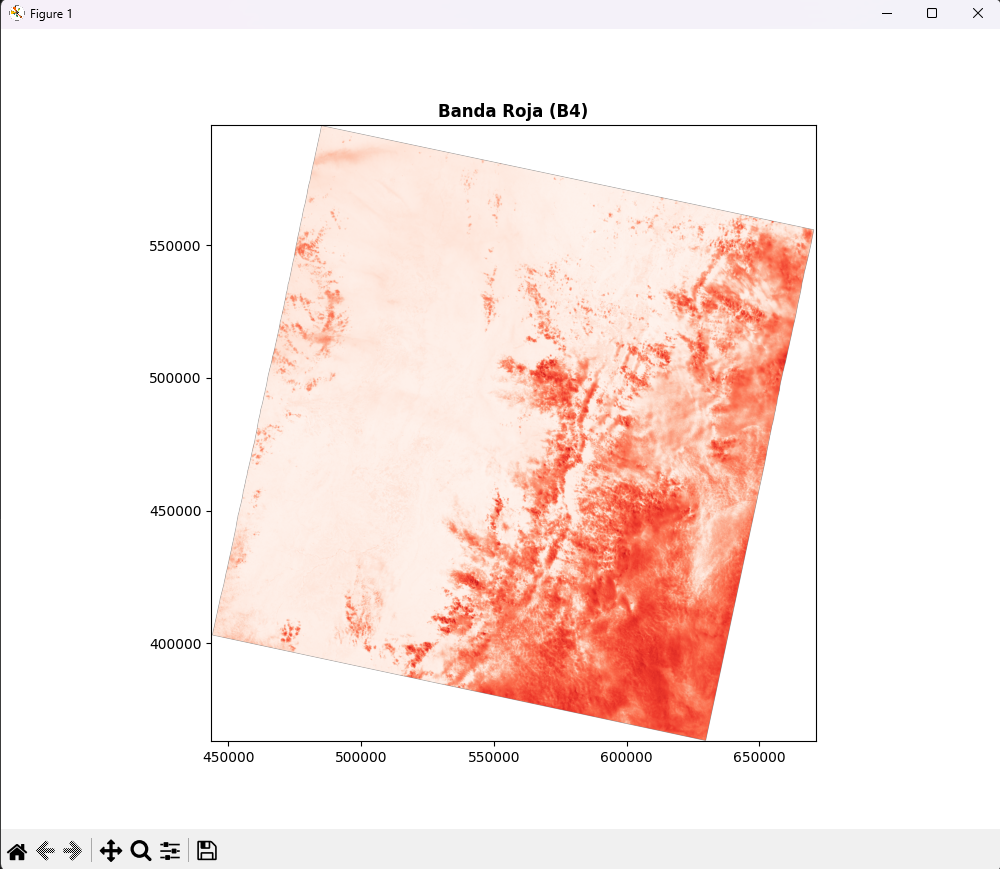
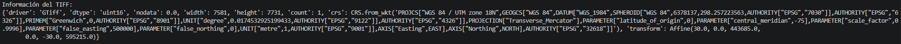
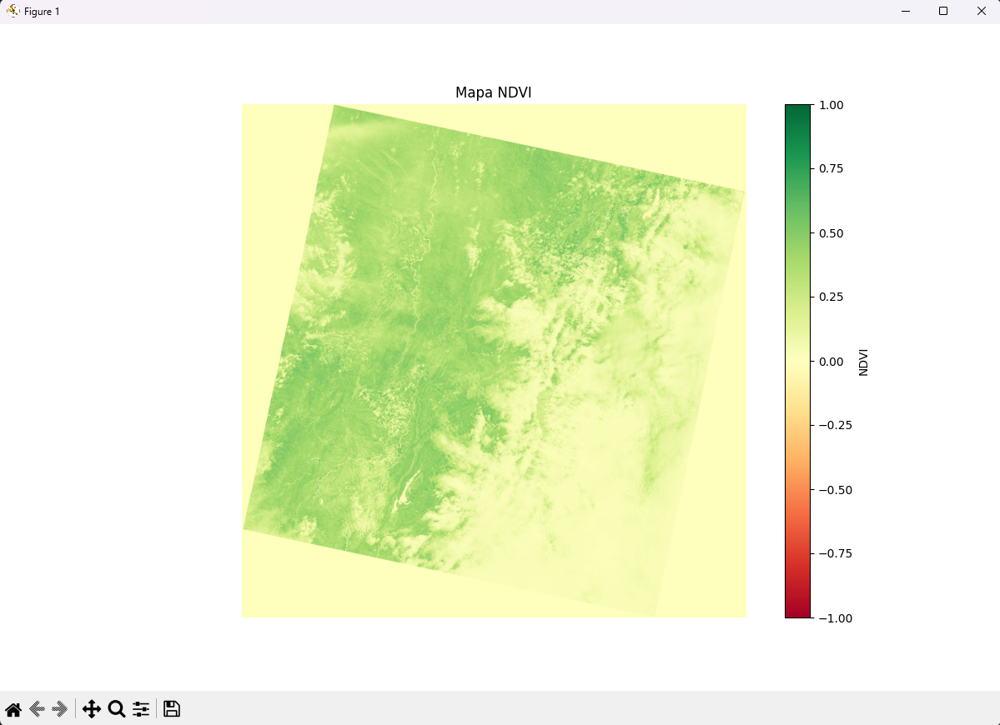
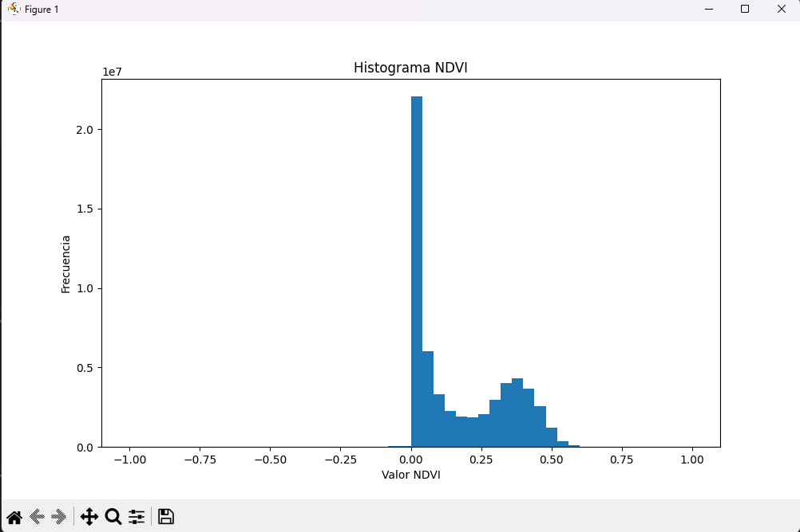
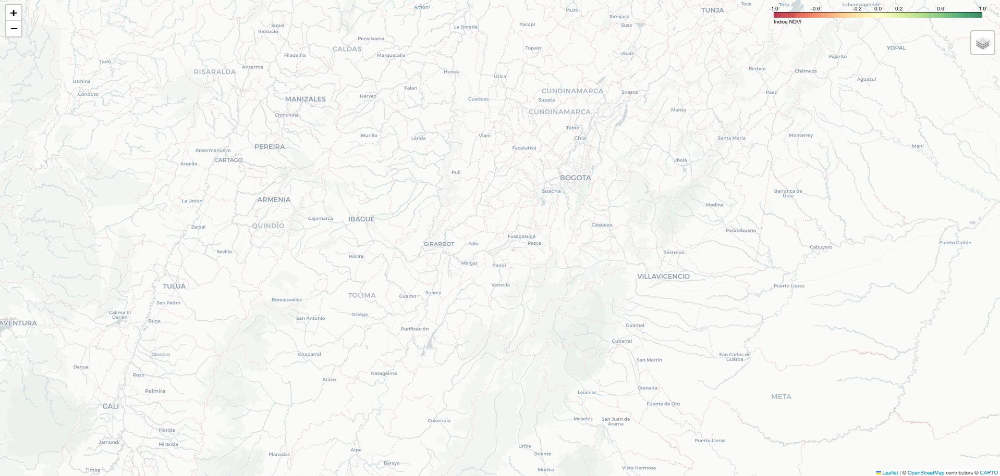
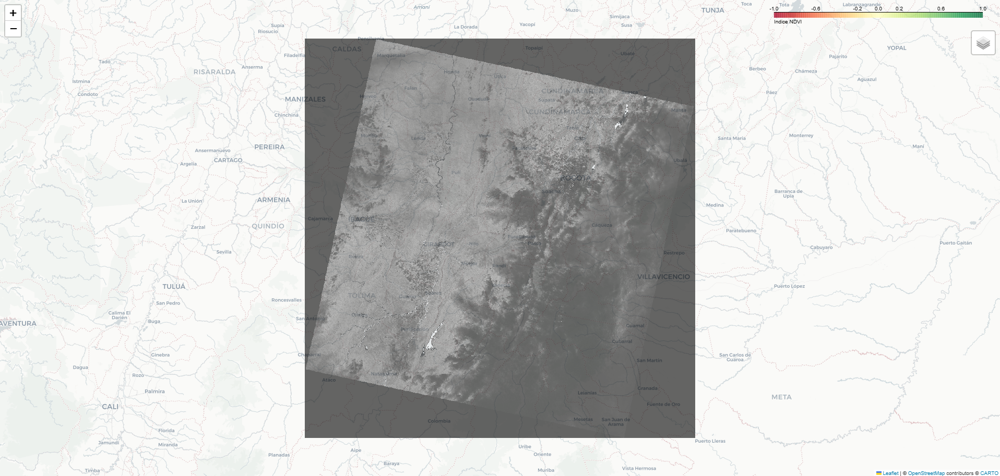
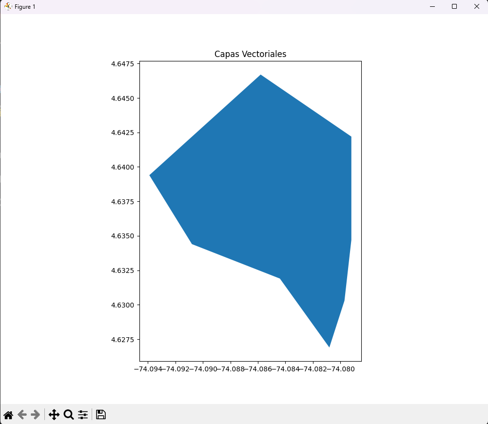
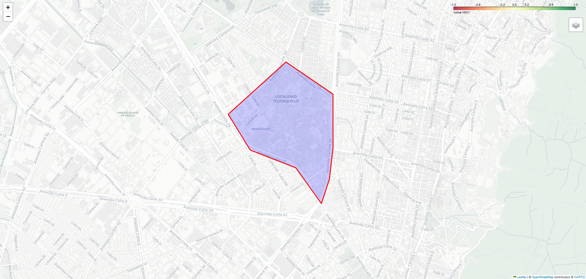

# Taller Mapas Interactivos Datos Satelitales

## Nombre del estudiante

* Brayan Alejandro Muñoz Pérez bmunozp@unal.edu.co
* Álvaro Andrés Romero Castro alromeroca@unal.edu.co
* Juan Camilo Lopez Bustos juclopezbu@unal.edu.co
* Alejandro Ortiz Cortes alortizco@unal.edu.co

---

## Fecha de entrega

8 de junio de 2026

---

# Descripción breve

El objetivo de este taller fue desarrollar una aplicación en Python capaz de visualizar datos geoespaciales abiertos mediante mapas interactivos. Se trabajó con imágenes satelitales en formato GeoTIFF utilizando las librerías Rasterio, Folium y GeoPandas.

Durante el desarrollo se implementó la lectura de bandas satelitales, el cálculo del índice NDVI para detección de vegetación, la visualización de overlays sobre mapas interactivos y la incorporación de capas vectoriales GeoJSON.

Además, el sistema permite explorar el mapa dinámicamente mediante zoom, control de capas y navegación interactiva desde el navegador.

---

# Implementaciones

## Entorno Python Local

### Librerías utilizadas

* rasterio
* folium
* geopandas
* matplotlib
* numpy
* branca

---

## Implementación 1: Lectura de imágenes satelitales

Se utilizaron archivos GeoTIFF descargados desde Landsat para leer bandas espectrales correspondientes a la banda roja (B4) y banda infrarroja cercana (B5).

### Funcionalidades implementadas

* Apertura de archivos `.tif`
* Obtención de metadatos geoespaciales
* Visualización de bandas satelitales
* Conversión de coordenadas UTM a EPSG:4326

### Resultados visuales

#### Banda Roja



#### Información Geoespacial



---

## Implementación 2: Cálculo y visualización NDVI

Se calculó el índice NDVI utilizando las bandas roja e infrarroja para identificar zonas con presencia de vegetación.

### Fórmula utilizada

```python
ndvi = (nir - red) / (nir + red)
```

### Funcionalidades implementadas

* Procesamiento matricial con NumPy
* Cálculo del índice NDVI
* Visualización con mapas de color
* Histograma de distribución

### Resultados visuales

#### Mapa NDVI



#### Histograma NDVI



---

## Implementación 3: Mapa interactivo con Folium

Se desarrolló un mapa interactivo basado en OpenStreetMap utilizando Folium para superponer la información geoespacial procesada.

### Funcionalidades implementadas

* Mapa base interactivo
* Overlays NDVI
* Zoom dinámico
* Popup de coordenadas
* Controles de capas
* Ajuste automático al área satelital

### Resultados visuales

#### Mapa Interactivo



#### Overlay NDVI



---

## Implementación 4: Integración de capas GeoJSON

Se creó un archivo GeoJSON manualmente para representar polígonos geográficos sobre el mapa interactivo.

### Funcionalidades implementadas

* Lectura de archivos GeoJSON
* Renderizado de polígonos
* Tooltips interactivos
* Superposición sobre imágenes satelitales

### Resultados visuales

#### Polígono GeoJSON



#### Overlay GeoJSON



#### Integración Completa


---

# Código relevante

## Lectura de bandas satelitales

```python
red_src = rasterio.open("B4.tif")
nir_src = rasterio.open("B5.tif")
```

---

## Cálculo NDVI

```python
ndvi = (nir - red) / (nir + red)
```

---

## Conversión de coordenadas

```python
bounds = transform_bounds(
    red_src.crs,
    "EPSG:4326",
    *red_src.bounds
)
```

---

## Overlay interactivo

```python
ImageOverlay(
    image=ndvi,
    bounds=[[bottom, left], [top, right]],
    opacity=0.6,
    name='NDVI'
).add_to(m)
```

---

# Prompts utilizados

Durante el desarrollo se utilizó IA generativa para:

* Corregir errores de Folium y GeoJSON
* Ajustar coordenadas EPSG:4326
* Solucionar problemas de overlays NDVI
* Generar ejemplos GeoJSON
* Corregir errores de threading en VSCode
* Optimizar la visualización del mapa interactivo

Ejemplos de prompts utilizados:

* "Cómo superponer un GeoTIFF sobre Folium"
* "Cómo convertir coordenadas UTM a EPSG:4326 con Rasterio"
* "Cómo crear un archivo GeoJSON manualmente"
* "Cómo calcular NDVI en Python"

---

# Aprendizajes y dificultades

## Aprendizajes

Durante el taller se aprendió:

* Uso de Rasterio para procesamiento geoespacial
* Manipulación de imágenes satelitales GeoTIFF
* Cálculo de índices espectrales como NDVI
* Creación de mapas interactivos con Folium
* Uso de capas vectoriales GeoJSON
* Conversión de sistemas de coordenadas geográficas

También se comprendió cómo integrar múltiples librerías geoespaciales dentro de un flujo completo de análisis y visualización.

---

## Dificultades

Las principales dificultades fueron:

* Problemas con coordenadas UTM y EPSG:4326
* Errores al renderizar overlays en Folium
* Conflictos entre matplotlib y VSCode Debugger
* Configuración correcta de GeoJSON
* Ajuste de límites geográficos para el mapa

Estas dificultades permitieron comprender mejor el manejo de sistemas de referencia espacial y depuración de aplicaciones geoespaciales.
