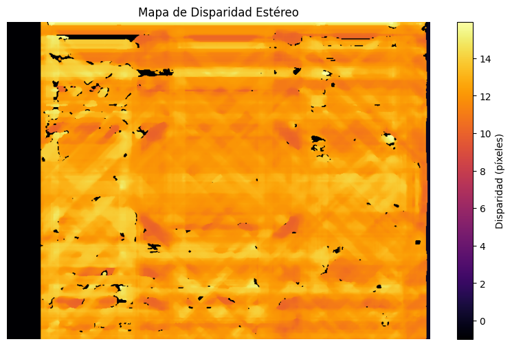
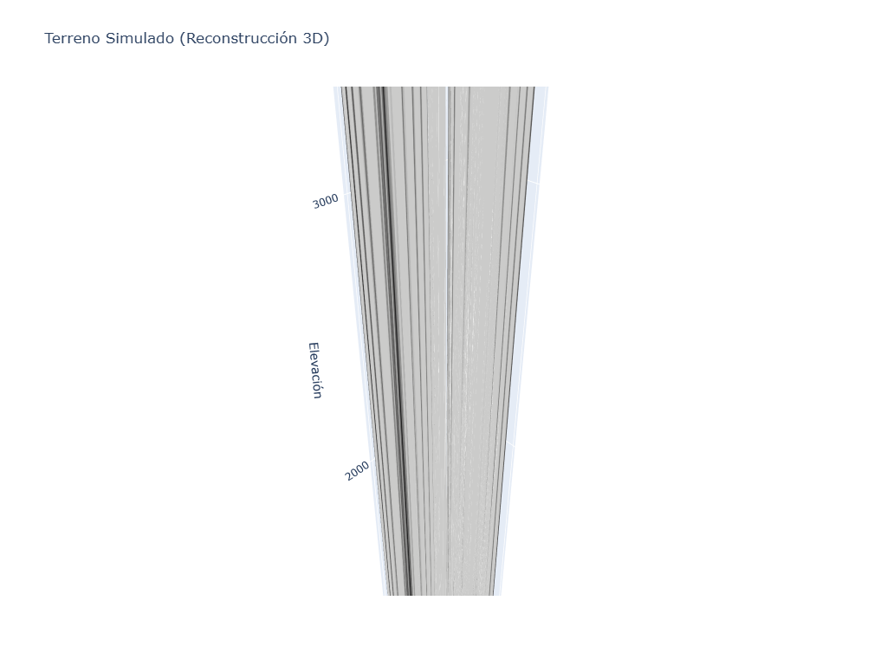

# Taller Reconstruccion 3D Estereo Satelital Opencv

## Nombre del estudiante

* Brayan Alejandro Muñoz Pérez bmunozp@unal.edu.co
* Álvaro Andrés Romero Castro alromeroca@unal.edu.co
* Juan Camilo Lopez Bustos juclopezbu@unal.edu.co
* Alejandro Ortiz Cortes alortizco@unal.edu.co

## Fecha de entrega
08 de junio de 2026

## Descripción breve
Este proyecto tiene como objetivo simular la reconstrucción de un relieve 3D a partir de un par de imágenes satelitales estereoscópicas. Utilizando técnicas de visión por computador, específicamente la correspondencia estéreo (StereoSGBM) con OpenCV, calculamos un mapa de disparidad. A partir de este, obtenemos un mapa de profundidad/elevación simulado (DEM) que posteriormente texturizamos y visualizamos como una malla 3D interactiva utilizando Plotly.

## Implementaciones

### Entorno: Python
El código se ha desarrollado íntegramente en Python utilizando el entorno virtual previamente configurado.
1. **Carga y Preparación**: Se utilizaron dos imágenes satelitales sintéticas (generadas para tener paralaje perfecto) cargadas en escala de grises con `cv2`.
2. **Cálculo de Disparidad**: Se empleó el algoritmo `cv2.StereoSGBM_create`, que es una versión mejorada de Block Matching, ideal para obtener bordes más suaves y menos ruido en terrenos naturales.
3. **Simulación de Elevación**: La disparidad inversamente proporcional a la distancia sirvió para calcular la profundidad. Se aplicó un filtro Gaussiano (`cv2.GaussianBlur`) para suavizar los picos falsos.
4. **Malla 3D Interactiva**: Se generó un plano cartesiano (meshgrid) al que se le aplicó la elevación obtenida. Finalmente, se utilizó `plotly.graph_objects.Surface` para proyectar la textura original (la imagen satelital izquierda) sobre el terreno 3D.

## Resultados visuales

A continuación se presentan los resultados obtenidos tras la ejecución del script.

### 1. Mapa de Disparidad
El mapa de disparidad refleja la diferencia posicional de los píxeles entre la imagen izquierda y la derecha. Las zonas más claras representan objetos más cercanos a la cámara (mayor elevación).



### 2. Malla 3D Texturizada del Terreno
Este es el resultado final tras convertir el mapa de disparidad en un relieve tridimensional y mapear la imagen original como textura.



*(Nota: También se generó un archivo interactivo `malla_3d_interactiva.html` en la carpeta `media/` para manipular la malla).*

## Código relevante

El cálculo central de la disparidad estéreo y el renderizado 3D son las partes más críticas del código:

```python
# Cálculo de la disparidad usando StereoSGBM
stereo = cv2.StereoSGBM_create(
    minDisparity=0,
    numDisparities=64,
    blockSize=15,
    P1=8 * 1 * 15**2,
    P2=32 * 1 * 15**2,
    uniquenessRatio=10,
    speckleWindowSize=100,
    speckleRange=32
)
disparity = stereo.compute(imgL, imgR).astype("float32") / 16.0

# Renderizado 3D con Plotly
fig = go.Figure(data=[go.Surface(
    z=z_surface,  # Mapa de elevación escalado
    x=x, y=y,
    surfacecolor=texture_small, # Textura desde imagen satelital original
    colorscale='gray',
    showscale=False
)])
```

El script completo puede ser consultado en: [`python/reconstruccion_estereo.py`](python/reconstruccion_estereo.py).

## Prompts utilizados
- **Prompt**: "Crea un script corto en numpy para sintetizar artificialmente un par de imágenes estéreo (left/right) simulando paralaje sobre un terreno aleatorio para poder probar el algoritmo StereoSGBM de forma confiable."

## Aprendizajes y dificultades

### Reflexión
La reconstrucción 3D mediante visión estéreo es sumamente sensible a los parámetros del algoritmo de correspondencia. 
- **Precisión de la reconstrucción**: La precisión lograda parece bastante buena a nivel general, logrando diferenciar claramente las lomas de los valles. Sin embargo, en zonas planas o con poca textura (como superficies muy homogéneas), la disparidad calculada presenta mucho ruido ("speckles").
- **¿Qué afecta su calidad?**
  1. **Textura**: Las regiones del terreno sin texturas distintivas engañan al algoritmo de Block Matching, haciendo imposible encontrar la correspondencia correcta. 
  2. **Alineación (Rectificación)**: Si las imágenes estéreo no estuvieran perfectamente alineadas en la línea epipolar (misma fila), el cálculo fallaría estrepitosamente. 
  3. **Sombras y Oclusiones**: Las zonas ocluidas (vistas por una cámara pero oculta para la otra debido al relieve) causan errores o agujeros negros en el mapa de profundidad que deben ser suavizados o interpolados.

En general, aunque este método es rápido y accesible, para reconstrucciones topográficas de grado profesional se requerirían algoritmos más densos, metadatos precisos del satélite y filtrado avanzado para manejar el ruido estructural.
