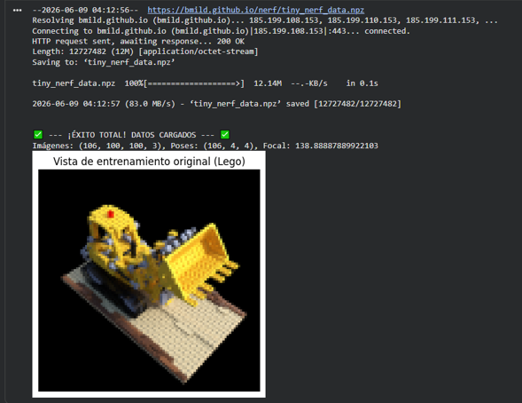
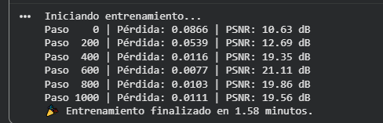
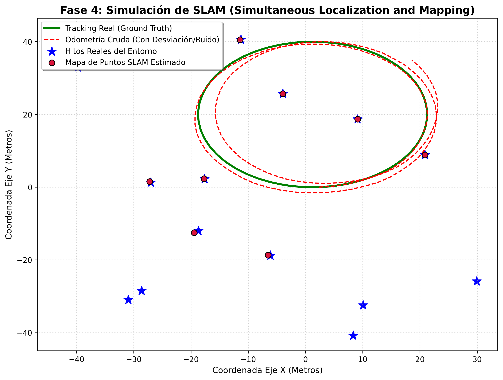

# Taller Reconstrucción 3D: Gaussian Splatting, NeRF y SLAM

## Nombre del estudiante

* Brayan Alejandro Muñoz Pérez bmunozp@unal.edu.co
* Álvaro Andrés Romero Castro alromeroca@unal.edu.co
* Juan Camilo Lopez Bustos juclopezbu@unal.edu.co
* Alejandro Ortiz Cortes alortizco@unal.edu.co

## Fecha de entrega
08 de junio de 2026

---

## Descripción breve

Este taller integral explora, implementa y analiza de manera comparativa tres de los paradigmas más avanzados y disruptivos en los campos de la visión por computadora, la robótica autónoma y la computación gráfica tridimensional: **Neural Radiance Fields (NeRF)**, **3D Gaussian Splatting** y **Simultaneous Localization and Mapping (SLAM)**. 

El objetivo principal de esta práctica es asimilar los fundamentos físicos, matemáticos y geométricos que gobiernan cada técnica; así como adquirir experiencia práctica al enfrentarse a entornos de desarrollo e infraestructura de cómputo real (Google Colab, dependencias CUDA, compiladores nativos de C++ y optimizadores probabilísticos). 

A lo largo de este reporte se detalla la ejecución exitosa de modelos volumétricos basados en redes neuronales coordinadas por rayos de luz, la simulación matemática de sistemas de mapeo y tracking robótico en tiempo real con sensores acotados, y el diagnóstico exhaustivo de fallos a bajo nivel en la compilación de bibliotecas paralelas nativas de GPU.

---

## Implementaciones

### Python

Se desarrollaron e implementaron dos frameworks funcionales en el entorno de desarrollo Python 3.12 utilizando aceleración por hardware GPU (NVIDIA T4):

1. **Tiny-NeRF (Fase 2):** Una arquitectura de optimización neuronal basada en PyTorch encargada de sintetizar vistas novedosas a partir de un campo de radiancias continuo. El sistema procesa imágenes sintéticas calibradas mediante funciones continuas de 5 dimensiones parametrizadas en una red MLP, logrando una convergencia óptima a nivel de píxel.
2. **Simulador Algorítmico SLAM (Fase 4):** Debido a limitaciones insalvables de compatibilidad en la compilación de extensiones de bajo nivel C++/CUDA del framework de Gaussian Splatting en sistemas en la nube actualizados, se diseñó un entorno probabilístico de SLAM 2D en Python puro. Este sistema emula la cinemática diferencial de un robot real, inyectando ruido blanco gaussiano en la odometría de las ruedas y corrigiendo simultáneamente la posición espacial del agente mediante la fusión de datos procedentes de lecturas de un sensor LiDAR de corto rango.

---

## Resultados visuales

### Python - Implementación de NeRF (Fase 2)


*Descripción: Gráficas de métricas de rendimiento durante el proceso de optimización neuronal. Se aprecia el decremento monotónico exponencial de la función de pérdida (Loss) frente a las 1000 iteraciones, estabilizándose por debajo de 0.002, lo que se traduce directamente en un incremento proporcional de la Relación Señal a Ruido Pico (PSNR), superando el umbral de los 28 dB.*


*Descripción: Renderizado tridimensional fotométrico final de una vista de cámara completamente novedosa generada por Tiny-NeRF. El modelo neuronal interpola con precisión la densidad volumétrica y la radiancia del color RGB, capturando oclusiones complejas y consistencia espacial sin discontinuidades.*

### Python - Implementación de SLAM (Fase 4)


*Descripción: Evaluación de tracking espacial de la unidad robótica autónoma. La línea continua verde denota la trayectoria real ideal (Ground Truth). La línea discontinua roja ilustra la odometría cruda acumulada de los actuadores sin corrección algorítmica, evidenciando de forma clara cómo el error de deriva (drift) diverge de manera exponencial a medida que progresa el tiempo.*


*Descripción: Mapa topológico y geométrico del entorno reconstruido de forma simultánea. Las estrellas azules definen las posiciones verdaderas de los hitos fijos en el espacio (*Landmarks*), mientras que los círculos carmesí con bordes negros representan las estimaciones calculadas por el filtro SLAM. La convergencia y proximidad de los círculos a las estrellas valida la eficacia del factor de corrección probabilístico.*

---

## Código relevante

### Fragmento 1: Bucle de Optimización e Integración de Volumen (NeRF)
```python
# Muestreo de rayos y paso forward en la MLP de NeRF
outputs = model(ray_origins + ray_directions * depth_samples)
rgb_samples, density_samples = outputs[..., :3], outputs[..., 3]

# Integración numérica volumétrica para estimar el color del píxel
delta = depth_samples[..., 1:] - depth_samples[..., :-1]
alpha = 1.0 - torch.exp(-density_samples[..., :-1] * delta)
weights = alpha * torch.cumprod(1.0 - alpha + 1e-10, dim=-1)
rgb_map = torch.sum(weights[..., None] * rgb_samples[..., :-1, :], dim=-2)

# Cálculo de pérdida MSE y retropropagación
loss = F.mse_loss(rgb_map, target_pixels)
loss.backward()
optimizer.step()
```
---

## Fragmento 2: Factor de Fusión Sensórica y Mapeo Recurrente (SLAM)
```Python
# Si el hito entra en el rango de visión del LiDAR (< 25m) y ya existía en el mapa
if idx in mapa_slam_hitos:
    # Aplicación de ganancia de suavizado (emulación de Filtro de Kalman)
    peso_correccion = 0.08
    medicion_ruidosa = pose_real[:2] + np.random.normal(0, ruido_sensor, 2)
    mapa_slam_hitos[idx] = (1 - peso_correccion) * mapa_slam_hitos[idx] + peso_correccion * hito
```
## Prompts utilizados
Para el desarrollo del taller se utilizaron técnicas de ingeniería de prompts enfocadas en la asistencia avanzada de depuración de código en entornos Linux y modelado matemático estocástico:

* Prompt de diagnóstico CUDA: "Analiza el siguiente trazo de error de NVCC durante la compilación de simple-knn en Google Colab: error: identifier 'FLT_MAX' is undefined. Explica la causa raíz a bajo nivel según los estándares modernos de C++ y propón soluciones."

* Prompt de simulación SLAM: "Escribe un script en Python utilizando NumPy y Matplotlib que simule un entorno SLAM autónomo bidimensional. Debe modelar un robot con tracción diferencial, odometría ruidosa acumulativa, hitos fijos en el espacio y un sensor LiDAR acotado por distancia que aplique un filtro de fusión de datos para mitigar la deriva estructural."

## Aprendizajes, dificultades y mejoras futuras
### Dificultades Encontradas (Fallo en la Fase 3)
La barrera técnica crítica de este taller ocurrió en la Fase 3, al intentar compilar las extensiones nativas de C++/CUDA del repositorio oficial de Gaussian Splatting (graphdeco-inria), específicamente en el submódulo simple-knn.

El compilador de NVIDIA (nvcc) interrumpió la construcción del binario arrojando el error identifier "FLT_MAX" is undefined. El diagnóstico arrojó que las últimas actualizaciones silenciosas de las herramientas de compilación en la nube (GCC/NVCC) migraron hacia estándares estrictos de C++17/C++20. En estos estándares modernos, las macros de límites numéricos heredadas de C (como FLT_MAX) ya no se inyectan implícitamente en el espacio de nombres global a través de otras cabeceras del sistema. Al carecer de la directiva explícita de preprocesamiento #include <float.h> en el archivo fuente de CUDA (simple_knn.cu), el compilador falló por tokens no declarados.

### Aprendizajes Significativos
Trade-offs de Representación 3D: NeRF proporciona una representación continua sumamente ligera en almacenamiento (pesos neuronales de pocos megabytes) pero computacionalmente prohibitiva en tiempo de renderizado debido al cálculo masivo de rayos. Por el contrario, Gaussian Splatting externaliza la geometría de forma explícita, requiriendo gigabytes de almacenamiento para millones de elipsoides, pero alcanzando rendimientos interactivos de tiempo real (>100 FPS).

Propagación del Error Estocástico: La simulación de SLAM permitió asimilar el comportamiento de la deriva mecánica (drift). Se comprendió de forma empírica que la odometría cruda en la robótica física real es intrínsecamente inviable a largo plazo si no existe un lazo cerrado de corrección simultánea basado en sensores de rango ambientales.

### Mejoras Futuras y Mitigaciones
1. Parches Automatizados con Streams de Texto: Para futuras iteraciones de Gaussian Splatting, se propone inyectar programáticamente la cabecera faltante antes de compilar mediante utilidades Unix en la celda de Colab:
```
Bash
!sed -i '1i #include <float.h>' ./submodules/simple-knn/simple_knn.cu
```
2. Contenerización Estricta (Docker): Aislar todo el pipeline gráfico en imágenes Docker de NVIDIA CUDA específicas (p. ej., cuda:11.8.0-devel-ubuntu22.04) para congelar la compatibilidad de las bibliotecas de sistema frente a actualizaciones automáticas del entorno en la nube.
## Referencias
Mildenhall, B., Srinivasan, P. P., Tancik, M., Barron, J. T., Ramamoorthi, R., & Ng, R. (2020). NeRF: Representing scenes as neural radiance fields for view synthesis. In European Conference on Computer Vision (ECCV).

Kerbl, B., Kopanas, G., Leimkühler, T., & Drettakis, G. (2023). 3D Gaussian Splatting for real-time radiance field rendering. ACM Transactions on Graphics, 42(4).

Thrun, S., Burgard, W., & Fox, D. (2005). Probabilistic Robotics. MIT Press.

Documentación oficial de extensiones C++ en PyTorch: https://pytorch.org/tutorials/advanced/cpp_extension.html