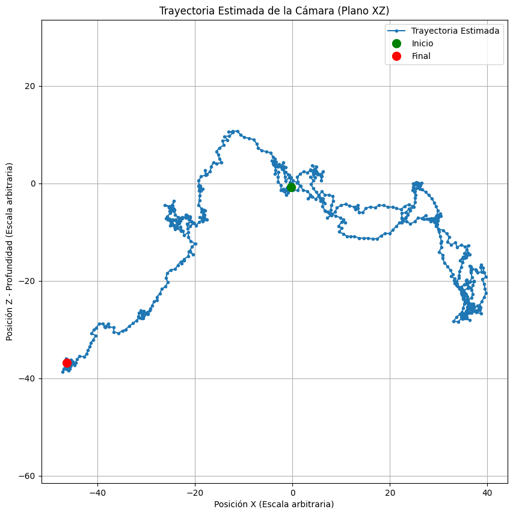

# Taller Convoluciones Personalizadas

## Nombre del estudiante

* Brayan Alejandro Muñoz Pérez bmunozp@unal.edu.co
* Álvaro Andrés Romero Castro alromeroca@unal.edu.co
* Juan Camilo Lopez Bustos juclopezbu@unal.edu.co
* Alejandro Ortiz Cortes alortizco@unal.edu.co

## Fecha de entrega
1 de junio de 2026

---

# Descripción breve

El objetivo de este taller fue de usar la detección de identificadores entre dos imagenes para poder obtener el movimiento capturado en una serie de imágenes. 

---

# Implementaciones

## Implementación en Python

## Funcionalidades desarrolladas

### 1. Uso de ORB y BFMatcher

Se uso `ORB` y `BFMatcher` para encontrar los identificadores de una imagen y los puntos que son iguales entre frames.

```python
frame_curr = cv2.undistort(frame_curr, K, D)
kp_curr, des_curr = orb.detectAndCompute(frame_curr, None)

matches = bf.match(des_prev, des_curr)

# Extraer puntos emparejados como arrays de NumPy
pts_prev = np.float32([kp_prev[m.queryIdx].pt for m in matches])
pts_curr = np.float32([kp_curr[m.trainIdx].pt for m in matches])

#Estimar movimiento entre cuadros
E, mask = cv2.findEssentialMat(pts_prev, pts_curr, focal=K[0,0], pp=(K[0,2], K[1,2]), 
                                method=cv2.RANSAC, prob=0.999, threshold=1.0)

_, R, t, mask_pose = cv2.recoverPose(E, pts_prev, pts_curr, focal=K[0,0], pp=(K[0,2], K[1,2]))

mask_inliers = mask_pose.ravel() == 255
pts_prev_valid = pts_prev[mask_inliers]
pts_curr_valid = pts_curr[mask_inliers]

kp_prev, des_prev = kp_curr, des_curr

```

---

### 2. Calculo de trayectoria

Se obtiene la trayectoria a partir del movimiento de los identificadores entre frames.

```python
# trayectoria estimada
scale = 1.0

cur_t = cur_t + scale * (cur_R @ t)
cur_R = R @ cur_R

trajectory.append(cur_t.flatten())
```

---

# Resultados visuales

## Capturas de la implementación

### Features e Inliers en las imágenes


---

### Trayectoria de la camara



---

# Código relevante

## Inicialización de Parámetros y Obtención de Imágenes

```python
PATH = r'rgb'

fx = 517.3
fy = 516.5
cx = 318.6
cy = 255.3

K = np.array([
    [fx,  0.0, cx],
    [0.0, fy,  cy],
    [0.0, 0.0, 1.0]
], dtype=np.float32)

d0, d1, d2, d3, d4 = 0.2624, -0.9531, -0.0054, 0.0026, 1.1633

D = np.array([d0, d1, d2, d3, d4], dtype=np.float32)

MAX_FEATURES = 2000

IMAGE_FILES = sorted(glob.glob(os.path.join(PATH, '*.png')))

IMAGES = list(filter(lambda x: x[0] is not None, ((cv2.imread(path), float(path.removesuffix(".png").removeprefix("rgb\\"))) for path in IMAGE_FILES)))
print("Cantidad de imagenes obtenidas:", len(IMAGES))
```

---

## Inicialización de los Modelos antes de Iterar

```python
orb = cv2.ORB_create(nfeatures=MAX_FEATURES)

bf = cv2.BFMatcher(cv2.NORM_HAMMING, crossCheck=True)

cur_R = np.eye(3)
cur_t = np.zeros((3, 1))

frame_prev, start_time = IMAGES[0]

frame_prev = cv2.undistort(frame_prev, K, D)
kp_prev, des_prev = orb.detectAndCompute(frame_prev, None)
```

## Cálculos frame a frame

```python
trajectory = []
animation = [(IMAGES[0][0], 0)]
for frame_curr, current_time in IMAGES[1:]:
    frame_curr = cv2.undistort(frame_curr, K, D)
    kp_curr, des_curr = orb.detectAndCompute(frame_curr, None)

    if des_curr is None or len(kp_curr) < 20:
        print(f"Frame {current_time}: No se encontraron suficientes puntos clave ORB.")
        kp_prev, des_prev = kp_curr, des_curr
        continue

    matches = bf.match(des_prev, des_curr)

    if len(matches) < 20:
        print(f"Frame {current_time}: No se encontraron suficientes coincidencias.")
        kp_prev, des_prev = kp_curr, des_curr
        continue

    # Extraer puntos emparejados como arrays de NumPy
    pts_prev = np.float32([kp_prev[m.queryIdx].pt for m in matches])
    pts_curr = np.float32([kp_curr[m.trainIdx].pt for m in matches])

    #Estimar movimiento entre cuadros
    E, mask = cv2.findEssentialMat(pts_prev, pts_curr, focal=K[0,0], pp=(K[0,2], K[1,2]), 
                                  method=cv2.RANSAC, prob=0.999, threshold=1.0)

    _, R, t, mask_pose = cv2.recoverPose(E, pts_prev, pts_curr, focal=K[0,0], pp=(K[0,2], K[1,2]))

    mask_inliers = mask_pose.ravel() == 255
    pts_prev_valid = pts_prev[mask_inliers]
    pts_curr_valid = pts_curr[mask_inliers]

    # trayectoria estimada
    scale = 1.0

    cur_t = cur_t + scale * (cur_R @ t)
    cur_R = R @ cur_R

    trajectory.append(cur_t.flatten())

    kp_prev, des_prev = kp_curr, des_curr

    frame_vis = frame_curr.copy()
    for i in range(pts_curr_valid.shape[0]):
        p1 = (int(pts_prev_valid[i, 0]), int(pts_prev_valid[i, 1]))
        p2 = (int(pts_curr_valid[i, 0]), int(pts_curr_valid[i, 1]))
        # Dibujar punto clave actual (verde)
        cv2.circle(frame_vis, p2, 3, (0, 255, 0), -1) 
        # Opcional: Dibujar línea desde la posición anterior (rojo)
        # cv2.line(frame_vis, p1, p2, (0, 0, 255), 1)

    animation.append((frame_vis, pts_curr_valid.shape[0]))
```

## Animación de Features

```python
fig, ax = plt.subplots()
ax.axis("off")
im = ax.imshow(animation[0][0])
txt = ax.text(0, 20, "inliers: {animation[0][1]}")

def update(frame):
    im.set_array(cv2.cvtColor(animation[frame][0], cv2.COLOR_BGR2RGB))
    txt.set_text(f"inliers: {animation[frame][1]}")
    return [im, txt]

time = 1000 * (IMAGES[-1][1] - IMAGES[0][1]) / len(IMAGES)
print("Delta t:", time)

ani = anim.FuncAnimation(fig, update, len(animation), blit=True, interval=time, repeat=True)
# ani.save("../media/animation.mp4")
from IPython.display import HTML
HTML(ani.to_jshtml())
```

## Visualización de trayectoria

```python
if len(trajectory) > 1:
    # La mayoría de los datasets de VO (como KITTI) asumen que el plano del suelo es XZ.
    # p[0] es X, p[2] es Z (profundidad).
    
    # Implementación basada estrictamente en la instrucción: plot([p[0]...], [p[2]...])
    plt.figure(figsize=(10, 10))
    # Graficar X vs Z (plano de movimiento comúnmente usado en VO monocular)
    plt.plot([p[0] for p in trajectory], [p[2] for p in trajectory], '-o', markersize=3, label='Trayectoria Estimada')
    
    # Marcar el inicio (Verde) y el final (Rojo)
    plt.plot(trajectory[0][0], trajectory[0][2], 'go', markersize=10, label='Inicio')
    plt.plot(trajectory[-1][0], trajectory[-1][2], 'ro', markersize=10, label='Final')

    plt.title('Trayectoria Estimada de la Cámara (Plano XZ)')
    plt.xlabel('Posición X (Escala arbitraria)')
    plt.ylabel('Posición Z - Profundidad (Escala arbitraria)')
    plt.legend()
    plt.axis('equal') # Mantener escala de ejes igual para una visualización correcta
    plt.grid(True)
    plt.show()
    
else:
    print("No se pudieron generar suficientes puntos de trayectoria para graficar.")
```

---

# Prompts utilizados

Principalmente se usó para poder reconstruir la trayectoria y al buscar sobre animación en matplotlib.

---

# Aprendizajes y dificultades

## Aprendizajes

Se aprendió sobre la odometria haciendo uso de las herramientas dadas por OpenCV (`ORB`, `BFMatcher`).

## Dificultades

Fue particularmente difícil el calculo de la trayectoria (incluso al final no parece estar correcto del todo) y las gráficas animadas debido a los limites de los notebooks.