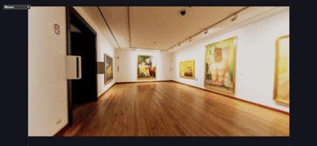

# Taller Arjs Realidad Aumentada Marcadores Web

## Nombre del estudiante

* Brayan Alejandro Muñoz Pérez bmunozp@unal.edu.co
* Álvaro Andrés Romero Castro alromeroca@unal.edu.co
* Juan Camilo Lopez Bustos juclopezbu@unal.edu.co
* Alejandro Ortiz Cortes alortizco@unal.edu.co

---

## Fecha de entrega

15 de junio de 2026

---

# Descripción breve

Este taller se usarón imágenes y videos en forma equirectangulares para mostrar entornos 3D predeterminados. Haciendo uso de los componentes `Renderer` y `VideoPlayer` en unity y `sphereGeometry` y `meshBasicMaterial` en threejs.

Donde se logro mostrar estos entornos con una cámara que permite rotación para poder ver toda la escena y cambiar entre las diferentes imágenes y videos.

---

# Implementaciones realizadas

## Implementación en Unity

Se creo un `GameObject` de esfera y se le aplico un material sin iluminación que renderizara tanto adentro como fuera de ella. Esto porque cambiar `transfrom.scale.x = -1` ya no permite invertir las normales de la esfera.

A esta esfera se le añadio el script `PanoramaLoader.cs`que se encarga de cambiar la imagen o video a disponer.

Se creo un `DropDown` en UI para permitir al usuario selecciónar la imágen/video que quiera ver. Donde el script que tiene pegado `InitDropdown.cs` se encarga de cargar las texturas desde `Assets/Resources/panorama`, las dispone en el dropdown y cuando se selecciona una nueva opción llama los métodos correctos en `PanoramaLoader.cs`.

A la camara se le añadio el script de base que viene en unity para manejo de camara con una velocidad de movimiento en 0.

### Código Relevante

**Carga de Imágenes en Dropdown y Acción en Selección**

```csharp
public class InitDropdown : MonoBehaviour {
	[SerializeField] private PanoramaLoader loader;

	private Texture2D[] textures;
	private VideoClip[] clips;
	private List<string> names;
	private TMP_Dropdown drop;

	void Start() {
		drop = GetComponent<TMP_Dropdown>();
		drop.ClearOptions();

		//Cargar imagenes y videos
		textures = Resources.LoadAll<Texture2D>("panorama");
		clips = Resources.LoadAll<VideoClip>("panorama");

		//nombres a poner en el dropdown
		names = new List<string>();

		foreach(Texture2D tex in textures)
			names.Add(tex.name);

		foreach(VideoClip clip in clips)
			names.Add(clip.name);

		drop.AddOptions(names);

		//llamar OnChange cuando hallan cambios en dropdown
		drop.onValueChanged.AddListener(OnChange);

		//mostrar la primera textura
		loader.ShowStatic(textures[0]);
	}

	private void OnChange(int index) {
		if (index >= textures.Length) {
			loader.ShowVideo(clips[index - textures.Length]);
		} else {
			loader.ShowStatic(textures[index]);
		}
	}
}
```

**Carga de Imágenes/Videos en la Esfera**

```csharp
public class PanoramaLoader : MonoBehaviour {
	Renderer rend;
	VideoPlayer vp;
	public float sensitivity = 1;

	private void Start() {
		rend = GetComponent<Renderer>();
		vp = GetComponent<VideoPlayer>();
	}

	public void ShowVideo(VideoClip clip) {
		Debug.Log("Loading video " +  clip.name);
		vp.clip = clip;

		vp.Play();
    }

	public void ShowStatic(Texture2D tex) {
		Debug.Log("Loading photo " + tex.name);
		//frenar video para evitar conflictos
		if(vp.isPlaying)
			vp.Stop();
        rend.material.mainTexture = tex;
	}
}
```

---

# Implementación Threejs

Se realizo las mismas funciones para el usuario que en unity, se usó un dropdown (`<select>` en html/jsx) y se crearon dos funciones para la carga de imágenes y videos `ImageSphere` y `VideoSphere` respectivamente. Y con la función `PanoramaViewer` (llamada cuando cambia el dropdown) se llamaban las funciones respectivas dependiendo del tipo de archivo.

En este caso el dropdown se tuvo que dar los archivos manualmente ya que no se permite visitar carpetas sin especificqar los archivos especificos.

Y para permitir al usuario rotar la camara se añadio el componente `OrbitControls` deshabilitando el zoom y la traslación.


### Código relevante

**Creación del canvas, dropdown y los controles**

```jsx
const panoramas = [
  {
    name: "Museo",
    file: "/panoramaFoto1.png",
  },
  {
    name: "Edificio vacío",
    file: "/panoramaFoto2.png",
  },
  {
    name: "Cálido",
    file: "/panoramaFoto3.png",
  },
  {
    name: "Video atardecer",
    file: "/panoramaVideo1.mp4",
  },
  {
    name: "Calle Italia",
    file: "/panoramaVideo2.mp4",
  },
  {
    name: "Calle Florida",
    file: "/panoramaVideo3.mp4",
  },
];

export default function App() {
  const [selected, setSelected] = useState(
    panoramas[0].file
  );

  return (
    <>
      <div
        style={{
          position: "absolute",
          top: 15,
          left: 15,
          zIndex: 1000,
        }}
      >
        <select
          value={selected}
          onChange={(e) =>
            setSelected(e.target.value)
          }
        >
          {panoramas.map((p) => (
            <option
              key={p.file}
              value={p.file}
            >
              {p.name}
            </option>
          ))}
        </select>
      </div>

      <Canvas
        camera={{
          position: [0, 0, 0.1],
          fov: 75,
        }}
      >
        <PanoramaViewer item={selected} />

        <OrbitControls
          enableZoom={false}
          enablePan={false}
          rotateSpeed={-0.5}
        />
      </Canvas>
    </>
  );
}
```

**Cambio de Imagen/Video**

```jsx
function ImageSphere({ src }) {
  const texture = useTexture(src);

  return (
    <mesh scale={[-1, 1, 1]}>
      <sphereGeometry args={[50, 64, 64]} />
      <meshBasicMaterial
        map={texture}
        side={THREE.BackSide}
      />
    </mesh>
  );
}

function VideoSphere({ src }) {
  const texture = useMemo(() => {
    const video = document.createElement("video");

    video.src = src;
    video.crossOrigin = "anonymous";
    video.loop = true;
    video.muted = true;
    video.playsInline = true;

    video.play();

    return new THREE.VideoTexture(video);
  }, [src]);

  return (
    <mesh scale={[-1, 1, 1]}>
      <sphereGeometry args={[50, 64, 64]} />
      <meshBasicMaterial
        map={texture}
        side={THREE.BackSide}
      />
    </mesh>
  );
}

export default function PanoramaViewer({ item }) {
  const isVideo =
    item.endsWith(".mp4")

  return isVideo ? (
    <VideoSphere src={item} />
  ) : (
    <ImageSphere src={item} />
  );
}
```

---

### Resultados visuales

#### Modelo 1


#### Modelo 2



---

# Prompts utilizados

Durante el desarrollo se utilizaron herramientas de IA generativa para:

- Unity:
  - Cargar imágenes y videos en esfera en Unity
  - Solucionar Scale.X = -1 no funcionando
  - Como utilizar Dropdowns en UI
- Threejs:
  - Cargar imágenes y videos en esfera en Threejs
  - Como usar dropdowns
  - Cargar todos los archivos de una carpeta

---

# Aprendizajes y dificultades

## Aprendizajes

Durante el desarrollo del taller se comprendió como disponer imágens y videos equirectangulares de forma que un usuario las pueda visualizar como panoramas 3D. Se entendió que este formato corresponde al mapeo de una textura en el interior de una esfera, resultando en una simple visualización que permite ver al usuario distintos angulos desde una posición predeterminada.

Se internalizo el uso de Unity y Threejs para mostrar el formato equirectangular y disponerlo al usuario.

---

## Dificultades encontradas

En Unity se tuvo problemas inicialmente con la `Scale.X = -1` debido a que en la versión usada este "truco" no funciona. Después de solucionar esto el siguiente problema fue el dropdown y sobre todo hacer que el `EventListener` se resolviera correctamente al cambio de imágen / video.

En threejs se tuvo menos problemas debido a que la diferencia entre carga de imágen y video es solo el tipo de textura a cargar. Pero poder organizar el `select` y el `canvas` para que todo se viera fue problematico debido a la necesidad de "pelar" con `css`.
 