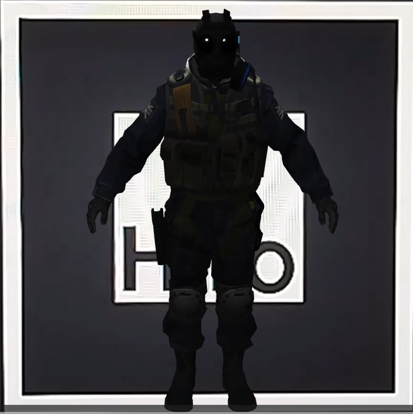
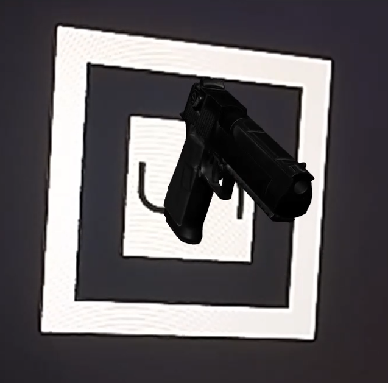

# Taller Arjs Realidad Aumentada Marcadores Web

## Nombre del estudiante

* Brayan Alejandro Muñoz Pérez bmunozp@unal.edu.co
* Álvaro Andrés Romero Castro alromeroca@unal.edu.co
* Juan Camilo Lopez Bustos juclopezbu@unal.edu.co
* Alejandro Ortiz Cortes alortizco@unal.edu.co

---

## Fecha de entrega

15 de junio de 2026

---

# Descripción breve

En este taller se desarrolló una experiencia básica de realidad aumentada web utilizando las librerías AR.js, A-Frame y Three.js. El proyecto permite detectar marcadores físicos mediante la cámara del navegador y proyectar modelos 3D en tiempo real sobre ellos.

Durante el desarrollo se implementaron marcadores predefinidos y personalizados, modelos 3D en formato GLB, animaciones, reproducción de sonido al detectar marcadores y múltiples objetos virtuales dependiendo del marcador identificado.

La aplicación funciona completamente desde el navegador sin necesidad de instalar aplicaciones móviles adicionales.

---

# ¿Cómo funciona AR.js?

AR.js es una librería de realidad aumentada para navegadores web que permite detectar marcadores utilizando la cámara del dispositivo. Cuando el marcador es identificado, la librería calcula su posición y orientación en el espacio para superponer modelos 3D sobre él en tiempo real.

En este taller se utilizó AR.js junto con A-Frame, el cual internamente utiliza Three.js para renderizar los modelos 3D y las animaciones.

Flujo general:

1. La cámara captura video en tiempo real.
2. AR.js detecta patrones o marcadores.
3. Se calcula la posición del marcador.
4. Three.js renderiza modelos 3D sobre el marcador.
5. Se ejecutan animaciones e interacciones.

---

# Herramientas utilizadas

- AR.js
- A-Frame
- Three.js
- HTML5
- JavaScript
- Visual Studio Code
- Live Server

---

# Implementaciones realizadas

## Implementación 1 — Escena básica AR

Se desarrolló una escena inicial utilizando el marcador Hiro incluido en AR.js. Sobre este marcador se renderizó inicialmente un cubo 3D básico para validar el funcionamiento de la cámara y el tracking.

### Características

- Detección de marcador Hiro
- Renderizado de objeto 3D
- Uso de cámara web
- Escena AR básica

### Código relevante

```html
<a-scene embedded arjs>

    <a-marker preset="hiro">

        <a-box
            position="0 0.5 0"
            color="red">
        </a-box>

    </a-marker>

    <a-entity camera></a-entity>

</a-scene>
```

---

# Implementación 2 — Modelo 3D personalizado GLB

Se reemplazó el cubo básico por modelos 3D personalizados en formato `.glb`, cargados mediante `gltf-model`.

### Características

- Carga de modelos GLB
- Posicionamiento y escalado
- Rotación personalizada
- Compatibilidad con A-Frame

### Código relevante

```html
<a-entity

    gltf-model="#modelo"

    position="0 0 0"

    scale="0.5 0.5 0.5"

    rotation="270 0 0">
</a-entity>
```

---

# Implementación 3 — Animaciones e interacciones

Se añadieron animaciones de rotación y eventos para detectar la aparición de marcadores utilizando `markerFound`.

### Características

- Animación automática
- Movimiento oscilatorio
- Eventos de detección
- Interacciones básicas

### Código relevante

```html
animation="
    property: rotation;
    from: 270 -30 0;
    to: 270 30 0;
    dir: alternate;
    loop: true;
    dur: 1500;
    easing: easeInOutSine;"
```

```javascript
marcador.addEventListener(
    "markerFound",
    () => {

        audio.currentTime = 0;
        audio.play();

    }
);
```

---

# Implementación 4 — Marcador personalizado

Se creó un marcador personalizado utilizando el generador oficial de AR.js y un archivo `.patt`.

### Características

- Marcador personalizado
- Tracking avanzado
- Detección múltiple
- Configuración smooth

### Código relevante

```html
<a-marker

    type="pattern"

    url="pattern-unal.patt"

    smooth="true"

    smoothCount="10"

    smoothTolerance="0.01"

    smoothThreshold="5">
```

---

# Implementación 5 — Múltiples modelos y sonido

Se configuraron múltiples marcadores para mostrar diferentes modelos 3D y reproducir sonido cuando el marcador era detectado.

### Características

- Sonido al detectar marcador
- Múltiples modelos 3D
- Eventos independientes
- Interacción multimedia

### Código relevante

```javascript
marcador2.addEventListener(
    "markerFound",
    () => {

        audio.currentTime = 0;
        audio.play();

    }
);
```

---

### Resultados visuales

#### Modelo 1



#### Modelo 2



#### Demostración

<video width="700" autoplay loop muted controls>
    <source src="media/reconocimiento.mp4" type="video/mp4">
</video>

---

# Prompts utilizados

Durante el desarrollo se utilizaron herramientas de IA generativa para:

- Solución de errores de integración con AR.js
- Configuración de modelos GLB
- Implementación de animaciones
- Reproducción de audio
- Detección de marcadores personalizados
- Optimización del tracking

### Ejemplos de prompts utilizados

- "Cómo cargar un modelo GLB en AR.js usando A-Frame"
- "Cómo reproducir sonido al detectar un marcador"
- "Cómo crear un marcador personalizado con AR.js"
- "Cómo animar rotaciones en A-Frame"
- "Cómo mejorar el tracking de marcadores personalizados"

---

# Aprendizajes y dificultades

## Aprendizajes

Durante el desarrollo del taller se comprendió el funcionamiento básico de la realidad aumentada basada en marcadores utilizando tecnologías web. También se aprendió a integrar modelos 3D, eventos interactivos y elementos multimedia directamente desde el navegador.

Se entendió cómo A-Frame utiliza internamente Three.js para renderizar escenas 3D y cómo AR.js permite detectar patrones físicos mediante visión computacional.

---

## Dificultades encontradas

Las principales dificultades estuvieron relacionadas con:

- Compatibilidad de versiones de AR.js
- Problemas de detección de marcadores personalizados
- Configuración correcta de modelos GLB
- Restricciones del navegador para reproducir audio
- Tracking inestable con mala iluminación

También se observó que los marcadores personalizados requieren imágenes de alto contraste y buena calidad para funcionar correctamente.

---

# Reflexión personal

La realidad aumentada basada en marcadores presenta limitaciones importantes, especialmente en condiciones de poca iluminación o cuando el marcador no se encuentra completamente visible frente a la cámara. Además, el tracking puede perder estabilidad dependiendo de la calidad del marcador y de la cámara utilizada.

A pesar de estas limitaciones, esta tecnología tiene un gran potencial en áreas como educación, arte y entretenimiento. En educación podría utilizarse para mostrar modelos interactivos en libros o laboratorios virtuales, mientras que en arte permitiría crear exposiciones interactivas y experiencias inmersivas utilizando únicamente dispositivos móviles y navegadores web.

---

# Conclusión

El taller permitió desarrollar una experiencia funcional de realidad aumentada web utilizando AR.js y Three.js. Se implementaron modelos 3D, animaciones, marcadores personalizados y eventos interactivos, demostrando que es posible crear aplicaciones AR accesibles directamente desde el navegador sin requerir aplicaciones móviles dedicadas.