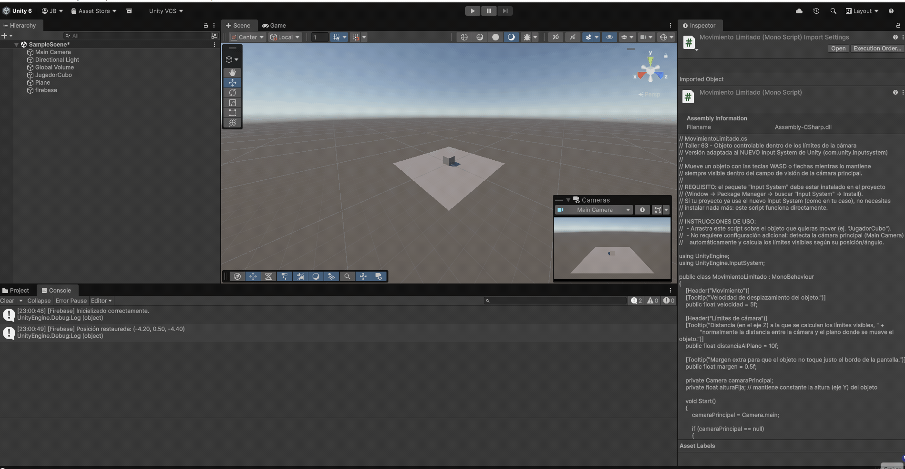
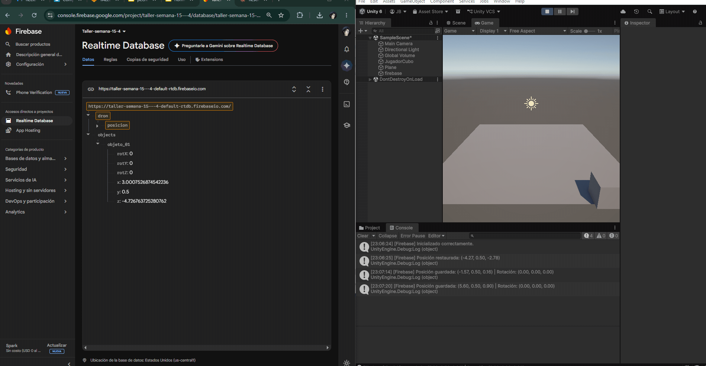
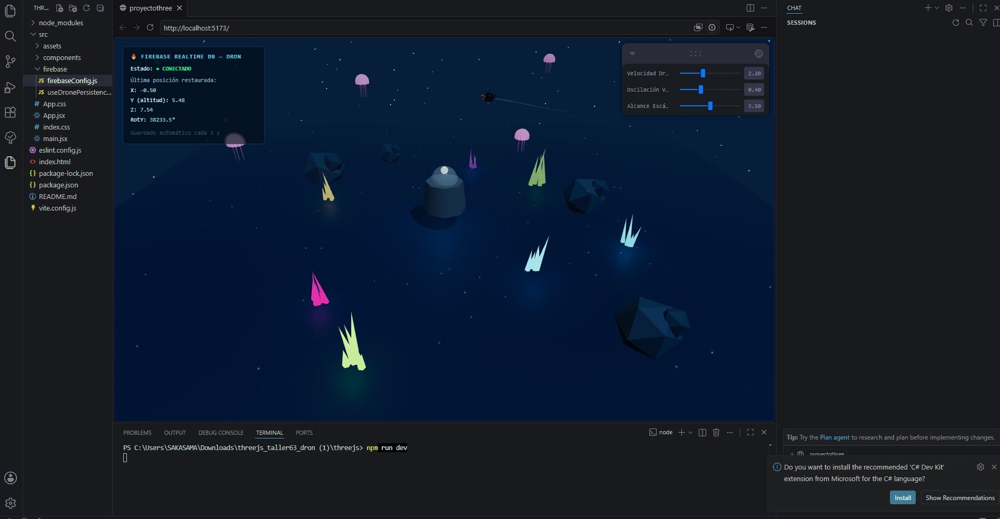
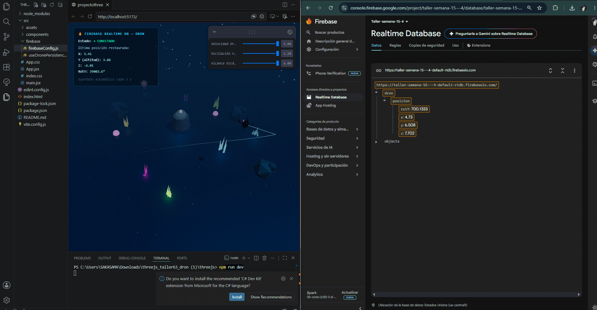

# Taller Guardado Persistencia Firebase Unity Threejs

## Nombre del estudiante

* Brayan Alejandro Muñoz Pérez bmunozp@unal.edu.co
* Álvaro Andrés Romero Castro alromeroca@unal.edu.co
* Juan Camilo Lopez Bustos juclopezbu@unal.edu.co
* Alejandro Ortiz Cortes alortizco@unal.edu.co

## Fecha de entrega

`15 de junio de 2026`

---

## Descripción breve

Este taller tuvo como objetivo implementar un sistema de persistencia de datos en la nube usando **Firebase Realtime Database**, integrado en dos entornos de desarrollo distintos: **Unity (C#)** y **Three.js con React (react-three-fiber)**. La idea central era demostrar cómo guardar y recuperar información de un objeto 3D —su posición y rotación— de forma que la experiencia visual mantenga continuidad entre sesiones, en lugar de reiniciarse siempre desde cero.

En **Unity**, se desarrolló un cubo controlable con teclado (WASD / flechas) que se mueve dentro de los límites visibles de la cámara. Cada 3 segundos, su posición y rotación se guardan automáticamente en Firebase, y al reiniciar la escena (Play), el objeto aparece exactamente donde fue dejado la última vez.

En **Three.js**, se construyó una escena de un arrecife bioluminiscente nocturno con un dron explorador autónomo que vuela en 3D visitando waypoints. De la misma forma, su posición (x, y, z) y rotación se guardan cada 3 segundos en Firebase, y se restauran automáticamente al recargar la página. Ambos entornos comparten el mismo proyecto de Firebase, demostrando que la nube puede centralizar datos provenientes de plataformas completamente distintas.

---

## Implementaciones

### Unity

Se implementó un objeto controlable (`JugadorCubo`) que se mueve con las teclas WASD o flechas direccionales, manteniéndose siempre dentro del campo de visión de la cámara principal gracias a un cálculo dinámico de límites basado en el FOV y la distancia de la cámara.

Para la persistencia, se creó un script `FirebaseManager.cs` que:
- Inicializa la conexión con Firebase al iniciar la escena (`FirebaseApp.CheckAndFixDependenciesAsync`).
- Recupera la última posición/rotación guardada y la aplica al objeto (`LoadData()`).
- Guarda automáticamente la posición y rotación actuales cada 3 segundos (`SaveData()`), usando un acumulador de tiempo dentro de `Update()`.

Los datos se almacenan en la ruta `objects/objeto_01` de la Realtime Database, con la siguiente estructura: `x`, `y`, `z` (posición) y `rotX`, `rotY`, `rotZ` (rotación en ángulos de Euler).

Un desafío adicional resuelto durante el desarrollo fue la migración del sistema de lectura de teclado: el proyecto usaba el nuevo **Input System** de Unity, incompatible con la clase clásica `Input.GetAxis()`. El script de movimiento se adaptó para usar `Keyboard.current` del namespace `UnityEngine.InputSystem`.

### Three.js / React Three Fiber

Se construyó una escena completa de un arrecife bioluminiscente nocturno (suelo ondulante animado, corales emisivos, medusas flotantes, formaciones rocosas y una estación de investigación sumergida), habitada por un **dron explorador autónomo** (`DronExplorador.jsx`) que navega libremente en los 3 ejes visitando una serie de waypoints predefinidos, con hélices giratorias, luces de navegación intermitentes y un haz de escaneo.

La persistencia se implementó mediante:
- `firebaseConfig.js`: inicializa el SDK modular de Firebase (`initializeApp`, `getDatabase`).
- `useDronePersistence.js`: hook personalizado que expone `savedPos` (posición leída al montar el componente) y `savePosition()` (función para escribir en Firebase).
- Dentro de `DronExplorador.jsx`, un acumulador de tiempo en `useFrame` dispara `savePosition()` cada 3 segundos, y un `useEffect` aplica `savedPos` al dron en cuanto Firebase responde con datos existentes.

Los datos se almacenan en la ruta `dron/posicion`, con la estructura `x`, `y`, `z` (incluye altitud, a diferencia de un objeto que solo se mueve en el plano) y `rotY` (rotación en el eje vertical). Un HUD en pantalla muestra en tiempo real el estado de la conexión a Firebase y los valores restaurados.

---

## Resultados visuales

### Unity - Implementación



El cubo `JugadorCubo` se mueve con el teclado dentro de los límites de la cámara. En la consola de Unity se observan los logs `[Firebase] Inicializado correctamente` y `[Firebase] Posición restaurada`, confirmando que el objeto retoma la posición guardada en una sesión anterior en lugar de iniciar en el punto por defecto.



Vista combinada de Firebase Console (Realtime Database) junto al Editor de Unity en ejecución. Se observa el nodo `objects/objeto_01` con los valores `x`, `y`, `z`, `rotX`, `rotY`, `rotZ`, y en la consola los logs de guardado (`[Firebase] Posición guardada: ...`) ocurriendo cada vez que se mueve el cubo, confirmando la escritura en tiempo real hacia la base de datos.

### Three.js - Implementación



El dron explorador navega autónomamente sobre el arrecife bioluminiscente. El HUD superior izquierdo muestra el estado "● CONECTADO" a Firebase junto con la última posición restaurada (X, Y/altitud, Z, RotY), confirmando la lectura inicial desde la base de datos al cargar la escena.



Vista combinada de Firebase Console (Realtime Database) junto a la escena de Three.js en ejecución. Se observa el nodo `dron/posicion` actualizándose en tiempo real (valores `x`, `y`, `z`, `rotY`) mientras el dron vuela por la escena, confirmando que el guardado automático cada 3 segundos efectivamente escribe en la nube.

---

## Código relevante

### Unity (C#) — Guardado y recuperación con Firebase

```csharp
// Guarda la posición y rotación actual cada 3 segundos
void SaveData()
{
    Vector3 pos = targetObject.position;
    Vector3 rot = targetObject.eulerAngles;

    var data = new System.Collections.Generic.Dictionary<string, object>
    {
        { "x", pos.x }, { "y", pos.y }, { "z", pos.z },
        { "rotX", rot.x }, { "rotY", rot.y }, { "rotZ", rot.z }
    };

    dbReference.Child("objects").Child(objectId).SetValueAsync(data);
}

// Recupera la última posición guardada al iniciar la escena
void LoadData()
{
    dbReference.Child("objects").Child(objectId).GetValueAsync()
        .ContinueWithOnMainThread(task =>
        {
            DataSnapshot snapshot = task.Result;
            if (snapshot.Exists)
            {
                targetObject.position = new Vector3(
                    float.Parse(snapshot.Child("x").Value.ToString()),
                    float.Parse(snapshot.Child("y").Value.ToString()),
                    float.Parse(snapshot.Child("z").Value.ToString())
                );
            }
        });
}
```

### Three.js — Hook de persistencia (`useDronePersistence.js`)

```js
export function useDronePersistence() {
  const [savedPos, setSavedPos] = useState(null);
  const [status, setStatus] = useState("loading");

  // Lee la última posición al montar el componente
  useEffect(() => {
    get(ref(db, "dron/posicion")).then((snapshot) => {
      if (snapshot.exists()) setSavedPos(snapshot.val());
      setStatus("ready");
    });
  }, []);

  // Guarda la posición actual bajo demanda
  const savePosition = useCallback((pos) => {
    set(ref(db, "dron/posicion"), pos);
  }, []);

  return { savedPos, savePosition, status };
}
```

### Three.js — Guardado automático cada 3 s (`DronExplorador.jsx`)

```js
saveTimerRef.current += delta;
if (saveTimerRef.current >= 3) {
  saveTimerRef.current = 0;
  savePosition({
    x:    parseFloat(drone.position.x.toFixed(3)),
    y:    parseFloat(drone.position.y.toFixed(3)),
    z:    parseFloat(drone.position.z.toFixed(3)),
    rotY: parseFloat(drone.rotation.y.toFixed(4)),
  });
}
```

---

## Prompts utilizados

Se utilizó IA generativa como apoyo durante el desarrollo de ambas implementaciones. Algunos de los prompts empleados:

```
"Integra Firebase Realtime Database en este proyecto Three.js para guardar
posición y rotación de un objeto cada 3 segundos, y restaurarla al recargar la escena"

"Crea un script en C# para Unity que guarde y recupere la posición y rotación
de un objeto 3D usando Firebase Realtime Database"

"Adapta este script de movimiento de Unity al nuevo Input System,
ya que el proyecto no es compatible con la clase clásica UnityEngine.Input"

"Ayúdame a mejorar el brillo e iluminación general de la escena de Three.js,
ya que no se aprecia correctamente el funcionamiento del dron"
```

---

## Aprendizajes y dificultades

### Aprendizajes

Este taller permitió comprender de forma práctica cómo un mismo backend en la nube (Firebase Realtime Database) puede centralizar datos provenientes de plataformas tecnológicamente muy distintas —un motor de videojuegos como Unity (C#) y una aplicación web con Three.js/React (JavaScript)— usando el mismo proyecto y la misma base de datos. Quedó claro el patrón general de persistencia: leer al iniciar, escribir periódicamente, y aplicar los datos leídos antes de comenzar cualquier lógica de movimiento. También se reforzó la diferencia entre el SDK clásico y el modular de Firebase para JavaScript (funciones puras como `ref`, `get`, `set` en lugar de métodos encadenados), y el manejo de tareas asíncronas en Unity mediante `ContinueWithOnMainThread`.

### Dificultades

La dificultad más significativa en Unity fue un conflicto entre el sistema de lectura de teclado clásico (`UnityEngine.Input`) y el nuevo Input System del proyecto, que generaba `InvalidOperationException` en tiempo de ejecución; se resolvió migrando el script de movimiento a la clase `Keyboard.current` del namespace `UnityEngine.InputSystem`. Otro obstáculo fue un error de compilación (`CS0246: The type or namespace name 'Firebase' could not be found`) causado por una importación incompleta del SDK de Firebase para Unity, que bloqueaba la compilación de todo el proyecto hasta reimportar correctamente el paquete `.unitypackage`. En Three.js, el principal desafío fue de configuración: al copiar el snippet genérico de Firebase Console (orientado a Analytics) se sobrescribió accidentalmente el archivo `firebaseConfig.js`, eliminando el `export const db` necesario para que el hook de persistencia funcionara, lo que causaba una pantalla en blanco sin errores visibles a primera vista.

### Mejoras futuras

Como mejora futura, sería valioso implementar autenticación de usuarios (Firebase Authentication) para que cada persona tenga su propio espacio de datos en lugar de compartir una única ruta global, así como ajustar las reglas de seguridad de la Realtime Database antes de cualquier uso fuera de un entorno de pruebas. También se podría explorar Firestore como alternativa para estructuras de datos más complejas o consultas más elaboradas.

---

## Contribuciones grupales

Taller realizado en grupo. 


---

## Referencias

- Documentación oficial de Firebase Realtime Database: https://firebase.google.com/docs/database
- Firebase para Unity: https://firebase.google.com/docs/unity/setup
- Firebase Realtime Database para Web/JavaScript: https://firebase.google.com/docs/database/web/start
- Documentación de React Three Fiber: https://docs.pmnd.rs/react-three-fiber/
- Documentación del nuevo Input System de Unity: https://docs.unity3d.com/Packages/com.unity.inputsystem@latest

---

