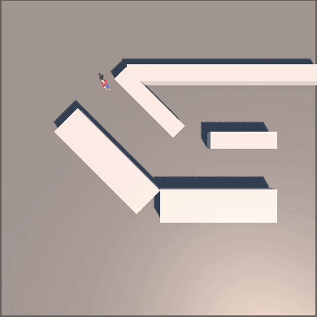

# Taller Materiales Pbr Unity Threejs

## Nombre de los estudiantes
* Brayan Alejandro Muñoz Pérez bmunozp@unal.edu.co
* Álvaro Andrés Romero Castro alromeroca@unal.edu.co
* Juan Camilo Lopez Bustos juclopezbu@unal.edu.co
* Oscar Javier Martinez Martinez ojmartinezma@unal.edu.co
* Alejandro Ortiz Cortes alortizco@unal.edu.co
## Fecha de entrega
2026-04-15

---

## Descripción breve

Este taller tuvo como objetivo utilizar las utilidades de unity:
 - **Navemsh**: Se encarga de definir los espacios caminables por un agente, y de permitirle a estos agentes viajar en este espacio por medio de coordenadas.
 - **Controlador de Animación**: Que se encarga de definir las animaciones de un objeto, sus estados, transiciones, y otros parametros.

## Implementacion

### Unity

Para definir el patrullaje de un agente se trabajó con los componentes de `navmesh`, `navmesh modifier` y `navmesh agent`. Donde `navmesh` toma los objetos en escena y a partir de sus `colliders` genera el espacio caminable por los agentes. `navmesh modifier` se uso en los objetos obstaculo para definir que estos no tienen espacio caminable. Y `navmesh agent` se uso en el gameobject del perseguidor, para poder direccionarlo por medio del metodo `setDirection` que toma un vector que define el lugar al que "quiere" llegar el agente.

Para definir el camino en si tomado por el perseguidor, se recolecto en un gamobject vacio otros gameobjects que hacen de nodos que debe alcanzar el agente.

Desde el objeto perseguidor se definio un angulo de visión de 60 y 10 rayos, con los que si alguno intersecta al jugador, el perseguidor deja el patrullaje y empieza a ir directamente hacia el jugador. 

Despues en el manejo de animaciones, se importo un modelo fbx con las animaciones de `idle`, `walk` y `run`. Estas se colocaron a un controlador de animación donde se crearon las tranciciones controladas por la variable speed. Donde al sobrepasar 0.01 se cambia de `idle` a `walk` y viceversa, y al sobrepasar 0.15 pasa de `walk` a `run` y viceversa.

## Resultados visuales

### Unity - Implementación



*Demostración del camino de patrullaje tomado por el perseguidor*

### Three.js - Implementación


*Demostración de perseccución*

---

## Código relevante

### Código relacionado con algoritmo de persecucción y animación:

```csharp
void Update() {
        speed = Vector3.Distance(transform.position, lastPos) / Time.deltaTime;
		animator.SetFloat("speed", speed);
        lastPos = transform.position;

        if(searchPlayer()) {
            agent.speed = 2;
            agent.SetDestination(playerPos);
        } else {
            agent.speed = 1.5f;
            patrol();
        }
	}

    bool searchPlayer() {
        Vector3 dir = Quaternion.AngleAxis(-visionAngle / 2, Vector3.up) * transform.forward;
        Quaternion deltaRot = Quaternion.AngleAxis(visionAngle / nrays, Vector3.up);
		RaycastHit hit;
		for(uint i = 0; i < nrays; i++) {
            if (Physics.Raycast(transform.position, dir, out hit, 100f) && hit.rigidbody != null) {
                this.playerPos = hit.transform.position;
                return true;
            }
            dir = deltaRot * dir;
        }
        return false;
    }

    void patrol() {
		if(!agent.pathPending && agent.remainingDistance < 0.5f) {
			nodeIndex = (nodeIndex + 1) % nodes.Length;
			agent.SetDestination(nodes[nodeIndex]);
		}
	}
```

## Aprendizajes y dificultades
### Aprendizajes
A través de este taller, aprendí a usar animaciones pre hechas en archivos fbx, a basar las transiciones de animasiones en parametros. Y a usar navmesh para definir areas habiles para agentes y a darles ordenes.

### Dificultades
La parte del `navmesh` fue relativamente fácil, pero por falta de experiencia hubo problemas para que la animación funcionara correctamente.

### Mejoras futuras
Se podría crear una animación en los nodos donde el perseguidor revise sus alrededores en busqueda del jugador.