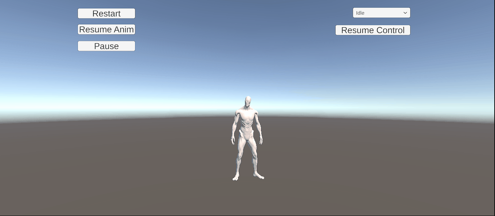

# Taller Animaciones Esqueleto Fbx Gltf

## Nombre del estudiante
* Brayan Alejandro Muñoz Pérez bmunozp@unal.edu.co
* Álvaro Andrés Romero Castro alromeroca@unal.edu.co
* Juan Camilo Lopez Bustos juclopezbu@unal.edu.co
* Oscar Javier Martinez Martinez ojmartinezma@unal.edu.co
* Alejandro Ortiz Cortes alortizco@unal.edu.co

## Fecha de entrega
2026-04-15

---

# Descripción breve

El objetivo de este taller fue trabajar con animaciones esqueléticas (basadas en huesos) utilizando archivos .FBX y .GLTF, comprendiendo cómo se importan, configuran y controlan dentro de entornos interactivos.

Se desarrollaron dos implementaciones:

- Unity: uso de modelos FBX de Mixamo con Animator Controller  
- Three.js con React Three Fiber: uso de modelo GLB con múltiples animaciones  

Se implementó control de animaciones mediante teclado y UI, además de sincronización de eventos como texto y sonido.

---

# Implementaciones

## Unity (versión LTS)

### Descripción

Se importó un modelo FBX desde Mixamo con rig humanoide. Se configuró el Animator Controller para gestionar transiciones entre animaciones (Idle, Walk, Run, Wave). Se controló mediante teclado y UI, además de incluir eventos de sonido.

### Funcionalidades

- Importación de modelo FBX  
- Configuración de rig en modo Humanoid  
- Uso de Animator Controller  
- Transiciones: Idle → Walk → Run  
- Control por teclado (WASD, Shift, Espacio)  
- UI con botones  
- Eventos de animación con sonido  

---

### Resultados visuales

  

---

### Código relevante

    animator.SetFloat("Speed", isRunning ? 1f : 0.4f);

    if (Input.GetKeyDown(KeyCode.Space))
    {
        animator.SetTrigger("Wave");
    }

---

## Three.js con React Three Fiber

### Descripción

Se utilizó un modelo GLB con animaciones integradas. Se cargó con useGLTF() y se controló con useAnimations(). Se implementaron transiciones suaves y control por teclado y UI.

### Funcionalidades

- Carga de modelo GLB  
- Uso de useGLTF y useAnimations  
- Animaciones: Idle, Walk, Run, Wave  
- Transiciones suaves (fadeIn / fadeOut)  
- Control por teclado  
- UI con botones  
- Texto sincronizado con animaciones  

---

### Resultados visuales

  

---

### Código relevante

    actions[currentAnimation]
        .reset()
        .fadeIn(0.3)
        .play();

---

# Prompts utilizados

Se utilizó IA para:

- Control de animaciones en Unity  
- Uso de useAnimations en React Three Fiber  
- Conversión de FBX a GLB  
- Implementación de cámara y UI  

Ejemplos:

- "cómo usar useAnimations en React Three Fiber"  
- "cómo controlar Animator en Unity"  
- "cómo convertir FBX a GLB con animaciones"  
- "cómo hacer que la cámara siga al jugador"  

---

# Aprendizajes y dificultades

### Aprendizajes

- Funcionamiento de animaciones esqueléticas  
- Uso de Animator en Unity  
- Uso de useGLTF y useAnimations  
- Importancia de usar GLB con animaciones integradas  

### Dificultades

- Integrar múltiples animaciones en un solo modelo  
- Problemas con rutas de archivos  
- Errores de configuración del Animator  
- Diferencias entre FBX y GLB  