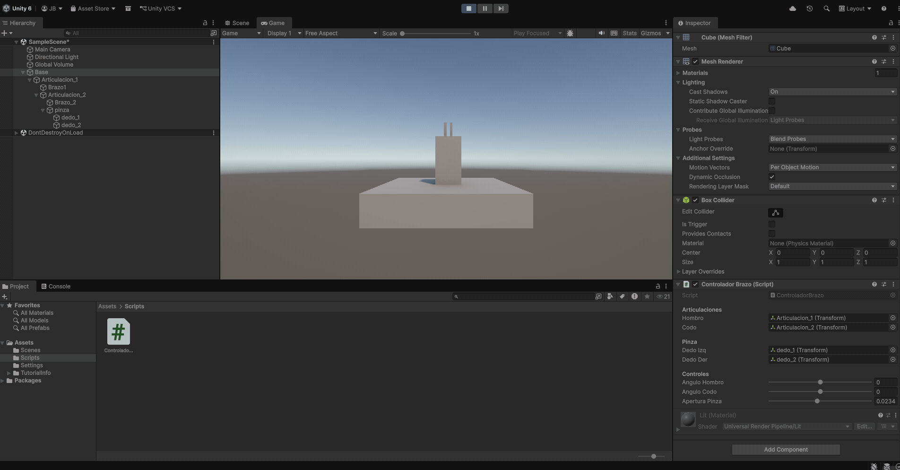
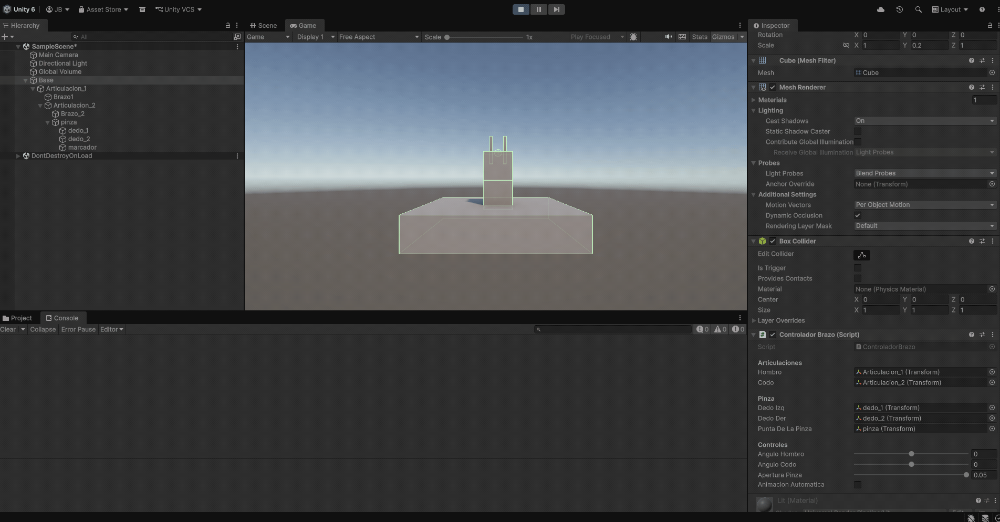
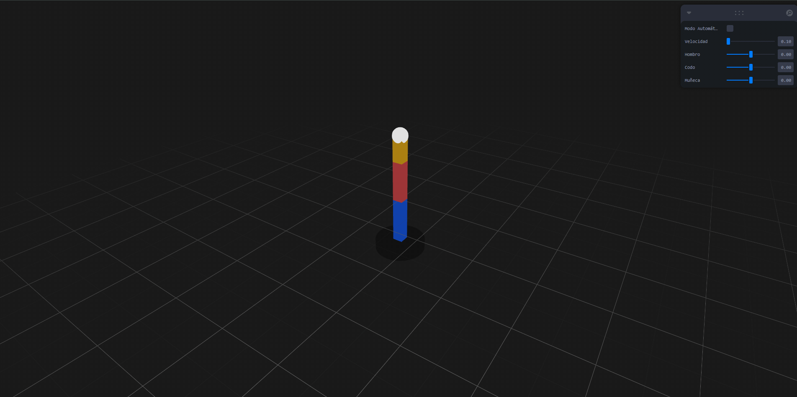
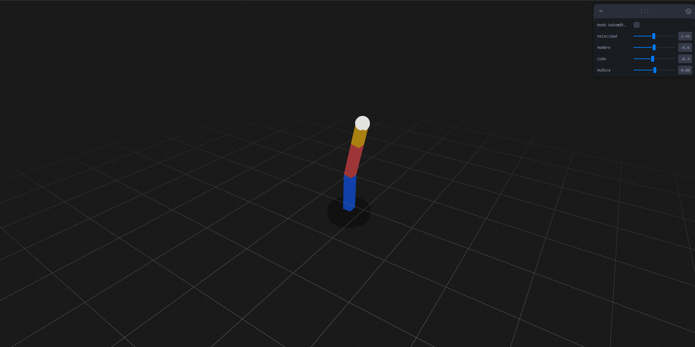

# Taller Cinemática Directa FK

## Nombre de los estudiantes
* Brayan Alejandro Muñoz Pérez bmunozp@unal.edu.co
* Álvaro Andrés Romero Castro alromeroca@unal.edu.co
* Juan Camilo Lopez Bustos juclopezbu@unal.edu.co
* Oscar Javier Martinez Martinez ojmartinezma@unal.edu.co
* Alejandro Ortiz Cortes alortizco@unal.edu.co
## Fecha de entrega
2026-04-15

---

## Descripción breve

Este taller consistió en la aplicación de conceptos de **Cinemática Directa (Forward Kinematics)** para animar estructuras jerárquicas en entornos 3D. El objetivo principal fue comprender cómo las transformaciones (especialmente rotaciones) aplicadas a un objeto "padre" afectan en cascada a todos sus "hijos" en una cadena articulada, permitiendo el movimiento de brazos robóticos y sistemas segmentados.

Se desarrollaron dos implementaciones funcionales: una en **Unity** y otra en **Three.js (React Three Fiber)**. En ambos casos, se construyó un brazo robótico capaz de ser controlado manualmente mediante una interfaz de usuario o de seguir patrones de movimiento automáticos mediante funciones matemáticas sinusoidales.

---

## Implementaciones

### Unity (C#)
Se creó una jerarquía de GameObjects: `Base -> Hombro -> Codo -> Pinza`.
* **Control de Usuario:** Se implementaron sliders con el atributo `[Range]` para ajustar los ángulos del hombro, codo y la apertura de la pinza de forma independiente.
* **Trayectoria:** Se utilizó la función `Debug.DrawLine()` para trazar una línea roja en tiempo real, permitiendo visualizar el camino recorrido por el extremo del brazo.
* **Animación Automática:** Se incluyó un interruptor booleano para activar un movimiento basado en `Mathf.Sin` y `Time.time`.

### Three.js / React Three Fiber
Se utilizó una estructura de componentes basada en `<group>` y `<mesh>` para replicar la jerarquía robótica.
* **Interfaz Leva:** Se integró la librería `leva` para proporcionar controles flotantes de los ángulos y la velocidad de animación.
* **Rastro (Trail):** Se implementó el componente `<Trail />` de `@react-three/drei` para generar una estela visual persistente del movimiento del actuador final.
* **Optimización:** Se empleó el hook `useFrame` para actualizar las rotaciones 60 veces por segundo, garantizando fluidez.

---

## Resultados visuales

### Unity - Implementación
  
*Muestra del control manual de articulaciones y apertura de pinza.*

  
*Visualización de la trayectoria roja generada por la animación automática.*

### Three.js - Implementación
  
*Ajuste de ángulos mediante sliders de Leva y visualización de estela.*

  
*Brazo en modo automático dibujando patrones espaciales con el Trail.*

---

## Código relevante

### Fragmento de Cinemática en Unity (C#)
```csharp
// Aplicación de rotaciones locales encadenadas
hombro.localRotation = Quaternion.Euler(0, 0, anguloHombro);
codo.localRotation = Quaternion.Euler(0, 0, anguloCodo);

// Dibujo de trayectoria en la ventana Scene
Debug.DrawLine(ultimaPosicion, puntaDeLaPinza.position, Color.red, 2f);
```
### Fragmento de Estructura en Three.js (React)   

```
JavaScript

// Uso de forwardRef para manipular grupos anidados en el loop de frame
const ArmSegment = forwardRef(({ length, rotationZ, children, color }, ref) => (
  <group ref={ref} rotation={[0, 0, rotationZ]}>
    <mesh position={[0, length / 2, 0]}>
      <boxGeometry args={[0.2, length, 0.2]} />
      <meshStandardMaterial color={color} />
    </mesh>
    <group position={[0, length, 0]}>{children}</group>
  </group>
));

```

## Prompts utilizados

Se utilizó IA generativa para:

- Resolución de errores de renderizado (pantalla negra) en React Three Fiber relacionados con el tamaño del contenedor #root y la intensidad de las luces.

- Implementación de la lógica de "pivote en la base" para que los eslabones rotaran desde sus extremos y no desde el centro.

- Configuración del componente Trail para visualizar la trayectoria en Three.js.

## Aprendizajes y dificultades

### Aprendizajes
Reforcé el concepto de coordenadas locales vs. globales. Entendí que al rotar un padre, el sistema de referencia de los hijos se transforma automáticamente, lo que facilita la animación compleja sin cálculos manuales de posición. También aprendí la importancia de la estructura de archivos en React para que hooks como useFrame funcionen correctamente dentro del contexto del Canvas.

### Dificultades
La mayor dificultad fue la configuración de los pivotes de rotación. Inicialmente, los cilindros rotaban desde su centro geométrico. Tuve que desplazar la malla respecto a su grupo padre para que el eje de rotación coincidiera con la "articulación". En Three.js, solucionar el problema del Canvas colapsado por CSS fue clave para visualizar el proyecto.

## Referencias

Lista de fuentes, tutoriales y documentación consultada durante el desarrollo del taller:

- **Documentación oficial de React Three Fiber**: [https://docs.pmnd.rs/react-three-fiber](https://docs.pmnd.rs/react-three-fiber) - Guía principal para la implementación de la jerarquía de mallas y el hook `useFrame`.
- **Drei Helper Library**: [https://github.com/pmndrs/drei](https://github.com/pmndrs/drei) - Documentación del componente `<Trail />` para la visualización de trayectorias.
- **Unity Manual - Transform Hierarchy**: [https://docs.unity3d.com/Manual/Transforms.html](https://docs.unity3d.com/Manual/Transforms.html) - Conceptos fundamentales sobre la herencia de transformaciones y rotaciones locales.
- **Leva Documentation**: [https://github.com/pmndrs/leva](https://github.com/pmndrs/leva) - Referencia para la creación de la interfaz de usuario de control manual.
- **Forward Kinematics Theory (ScratchAPixel)**: [https://www.scratchapixe
