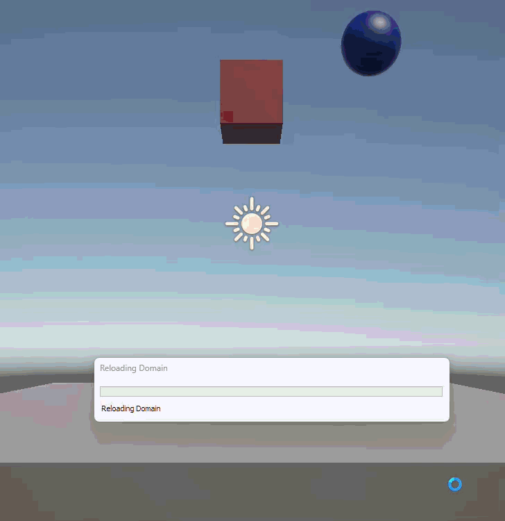

# Taller Colisiones Y Particulas

**Nombres de los estudiantes:**
- Brayan Alejandro Muñoz Pérez (bmunozp@unal.edu.co)
- Álvaro Andrés Romero Castro (alromeroca@unal.edu.co)
- Juan Camilo Lopez Bustos (juclopezbu@unal.edu.co)
- Alejandro Ortiz Cortes (alortizco@unal.edu.co)

**Fecha de entrega:** 2026-03-28

---

## Descripción breve
El objetivo de este taller es comprender e implementar la detección de colisiones físicas en Unity mediante el uso de `Colliders` y `Rigidbodies`. Desarrollamos una escena interactiva donde objetos sometidos a gravedad generan una respuesta visual (instanciación de un sistema de partículas) en el punto exacto de contacto al impactar contra una superficie u otro objeto. 

---

## Implementaciones

### Unity (Versión LTS 3D Core)
- **Físicas:** Se asignaron componentes `BoxCollider`, `SphereCollider` y `Rigidbody` a las primitivas 3D para someterlas a simulación de gravedad y cálculo de colisiones mediante el motor de física de Unity (PhysX).
- **VFX:** Se creó un Particle System configurado como un "Burst" (ráfaga única) y convertido a Prefab, con la propiedad `Stop Action` en `Destroy` para optimización de memoria.
- **Scripting:** Se diseñó el script `ColisionParticulas.cs` que hace uso de la función `OnCollisionEnter(Collision collision)`. Se implementó lógica de umbral de velocidad (`relativeVelocity.magnitude > 1.5f`) para evitar instanciaciones infinitas cuando el objeto descansa sobre el suelo. Se instancian las partículas utilizando `collision.contacts[0].point` y `collision.contacts[0].normal`. Adicionalmente, se incluyó lógica para reproducir efectos de audio espacial mediante un `AudioSource` dinámico.

---

## Resultados visuales


*Animación mostrando la caída de objetos con Rigidbody y la emisión de partículas al impactar el Collider del suelo.*


*Acercamiento de la instanciación de Prefabs y la autodestrucción en la jerarquía.*

---

## Código relevante

**Detección de contacto e instanciación de partículas:**
```csharp
private void OnCollisionEnter(Collision collision)
{
    // Umbral de velocidad para evitar spam en reposo
    if (collision.relativeVelocity.magnitude > 1.5f)
    {
        if (particulasPrefab != null)
        {
            Vector3 puntoImpacto = collision.contacts[0].point;
            Quaternion rotacionImpacto = Quaternion.LookRotation(collision.contacts[0].normal);
            Instantiate(particulasPrefab, puntoImpacto, rotacionImpacto);
        }
    }
}